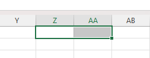

การแข่งขันการเขียนโปรแกรมในการแข่งขันทักษะด้านคอมพิวเตอร์ ครั้งที่ 2 ณ คณะวิทยาการคอมพิวเตอร์ มหาวิทยาลัยราชภัฏอุบลราชธานี เมื่อวันที่ 20 ธันวาคม 2567 ที่ผ่านมา

สำหรับงานแข่งนี้จัดขึ้นที่คณะที่ผมกำลังศึกษาอยู่ครับ ผมเลยมากับพี่ [@FoxZFox](https://github.com/FoxZFox)

เอาละ การแข่งครั้งนี้อนุญาตให้ใช้ได้ 3 ภาษา `C` `C++` `Python` ซึ่งในการแข่งผมใช้ python ครับ มันเขียนง่ายดี จากที่ทำมาทุกข้อ รับประกันได้ว่า python solve ได้หมด

**Resource limit**

- Runtime: 5s
- Memory: 2GB

เหลือๆครับ

# Problems

- Difference of Integers
- Pair Isograms
- การระบุเซลล์ใน MS Excel
- Vigenere Cipher
- Palindrome's Problem

เอาละ code อาจดูพิลึกหน่อย เพราะตอนเขียนนึกไรออกก็ร่ายๆไป 😅 พอมาดูอีกที แบบ เขียนไรไปวะเนี่ย เขียนใหม่สั้นกว่านี้อีก...

# Difference of Integers

ให้หาว่ารายการเลข 2 รายการนี้มีเลขอะไรบ้างที่**ไม่ซํ้ากัน** โดย input ประกอบไปด้วย 2 บรรทัด โดยตัวเลจตัวแรกคือจำนวนของตัวเลขในรายการนั้น ส่วน output ถ้าไม่มีเลขที่ไม่ซํ้ากันให้แสดงว่า `No Differences` ถ้ามีให้แสดงจำนวน ตามด้วยรายการที่ sort แล้ว

**Input**

```txt
4 7, 19, 1, 27
5 7, 23, 14, 9, 27
```

**Output**

```txt
5 1, 9, 14, 19, 23
```

ข้อนี้จะเป็นเรื่อง set ครับ โดยมันเรียกว่า symmetric difference ซึ่ง python มันทำง่ายมาแค่ `a ^ b` แต่ในตอนแข่งผมนึกไม่ออกเลขเขียนสูตรเอาครับ

```py
a = set(map(int, input().split(" ", 1)[-1].replace(" ", "").split(",")))
b = set(map(int, input().split(" ", 1)[-1].replace(" ", "").split(",")))
l = sorted(list(a.union(b) - a.intersection(b)))
if len(l) == 0:
    print("No Differences")
else:
    print(f"{len(l)} {', '.join(map(str, l))}")
```

# Pair Isograms

เราจะได้ case ทดสอบมาไม่ทราบจำนวน ซึ่งจะหยุดเมื่อเจอ `stop`

- **Pair isogram** คือคำที่แต่ละตัวอักษรปรากฏซ้ำกันสองครั้งพอดี

ตามชื่อเลยครับ problem อยากทราบว่า string นี้เป็น pair isogram ไหม ถ้าใช่ให้ output `pair isogram` ถ้าไม่ใช่ให้ output `NOT pair isogram`

**Input**

```txt
resTauratEurs
aPpeareR
stop
```

**Output**

```txt
NOT pair isogram
pair isogram
```

เราจะใช้ Counter ครับ โดยมันจะนับว่ามีอะไรซํ้ากันกี่ตัว เราก็แค่ loop เอา value ออกมาดูว่า string ที่ใส่เข้าไปมันมี char ที่มีไม่เท่ากับ 2 ไหม

ในตอนแรก run ใน local ถูกครับแต่ submit ไปแล้วผิด ผมเลยไม่มั่นใจว่า input มีอะไรอย่างอื่นเช่นตัวเลขไหม หรือยังไงผมเลยลองแปะ `str.isalpha` ดู สรุปได้ผล แล้วมารู้ที่หลังว่า testcase เป็นไฟล์ CRLF (มันมี `\r` ซึ่งมันหลุดเข้าไปใน Counter)

```py
from collections import Counter

while True:
    s = input()
    if s == "stop":
        break

    if len(s) < 2:
            print("NOT pair isogram")
            continue

    c = Counter([x for x in s.lower() if x.isalpha()])
    for _, v in c.items():
        if v != 2:
            print("NOT pair isogram")
            break
    else:
        print("pair isogram")
```

# การระบุเซลล์ใน MS Excel

สรุปเลยคืออยาก convert column ที่เป็นเลขให้กลายเป็น cell address ของ excel

รับ r ตามด้วยเลข ต่อด้วย c ตามด้วยเลข และหยุดเมื่อเลขทั้งสองเป็น 0 ส่วน output จะแสดง cell address ต่อด้วย row number

**Input**

```txt
r1c1
r3c1
r5c26
r0c0
```

**Output**

```txt
A1
A3
Z5
```

นั่งงมอยู่พักใหญ่เลยครับ ว่าจะคำนวนอย่างไรดี ผมก็พยายามจะคำนวนแบบการแปลงเลขฐานแต่เจ้ากรรม excel เริ่มนับจาก 1 (ไม่นับ 0) **1-based index**



จะเห็นว่าเมื่อแทน A เป็น 1 แล้วละก็ เมื่อ Z = 26 ถ้าเป็น 27 จะกลายเป็น AA แต่เดี๋ยวก่อน A เป็น 1 นี้คือสาเหตุว่าทำไมการแปลงเลขฐานปกติใช้ไม่ได้ เราจึงต้องหาวิธีแปลงอื่นๆที่ไม่ใช่การคำนวน

ผมจึงเลือกที่จะ loop หยิบเลขออกมาก้อนใหญ่ในแต่ละหลักจนมันหมด

```py
while True:
    row, col = map(int, input().replace("r", "").split("c"))
    if row == 0 and col == 0:
        break

    x = col - 1
    d = ""
    A = ord("A")
    i = 1
    while True:
        c = x % (26 ** i)
        x = (x - c) - 1 # Adjust to 0-based index
        d = chr((c // (26 ** (i - 1))) + A) + d
        if x <= 0:
            break
        i += 1

    print(f"{d}{row}")
```

> แนะนำว่าเขียนใหม่เถอะ code นี้ประหลาดจริง

# Vigenere Cipher

ตามชื่อเลยครับ ซึ่งผมเจอบ่อยในการแข่งขัน CTF ครับ เลยอ่านว่ามีอะไรแปลกๆใน statement ไหม แล้วไม่เจอเลยเขียนตามท่านมาตราฐานเลยครับ

input บรรทัดแรกคือข้อความที่จะเข้ารหัส บรรทัดที่สองคือ key และ output ข้อความที่เข้ารหัสแล้ว

**Input**

```txt
no pets
dog
```

**Output**

```txt
qc vhhy
```

ข้อมูลเพิ่มเติม : [wikipedia](https://en.wikipedia.org/wiki/Vigen%C3%A8re_cipher)

**Encryption Formula :** $$C_i = E_K(M_i) = (M_i + K_{i \bmod m}) \mod \ell$$

**Decryption Formula :** $$M_i = D_K(C_i) = (C_i - K_{i \bmod m}) \mod \ell$$

$$M_i$$: Offset of the i-th character of the plaintext M in the alphabet Σ. \
$$C_i$$: Offset of the i-th character of the ciphertext C. \
$$K_{i \bmod m}$$: Offset of the corresponding key character (cyclically repeated). \
$$ℓ$$: Length of the alphabet (e.g., ℓ = 26 for English). \
$$m$$: Length of the key.

โดนสรุปสั้นๆ คือถ้า key หมดให้วนซํ้า และ ignore char ที่ไม่ใช่ alpha เพราะมันคำนวนไม่ได้ และทำการแปลง key ให้เป็นเลข 0-25 เพื่อใช้เลื่อนตำแหน่ง และตอนคำนวนต้องเลื่อน char ไปเริ่มที่ 0 เหมือนกับ key แล้วเมื่อเลื่อนเสร็จแล้วมันเกิน z ให้วนกลับโดยใช้ mod แล้วเลื่อนกลับเป็น ascii ให้กลับมาเป็น char เหมือนเดิม ส่วน case upper / lower ทำเหมือนกันทั้งคู่

```py
t = input()
a = ord("a")
A = ord("A")
k = [ord(x.lower()) - a for x in input()]

c = ""
ki = 0
kl = len(k)
for i in t:
    if i.isalpha():
        if i.islower():
            c += chr((((ord(i) - a) + k[ki]) % 26) + a)
        else:
            c += chr((((ord(i) - A) + k[ki]) % 26) + A)
        ki = (ki + 1) % kl
    else:
        c += i

print(c)
```

ระวัง CRLF ด้วยนะครับ

# Palindrome's Problem

ตามชื่อมันเลย คือการที่ string ตัวนั้นสามารถอ่านจากหน้าไปหลังหรือหลังไปหน้าได้ แต่ใน problem นี้มีคำถามว่า เลขที่เป็น string จาก x ไป y เนี่ยมีเลขที่เป็น palindrome กี่ตัว

**Input**

```txt
1, 1000000
```

**Output**

```txt
1998
```

ไม่คิดไรมากครับ ทุบมันด้วยการ brute force โดนเราจะเขียนแบบง่ายๆคือ loop range จาก x ไป y โดย y ต้องมากกว่า x เสมอ แต่ input มี case ที่มันสลับกันได้ เราเลข sort ก่อน และการทดสอบเราจะแปลง int -> str แล้ว reverse ดูว่ามันเหมือนเดิมไหม ถ้าใช่ก็นับ +1

```py
x,y = sorted(list(map(int, input().replace(" ", "").split(","))))
c = 0
for i in range(x, y + 1):
    s = str(i)
    if s == s[::-1]:
        c += 1
print(c)
```

---

จบไปแล้วสำหรับ solution ข้อต่างๆ ผมมองว่าถ้าเป็นสาย competitive programming อยู่แล้วจะมองว่าข้อพวกนี้ง่ายหมดเลยครับ จะท้าทายหน่อยก็แค่ข้อ `C` เลยไม่รู้จะพูดยังไงดีกับผลการแข่งขันที่ผมเองก็รู้สึกแปลกๆ หรือผมรู้สึกไปเอง? และก็ส่วนของ input ที่แปลกๆ เช่นมี `\r` ติดมาด้วย ซึ่งคนที่รู้ว่า testcase ระบบ judge ยัด input ยังไง ก็อาจจะไหวตัวทันด้วยการใช้ trim เช่น python `str.strip`

แล้วผมรอดในตอนแข่งได้ไง ก่อนที่จะรู้ว่า input เป็น CRLF ?

```txt
i s a l p h a   i t   w o r k   b u t   i d k   w h y . . .
```
