การแข่งขัน CTF ต้อนรับปี ม้า โดย DropCTF ในวันที่ 3-5 มกราคม ที่ผ่านมา

- [**@noonomyen**](https://github.com/noonomyen)
- [**@c0ffeeOverdose**](https://github.com/c0ffeeOverdose) - [**blog.c0ffeeoverdose.com**](https://blog.c0ffeeoverdose.com/posts/ctf/dropctf-archa-2026-writeup/)

# Challenges

- **WY MIX**
- **DDJ WY HACKER**
- **Archa tool**
- **NZT-48 Is Calling**
- **baby crypto**
- **GhostStallion**
- **PwnKnight: Dungeon of Darkness**
- **Act II: The Nameless Market**
- **Act III: The Truth of PwnKnight**
- **Network Security ACT I**
- **Network Security ACT II**
- **Network Security III**
- **DEALER HUNTING**
- **WELCOME!**
- **Horse Excel**

# WY MIX

_ตอนนี้ทางเราตรวจพบ แฮกเกอร์สมองเพรชคนนึงที่ได้ผันมาเป็นดีเจมือสมัครเล่น และเขาได้ใช้ยาบ้า ยาม้า ในขณะที่ทำเพลง นั่นทำให้เขาเสียสติ และเริ่มมี อาการหลุดออกมา สิ่งที่คุณต้องคือตามหา flag จาก MIX ที่เขาทำขึ้น_

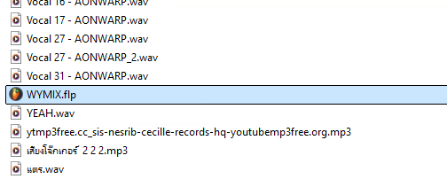

เป็นไฟล์โปรแกรม FL Studio

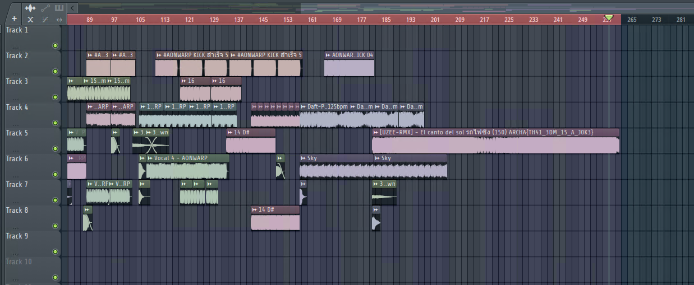

จะมี flag อยู่ตรง track 5 ช่วงท้ายๆ

Flag `ARCHA{TH41_3DM_15_A_J0K3}`

# DDJ WY HACKER

_เราได้โทรไปพูดคุยกับ แฮกเกอร์บ้ายาจากข้อ WY MIX และได้รู้ว่าเขาชอบฟัง DJ คนนึงมากๆซึ่งทำให้เขาได้มีแรงบันดาลใจในการทำเพลง จงเข้าไปหาว่าแฮกเกอร์บ้ายาคนนี้ เขาไปคอมเม้นท์อะไรในช่องของ DJ​ ที่เขาชอบ_ \
_ก่อนที่เขาจะวางสายจากเราเขาได้ แสดงอาการ หลุด ออกมาก่อน และ ได้พูดว่า !@#$%^&_())(_&^%$#@!\_- 130 130 130 130 130 130 (เขาพูดไม่รู้เรื่องแต่ เหมือนมีจะมีบางอย่างที่เป็นเบาะแส ลองหาดู)_

ต่อจาก **WY MIX**

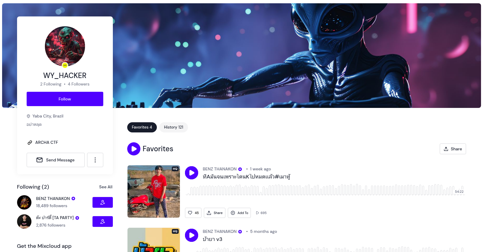

ได้ link mixcloud มา

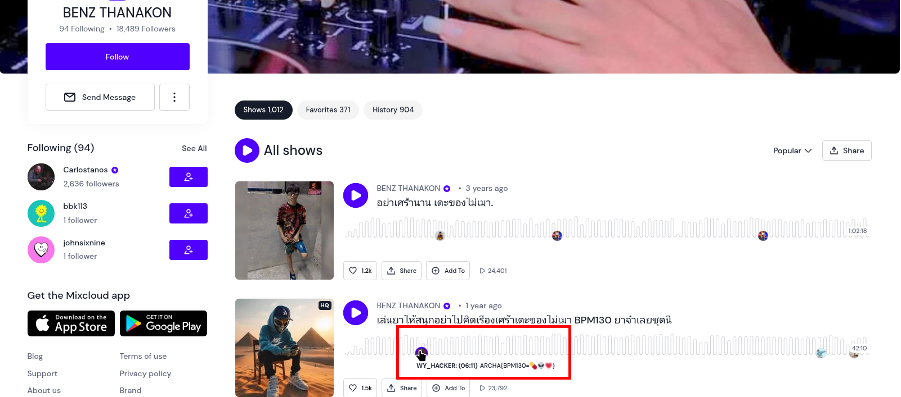

เราได้ตามไปยังหน้า profile DJ ที่เขาชอบ และได้ลองหาจาก popular ดู โดย trick คือ muxcloud จะ show comment ณ เวลาใน track ซึ่งเราสามารถเอา cursor ไป hold ดูได้แบบนี้

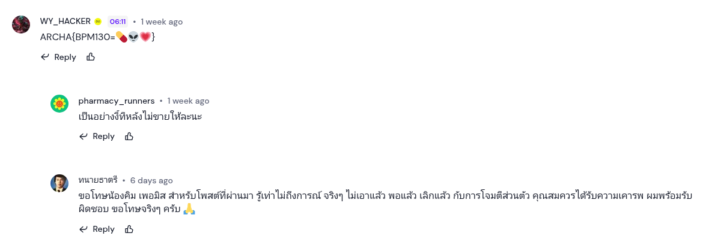

Flag `ARCHA{BPM130=💊👽💗}`

<!-- # YUMMY GOLDEN HORSE

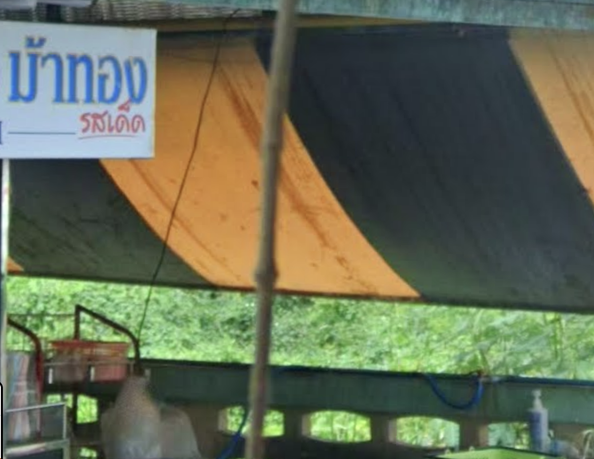

*จงทำการ osint จากภาพต่อไปนี้และนำ เบอร์ของร้านมาตอบ* -->

<!-- # Bucked Horse


*“โอ้ไม่… ไอ้บัญชีม้าเลวนั่น มันขโมยเงินจากเว็บพนันของฉันไปจนหมด!” กล้องวงจรปิดที่สนามบินถ่ายภาพนี้ไว้ได้พอดีก่อนที่ไอ้เลวนั่นจะหายไปพร้อมกับเงินทั้งหมด ในวันที่ 30 ธันวาคม ช่วงบ่ายเนี่ย มันไปลงจอดที่ “สนามบินไหน” กันแน่? ถ้ารู้จุดลงจอด บางที… เงินของฉันอาจยังมีหวังได้กลับคืนมา* -->

# Archa tool

_ท่านจอมยุทธ์ได้กลับมาแล้ว และเขาได้กลับมาพัฒนา Tool ที่สามารถวิเคราะห์ไฟล์ได้อย่างง่ายดาย จงวิเคราะห์และหา Flag ที่ซ่อนไว้น่ะจุ๊ฟๆ_
_Hint 1: เสียดายจังทำไมฉันไม่สามารถ Reverse Engineer โปรแกรมนี้ได้เลย แต่ฉันรู้ว่าโปรแกรมนี้ใช้ Pyarmor Obfuscate ฉันจะ DeObfuscate โปรแกรมนี้ยังไงดี แต่ว่าๆ มันมี Tool ใน github ที่ช่วยถอดรหัสเยอะเลยน่ะ เช่น Pyarmor o\*e shot_

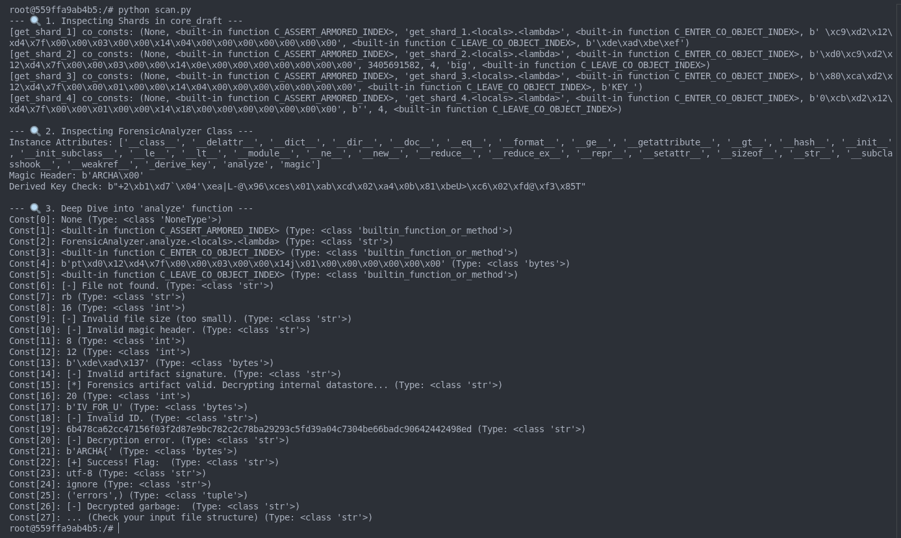

output code ที่ให้ llm เขียน scan สรุปสภาพแวดล้อม

ขั้นตอนที่จบคือ เมื่อเรา import เข้ามา เราทำการสำรวจ `archa_tool.ForensicAnalyzer` แล้วพบ method `_derive_key()` ทำหน้าที่สร้าง key AES-256 ต่อมาสำรวจค่า constants ภายใน `analyze` `analyzer.analyze.__code__.co_consts` มี hardcode ciphertext (hex string) ยาว 78 ตัว (39 bytes) ที่ตำแหน่ง Const[19] และ Nonce (IV): b'IV_FOR_U' ที่ตำแหน่ง Const[17] เขียนสคริปต์ code นำทั้ง 3 อย่าง (Key, Ciphertext, Nonce) มาเข้าฟังก์ชัน ctr_crypt เพื่อถอดรหัส

```py
from archa_tool.crypto import ctr_crypt
import archa_tool

analyzer = archa_tool.ForensicAnalyzer()

real_key = analyzer._derive_key()
print(f"[*] Recovered Key: {real_key.hex()}")

hex_cipher = "6b478ca62cc47156f03f2d87e9bc782c2c78ba29293c5fd39a04c7304be66badc90642442498ed"
ciphertext = bytes.fromhex(hex_cipher)
nonce = b"IV_FOR_U"

print(f"[*] Ciphertext Len: {len(ciphertext)}")
print(f"[*] Nonce: {nonce}")

plaintext = ctr_crypt(ciphertext, real_key, nonce)
decoded_flag = plaintext.decode("utf-8")

print(f"FLAG: {decoded_flag}")
```


# NZT-48 Is Calling

_นายบ่าวเป็นเด็กวัยรุ่นที่อยากเป็น Hacker โดยเขาชอบเล่นเกม Roblox เป็นชีวิตจิตใจและวันหนึ่งเขาได้กินยาที่ชื่อว่า NZT‑48 และทำให้สมองของเขาได้ทำงาน 100% และได้โดนจิตใจด้านมืดเข้าครอบงำ และเขารู้สึกได้ว่าอยากเป็น Hacker และเขาก็ได้ Download Malware เข้ามาโดยไม่คาดคิดและทำให้เขาโดน Malware เข้าควบคุมคอมพิวเตอร์จงช่วยนายบ่าวตามรอย Hacker ที่พยายามแฮกคอมพิวเตอร์ของเขา จงตอบคำถามให้ครบ 10 ข้อก่อนที่ฤทธิ์ยา NZT‑48 จะหมดลง_

## Question 1

_นายบ่าวได้ พยายาม Download โปรแกรมอะไรในขณะที่กำลังหาวิธี Hack Roblox (ตอบเป็นตัวพิมพ์เล็กให้หมด)_

tool ที่เราจะใช้เป็นหลักคือ volatility 3

เราจะไปดูที่ web browser เริ่มจาก windows.filescan ออกมาดูว่ามี history ของ browser ไหม

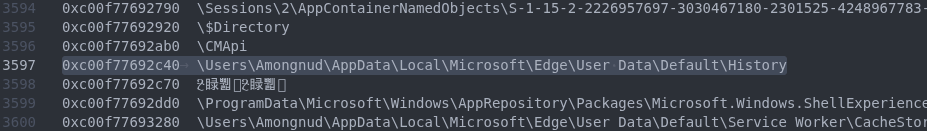

ซึ่งอยู่ที่ `0xc00f77692c40` ต่อมาเราจึงทำการ dump ออกมา

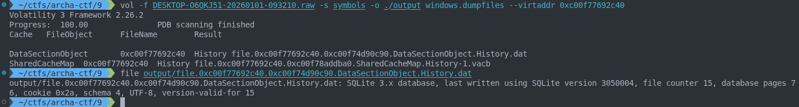

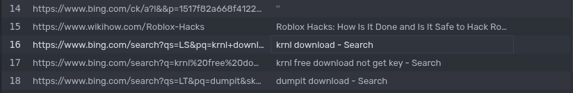

ที่ table `urls` แสดงให้เห็นว่ากำลังพยายาม download krnl คือ roblox exploit / executor

Answer `krnl`

## Question 2

_Profile ในเกม Roblox ของนายบ่าวชื่อว่าอะไร_

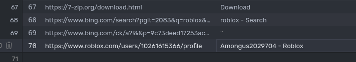

ใน table `urls` เดียวกัน

Answer `Amongus2029704`

## Question 3

_นายบ่าวได้ Download โปรแกรม ที่น่าสงสัยจากลิ้งไหน โดยให้ตอบเป็น Defang URL เช่น hxxp[://]localhost[.]com/secret[.]exe_

ใน table `downloads` จะมี column `tab_url` อยู่

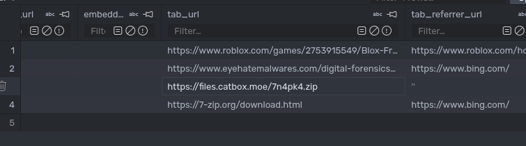

ซึ่งจะเป็นไฟล์ `7n4pk4.zip`

Answer `hxxps[://]files[.]catbox[.]moe/7n4pk4[.]zip`

## Question 4

_นายบ่าวได้ Download โปรแกรมที่น่าสงสัย โปรแกรมนั้นชื่อว่าอะไร_

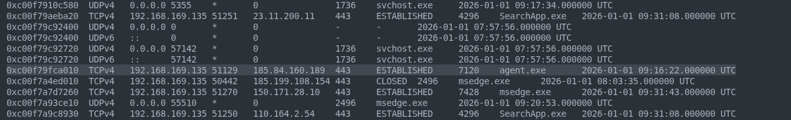

ใช้ windows.netscan มี program กำลัง ESTABLISHED ชื่อแปลกๆอยู่ pid 7120

Answer `agent.exe`

## Question 5

_เครื่องนายบ่าวได้โดน Malware ที่ชื่อว่าอะไรโดยให้ตอบเป็น Malware Family_

ทำการ dump files ของ pid 7120 ออกมา

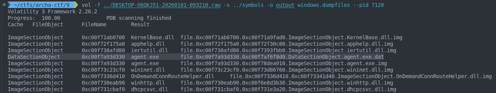

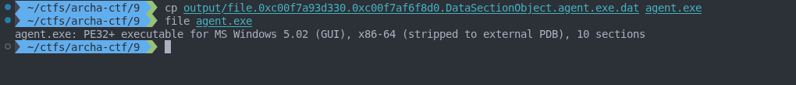

เสร็จแล้วเราก็โยนใส่ virustotal

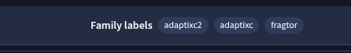

แล้วดูตรง Family labels

Answer `AdaptixC2`

## Question 6

_จงหา IP และ Port ของ C2 ที่เข้ามายึดเครื่องของนายบ่าว ให้ตอบเป็น ip:port เช่น 127.0.0.1:1337_

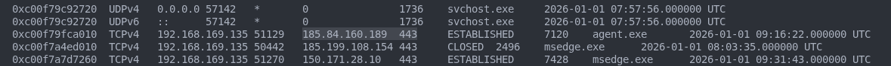

กลับไปที่ windows.netscan ตรง process agent.exe สถานะ ESTABLISHED จะบอกเราว่ามันกำลังต่อไปที่ `185.84.160.189 443`

Answer `185.84.160.189:443`

## Question 7

_ชื่อจริงๆ ของนายบ่าวชื่ออะไรกันแน่ Hint: Profile ของนายบ่าว ในเกม Roblox มีเขียนอะไรไว้น้าา_

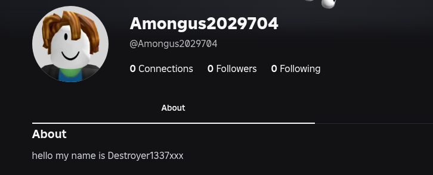

ตามไปหน้า profile จากชื่อ `Amongus2029704`

Answer `Destroyer1337xxx`

## Question 8

_หลังจาก OSINT ชื่อจริงของนายบ่าวคุณได้เจอชื่อของเขาใน เว็ปไซต์อะไร Defang URL เช่น hxxp[://]localhost[.]com Hint: เว็บไซต์อะไรเอ่ย ที่เอาไว้จัดเก็บโค้ดกับข้อความ ได้ บางที แฮกเกอร์ก็ชอบแอบเอา ข้อความแปลกๆมาแอบวางไว้ แล้วนายบ่าวเคยเข้าไปที่เว็บไซต์นี้ด้วย_

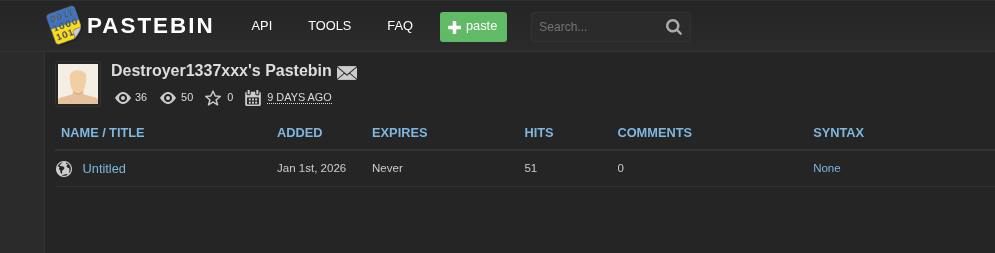

มี user ชื่อ `Destroyer1337xxx` ใน pastebin

Answer `hxxps[://]pastebin[.]com`

## Question 9

_สุดท้ายเหลือรหัสผ่านที่สามารถเข้าถึง C2 ของ Hacker ที่พยายามเข้ามาแฮกเครื่องนายบ่าวคืออะไร Hint: รหัสผ่านอยู่เว็ปไซต์ใน Question 8 ตอนนี้คุณรู้อะไรบ้างลองเข้าไป OSINT หน่อยซิหาแต่เว็ปไซต์นี้มันใช้ยังไงน้าา เรารู้อะไรบ้างจาก Question 7 Hint 2: ทำไมการตามหา Username คนอื่น ในเว็บไซต์นี้ยากจังฉันต้อง Login เข้าไปตรวจสอบหน่อยแหละ_

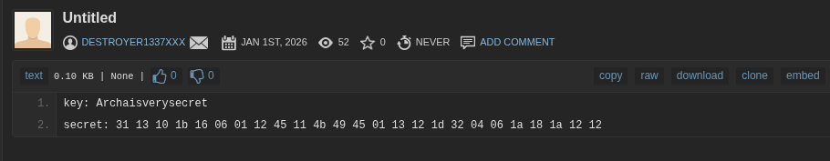

เสร็จแล้วนำไปถอดดู

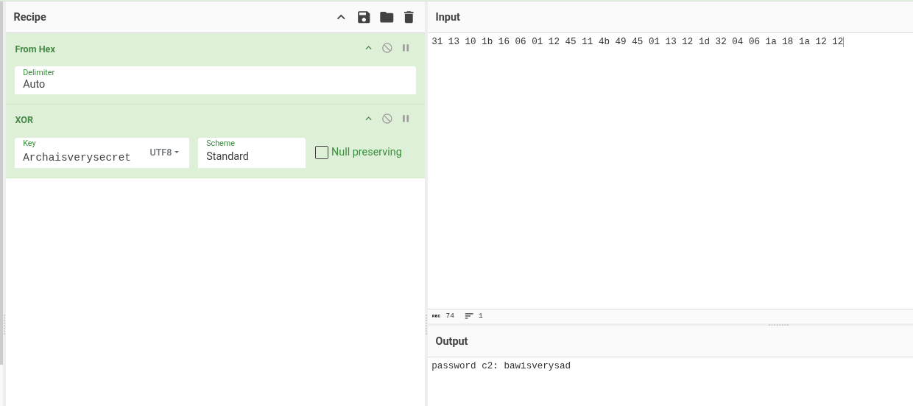

Answer `bawisverysad`

## Question 10

_เมื่อเข้าไปที่ C2 Server จงสังเกตุว่า User คนไหนที่เคยเข้ามาใน C2 server โดยให้ตอบเป็น Username ที่มี "\_" อยู่เช่น ถ้าใน C2 มี User ที่เคยเข้ามาเป็น test,test_1337,wow ให้ตอบเป็น test_1337 Hint: จะ build client c2 ของแฮกเกอร์คนนี้ยังไงน้าา ฉันอยากเข้าไปดูใน c2 จังเลย โดยทุกอย่าง set เป็น default โดยปกติของ c2 ตัวนี้ เช่น Port และ endpoint_

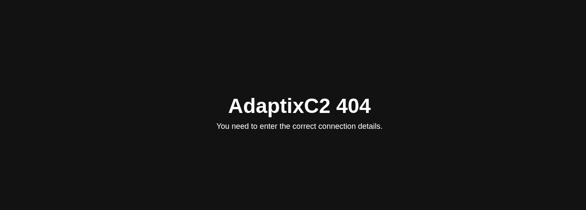

มี AdaptixC2 server อยู่ที่ port 4321

::github{repo=Adaptix-Framework/AdaptixC2}

ทำการ build client

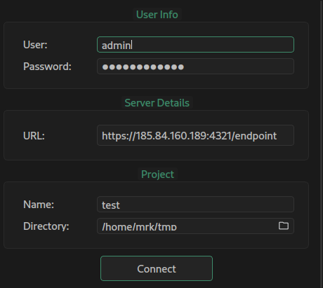

กำหนด user เป็นอะไรก็ได้

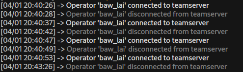

เมื่อเราเข้ามาแล้วจะเจอ user ที่แปลกๆอยู่

Answer `baw_lai`

# baby crypto

_🐻‍❄️🖤 คืออะไรกันน่ะหมีขาวกับหัวใจสีดำกำลังเป็น หมีขาวที่กำลังอกหักรึเปล่า ลองทายดูซิ้และหา ความลับมาให้เจอ_ \
_Base FFFF+1 คืออะไรกันน่ะ ว่าแต่ทำไมฉันไม่เคยไม่ยินการเข้ารหัสนี้มาก่อนเลย_

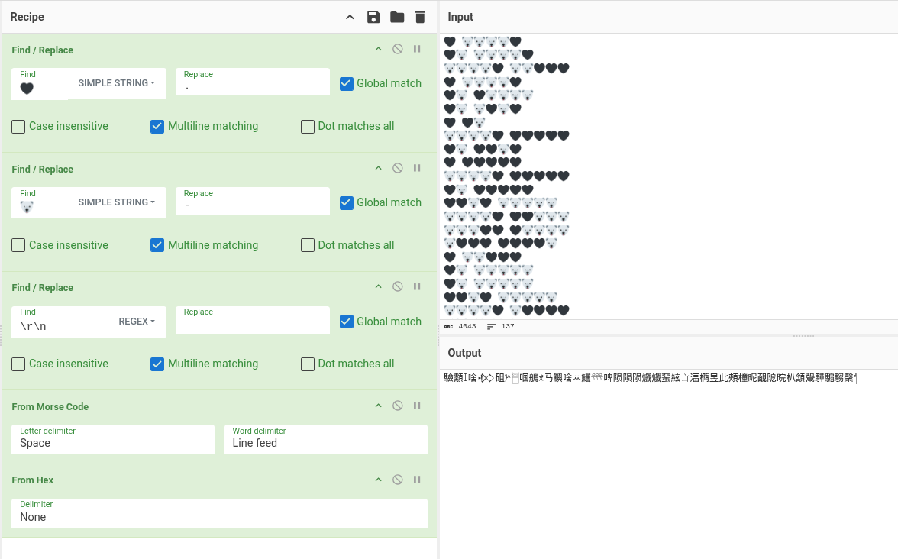

มันคือ morse code ครับ ซึ่งว่าจะรู้ว่ามันคือ morse code ก็นานอยู่ เราใช้วิธีแปลง emoji ให้อยู่ใน ascii range ก่อน เช่น 0 1 เพื่อให้ llm try hard ดู ซึ่งมัน work กว่าการยัด emoji เข้าไปตรงๆครับ เมื่อรู้ว่าคือ morse code ทุกอย่างก็ง่ายหมดเลยครับ ในขั้นตอน base65536 นี้ผมจำได้ก่อน เลย break llm มาถอดเอง

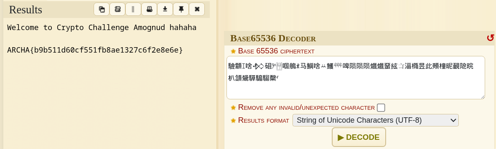

Flag `ARCHA{b9b511d60cf551fb8ae1327c6f2e8e6e}`

# GhostStallion

_The horse race challenge is coming up! but some registered competitor list are lost. Can you retreive them back and we will reward you worthly._

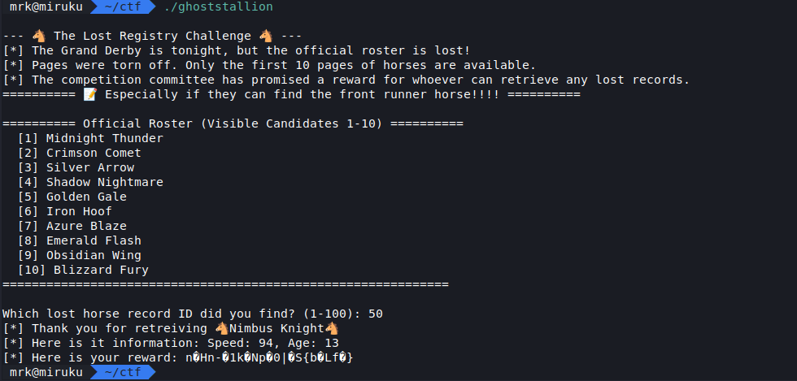

งงหว่า


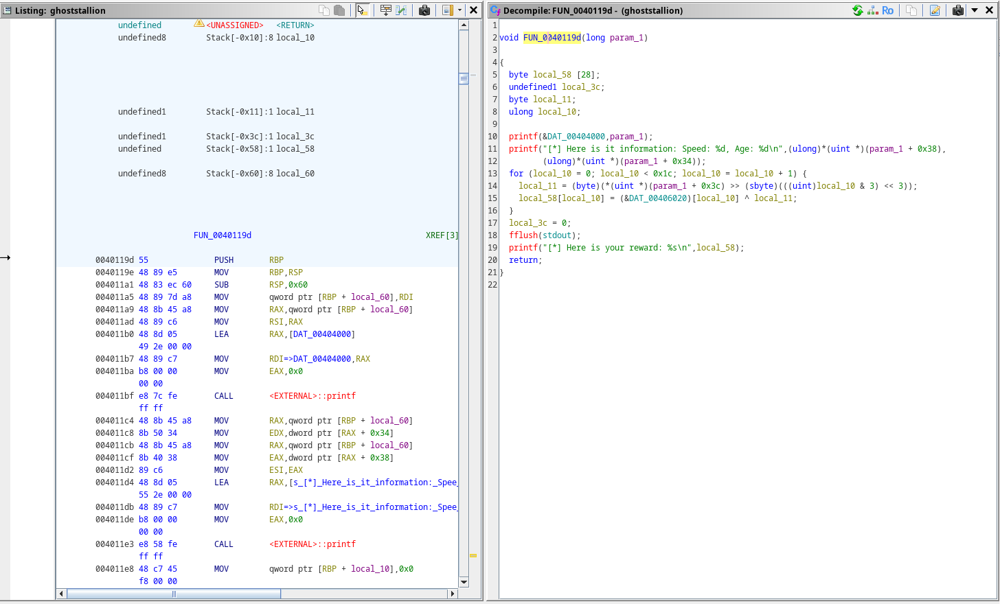

เมื่อเรา reverse เราจะพบกับ `FUN_0040119d` ที่มี logic ในการ XOR อยู่ ซึ่งเก็บลง array ยาว 28 ซึ่งเท่ากับความยาว flag ที่กำลังตามหาพอดี

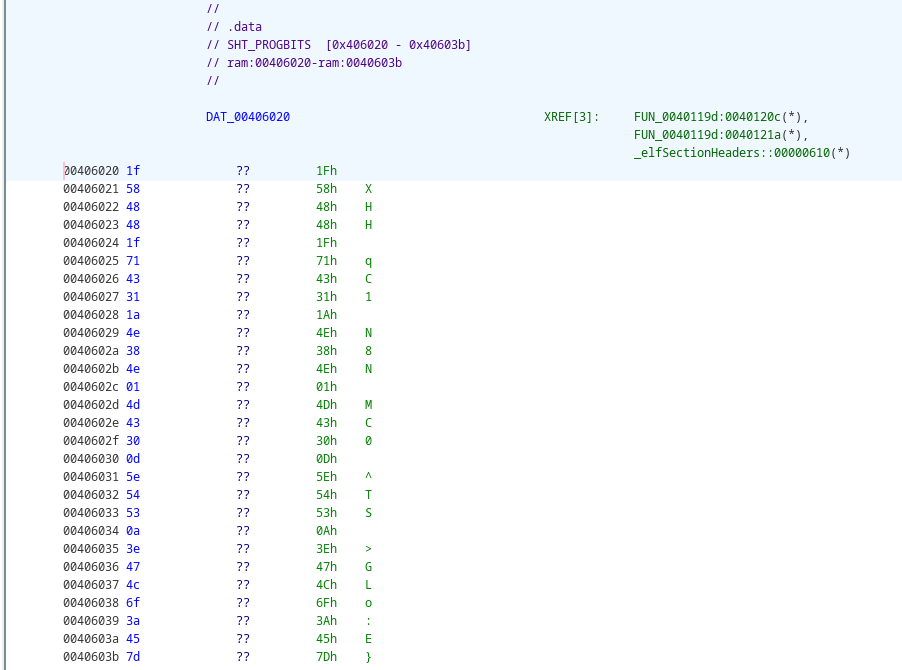

เราจึง dump data `DAT_00406020` ออกมาถอดดู โดยเริ่มจาก known prefix `ARCHA{`

```py
from itertools import cycle

DAT_00406020 = [0x1f, 0x58, 0x48, 0x48, 0x1f, 0x71, 0x43, 0x31, 0x1a, 0x4e, 0x38, 0x4e, 0x01, 0x4d, 0x43, 0x30, 0x0d, 0x5e, 0x54, 0x53, 0x0a, 0x3e, 0x47, 0x4c, 0x6f, 0x3a, 0x45, 0x7d]

known_prefix = b"ARCHA{"

for i in range(1, len(known_prefix)):
    key = [d ^ t for d, t in zip(DAT_00406020, known_prefix[:i])]
    decoded = bytearray([d ^ k for d, k in zip(DAT_00406020, cycle(key))])
    if decoded.startswith(known_prefix) and decoded.endswith(b"}"):
        print("Flag:", decoded.decode())
        print("Key:", bytes(key).hex())
        break
```

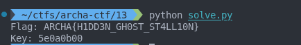

ใช้ key ยาว 4 bytes

Flag `ARCHA{H1DD3N_GH0ST_ST4LL10N}`

# PwnKnight: Dungeon of Darkness

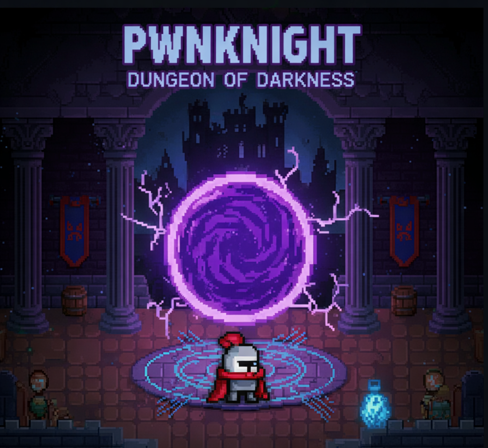

_PwnKnight: Dungeon of Darkness The Abyssal Kingdom was an empire of flawless logic until the Demon of Corruption arrived. Using "Forbidden Logic," it distorted the world's rules, creating dungeons that were actually fractures in the world's system. The Knight Who Believed in Flaws In the darkness, only PwnKnight believed that "Every system has a flaw." He relied on intellect and observation to question the laws of the world. One day, he was summoned by the keeper of rules, Archmage Rootwell. Act I: Hidden in Plain Sight Rootwell revealed that the Princess was taken by the Demon to rewrite the world itself. PwnKnight's first mission was not battle, but to find a hidden path. Rootwell warned: "Some truths are not hidden behind doors, but behind conditions. The answer may be closer than you expect."_

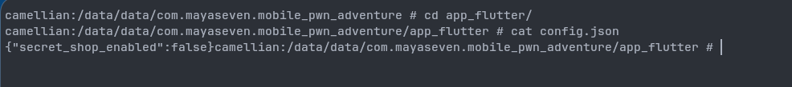

เราบังเอิญพบว่ามีไฟล์ config.json ใน data ของ app ซึ่งเมื่อเราเปลี่ยนเป็น true จะทำให้เราสามารถเข้า secret shop ได้

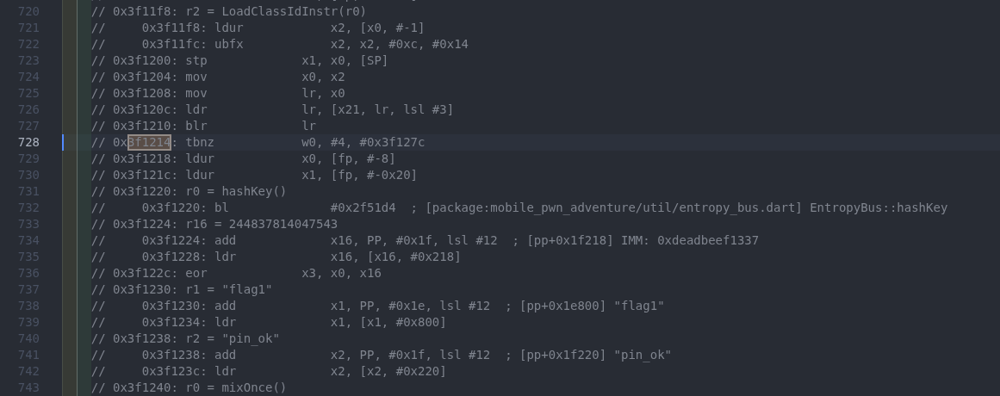

ใช้ blutter ในการย้อนกลับไฟล์ libapp.so แล้วเมื่อแกะไปจนเจอ logic ใน shop เราจะพบว่า เงื่อนไขที่ว่า `TBNZ` (Test Bit and Branch if Non-Zero) bit ที่ `4` ของ register `w0` ให้กระโดดไปที่ `0x3f1214`

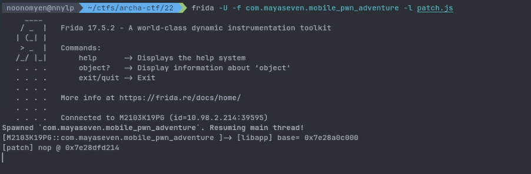

ซึ่งเราจะไม่ให้ logic ตรงนี้ทำงานโดยการ nop มันซะเลย

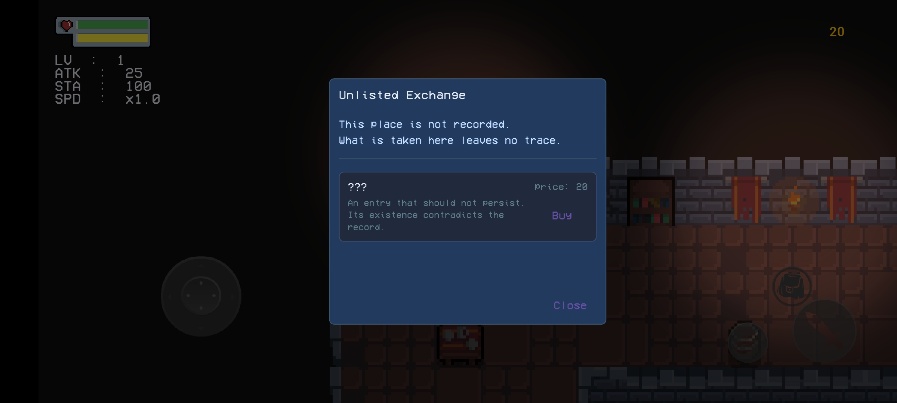

เราก็จะสามารถกดเข้าไปได้เลย

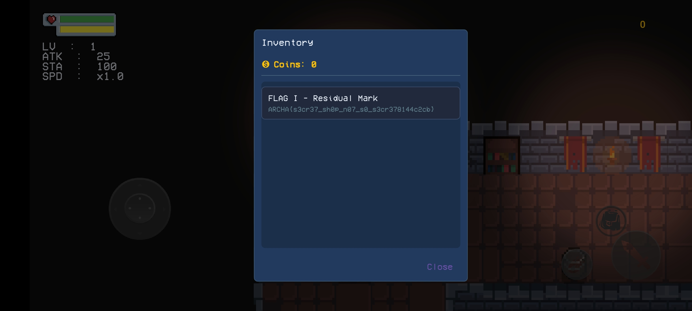

ซึ่งจริงๆมันมี pin อยู่แต่วิธีแรกที่เราได้คือ bypass มัน ง่ายดีด้วย

Flag `ARCHA{s3cr37_sh0p_n07_s0_s3cr378144c2cb}`

# Act II: The Nameless Market

_Act II: The Nameless Market During his journey, PwnKnight encountered a small shop tucked away in a forgotten corner of the kingdom. No sign. No history. No one ever spoke of it. The merchant guarding the shop said only: "Some things were never meant to be seen by everyone." PwnKnight did not know where the shop came from. He only knew that it still existed, even as the world around it changed. He stepped inside, uncertain whether what awaited him was merely merchandise— or another fragment of the kingdom's hidden truth._
_Hint: API_

จุดสังเกตคือ ทำไมเอ้ย เวลาเปิด shop มันถึงช้า

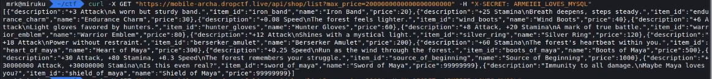

ใช่ครับ items อยู่บน server, โดยเราจะสามารถแกะสิ่งนี้ได้โดยการ hook function ที่เรียกใช้เกี่ยวกับ http ซึ่งความแปลกคือ เราสามารถใส่ราคาของมันเยอะจนพบว่ามี item ลับอีก 2 ตัว

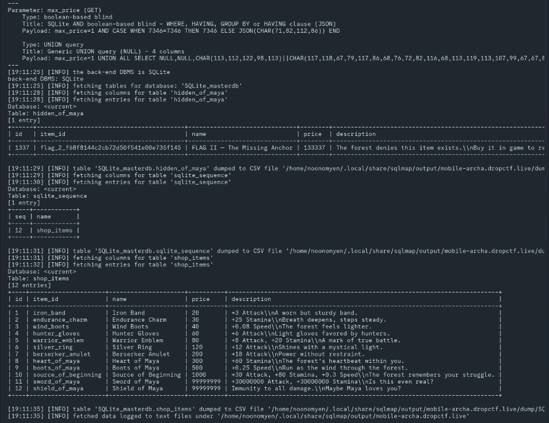

และเมื่อเราทำการ sqlmap เราก็จะพบว่ามีอีก table หนึ่งที่เก็บ id เป็น flag_2

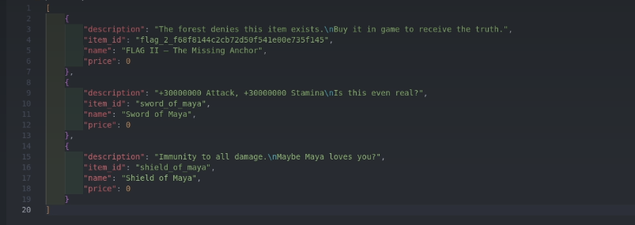

เราจึงมาทำการสร้าง response ปลอมที่รวม item พิเศษนั้นแหละ flag ไว้

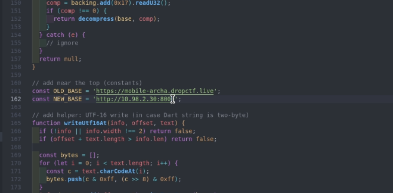

แล้วใช้ frida ในการ hook function เพื่อแก้ไข url ให้ชี้มาที่ server ของเราเองซะเลย

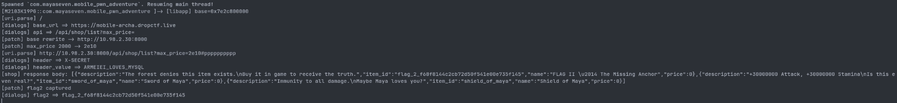

เรียบร้อย

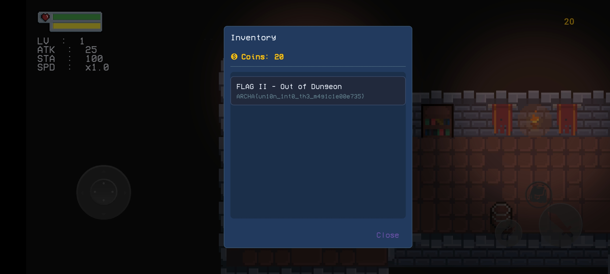

Flag `ARCHA{un10n_1nt0_th3_m4g1c1e00e735}`

# Act III: The Truth of PwnKnight

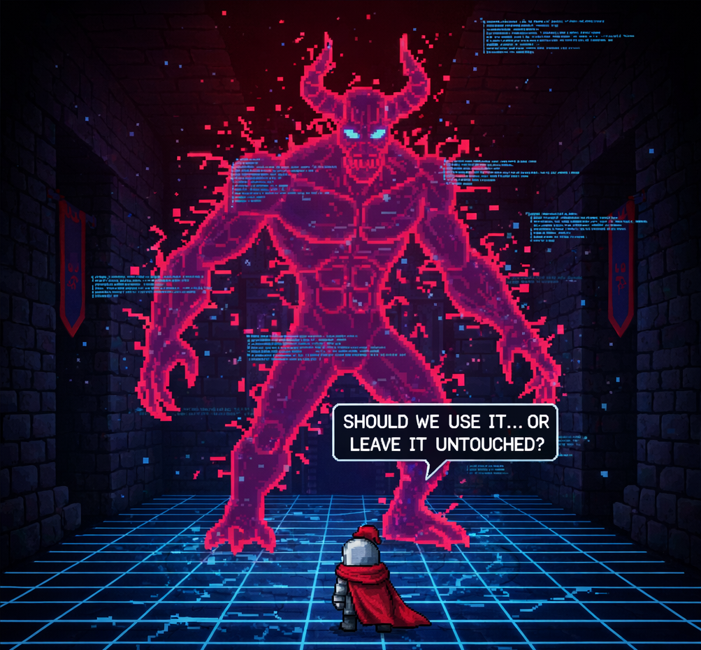

_Act III: The Truth of PwnKnight As the Demon's castle finally came into view, PwnKnight uncovered a truth that brought him to a halt. He was not a knight born of fate or legend. He was the result of an experiment— a fusion of code and magic. This world might not be real at all. It might be nothing more than a massive sandbox. The princess.The Demon. Even PwnKnight himself. All of them could be nothing more than components of a system. And so the final question was no longer: "Can the Demon be defeated?" But instead: "When we have the power to control the system— should we use it… or let it remain untouched?"_

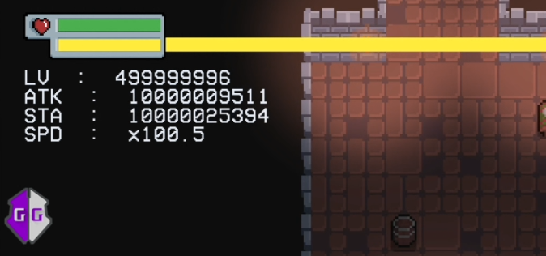

ใช้ Game Guardian ในการ hack ครับ


trick ก็คือ ให้หาแบบ encrypted value โดยแก้ level ให้โหดๆแล้วไปตี boss รอบเดียวตายครับ

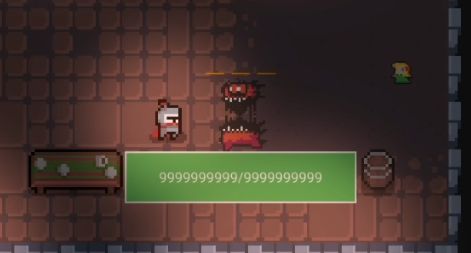

3 2 1

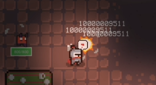

มาบเข้าให้

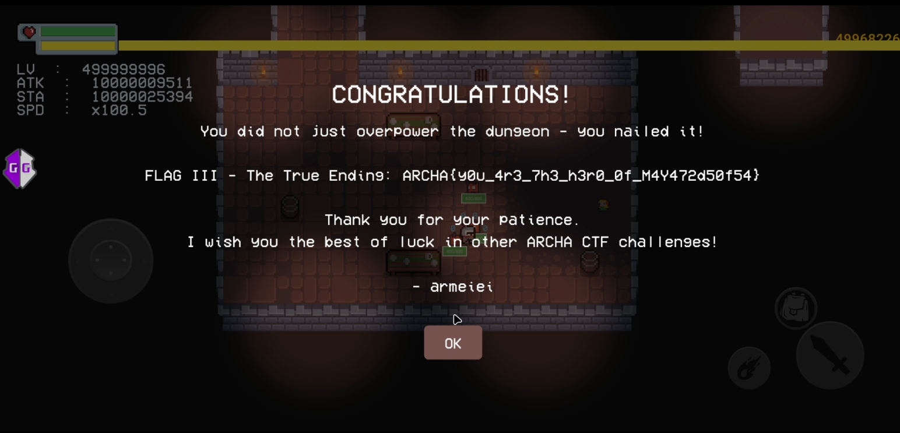

ครับ ง่ายกว่าข้อ 1 และ 2 อีก

Flag `ARCHA{y0u_4r3_7h3_h3r0_0f_M4Y472d50f54}`

# Network Security ACT I

_DNS Poisoned Flag 12,500 DNS queries. Only a few contain base64-encoded chunks. Reconstruct and decode._

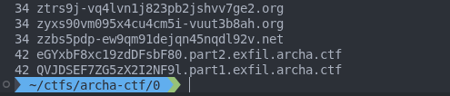

เจอ 2 part หลังจากทำการ ใช้ tshark ดึง query name และ sort มัน

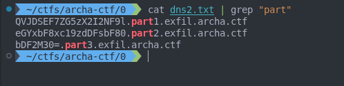

เราเลยเขียนลง file แล้ว grep ออกมาใหม่

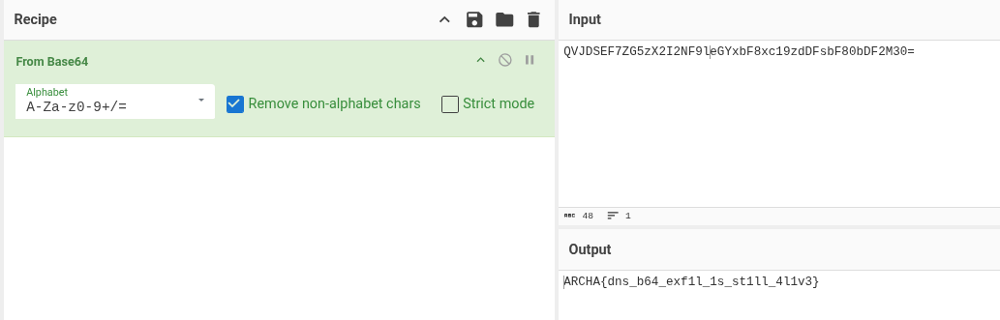

เสร็จแล้วทำการรวมมันแล้วถอด

Flag `ARCHA{dns_b64_exf1l_1s_st1ll_4l1v3}`

# Network Security ACT II

_Secret TLS 150+ TLS handshakes on port 443. One of them leaks the flag in plaintext Application Data. Zip_

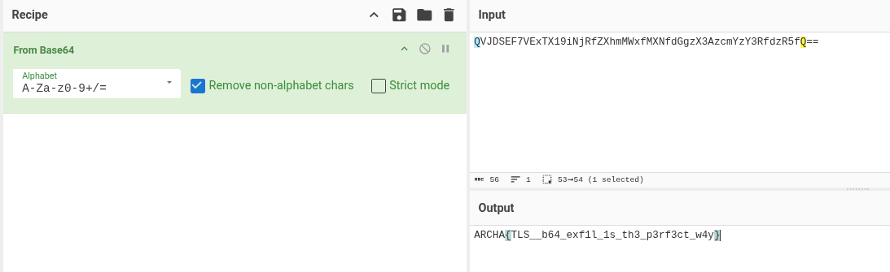

strings grep แล้วเจอเลย


รวมแล้วถอด

Flag `ARCHA{TLS__b64_exf1l_1s_th3_p3rf3ct_w4y}`

# Network Security III

_Quarterly Report of Doom An innocent-looking Excel file was downloaded. It contains another Excel… which contains another… and the deepest one holds the flag._

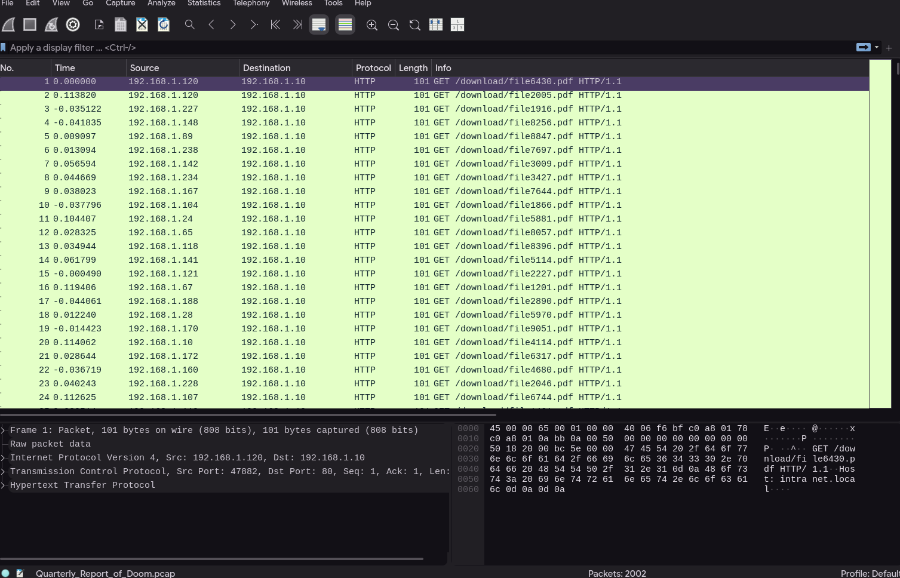

คือ file pcap ที่มี http เยอะ

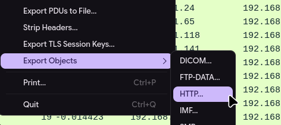

แต่ก็แค่ dump

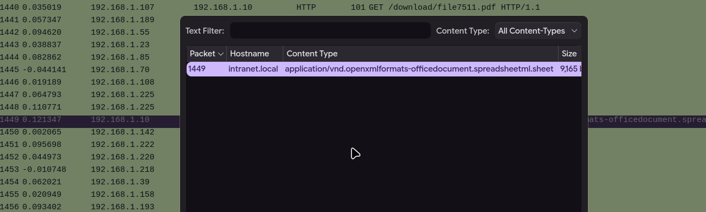

แถมมีไฟล์เดียวด้วย

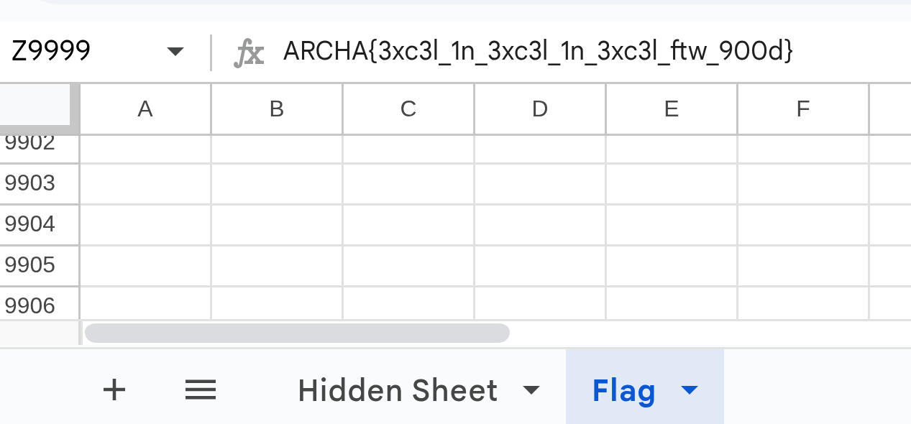

ตรง sheet `Flag` ceil `Z9999`

Flag `ARCHA{3xc3l_1n_3xc3l_1n_3xc3l_ftw_900d}`

# DEALER HUNTING

_จงตามหาข้อความลับของ ดีลเลอร์_

ต่อจาก **DDJ WY HACKER**

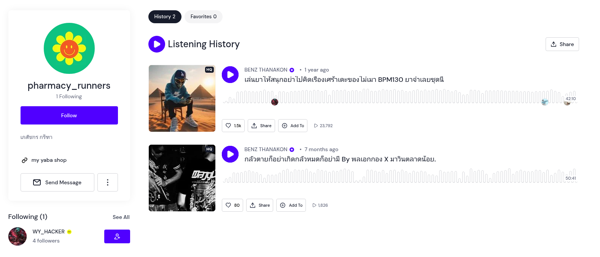

ตามไปยัง account ที่มา comment `pharmacy_runners` ซึ่งจะมี link telegram bot สำหรับขาย something อยู่

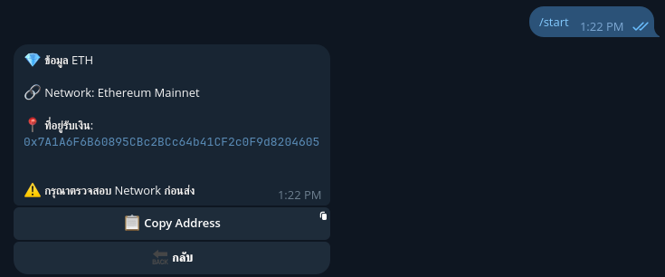

เมื่อเราลองๆเล่นดูจะพบว่า ไม่ว่าจะจ่ายผ่านเหรียญอะไร address ก็จะเป็น `0x7A1A6F6B60895CBc2BCc64b41CF2c0F9d8204605` เสมอ เราเลยตามไปดูที่ etherscan

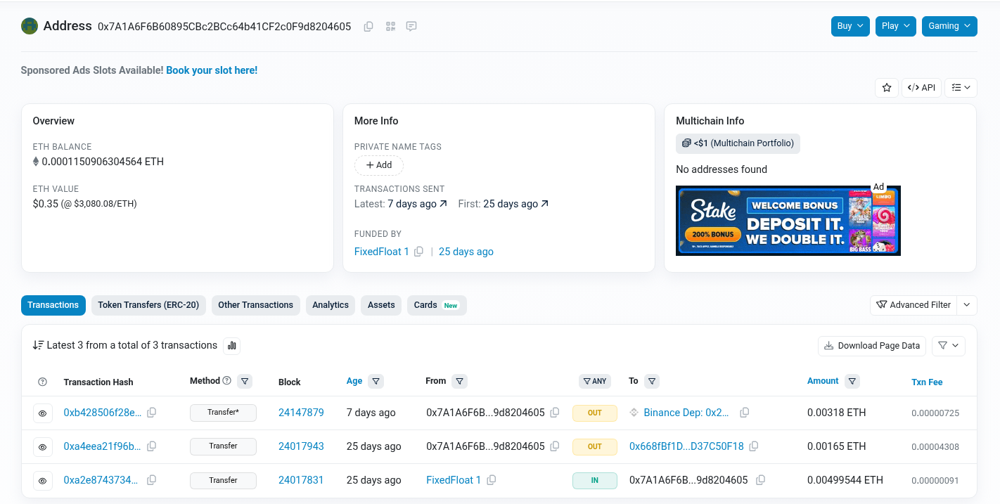

ต่อที่ transaction hash `0xb428506f28e39f6c7c4721f3641a1a1503fab26155a4e8bac07648e0875b9049`

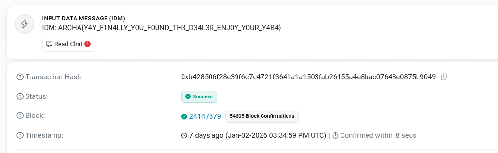

Flag `ARCHA{Y4Y_F1N4LLY_Y0U_F0UND_TH3_D34L3R_ENJ0Y_Y0UR_Y4B4}`

# WELCOME

WELCOME TO ARCHA CTF NICE TO MEET YOU: อยู่ใน Announcement Discord ลองเข้าไปหาดูสิ : )

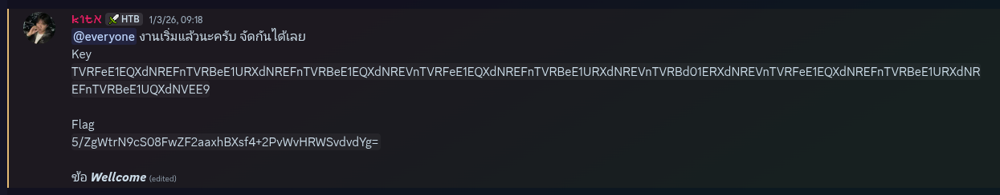

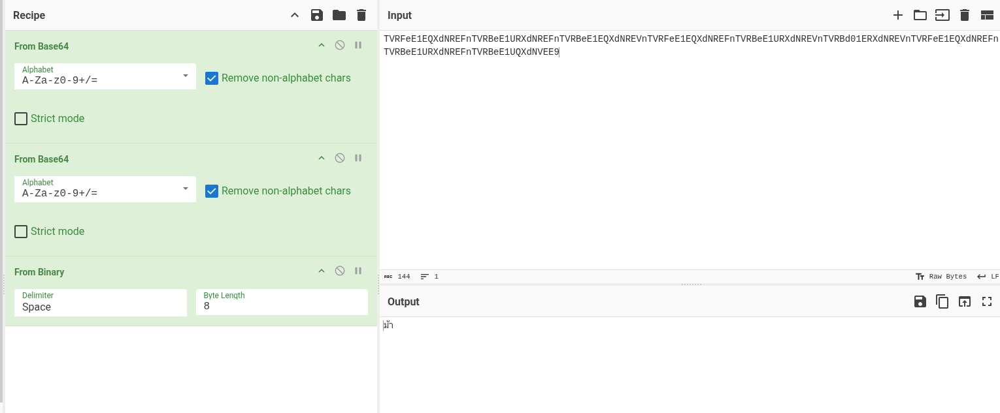

key คือ `ม้า`

```py
from base64 import b64decode
from Crypto.Cipher import AES

FLAG = "5/ZgWtrN9cS08FwZF2aaxhBXsf4+2PvWvHRWSvdvdYg="
KEY = "ม้า"

aes = AES.new(KEY.encode().ljust(32, b"\x00"), AES.MODE_CBC, iv=b"\x00" * 16)
flag = aes.decrypt(b64decode(FLAG))

print("Flag:", flag.decode())
```

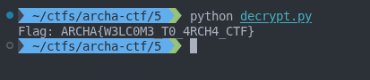

หลังจากลองมันหลายๆวิธีสรุปมันก็คือ AES-256-CBC + ZeroPadding

Flag `ARCHA{W3LC0M3_T0_4RCH4_CTF}`

# Horse Excel

_จงแก้ปัญหาง่ายๆของน้องม้าให้ได้เพื่อรับ Flag_ \
_Hint: Macro4.0 is not MacroVBA bro_ \
_Hint 2: Open Name Manager_ \
_Hint 3: เปลี่ยนสีให้เป็นเลข_

> Not solve

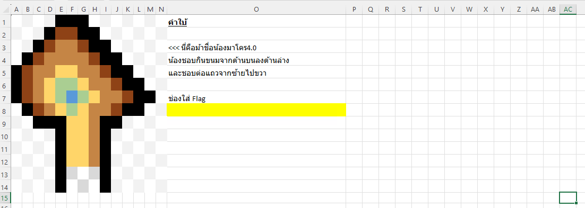

ได้ไฟล์ xlsm มา เป็น puzzle ชัดๆ

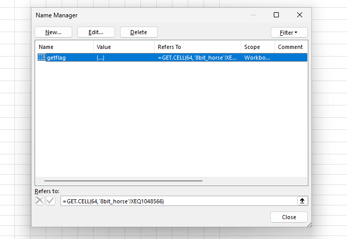

มี name manager อยู่ชื่อ `getflag`

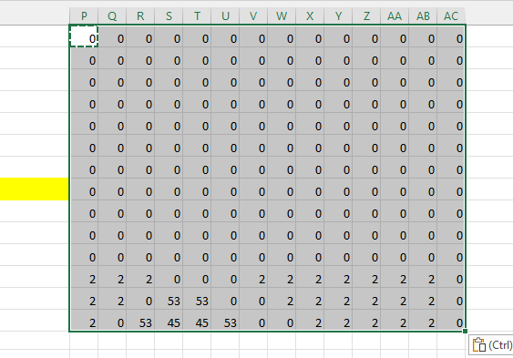

เมื่อวาง `=getflag` ลงพื้นที่ข้างๆจะพบว่ามันแปลกๆ จริงแล้วเราต้องแก้ไข name manager ตัวนั้นด้วย

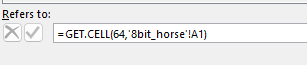

ชี้ไปที่ A1

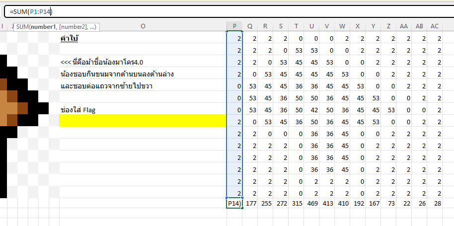

แก้ไขเสร็จแล้วจะมีเลขเพิ่มขั้น ต่อมา **น้องชอบกินขนมจากด้านบนลงด้านล่าง** ก็คือ sum แนวตั้ง

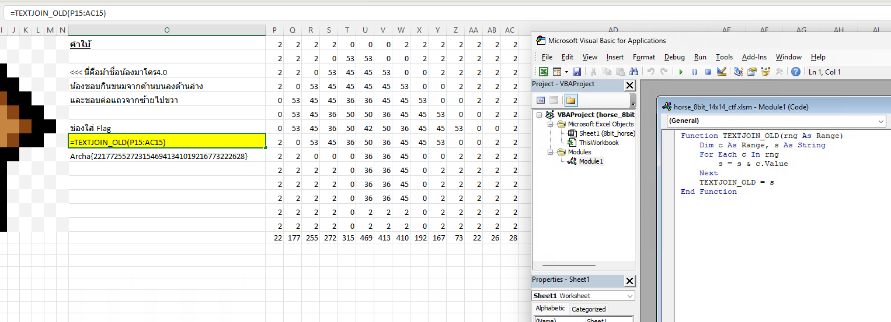

ต่อมา **และชอบต่อแถวจากซ้ายไปขวา** ก็คือ text join แต่ challenge creator ได้สร้าง vba function ตัวหนึ่งไว้คือ `TEXTJOIN_OLD` ที่รับเป็น range ซึ่งจะเอา text มาต่อให้ แล้วให้เราเรียกใช้ใน ceil ที่กำหนด จะมี function ที่ใส่ flag prefix ให้

Flag `Archa{2217725527231546941341019216773222628}`

---

ก็จบไปแล้วนะครับ ดองไว้นานเลย ไม่รู้ว่าจะได้กลับมา update หรือเปล่า เพราะช่วงนี้ก็วุ่นๆกับเรื่องอื่นอยู่ แต่ก็เป็นงานที่สนุกและแปลกดีครับ แข่งเสร็จแล้วหลุดต่อ เอาเป็นว่าเจอกันงานหน้าครับ บ่าย!
