- Programming
  - **Half Search Game**
  - **ASCII CAPTCHA**
- Web application
  - **Decoding the Storm**
  - Partial Flag Check Service
- Digital Forensics
  - **Flood Alert**
  - **Sound of Doc**
- Pwnable & Reverse Engineering
  - **Reverse w/ Code**
  - Reverse w/o Code
- Network Security
  - Chat Message
  - **Encrypted File**

> bold text คือสามารถแก้ได้ในเวลาการแข่งขัน

---

# Programming

## Programming > Half Search Game

ปัญหาของมันคือ เราต้อง connect ไปที่ ip:port ที่กำหนดมาให้ เราต้องเดาว่าเลขที่ถูกต้องจากการสุ่มคือเลขอะไร โดยเราจะต้องตอบให้ได้ภายใน 3 วิ และไม่เกิน 10 ครั้ง โดยทุกครั้งที่ตอบจะได้คำใบ้เพื่อให้เราขยับเข้าใกล้คำตอบได้ ในโจทย์นี้เราได้ source code ฝั่ง server มาวิเคราะห์

**Server**

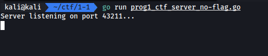

**Client**

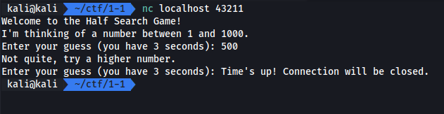

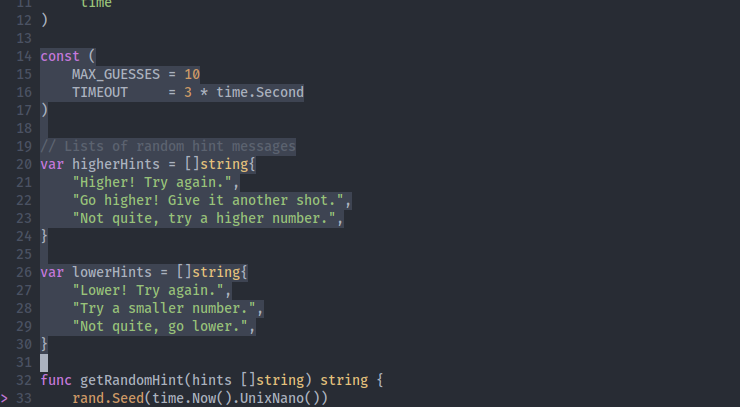

จาก source code สรุปได้ว่า

- จำกัด 10 รอบต่อเกม
- จำกัด 3 วินาที
- Hit บอกว่าไปทาง high 3 รูปแบบ
  - `Higher! Try again.`
  - `Go higher! Give it another shot.`
  - `Not quite, try a higher number.`
- Hit บอกว่าไปทาง low 3 รูปแบบ
  - `Lower! Try again.`
  - `Try a smaller number.`
  - `Not quite, go lower.`

การแก้ปัญหาคือ เราจะทำการสร้าง script สำหรับเล่นเกมนี้แทนเรา เพราะด้วยข้อจำกัดเวลาแค่ 3 วินาที ยากมากที่มนุษย์จะตอบได้ทัน

เราได้ทำการสร้าง script นั้นด้วย python โดยใช้ socket connect ไปที่ target แล้วรับรู้สถานะด้วยการ search string และใช้ binary search เพื่อหาทางเข้าใกล้คำตอบอย่างรวดเร็ว กรณีที่ fail จะทำการ retry เองจนกว่าจะได้ flag

```py
import socket

HOST = "localhost"
PORT = 43211

def task():
    with socket.socket(socket.AF_INET, socket.SOCK_STREAM) as sock:
        sock.connect((HOST, PORT))
        res = sock.recv(1024).decode()
        print(res, end="")
        low = 1
        high = 1000
        while low <= high:
            guess = (low + high) // 2
            print(guess)
            sock.send((str(guess) + "\n").encode())
            res = sock.recv(1024).decode()
            print(res, end="")
            res = res.lower()
            if "congratulations" in res:
                print()
                return True
            elif "higher" in res:
                low = guess + 1
            elif "smaller" in res or "lower" in res:
                high = guess - 1
    return False

while True:
    try:
        if task():
            break
    except KeyboardInterrupt:
        break
    except:
        pass
```

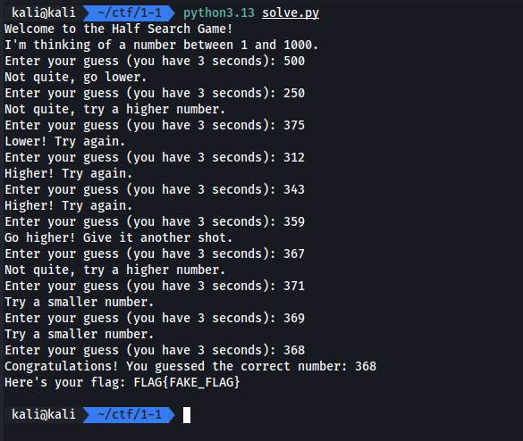

## Programming > ASCII CAPTCHA

ปัญหาในโจทย์ข้อนี้คล้ายๆกับข้อ [Half Search Game](half-search-game.md) ที่ต้องเขียนโปรแกรม connect ไปที่ target เพื่อ solve ปัญหา

สำหรับโจทย์นี้เราต้องทำการตอบว่า 30 ตัวอักษรที่อยู่ในรูป ASCII Art คือตัวอักษรอะไรบ้าง ซึ่งจำกัดเวลา 3 วินาที และสุ่มใหม่ทุกครั้งที่เล่น และในโจทย์นี้เรายังได้ source code มาเหมือนเดิม

**Server**

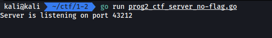

**Client**

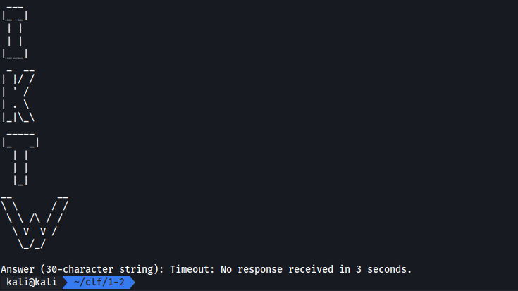

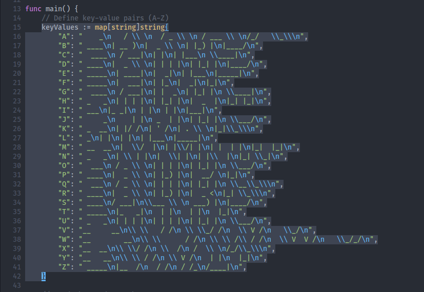

จาก source code จุดที่น่าสนใจคือ map ที่เก็บ character และ character ที่อยู่ในรูป ASCII Art ไว้ ซึ่งเราจะเอาไปใช้ประโยชน์ในภายหลัง

ภาพจากที่อยู่ [Client](#client) เราจะสังเกตุได้ว่าอักษรที่เป็น ASCII Art นั้นสูงคงที่ คือ 5 บรรทัด ดังนั้นบรรทัดทั้งหมดที่ได้รับ server หลัง connect คือ $l=(n\cdot5)+2$ โดยที่ $l$ คือจำนวนบรรทัด และ $n$ คือจำนวนตัวอักษร ส่วนการบวก 2 คือบรรทัดว่าง + บรรทัดแสดงคำถาม

เราจะทำการเขียน script สำหรับแก้ปัญหานี้ด้วย python โดยการ connect ไปที่ target แล้วเมื่อได้รับคำถามแล้วเราจะสนใจแค่ 150 บรรทัดแรก แล้วเราก็ทำการแยกเป็นกลุ่มตามลำดับ กลุ่มละ 5 บรรทัด เสร็จแล้วทำการ join เข้าด้วย newline และแทรก newline บรรทัดสุดท้าย (เนื่องจาก map ของ server มี newline ต่อท้าย) แล้วทำการ map แต่ละบรรทัดว่าตรงกับตัวอักษรอะไร แล้วทำการส่งกลับ server เพื่อตอบ

```py
import socket

HOST = "localhost"
PORT = 43212

map_ = {
    "A": "    _\n   / \\ \n  / _ \\ \n / ___ \\ \n/_/   \\_\\\n",
    "B": " ____\n| __ )\n|  _ \\ \n| |_) |\n|____/\n",
    "C": "  ____\n / ___|\n| |\n| |___\n \\____|\n",
    "D": " ____\n|  _ \\ \n| | | |\n| |_| |\n|____/\n",
    "E": " _____\n| ____|\n|  _|\n| |___\n|_____|\n",
    "F": " _____\n|  ___|\n| |_\n|  _|\n|_|\n",
    "G": "  ____\n / ___|\n| |  _\n| |_| |\n \\____|\n",
    "H": " _   _\n| | | |\n| |_| |\n|  _  |\n|_| |_|\n",
    "I": " ___\n|_ _|\n | |\n | |\n|___|\n",
    "J": "     _\n    | |\n _  | |\n| |_| |\n \\___/\n",
    "K": " _  __\n| |/ /\n| ' /\n| . \\ \n|_|\\_\\\n",
    "L": " _\n| |\n| |\n| |___\n|_____|\n",
    "M": " __  __\n|  \\/  |\n| |\\/| |\n| |  | |\n|_|  |_|\n",
    "N": " _   _\n| \\ | |\n|  \\| |\n| |\\  |\n|_| \\_|\n",
    "O": "  ___\n / _ \\ \n| | | |\n| |_| |\n \\___/\n",
    "P": " ____\n|  _ \\ \n| |_) |\n|  __/ \n|_|\n",
    "Q": "  ___\n / _ \\ \n| | | |\n| |_| |\n \\__\\_\\\n",
    "R": " ____\n|  _ \\ \n| |_) |\n|  _ <\n|_| \\_\\\n",
    "S": " ____\n/ ___|\n\\___ \\ \n ___) |\n|____/\n",
    "T": " _____\n|_   _|\n  | |\n  | |\n  |_|\n",
    "U": " _   _\n| | | |\n| | | |\n| |_| |\n \\___/\n",
    "V": "__     __\n\\ \\   / /\n \\ \\_/ /\n  \\ V /\n   \\_/\n",
    "W": "__        __\n\\ \\      / /\n \\ \\ /\\ / /\n  \\ V  V /\n   \\_/_/\n",
    "X": "__  __\n\\ \\/ /\n \\  /\n /  \\ \n/_/\\_\\\n",
    "Y": "__   __\n\\ \\ / /\n \\ V /\n  | |\n  |_|\n",
    "Z": " _____\n|__  /\n  / /\n / /_\n/____|\n",
}

for c in map(chr, range(ord("A"), ord("Z") + 1)):
    map_[map_[c]] = c
    del map_[c]

with socket.socket(socket.AF_INET, socket.SOCK_STREAM) as sock:
    sock.connect((HOST, PORT))
    data = sock.recv(4096).decode()
    print(data, end="")
    lines = data.splitlines()
    group = []
    for i in range(30):
        group.append([])
        for j in range(5):
            group[i].append(lines[(i * 5) + j])
        group[i] = "\n".join(group[i]) + "\n"
        group[i] = map_[group[i]]
    ans = "".join(group)
    print(ans)
    sock.send((ans + "\n").encode())
    res = sock.recv(4096).decode()
    print(res)
```

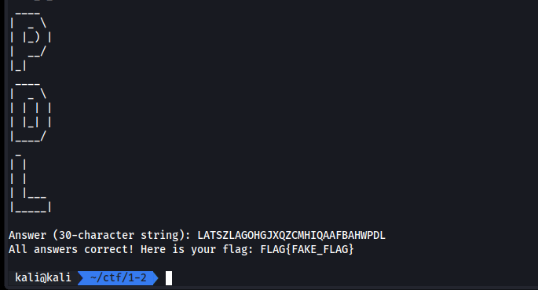

# Web application

## Web application > Decoding the Storm

เราได้ไฟล์ html โดยเราต้องหา flag ในเว็บนี้

**Screen**

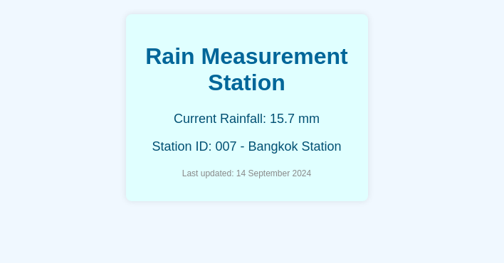

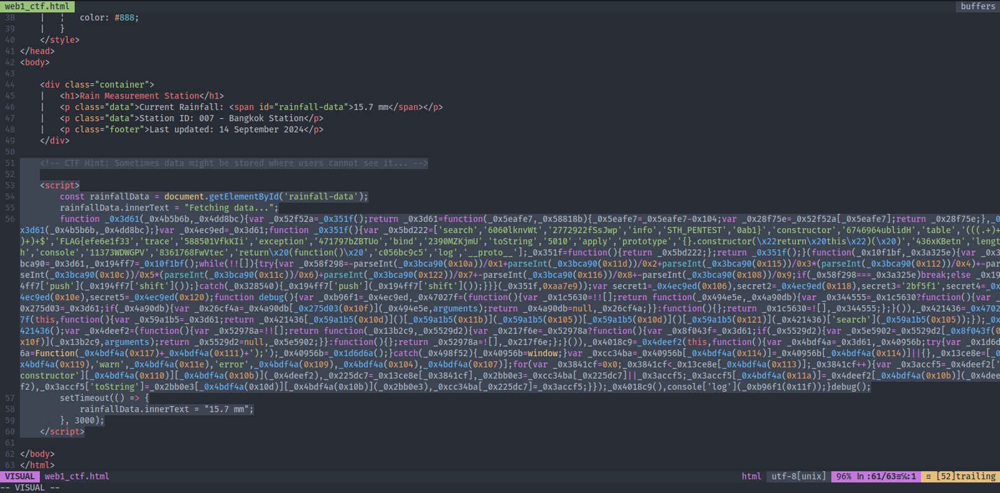

เมื่อเราได้เปิดดู html แล้วพบว่ามีจุดหนึ่งใน code พร้อมกับ hit ที่บอกว่าข้อมูลอยู่ในรูปอะไร ซึ่งถ้ามองด้วยตาปล่าวจะรู้ว่ามันคือ code ที่ถูก obfuscate

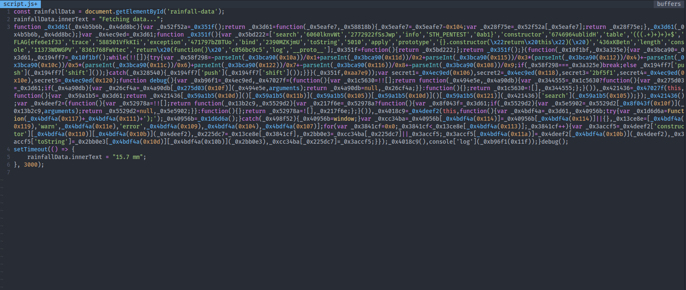

เราจึงได้แยก javascript ดังกล่าวออกมา

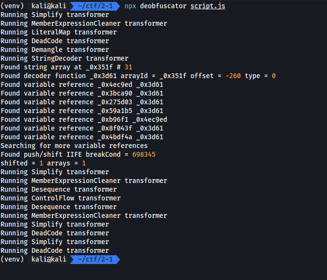

ทำการ deobfuscate

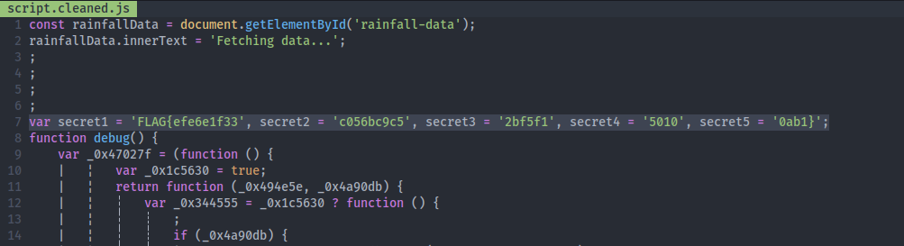

## Web application > Partial Flag Check Service

โจทย์ข้อนี้เราต้องเด่าว่า flag คืออะไร โดยที่มีคำใบ้ว่าเราสามารถที่จะเดาที่ละตัวแล้วตรวจสอบว่า flag นั้นถูกต้องไหม โดยที่ภายใน flag คือ md5

**Screen**

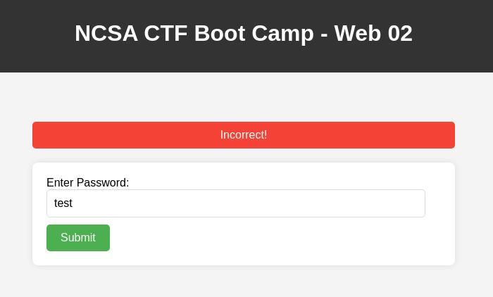

เมื่อกรอกผิด

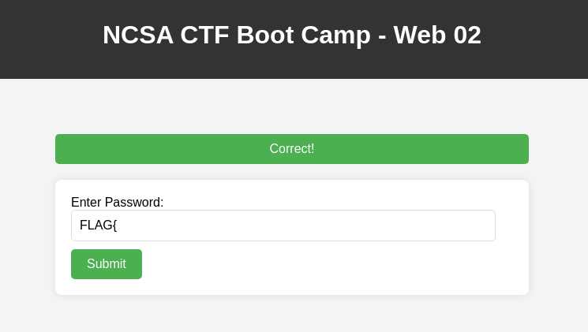

เมื่อเรากรอกถูกส่วนหนึ่ง

จากการทดลองกรอก flag pattern เราพบว่า เป็นไปตามที่โจทย์อธิบาย

ความน่าจะเป็นของ md5 ที่ยาว 128 bits คือ $2^{128}$ ซึ่งเยอะมาก แต่โจทย์ได้ให้คำใบ้โดยการสามารถตรวจสอบได้ที่ละตัวอักษร เลยเหลือความน่าจะเป็นเพียง $16\cdot32$

เพื่อความรวดเร็วในการหาคำตอบที่ถูกต้องเราจึงเลือกที่จะเขียน script ในการ brute force

```py
import requests

URL = "https://localhost"

headers = {"Content-Type": "application/x-www-form-urlencoded"}
count = 0
flag = "FLAG{"
chars = "0123456789abcdef"

for _ in range(32):
    for c in chars:
        count += 1
        test = flag + c
        print(test)
        res = requests.post(URL, data={"password": test}, headers=headers).text
        if "Correct!" in res:
            flag = test
            break
        elif "Incorrect!" in res:
            continue
        else:
            flag = test
            break

print(flag + "}")
print(count)
```

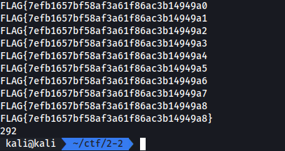

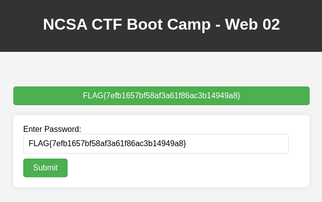

# Digital Forensics

## Digital Forensics > Flood Alert

เราต้องหา flag ในไฟล์ pdf

**Screen**

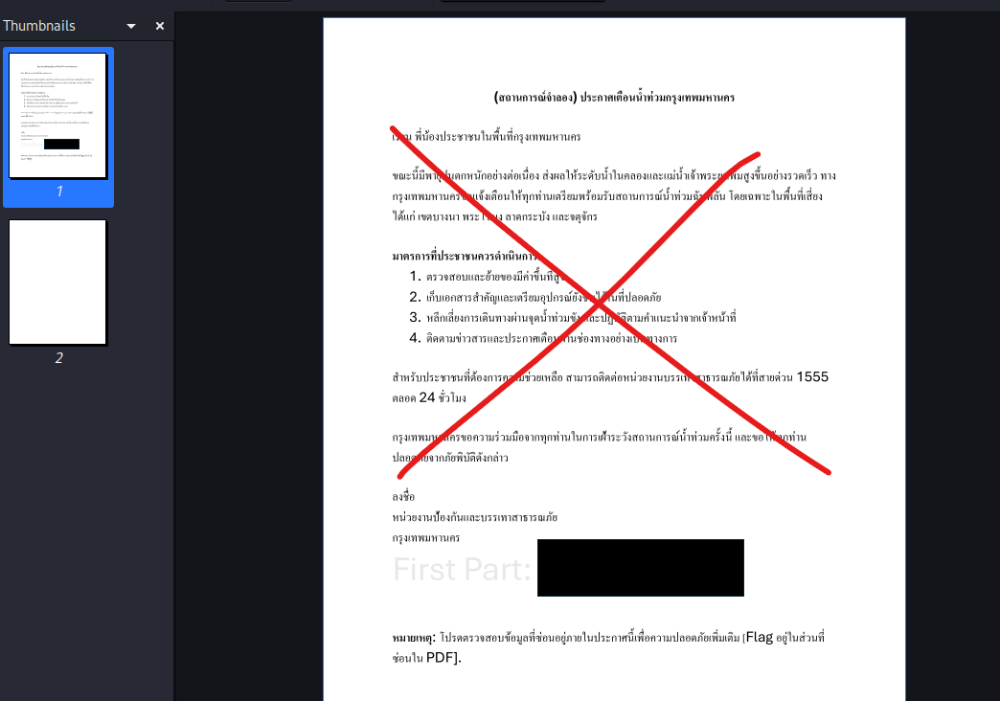

สำหรับโจทย์ข้อนี้เราสามารถหาสองส่วนแรกได้ง่ายๆ 2 วิธีคือ

- Ctrl + A แล้วจะเจอทันที
- ใช้ PDF to Text

ปัญหาของมันคือตัว text ถูกซ่อนด้วยการกำหนดสี font จึงทำให้มองไม่เห็น

ส่วนสุดท้ายอยู่ใน info

**1+2 - Ctrl + A**

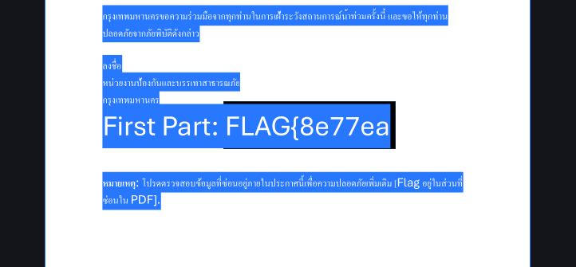

ครึ่งหลังอยู่หน้าที่สอง

**1+2 PDF to Text (poppler-utils)**

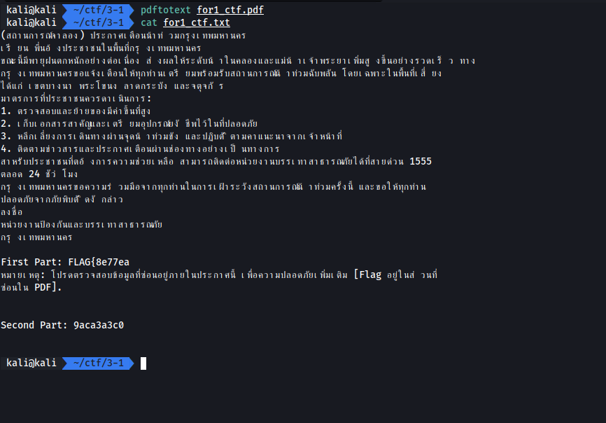

**3 - (pdfinfo)**

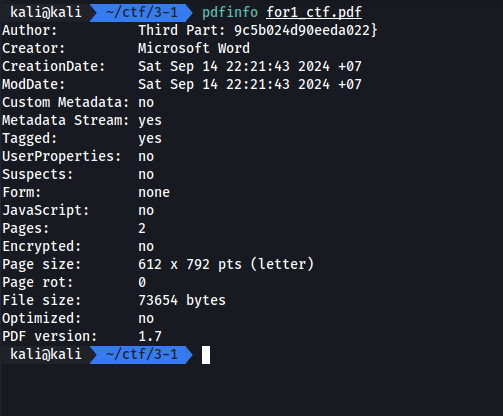

## Digital Forensics > Sound of Doc

เราได้ไฟล์ pdf ที่มี .mp3 ขึ้นก่อน

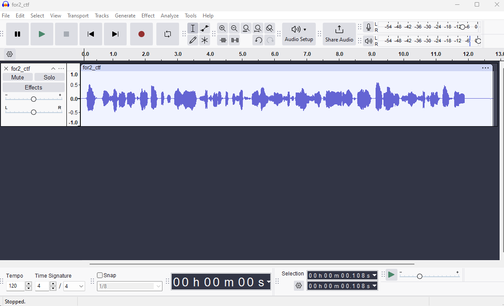

ลองลบ `.pdf` แล้วเล่นเสียงดู นี้แหละ flag

# Pwnable & Reverse Engineering

## Pwnable & Reverse Engineering > Reverse w/ Code

ในโจทย์ข้อนี้เราได้ไฟล์มาสองไฟล์คือ ELF ไฟล์และ source code โดยเราต้องทำการใส่ flag เข้าไปแล้วโปรแกรมจะตอบกลับมาว่า flag นั้นถูกต้องไหม

**Screen**

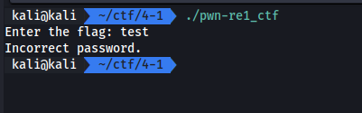

เนื่องจากเรามี source code เราจึงมุ่งเป้าไปหาคำตอบที่ source code

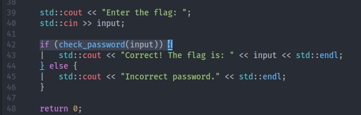

จะเห็นได้ว่า เงื่อนไขนี้ได้ทำการ check ว่าคำตอบถูกต้องไหม

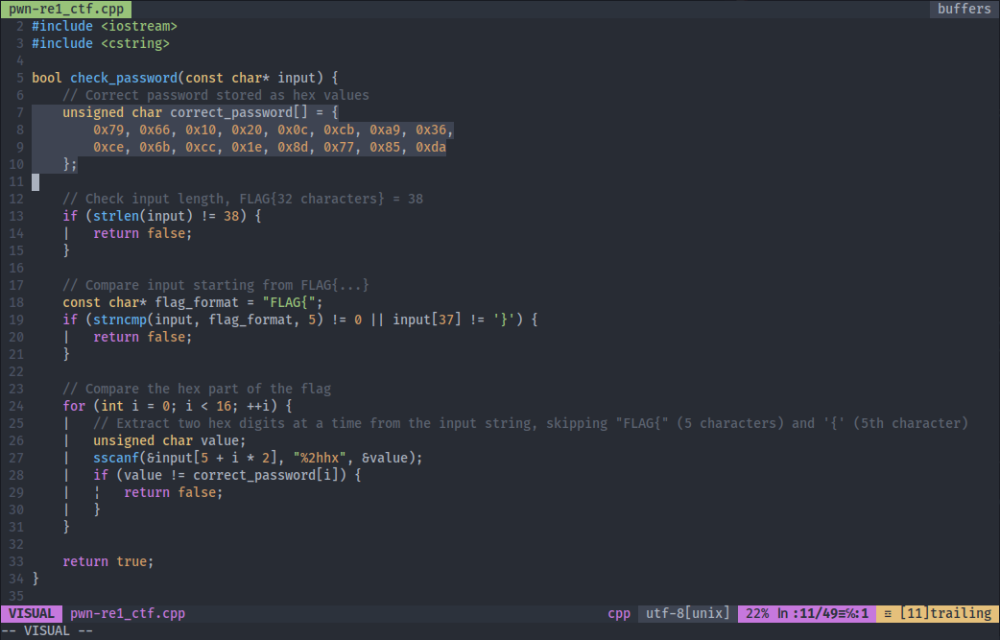

เราจึงไปต่อที่ function ที่ถูกเรียก จาก code จะพบวิธีตรวจสอบ password โดยวิธีการที่ใช้ในการตรวจสอบสรุปได้ดังนี้

- ตัวอักษรต้องเท่ากับ 38 (เกิดจาก flag pattern **6** + md5 **32** = **38**)
- ต้องขึ้นต้นด้วย `FLAG{` และลงท้ายด้วย `}`
- ภายใน flag pattern ต้องเท่ากับ `correct_password` โดย input ต้องเป็น raw hex

เราจึงสรุปได้ว่า password คือ ค่าในตัวแปร `correct_password` เราจึงนำมารวมกับ flag pattern จึงได้ flag

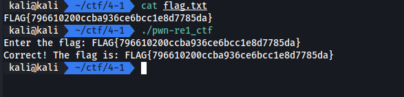

## Pwnable & Reverse Engineering > Reverse w/o Code

โจทย์ข้อนี้ได้ไฟล์ ELF เพียงอย่างเดียว

**Screen**

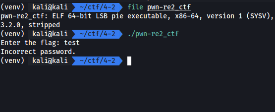

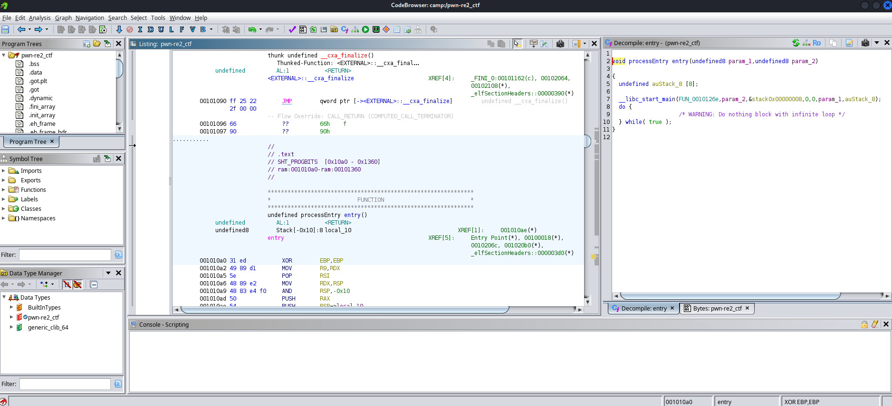

เนื่องจากไม่มี source code และ ELF ไฟล์นี้เป็นแบบ stripped เราจึงเริ่มจากการ reverse engineering เลย ซึ่งในครั้งนี้เราจะใช้ ghidra

เมื่อเปิดมาให้เรา analyze เลย

เราจะไล่เข้าไปหาจุดที่เปรียบเทียบคำตอบ

`__libc_start_main` -> `FUN_0010126e` -> `FUN_00101189`

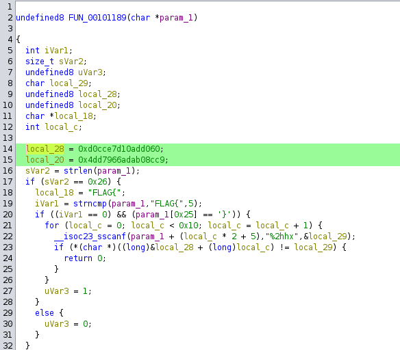

จาก code ตัว loop แสดงให้เห็นว่า มันทำการตรวจสอบจาก input + 5 ถึง input + 5 + 32 ว่าตรงกับ `local_28` + `local_c` ไหม โดยก่อนเข้า loop จะทำการตรวจสอบ 5 ตัวแรกคือ `FLAG{` ตัวสุดท้ายคือ `}` ภายใน flag คือ hex 16 bytes หรือ char 32 ตัวนั้นเอง

โดยภายใน flag จะถูกเปรียบเทียบกับตัวแปร `local_28` ซึ่งจากการสังเกตุจะพบว่า `local_28` และ `local_20` นั้นมีขนาดเท่ากันและประกาศต่อกัน 8 + 8 = 16 bytes

เราจึงนำค่าในสองตัวแปรดังกล่าวมารวมกันเป็น character array ขนาด 16 bytes แล้วทำการแปลงกลับเป็น hex ที่ละ byte

```cpp
#include <iostream>
#include <iomanip>
#include <cstring>

using namespace std;

int main() {
    unsigned long long var1 = 0xd0cce7d10add060;
    unsigned long long var2 = 0x4dd7966adab08cc9;
    size_t size = sizeof(var1) + sizeof(var2);

    unsigned char ptr[size];

    memcpy(ptr, &var1, sizeof(var1));
    memcpy(ptr + sizeof(var1), &var2, sizeof(var2));

    cout << "FLAG{";

    for (size_t i = 0; i < size; i++) {
        cout << hex << setw(2) << setfill('0') << (int)ptr[i];
    }

    cout << "}" << endl;

    return 0;
}
```

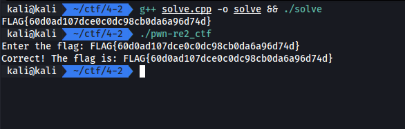

# Network Security

## Network Security > Chat Message

เราต้องหา flag จากการถอดรหัสไฟล์ ซึ่งได้จากการดัก traffic

**Screen**

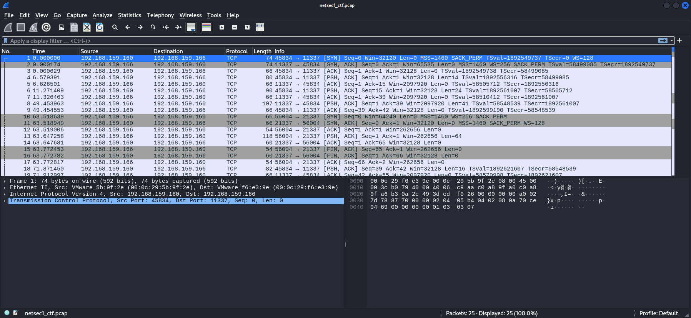

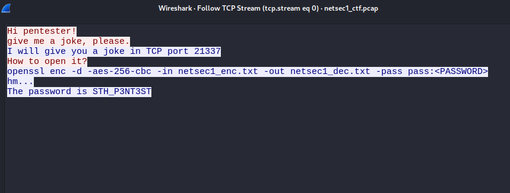

เริ่มจากการ follow tcp stream แล้วพบว่าเป็นการคุยกันผ่าน tcp และมี password และ command ของ openssl ติดมาด้วย พร้อมบอกว่า มุขนั้นอยู่ที่ไหน

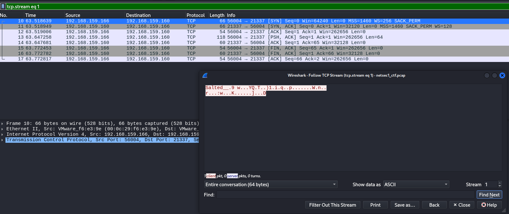

เราจึงไปตามยัง port แล้วเมื่อ follow tcp stream ดังกล่าวแล้วพบว่าเป็นข้อความเข้ารหัสไว้

จากสรุปได้ว่า ในตอนแรกและตอนที่สอง คือ เราจะต้องเอาข้อความจาก port ที่ตามมาไปเขียนลงไฟล์ แล้วทำการถอดรหัสด้วย password และคำสั่งที่ได้ในตอนแรก

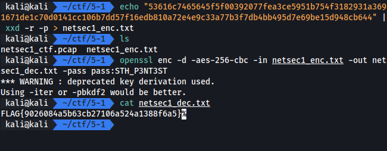

## Network Security > Encrypted File

ในโจทย์นี้เราได้ไฟล์ pcap มา ซึ่งเราต้องหา 7z ในนั้นและ password สำหรับแตกไฟล์

**Screen**

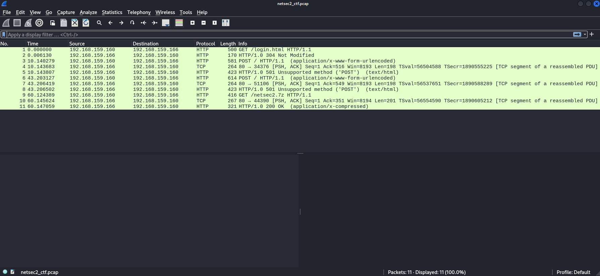

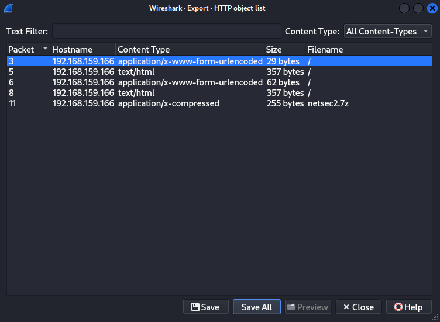

เริ่มจากการ export เอา 7z ออกมาก่อนเลย

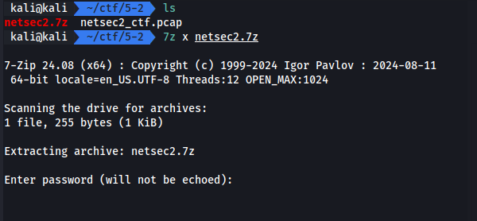

พบว่ามี password จริงๆ

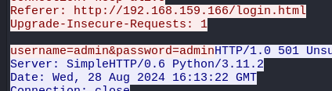

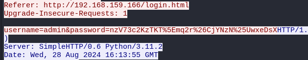

เราจึงไล่ดู HTTP แต่ละ request ว่ามีอะไรน่าจะเป็น password ได้บ้างแล้วพบว่ามี 2 request ที่น่าสนใจ

แต่พอเรานำ password ทั้งสองไปทดสอบพบว่าใช้ไม่ได้

แต่เดี๋ยวก่อน HTTP ส่วนหัวไม่สามารถส่งอักษรพิเศษตรงๆได้ ต้อง encode ก่อน เราจะสังเกตุได้จากมี % ตรง password ที่สอง

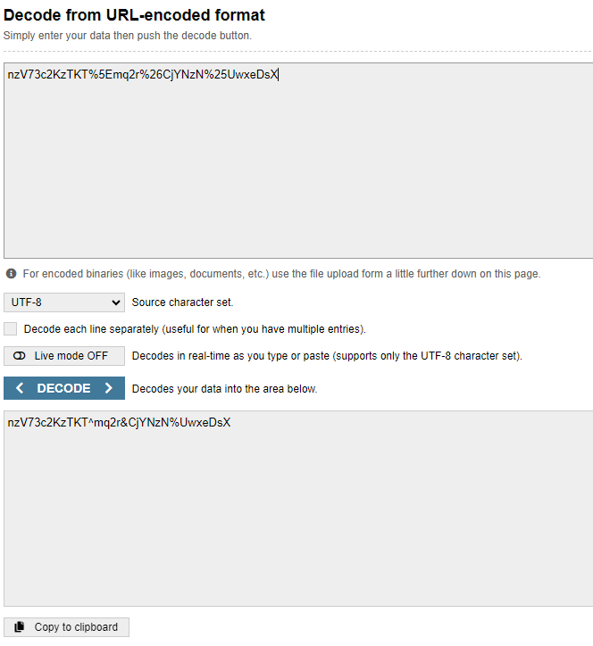

เราจึงทดลองนำไป decode แล้วแตกไฟล์ใหม่อีกครั้ง

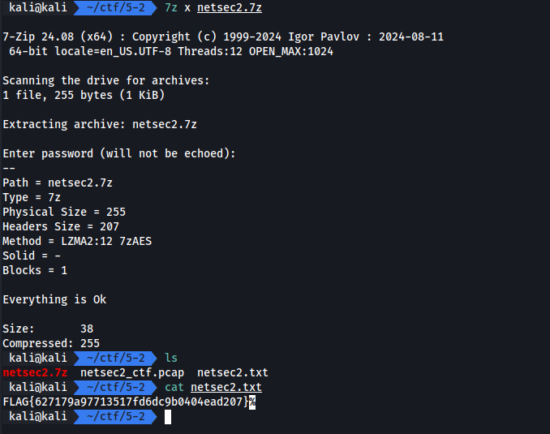
