เปิดก่อนเลย เศร้าครับ 555 ก็สำหรับงานนี้ Hack the Scammer CTF 2025 ที่จัดโดย NCSA และ hosted by Siam Thanat Hack ก็เป็นงานที่ออกแนวใหม่ๆมากครับ เพราะก่อนหน้านี้ CTF ในไทยเราเน้นหมวด jeopardy ทั่วไป แต่ในงานนี้ก็ยังเป็น jeopardy ครับ แต่เน้นหมวด Web และ OSINT แค่สองตัว เพื่อให้เข้า theme hack scammer ซึ่งต้องเรียกว่าทำทีมผมตกม้าตายกันเลยทีเดียวกับหมวดเว็บ

โดยจะเป็นการจำลองสถานะการระบบ scammer ตั้งแต่การหลอก ข้อมูลเว็บที่หลุด หาหลังบ้านของ scammer เจอจนถึงการระบุตัวคนทำได้

ส่วน OSINT จะออกแนวตามหาข้อมูลแบบ passive บน internet ครับ

ระดับ นิสิตนักศึกษา บุคลากรหน่วยงานรัฐ เอกชน และประชาชนทั่วไป \
Score type: Dynamic

**Team**

- [@noonomyen](https://github.com/noonomyen)
- [@c0ffeeOverdose](https://github.com/c0ffeeOverdose)

# Category

- Web
  - **Scenario 3 Part 1 - Suspicious Discord Login**
  - **Scenario 3 Part 2 - Data Leakage (1)**
  - **Scenario 3 Part 3 - Data Leakage (2)**
  - **Scenario 3 Part 4 - Recon 101**
  - Scenario 3 Part 5 - No More Cloudflare
  - Scenario 3 Part 6 - Web Discovery
  - Scenario 3 Part 7 - Session Craftmanship
  - Scenario 3 Part 8 - No More SQLMap
  - Scenario 3 Part 9 - Scammer Identity
- OSINT
  - **Scenario 2 Part 1 - Reuse Meme**
  - Scenario 2 Part 2 - Dark Web Monitoring
  - Scenario 2 Part 3 - Geo Guesser 1
  - **Scenario 2 Part 4 - Bear & Honey**
  - **Scenario 2 Part 5 - Geo Guesser 2**
  - **Scenario 2 Part 6 - Geo Guesser 3**
  - Scenario 2 Part 7 - Dark Web Monitoring 2

---

# Scenario 3 Part 1 - Suspicious Discord Login

*Author: longcat* \
*(Flag 15) คุณในฐานะเจ้าพนักงานศูนย์เฝ้าระวังภัยคุกคาม ThaiCERT ได้รับแจ้งว่ามีเว็บไซต์ Phishing ของ Scammer ที่เลียนแบบเว็บ Discord เข้าไปตรวจสอบด่วน*  \
*URL ทางเข้า: `https://discord.system-login.co`*  \
*Scope การทดสอบโจมตี: \*.system-login.co ทั้งหมด ส่วนระบบอื่น ๆ สามารถเข้าไป หาข้อมูล / OSINT ได้อย่างเดียว*  \
*Flag Format: STH{}*

ได้จาก comment ใน index ครับ `view-source:https://discord.system-login.co/`

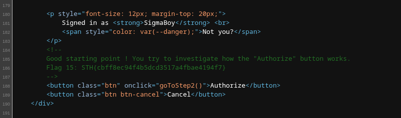

Flag: `STH{cbff8ec94f4b5dcd3517a4fbae4194f7}`

# Scenario 3 Part 2 - Data Leakage (1)

*Author: longcat* \
*(Flag 16) เพื่อที่จะตามจับเจ้าของเว็บ ต้องหาทางรู้ให้ได้ว่า ใครเป็นเจ้าของโค้ดเว็บนี้? ถ้าพบแล้ว อาจจะนำไปสู่ ข้อมูลเว็บในเวอร์ชันก่อน ๆ ที่มีข้อมูลที่น่าสนใจก็เป็นได้* \
*Flag Format: FLAG{}*

ต่อจาก **Data Leakage (2)** ตัว flag อยู่ใน commit เก่าๆของ repo อีกวิธีคือตามไปดู public repo โดย remote url จะได้จาก `.git/config`

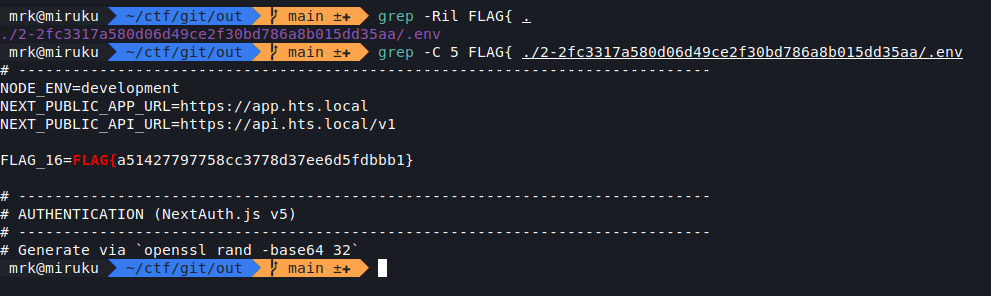

Flag: `FLAG{a51427797758cc3778d37ee6d5fdbbb1}`

# Scenario 3 Part 3 - Data Leakage (2)

*Author: longcat* \
*(Flag 17) บางทีโค้ดที่เก็บใน Github กับที่โปรแกรมเมอร์เอาไปใช้อาจจะมี Commit ที่ยังไม่ได้ Push ก็เป็นได้ ?* \
*Flag Format: STH{}*

Solved by [@c0ffeeOverdose](https://github.com/c0ffeeOverdose)

เจอจาก `.git` directory โดยใช้ tool dump ออกมา `https://discord.system-login.co/.git/config` เสร็ขแล้วใช้ extractor แยก commit ออกมา

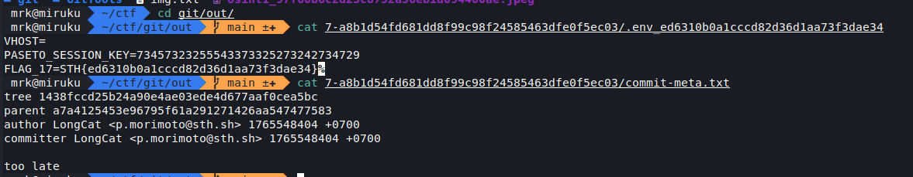

::github{repo=internetwache/GitTools}

Flag: `STH{ed6310b0a1cccd82d36d1aa73f3dae34}`

# Scenario 3 Part 4 - Recon 101

*Author: longcat* \
*(Flag 18) ต้องหาความเชื่อมโยง discord.system-login.co กับระบบอื่น ๆ ที่อาจเกี่ยวข้องกัน* \
*Flag Format: STH{}*

Solved by [@c0ffeeOverdose](https://github.com/c0ffeeOverdose)

ใช้ fuzzing tool หา subdomain จนเจอว่ามี `support.system-login.co` อยู่

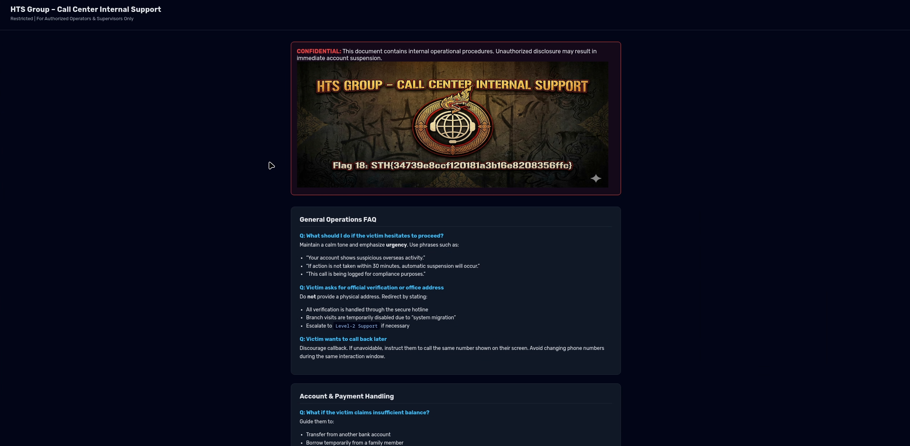

Flag: `STH{34739e8ccf120181a3b16e8208356ffc}`

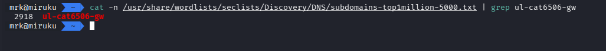

# Scenario 2 Part 1 - Reuse Meme

*Author: longcat* \
*อะไรจะถูกใช้ซ้ำจาก Meme นี้ ?* \
*FLAG Format: ถ้ามีตัวอักษร ตอบเป็นตัวพิมพ์เล็กทั้งหมด ถ้ามี space แทนที่ด้วย _ นำคำตอบครอบด้วย STH{...}* \
*เช่นถ้าคำตอบคือ my sock 7 ให้ตอบว่า STH{my_sock_7}*

เป็นรูป meme ครับ ซึ่งเมื่อ search google แล้วมี user reddit แคปมาจาก x ของ elon musk

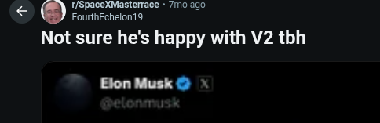

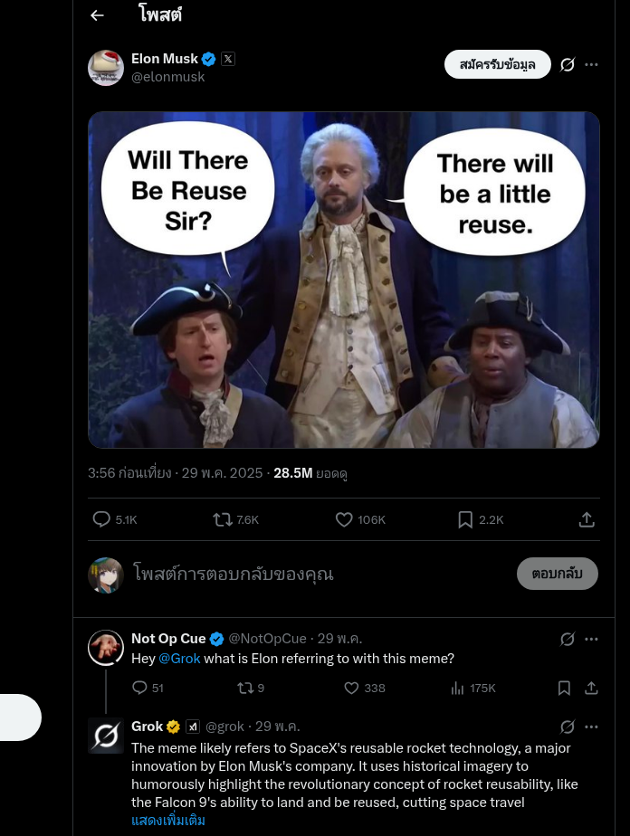

ตามไปดูจาก x ครับ ซึ่งจะเจอคนมา tag เรียก grok มาถามว่า elon musk กำลังพูดถึงอะไร

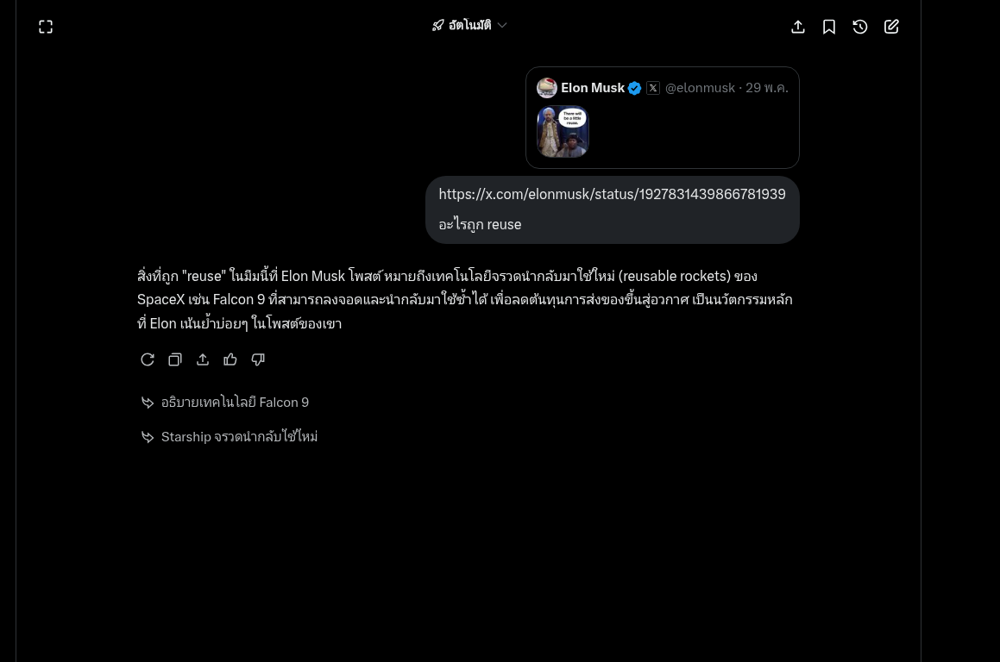

ตอนแรกคิดว่า rocket ครับ แต่ก็ใช่ แต่เป็นชื่อของ rocket ได้จากการถาม grok อีกครั้งเลยรู้ว่าเป็น Falcon 9

Flag: `STH{falcon_9}`

# Scenario 2 Part 4 - Bear & Honey

*Author: longcat* \
*จากรายงาน Honeypot ของ TZ-CERT <https://www.tzcert.go.tz/report/TZCERT-HON-25-0040-honeypot-report-28th-april-2025/download> พบว่า มีการเดาสุ่มรหัสผ่านระดับเครือข่ายต่าง ๆ มากมาย* \
*ใน Top 10 อันดับชุดผู้ใช้งานและรหัสผ่าน มีบัญชีหนึ่งคือ tshell และรหัสผ่านเป็นค่าว่าง* \
*จงตามหาว่า ชื่อผู้ใช้งาน tshell ใช้สำหรับโจมตีอุปกรณ์เครือข่าย ""รุ่น"" อะไรที่มีใช้เยอะในประเทศไทย และเกี่ยวข้องกับ CVE หมายเลขอะไร* \
*Flag Format: คำตอบเช่นรุ่น ABC1234 (ตัวพิมพ์ใหญ่ทั้งหมด เขียนติดกัน) และ CVE-2025-1337 ให้ตอบว่า STH{ABC1234_CVE-2025-1337}*

เป็นรายงาน honeypots ประจำสัปดารห์ของ TZ-CERT ครับ โดย attack username tshell

จริงๆผมใช้ ai นวดเอาครับ แต่ถ้าจะหาก็จะประมาณนี้ครับ

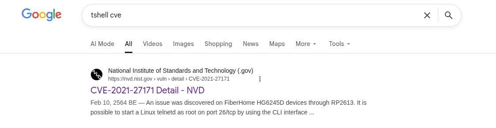

หาจาก cve เลยเพราะ chall ถามหา device + cve

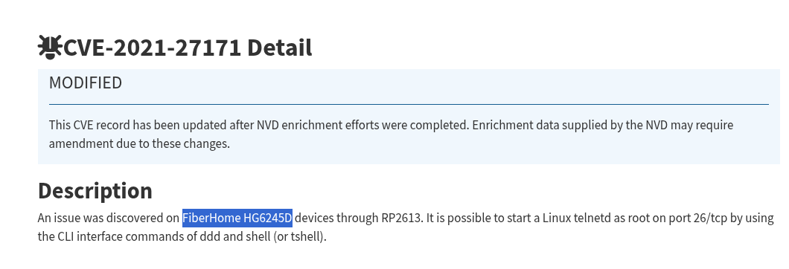

ยังไม่ถูกครับ หาต่อจาก device นั้นดู เพราะรุ่นนี้ก็เจอเยอะในไทยครับ

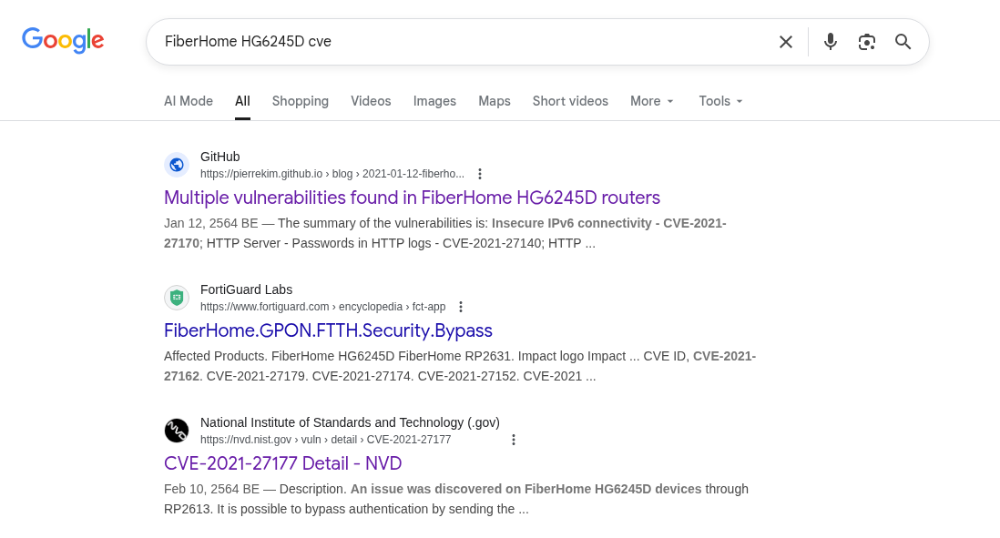

ยังมีเพิ่มครับ

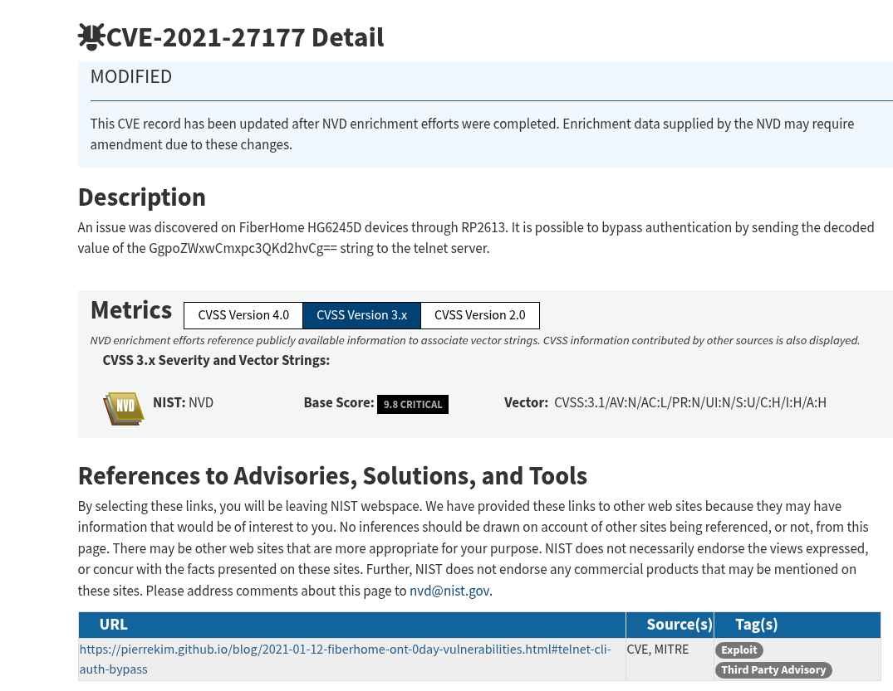

เจอแล้ว พร้อม PoC telnet shell

Flag: `STH{HG6245D_CVE-2021-27177}`

# Scenario 2 Part 5 - Geo Guesser 2

*Author: longcat* \
*ก่อนเด็กชายคนหนึ่งจะถูกลักพาตัวไป เค้าส่งรูปนี้ให้ทางบ้าน และบอกว่าถูกขังอยู่ที่ร้านอาหารอีกฝั่งของในรูป น่าจะในกรุงเทพ ช่วยหาให้หน่อยว่า ร้านอะไร เราต้องรีบส่งสายตรวจไปที่นั้นด่วน!* \
*Flag Format: ชื่อร้านภาษาไทย เขียนติดกันหมด ไม่มีคำนำหน้า-ต่อท้าย ไม่มีเว้นวรรค ตัวอย่าง STH{ข้าวมันไก่นายน้อย}*

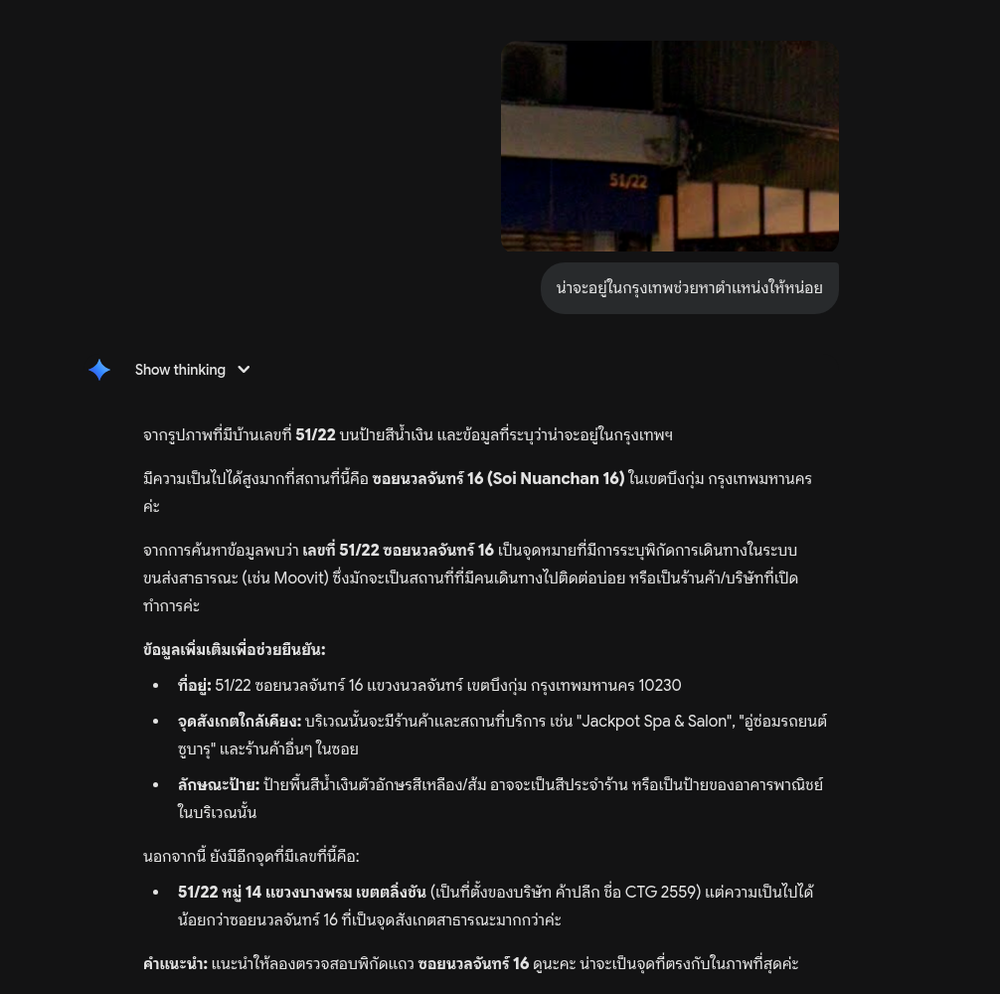

ask gemini แปป

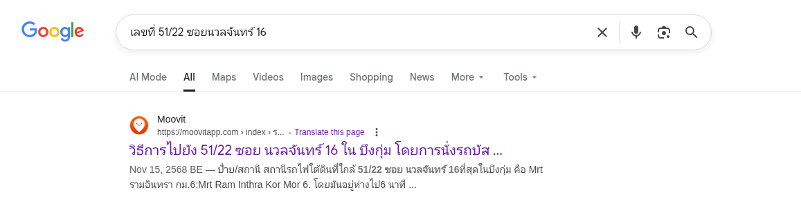

เสร็จแล้วหา location ครับ

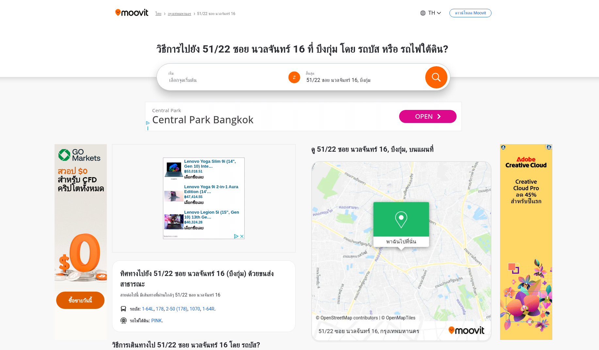

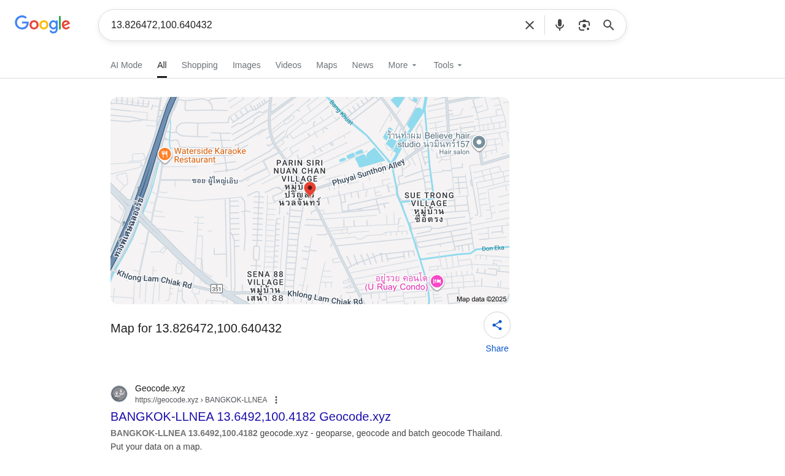

ได้ location มาจาก moovit เราก็เอาไปหาจาก google map ต่อครับ

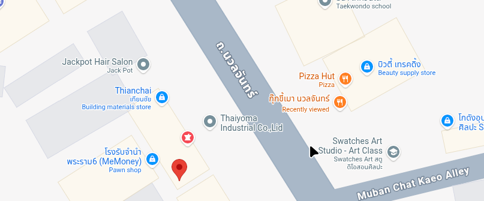

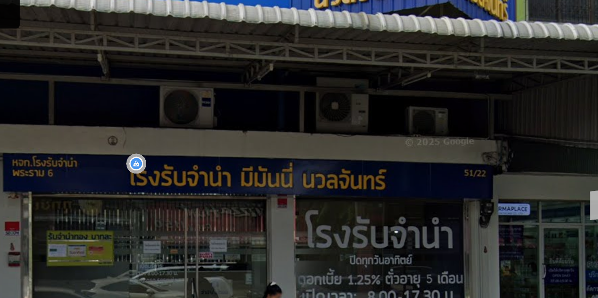

เจอแล้ว 51/22 ที่ว่า

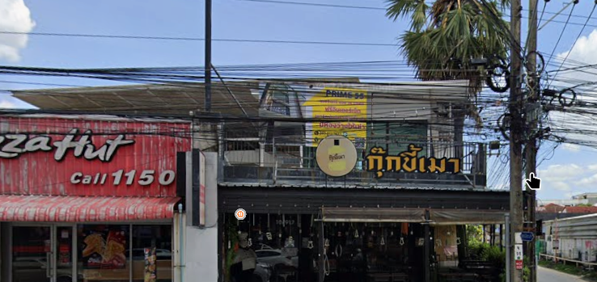

และตรงข้ามก็คือ

Flag: `STH{กุ๊กขี้เมา}`

> Note: This is a hypothetical scenario and not a real event.

# Scenario 2 Part 6 - Geo Guesser 3

*เราได้รับเบาะแสมาว่า บริษัทการเงินแห่งหนึ่งในประเทศเพื่อนบ้าน อาจมีส่วนเกี่ยวข้องกับธุรกิจสีเทา แต่ภาพที่เราได้รับมาถูกตัดออกไปช่วยตามหาทีว่านี้คือโลโก้บริษัทอะไร* \
*Flag Format: ภาษาอังกฤษตัวเล็กหมด ถ้ามีเว้นวรรคใช้ _ ไม่ต้องใส่ประเภทบริษัทต่อท้ายละครอบด้วย STH{..}* \
*ตัวอย่าง STH{mk_suki}*

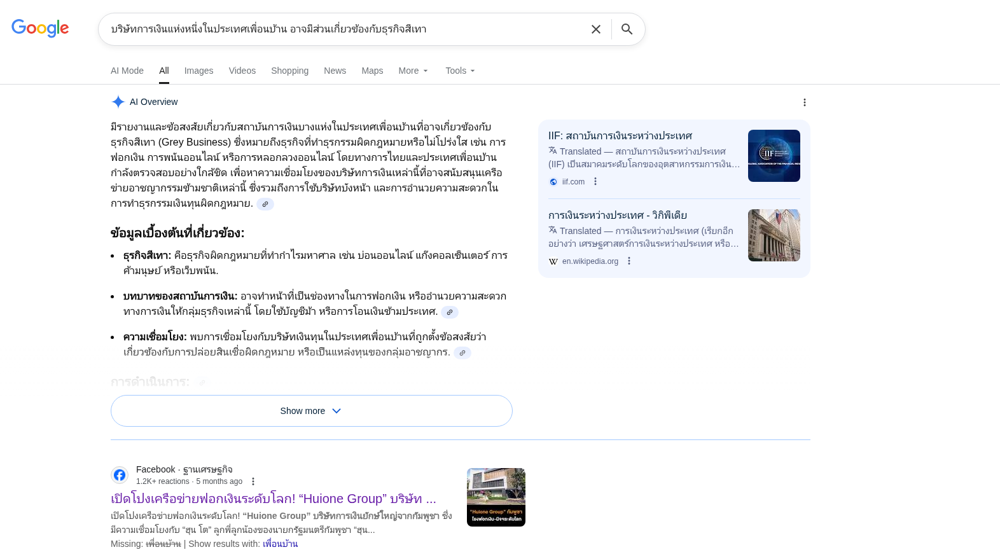

search มันตรงๆเลยสิครับ

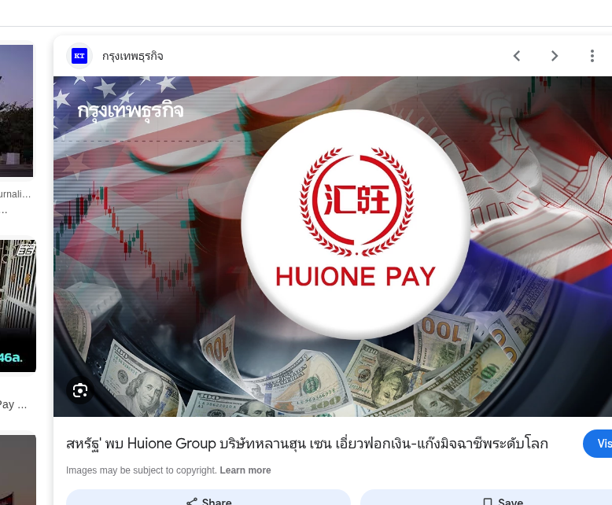

เจอละ

Flag: `STH{huione_pay}`

---

หมดละ ได้แค่ 8 ข้อเองครับ geo อีกตัวผมหาร้านไม่เจอ เดาๆว่าบนเขาแต่ไม่รู้เขาไหนครับ 555 ส่วนข้อมูล dark web ผมไม่เคยหาครับ เลยไม่รู้แหละที่จะใช้หาเช่นกัน เลยจบที่ 8 ข้อครับ แต่ข้อที่คาดหวังสุดๆก็ web นิแหละครับ แต่หา subdomain ไม่เจอ เราเข้าใจว่าคงไม่เหลือ subdomain ให้หาอีกแล้วเราเลยพยายามหาร่องรอยบน internet และข้อมูลเกี่ยวกับเว็บ แต่ก็หาอะไรไม่เจอครับ จนกระทั่งทราบภายหลังว่า มันต้อง fuzz หาจาก wordlist ซึ่ง domain ก็คือ `ul-cat6506-gw.system-login.co` เป็น vhost + direct ip port 80 เข้าจาก ip ตรงเฉยๆไม่ได้

เป็นการพลาดที่รุนแรงมากครับ เพราะเป็นประตูให้ทำข้อที่เหลือทั้งหมดเลย 😥

เจอกันงานหน้าเช่นเคยครับ ^_^
