โครงการอบรมเชิงปฏิบัติการและแข่งขันทักษะความปลอดภัยทางไซเบอร์ ครั้งที่ 2
วันที่ 30 พฤศจิกายน - 3 ธันวาคม พ.ศ. 2567 ณ หอประชุมศรีวชิรโชติ มหาวิทยาลัยราชภัฏพิบูลสงคราม


สำหรับงานนี้ผมก็ solve ช้ามาก หันมาอีกที่พี่ในทีมล่อ Threat Intelligence ไปหมดหมวดหนึ่งละ 😅 ผมเลยได้เขียน write-up แค่ challenge ที่ผม solve ได้อันน้อยนิด

# Team members

- [willywotz](https://github.com/willywotz)
- [c0ffeeOverdose](https://github.com/c0ffeeOverdose)

# Challenges

- **DFIR (5)**
- **Investigate (5)**
- **Scenario (1, 5, 1)**
- **Threat Intelligence (10)**
- **Web Hacking (10)**
- **Welcome Flag (1)**

# Welcome Flag

อยู่กระดาษหน้าทางเข้า

```txt
PSRU{Good_Morning}
```

# DFIR 1

ไฟล์ malicious ที่ผู้ไม่หวังดีใช้ติดตั้งบนเครื่องเหยื่อยสำหรับช่องทางการติดต่อกลับไปยัง C2 Server คือไฟล์ชื่อว่าอะไร

รู้ได้จาก DFIR 2

```txt
psru_update.exe
```

# DFIR 2

ไฟล์ malicious ที่ผู้ไม่หวังดีใช้ติดตั้งบนเครื่องเหยื่อทำการติดต่อกลับไปยัง C2 Server ที่หมายเลข IP อะไร หมายเลข Port อะไร

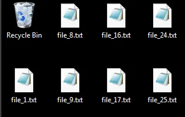

เราจะเจอไฟล์ executable อยู่ 3 ไฟล์คือ key, key2, psru_update.exe


เราจึงคิดว่าไฟล์ psru_update.exe น่าสงสัย เราเลยเอาไปเข้า virus total ดู

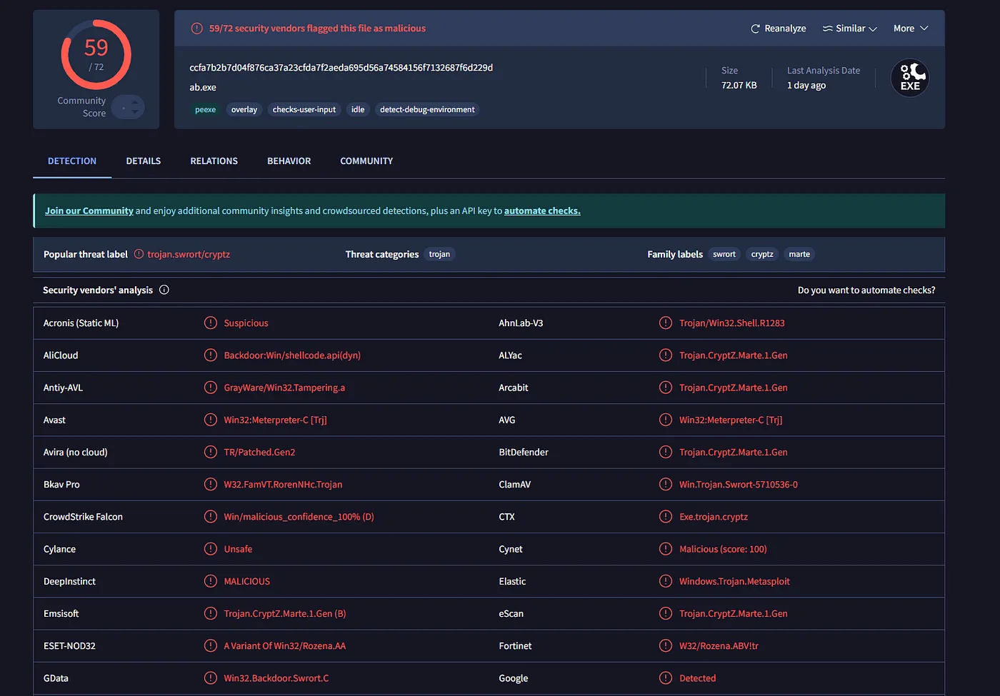


เราเจอ IP และ Port ที่ระบุว่า key คือ C2

```txt
194.58.112.174:8888
```

# DFIR 3

มีไฟล์ที่ถูกเข้ารหัสหลายไฟล์ จะมีอยู่ไฟล์เดียวที่ซ่อนข้อความลับ (flag) ไว้ คือไฟล์ชื่อว่าอะไร

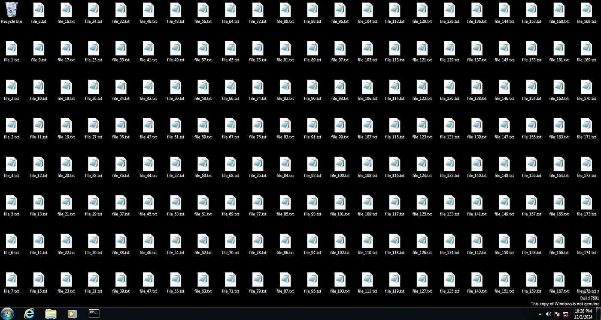

คิดว่าต้องอยู่นี้แหละ ว่าแต่ไฟล์ไหน เราจึงโยนไป linux เพื่อความง่ายในการหา แล้วลองดูว่าไฟล์ซํ้ากันไหม

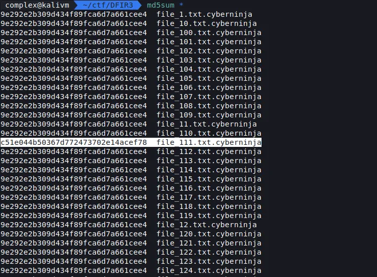

เจอละ ตอนแรกก็ลังเลอยู่ เพราะตอบได้แต่ 10 รอบ แต่ก็ถูกแล้ว

```txt
file_111.txt.cyberninja
```

# ลองทายดูซิ… #2

อาคารภายในภาพมีชื่อว่าอะไร


อยู่ไหนไม่รู้แต่ google map ช่วยได้ อาคารมีป้ายใหญ่ๆเขียนว่า e-LIBRARY

```txt
e-LIBRARY
```

# Scenario 3–1

ลองนั่งยานดูสิ…

หาเจอได้ใน Linked in

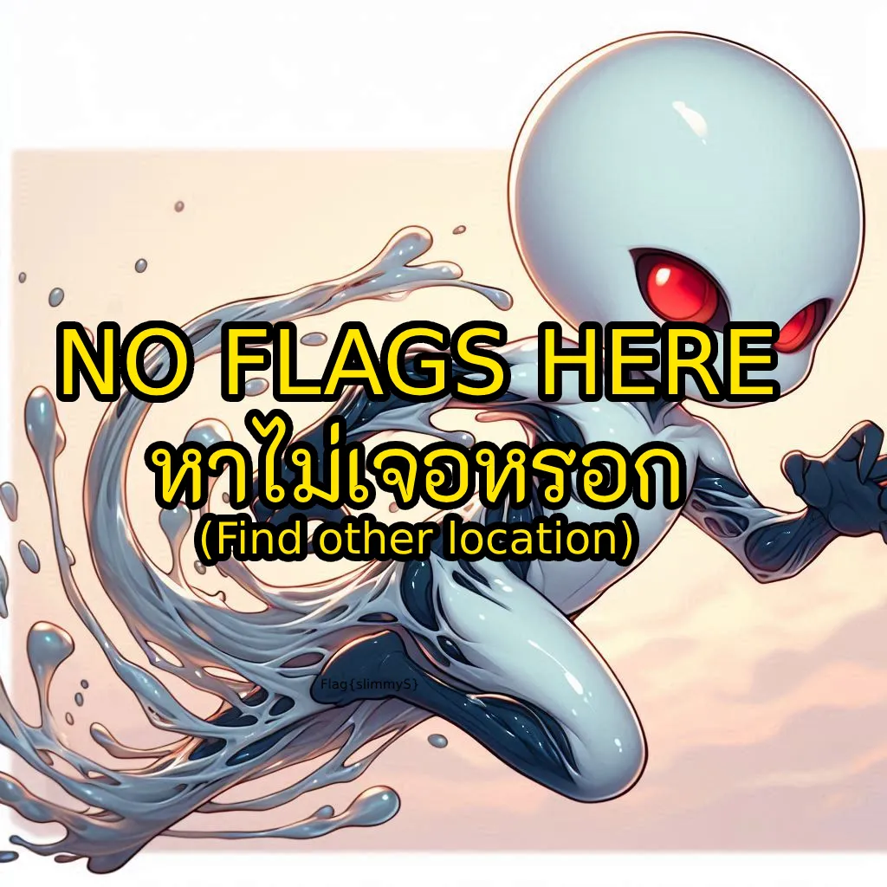

ดูยากใช่ไหมละ งั้นเล่นท่าสักหน่อย

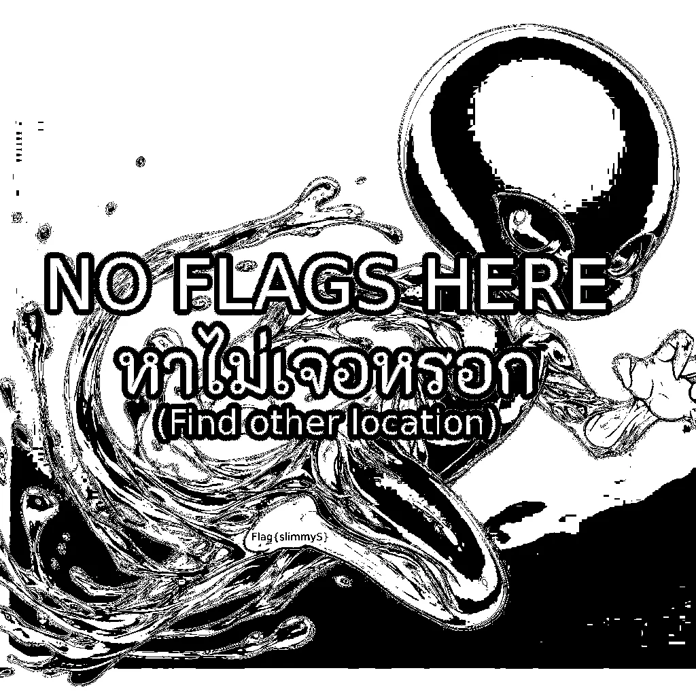

```txt
PSRU{slimmyS}
```

# Scenario 3–2

ลองนั่งยานดูสิ…

ได้ไฟล์รูปมารูปหนึ่ง


aperisolve แล้วเจอว่ามีรูปหนึ่งอยู่ด้านใน

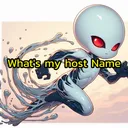

What’s my host Name ?

คิดได้สองแบบ

1. ไฟล์ที่ได้มาอยู่ในไฟล์อะไร ? -- vageta
2. story ใน linked in พูดถึงใคร ? -- slimmy และ vageta

```txt
PSRU{vagete}
```

# Scenario 2–2

นั่งยานดูสิ..

เราได้รูป vegeta2.png มา

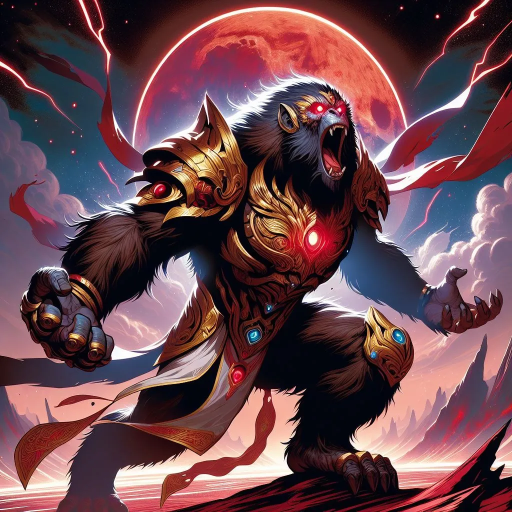

แต่เราเจอข้อความหนึ่งที่บอกว่า flag อยู่ใน banner (page in facebook)

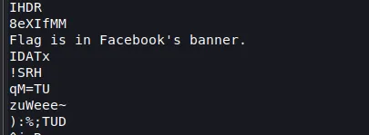

เราสับสนระหว่าง profile และ banner สักพัก เพราะอยู่ profile ก็มี flag เหมือนกันแต่ดูเหมือนจะหลอก เพราะเรามาเจอจริงๆอยู่ banner ซึ่งมันสักเกตุยากนิดหนึ่ง

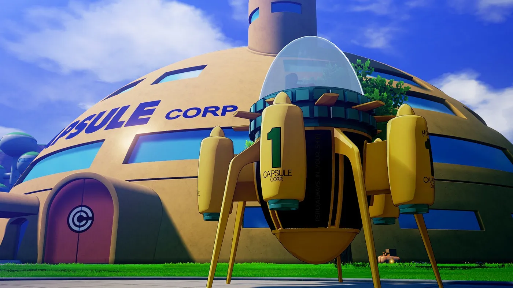

เราจึงใช้บริการ aperisolve อีกครั้งหนึ่ง

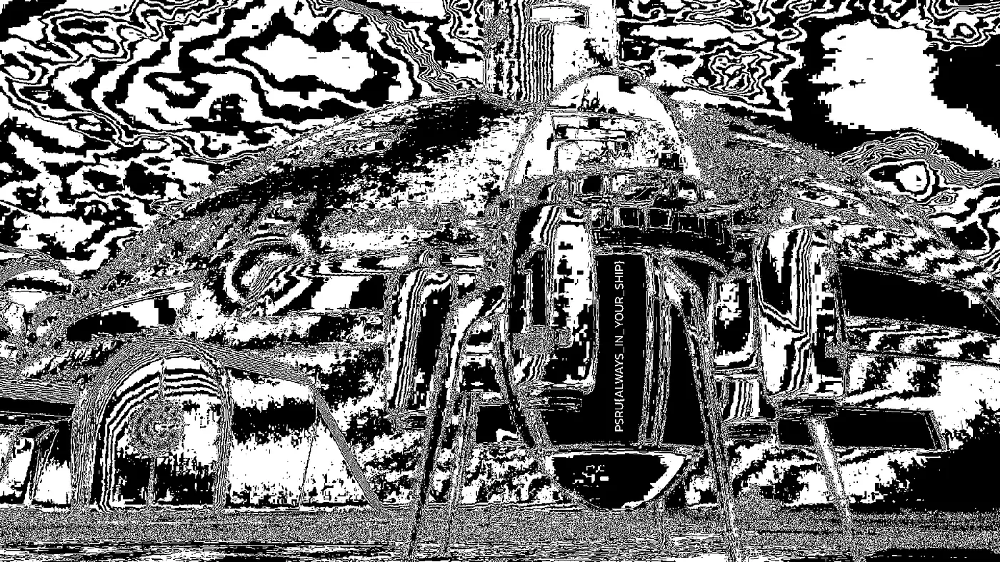

น่าน ดูง่ายขึ้นเยอะ

```txt
PSRU{ALWAYS_IN_YOUR_SHIP}
```

สำหรับงานนี้ผมว่าดีนะ มีการเอาเรื่องอื่นๆที่ไม่ค่อยเจอในการแข่งมาอบรม เช่น Cyber Threat Intelligence, Investigation มาพูด และสังเกตว่าพักหลังๆทาง NCSA จะออกไปทาง Scenario ด้วย ที่เราจะได้เจอว่าเขาจัดเต็มในการแข่ง THCTT 2024 Final round

สุดท้ายนี้ flag ข้อ web อยู่ไหนนนน!!! หาไม่เจอว้อยยย
