การแข่งขัน CTF หลังสงกรานต์ จัดโดย SECPlayground และ Sponsored โดย I-SECURE, Secure-D ในวันที่ 18/04/2025

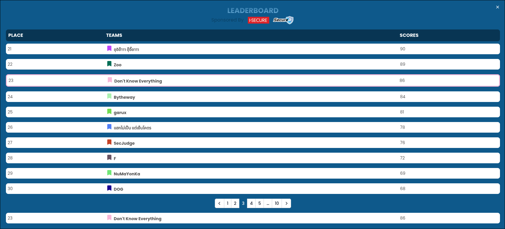

รู้สึกแย่สุดๆ 🥲

รอบก่อน solve ช้ารอบนี้ไม่ได้เลย web application 0 solve กันเลยทีเดียว

# Challenges

- Web Application Security
  - Shopez
  - TechSupport
  - Catz
  - Secure_Panel
- **Digital Forensic**
  - **Another day of SOC#1-10 (1)**
  - **Compromised the system again#1-3 (1)**
- Pwnable
  - RCE101 (ไม่สามารถ start instance ได้)
- Reverse Engineering
  - **The Hidden Class**
  - **The Vault**
  - **The Format**
  - **The Hidden Message 1-4 (1,2,3)**
- **Cryptography**
  - **World War Encryption**
  - **Paddle Case**
  - **What is it**

---

# Another day of SOC#1

_On April 10, 2025, the Security Operations Center (SOC) detected unusual SSH login activity from an IP address originating in South Korea. Further investigation revealed a sophisticated attack chain involving vulnerability scanning, source code analysis, credential theft, unauthorized SSH access, privilege escalation, and persistence establishment. The attacker deployed a wellknown C2 (Command and Control) server for remote management of the compromised infrastructure._

_What is the threat actor IP?_

พูดตามตรง เดาเอาครับ สุ่มไปเรื่อยๆ

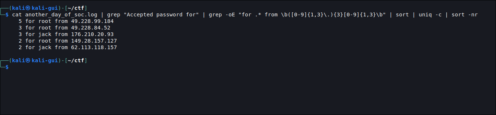

คือ SSH ถ้า login เข้ามาได้จะมี log `Accepted password for $USER`

เราจึง filter ออกมาแล้วลองไล่ดู

`62.113.118.157`

# Compromised the system again#1

_A threat actor attempts to gain unauthorized access to a Linux server hosted in your network using a commonly well-known attack._

_After multiple failed attempts, the actor successfully compromised the server. Post-compromise, the threat actor executes a script that downloads a secondary payload from a Command and Control (C2) server. The payload attempts to establish persistence and opens a reverse shell to the attacker's infrastructure._

_Your task is to analyze the logs and answer the following questions._

_Question: What IP of the threat actor?_

_Flag format: forensic\{IPAddress\}_

_Example: forensic\{127.0.0.1\}_

เริ่มจาก SSH

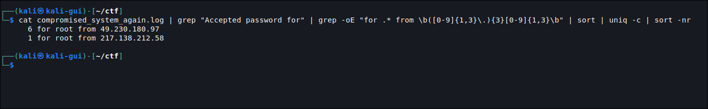

ลองมันทัั้งคู่เลยละกันนนนนนน

`forensic{217.138.212.58}`

# The Hidden Class

_You've found a suspicious file called the\_hidden\_class left behind on a compromised developer machine. The application claims to \"validate license keys,\" but there's more to it than that. Your task is to reverse engineer the file to retrieve the secret flag._

_Flag format: re\{.....\}_

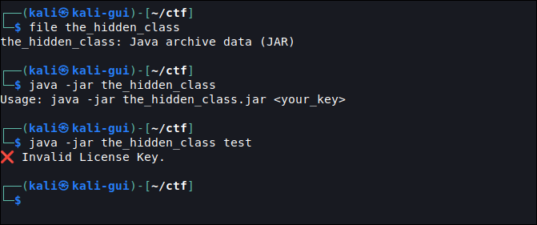

เอาละ decompile เลย

::github{repo="leibnitz27/cfr"}

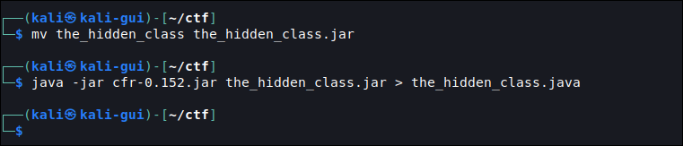

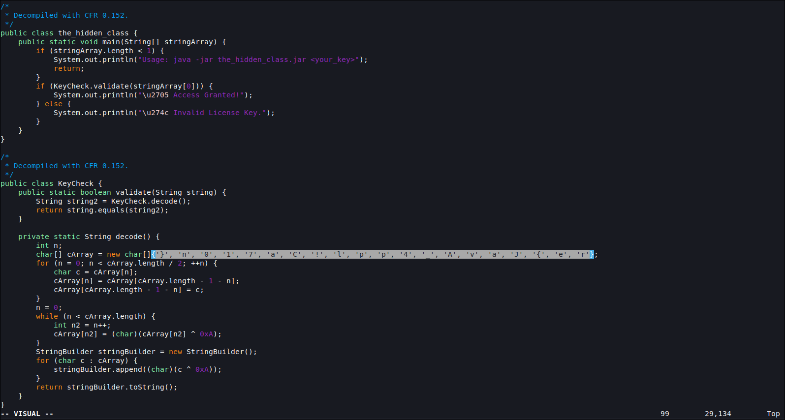

ok ไม่ยาก

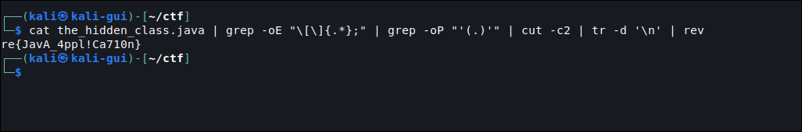

`re{JavA_4ppl!Ca710n}`

# The Vault

_We've intercepted a secure vault program used by a secret organization. Your mission is to reverse engineer the program to access the vault and retrieve the flag. Good luck!_

_Flag format: re\{.....\}_

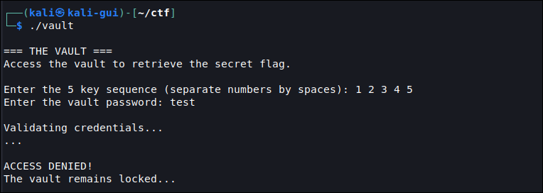

เราได้ ELF ไฟล์มา ซึ่ง

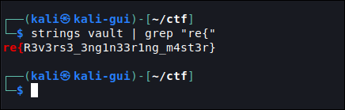

อะอ้าว...

จริงๆเรา reverse ไปเจอ string เจ้านี้แหละ แต่คิดไม่ถึงไงว่าจะเก็บ flag ไว้แบบนี้

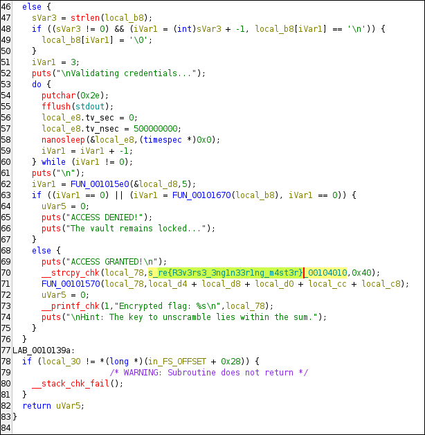

Ghidra > FUN_00101220

`re{R3v3rs3_3ng1n33r1ng_m4st3r}`

# The Format

_A company has developed a highly secure access system that only grants access to users who enter a valid secret passcode._

_The flag is hidden within the program and will only be revealed if the correct format is entered._

_Your mission is to reverse engineer the binary and retrieve the flag!_

_Flag format: re\{.....\}_

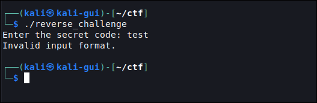

เราได้ ELF มา ซึ่งน่าจะ simpleๆ แหละ

งานนี้เราก็จะใช้ ghidra เช่นเคย

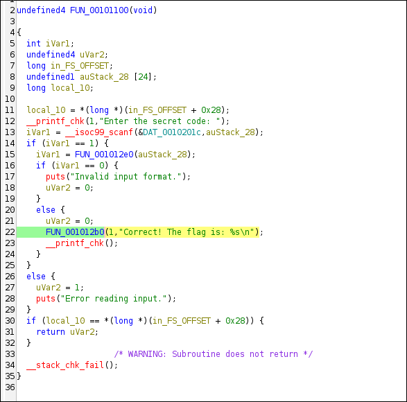

เราพบว่า function `FUN_001012b0` ที่ถูกเรียกใน `FUN_00101100` นั้นมีการเรียกใช้ data `0x00104010` น่าสงสียอยู่

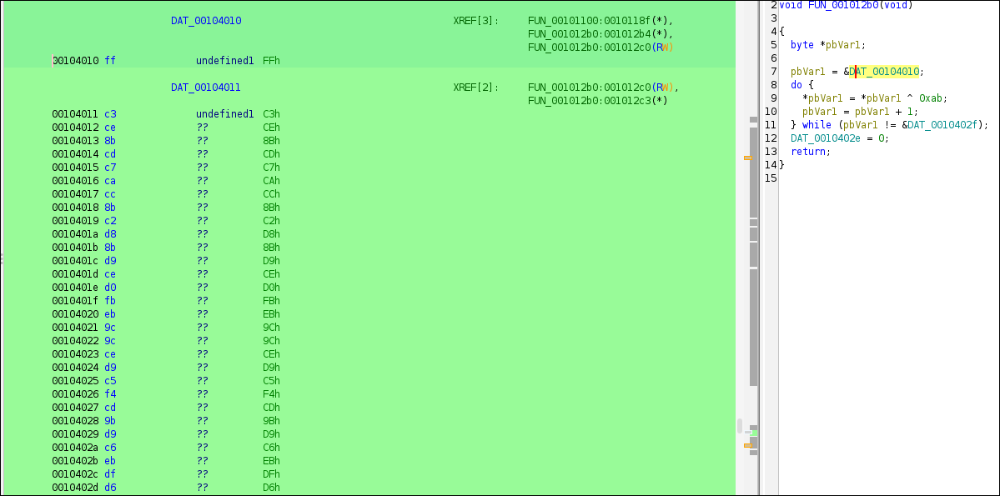

โดยมันได้เอาไป XOR กับ `0xAB` เราจึงลองนำ data ดังกล่าวไปถอดดู

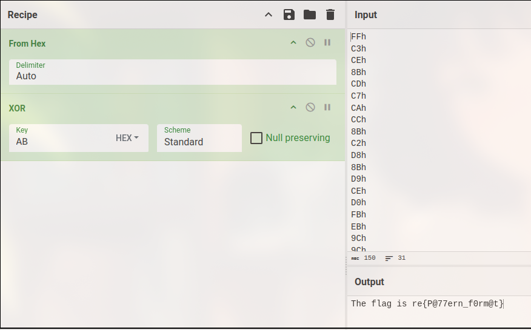

`CyberChef`

`re{P@77ern_f0rm@t}`

# The Hidden Message 1

_Deep within the digital archives of an abandoned research facility, rumors spoke of a message hidden by a brilliant but eccentric programmer. The programmer, known only as "Phantom," had created a series of challenges that protected a secret that could revolutionize cybersecurity as we know it._

_You are part of an elite team of digital archaeologists, tasked with uncovering lost knowledge from the digital ruins of the past. Your current mission has led you to a dusty terminal in the corner of the facility's main server room. The screen flickers to life as you approach, displaying a simple prompt - \"CTF Challenge.\"_

_According to recovered documentation, this is the second in a series of reverse engineering challenges designed to test the worthiness of those seeking Phantom's ultimate secret. The first level was trivial - a simple "Hello, World!" check to ensure basic programming knowledge. But Level 2 is where the real challenge begins._

_The terminal blinks expectantly, waiting for the correct input - a flag that would prove your reverse engineering skills and grant you access to the next level. Your team's future depends on your ability to extract the hidden message from this seemingly simple program._

_As you examine the binary, you realize that Phantom wasn't just testing technical skills but also teaching a fundamental lesson about security through obscurity: what lies in plain sight is often the most overlooked._

_Flag format: re\{.....\}_

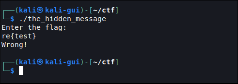

ELF ไฟล์ฮะ

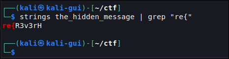

น่าน แต่มันหายไปไหนอะที่เหลือ ตามๆไปดูใน ghidra ดีกว่า

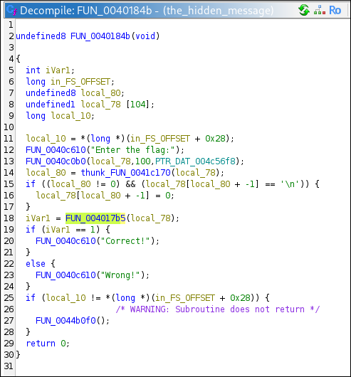

`FUN_0040184b`

เจอเงื่อนไขละ

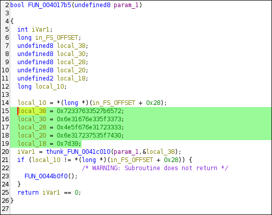

`FUN_004017b5`

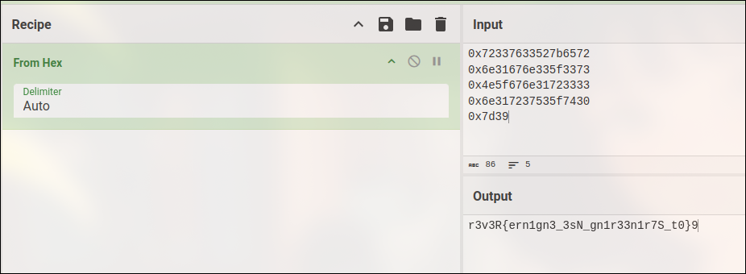

อะ เหมือนจะเป็น flag แต่ไม่ พอลองดูดีๆ มันคือ Endianness แบบ Little Endian ครับ ตัวแปรตัวหนึ่งเมื่อเราถอดออกมาแล้ว จริงๆมันคือ bytes ครับ เราจะต้อง reverse มันอีกทีหนึ่งก่อนนำไปรวมกัน สังเกตจาก

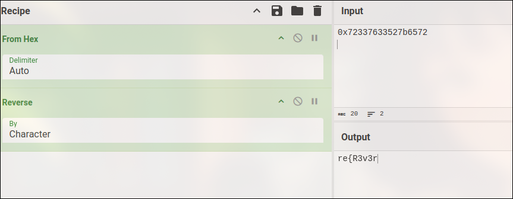

มันจะตรงกับที่เรา strings ได้ในรอบแรกครับ

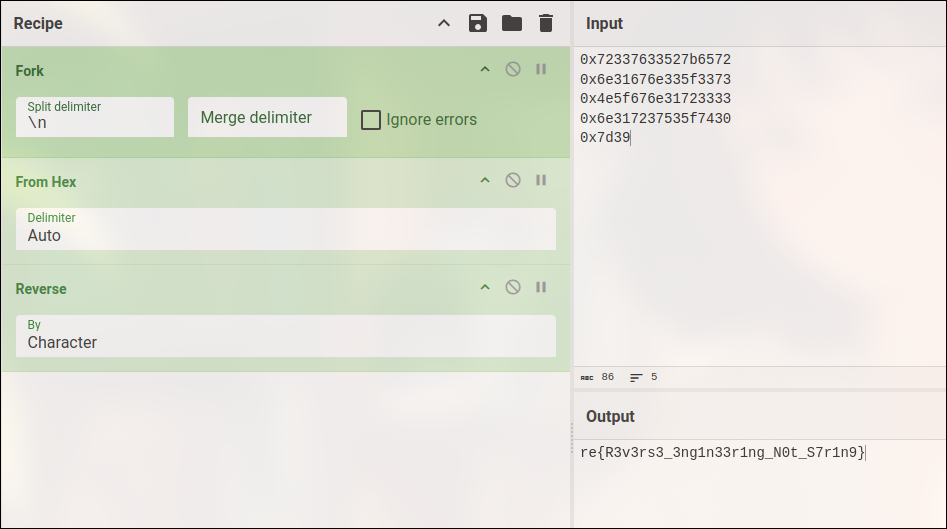

`re{R3v3rs3_3ng1n33r1ng_N0t_S7r1n9}`

# The Hidden Message 2

_As a security analyst for SecureNet Industries, you've been tracking a suspicious application that appears to be sending encrypted data to an unknown server. Your team has managed to obtain the executable and believes it contains a hidden authentication mechanism that could reveal information about the attackers._

_Initial analysis reveals the program was written in C and contains multiple functions that manipulate memory to construct a verification token. Your task is to reverse engineer the application, understand its internal structure, and extract the verification token (flag) that will help identify the origin of this malicious software._

_The binary appears to be building a string in memory through multiple function calls, making static analysis challenging. You'll need to use dynamic analysis tools like radare2 to track how the memory is manipulated during runtime._

_Flag format: re\{.....\}_

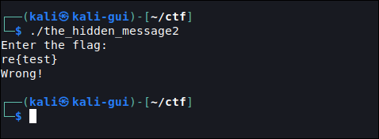

ELF again ซึ่ง เหมือนจะมาท่าเดียวกันไหม แต่รอบนี้ได้ใบ้มาคือต้อง dump memory ดู

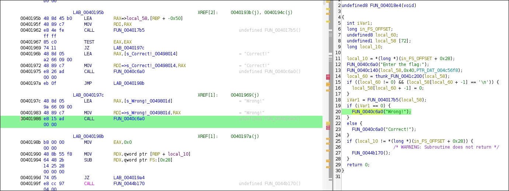

หลังจาก reverse ไปสักพัก มันซับซ้อนแฮะ เราเลยจะ dump memory ออกมาดูซึ่งเราก็เลยแวะไป patch `CALL 0x0040c6a0` เป็น `INT3` (Interrupt 3 - Breakpoint instruction ของ x86) เพื่อความง่ายในการทำ breakpoint ไหนๆก็ได้ reverse ไฟล์แล้ว ซึ่ง idea คือจะ dump memory ก่อนที่จะ print "Wrong" ออกมา

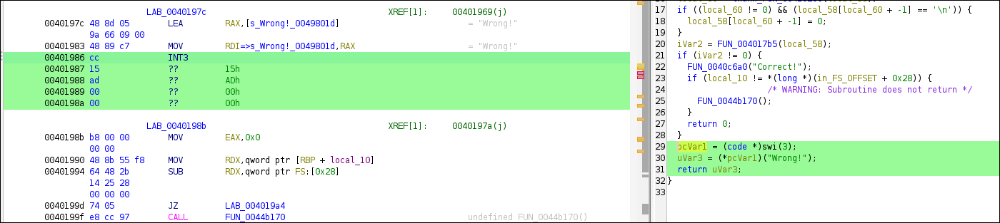

patch แล้วก็ ต่อด้วย radare2

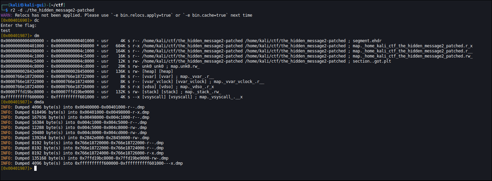

แล้วก็ strings มันซะเลย เริ่มจาก heap memory

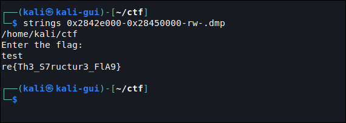

k

`re{Th3_S7ructur3_FlA9}`

# The Hidden Message 3

_You've discovered a hidden terminal in an abandoned server room at the old RegEx Technologies building. The screen displays a blinking cursor beneath a message:_

_\=\=\=\=\= SECURITY PROTOCOL ACTIVE \=\=\=\=\=_

_ACCESS TO SECURE DATABASE REQUIRES AUTHENTICATION_

_ENTER REGEX PLAYGROUND ACCESS CODE_

_Intelligence suggests this terminal contains critical data about the company's underground testing facility codenamed "SPG". Your mission is to crack the authentication system and gain access to the facility's blueprints._

_Analysis of the terminal's firmware revealed it's running a binary validation program that checks user input against a stored value. The program was designed by the company's eccentric security engineer, who was obsessed with binary operations and pattern matching._

_Your team has extracted the validation program's source code, but the actual key is encoded within its binary functions. Crack the code and retrieve the access token to complete your mission._

_Flag format: re\{.....\}_

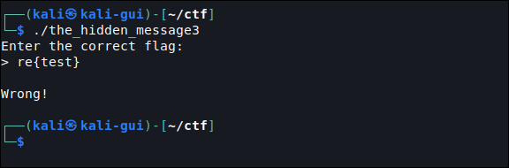

อืมมมมมมมมมมมมม

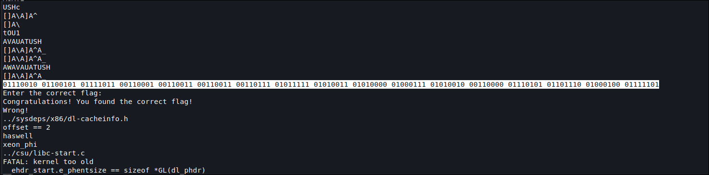

เอ๊ะ! แปลกๆ

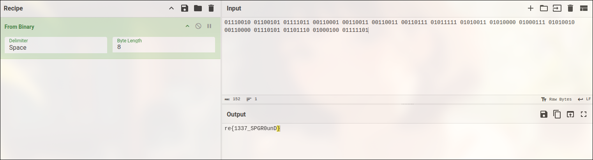

ซะงั้น

`re{1337_SPGR0unD}`

# World War Encryption

_During the Cold War, a spy known only as \"Shadow Fox\" was transmitting secret messages to their handlers using a cipher resistant to simple frequency analysis. Before disappearing, they left behind an encrypted message along with a cryptic clue to decipher it._

_\"Our enemies whispered in code, but history unveiled their secrets._
_A name known to those who studied Cold War intelligence._
_My pattern repeats, yet I am stronger than a simple shift.\"_

_Your mission is to recover the spy’s secret phrase before enemy intelligence cracks it._

_Flag format: CRYPTO\{.....\}_

_Example CRYPTO\{GGEZ\}_

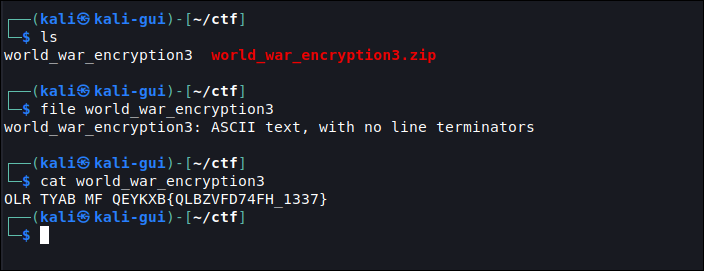

เราได้ข้อความมา ซึ่งถ้าลองมองจากปากซอยทางเข้าบ้านคงเห็นลางๆว่า `THE FLAG IS CRYPTO`

ซึ่งมันคือ Vigenere Cipher โดยเราได้ทำการ Brute Force จาก text ที่เราเดาได้จากปากซอยดู

```py
encrypted = "OLR TYAB MF QEYKXB"
plain =     "THE FLAG IS CRYPTO"

shifts = [ord(e) - ord(p) for e, p in zip(encrypted, plain)]

ciphertext = "QLBZVFD74FH_1337"

for k in range(len(shifts)):
  _shifts = shifts[k:]
  _shifts_len = len(_shifts)
  plaintext = ""
  i = 0
  for c in ciphertext:
    if c.isalpha():
      nc = chr((ord(c) - _shifts[i % _shifts_len] - ord("A")) % 26 + ord("A"))
      plaintext += nc
      i += 1
    else:
      plaintext += c

  print(plaintext)
```

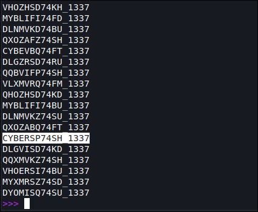

เจอแล้ว!

`CRYPTO{CYBERSP74SH_1337}`

# Paddle Case

_During an undercover operation, Agent \"Shadow Phantom\" sent an encrypted message to headquarters. Unfortunately, the enemy intercepted both the agent's message and another unrelated encrypted message_

_However, our intelligence unit has managed to obtain one plaintext message. Using this known plaintext, can you recover the unknown message before it's too late?_

_Flag format: crypto\{.....\}_

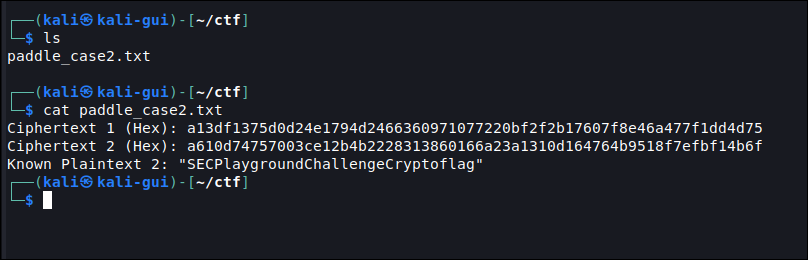

สำหรับข้อนี้มันคือ XOR สรุปคร้าวๆคือการเข้ารหัส XOR จะเป็นแบบ symmetric encryption คือการที่ key สามารถใช้เข้ารหัสและถอดรหัสได้ใน key เดียว

โดย hex ที่เราได้มามันคือ encrypted message และได้ plain text

แล้วจะรู้ key ได้ไง?

- PlainText ^ Key = CipherText
- CipherText ^ Key = PlainText
- PlainText ^ CipherText = Key

ใช่แล้ว ด้วยคุณสมบัติย้อนกลับได้ เราก็แค่เอา plain text มา XOR กับ cipher text ก็จะได้ key

ด้วยคุณสมบัติการจับกลุ่มของ XOR เราจึงสามารถเปลี่ยนลำดับการ XOR ได้ เราจึงไม่จำเป็นต้องลองจับคู่ทดสอบ แต่ XOR มันรอบเดียวได้เลย

```text
       Key = CipherTextA ^ PlainTextA

PlainTextB = CipherTextB ^ Key
           = CipherTextB ^ (CipherTextA ^ PlainTextA)
           = CipherTextA ^ CipherTextB ^ PlainTextA
```

```py
from binascii import unhexlify

def xor_bytes(b1, b2):
    return bytes([x ^ y for x, y in zip(b1, b2)])

ciphertext1 = unhexlify("a13df1375d0d24e1794d2466360971077220bf2f2b17607f8e46a477f1dd4d75")
ciphertext2 = unhexlify("a610d74757003ce12b4b2228313860166a23a1310d164764b9518f7efbf14b6f")
plaintext = b"SECPlaygroundChallengeCryptoflag"

print(xor_bytes(plaintext, xor_bytes(ciphertext1, ciphertext2)).decode())
```

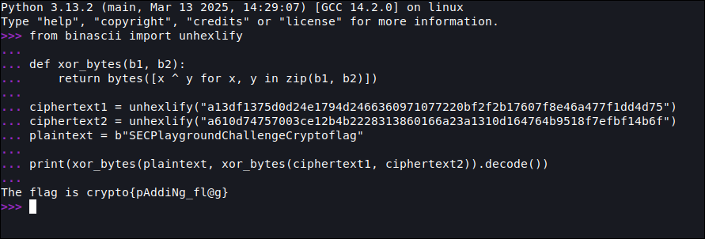

`crypto{pAddiNg_fl@g}`

# What is it

_A notorious threat actor left a dying message on the compromised server. At first glance, it appears to be a corrupted file. Your task is to recover the flag. Can you uncover it from the message?_

_The dying message: \"The air was thick with smoke and regret, As the last flicker of hope faded in the sunset. My mission failed, my sins remain, But I leave behind a trail in the rain. The silent night echoes my past, Whispers of numbers-some unsurpassed. One hero fell, three stood tall, Three secrets lost, seven will call. If you seek the truth, decrypt the past, For shadows speak in codes that last. The wind carries my final breath, Find the key before my death.\"_

_Flag format: crypto\{.....\}_

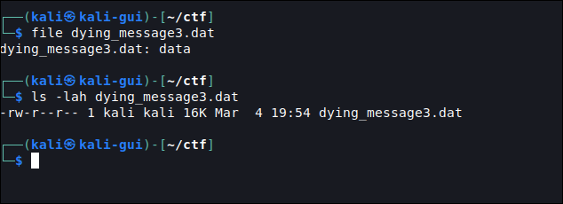

เราได้ไฟล์ที่ระบุประเภทไฟล์ไม่ได้ ซึ่งเต็มไปด้วยเลข 9

ด้วยความคิดไม่ออกสักทีเลยกด hint ไป แล้ว เขาใบ้ว่ามันคือ binary encryption ซึ่ง....ครับ

หลังจากใช้เวลาสักพักเราจึงไปเปิด list tool ดูว่า พวกเข้ารหัสไฟล์นี้จะมีอะไรได้บ้าง หลังจากลอกไปลองมา สรุปมันคือ XOR โดย Key คือเลข 9 ที่เป็นไปได้

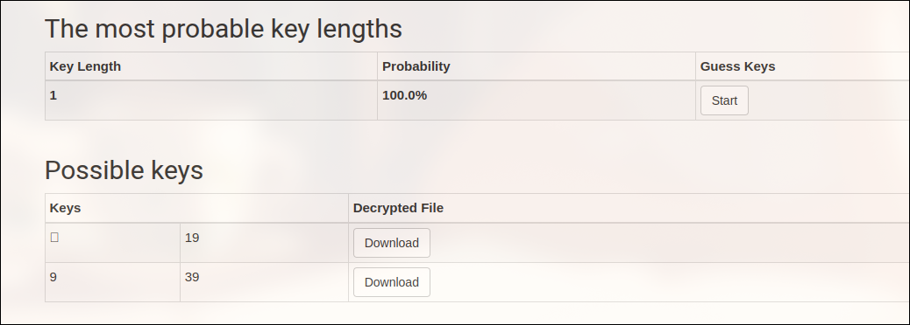

[XOR Cracker](https://wiremask.eu/tools/xor-cracker/)

เราจึงใช้ CyberChef ในการถอด และตรวจสอบประเภทไฟล์

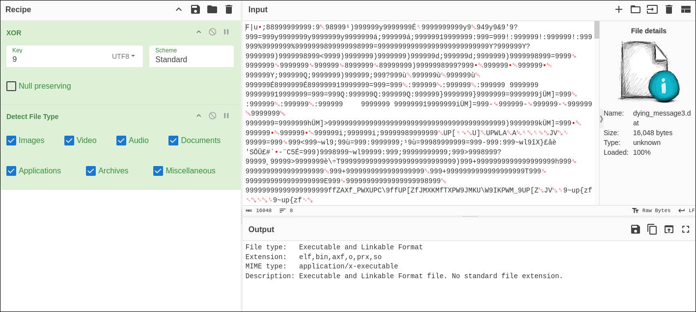

[CyberChef](https://gchq.github.io/CyberChef/)

ห๊ะ... มันคือ ELF !!!

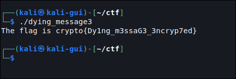

เราจึง download มา execute ดู

`crypto{Dy1ng_m3ssaG3_3ncryp7ed}`

---

จบไปแล้ว สำหรับ write up ครั้งนี้ รู้สึกจะน้อยๆหน่อยเพราะ solve ได้ไม่เยอะ และเป็นงานแข่งหลังจากผมหายไปจาก CTF ตั้งแต่ต้นปียาวๆไม่ได้แตะเลย มาอีกทีก็ลุยเลย เละสิครับ
