- Web
  - BeautifulJS
  - Confusion
- Reverse
  - **Real or Fake**
  - **Real or Fake 2**
  - ReverseMe
- Crypto
  - 7.83hz
  - G3N1E
- Pwn
  - **AuthEnd**
  - Tech Bubble Sort
- Network
  - **BananaNetwork**
- Forensic
  - AD_Dump
- Misc
  - **Modern password**

> bold text = sovle ได้ขนะแข่ง

---

# Reverse

## Reverse > Real or Fake

ได้ไฟล์สำหรับ reverse มา เป็น ELF

**Screen**

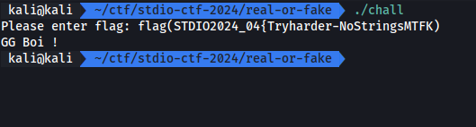

**Ghidra decompile**

```cpp
undefined8 main(void)

{
  int iVar1;
  int iVar2;
  size_t sVar3;
  ulong uVar4;
  byte abStack_1d8 [64];
  byte local_198 [140];
  uchar local_10c [4];
  char local_108 [64];
  undefined8 local_c8;
  undefined8 local_c0;
  undefined8 local_b8;
  undefined8 local_b0;
  undefined8 local_a8;
  undefined8 local_a0;
  undefined8 local_98;
  undefined8 local_90;
  undefined8 local_88;
  undefined8 local_80;
  undefined8 local_78;
  undefined8 local_70;
  undefined8 local_68;
  undefined8 local_60;
  undefined8 local_58;
  undefined8 local_50;
  undefined local_48;
  byte local_39;
  undefined4 local_38;
  undefined4 local_34;
  undefined4 local_30;
  undefined4 local_2c;
  undefined4 local_28;
  int local_24;
  int local_20;
  uint local_1c;

  local_28 = 1;
  local_c8 = 0x3831623563663536;
  local_c0 = 0x6136326162643834;
  local_b8 = 0x6131336436306631;
  local_b0 = 0x3038393366386239;
  local_a8 = 0x3233333765373236;
  local_a0 = 0x3366636264656132;
  local_98 = 0x3336303837326530;
  local_90 = 0x3663343936336666;
  local_88 = 0x3266363064333632;
  local_80 = 0x3461336162383733;
  local_78 = 0x3631326338363739;
  local_70 = 0x3636353636366630;
  local_68 = 0x3864383231613766;
  local_60 = 0x6339383266336633;
  local_58 = 0x6139393633393865;
  local_50 = 0x6135303736373462;
  local_48 = 0;
  printf("Please enter flag: ");
  __isoc99_scanf(&DAT_0010201c,local_108);
  iVar2 = strncmp("flag(STDIO2024_04{Tryharder-NoStringsMTFK)",local_108,0x14);
  if (iVar2 == 0) {
    puts("GG Boi !");
    local_2c = 0xf;
    local_30 = 0x378;
    local_34 = 0x11;
    calc(99,0x11,0xf);
    local_38 = 0xb3;
    snprintf((char *)local_10c,4,"%d",0xb3);
    SHA512(local_10c,3,local_198);
    local_20 = 0;
    for (local_1c = 0; local_1c < 0x40; local_1c = local_1c + 1) {
      iVar2 = *(char *)((long)&local_c8 + (long)local_20) % ' ' + 9;
      iVar1 = *(char *)((long)&local_c8 + (long)(local_20 + 1)) % ' ' + 9;
      abStack_1d8[(int)local_1c] =
           (char)iVar1 + (char)(iVar1 / 0x19) * -0x19 +
           ((char)iVar2 + (char)(iVar2 / 0x19) * -0x19) * '\x10';
      local_20 = local_20 + 2;
    }
    local_24 = 0;
    while( true ) {
      uVar4 = (ulong)local_24;
      sVar3 = strlen((char *)local_198);
      if (uVar4 <= sVar3) break;
      local_39 = abStack_1d8[local_24] ^ local_198[local_24];
      printf("Here\'s your flag: %c\n",(ulong)(uint)(int)(char)local_39);
      local_24 = local_24 + 1;
    }
  }
  return 0;
}
```

จากการสั่งเกตุคราวๆจะเห็นว่าตรง strncmp นั้นจะ check 20 ตัวแรก (0x14) แล้วทำการ hash sha512 จาก `local_10c` ไปเก็บที่ `local_198` แล้วทำการ loop สร้างค่าไปเก็บไว้ที่ `abStack_1d8` แล้วทำการ loop แสดงผล flag

แต่ทำไม flag ไม่ออก ? ถ้าเราอ่าน code จนละเอียดแล้วเราจะพบว่า input ของเราหลังจาก 20 ไม่ได้มีผลอะไรต่อเงื่อนไขของ output flag เลย เพราะเงื่อนไขที่ว่า ถ้า `local_24` น้อยกว่า ความยาวของ hash (64) ให้หยุด ซึ่งค่าเริ่มต้นของ `local_24` มันเริ่มจาก 0 เสมอ นั้นจึงเป็นสาเหตุให้ loop นี้หยุดทำงานทันที

และอีกเหตุผลหนึ่งคือ input ของเราไม่มีผลต่อการสร้าง output (flag) นอกจาก check ว่า 20 แรกตรงไหม

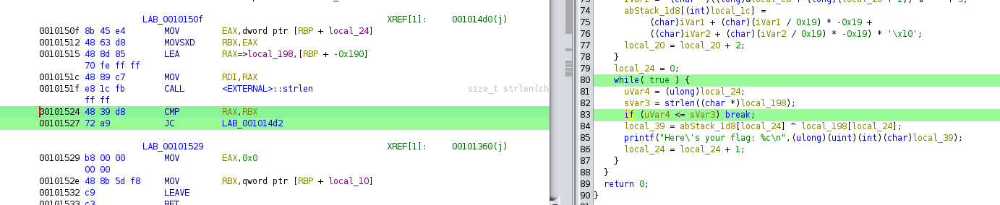

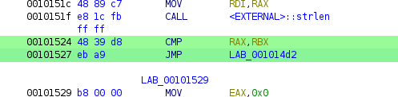

การแก้ปัญหา เราจะทำการลบ condition ตรงนี้ทิ้งด้วยการ jump

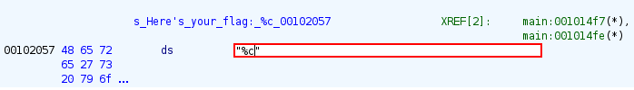

จะเห็นว่า output แต่ละ char นั้นจะเต็มไปด้วย string ที่เป็น prefix นี้ เราจึงลบมันออกเพื่อความง่ายในการเอา flag


patched

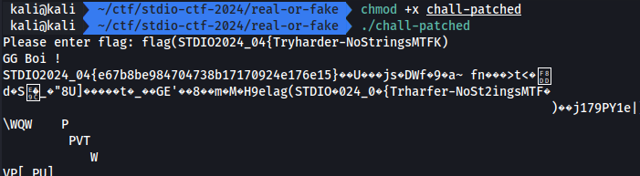

## Reverse > Real or Fake 2

ต่อเนื่องจากข้อ [Real or Fake](./real-or-fake.md) ซึ่งข้อนี้ คำใบ้คือ "ครั้งนี้พลาดจริงๆ ตรงล่างสุด"


ครับ...

หลังจาก reverse แล้วเราจะเจอทันทีว่า มันไม่มี printf ตรง loop ที่ใช้ output

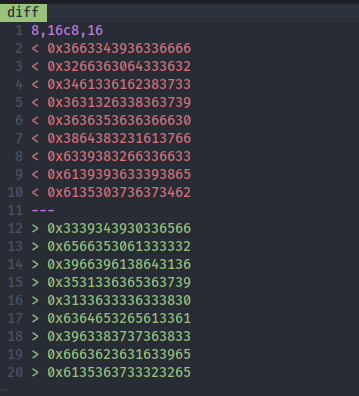

diff real or fake 1 และ 2 ต่างกันตรงที่ตัวแปรที่ 8 - 16

และอีกหนึ่งจุดคือ ค่าที่ประกาศไว้ในตอนแรกถูกแก้ไข นั้นหมายความว่า flag ไม่ใช่ตัวเดียวกันกับข้อแรกแน่ๆ

โดยรวมแล้วข้อ 2 มี flag ใหม่ และไม่มี printf แถมจะใส่ if 0 < 64 มาอีก เราจึงแก้ปัญหาด้วยการยืม ELF ที่ patch แล้วในข้อก่อนมาใช้ เพื่อใช้แทนที่ค่า flag ใหม่ ให้คำนวณออกมา


หลังจาก patch เพื่อความง่ายอีกครั้ง เราก็ข้าม check prefix input ไปทำให้ใส่อะไรก็ได้

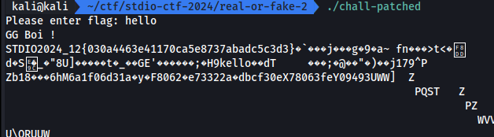

# Pwn

## Pwn > Auth End

เราได้ไฟล์ ELF มาเพื่อหาวิธีเจาะช่องโหว่

**Screen**

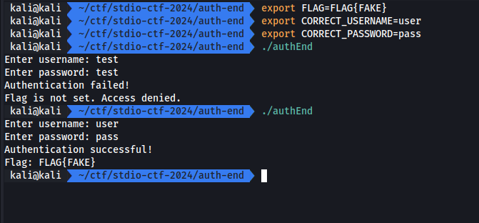

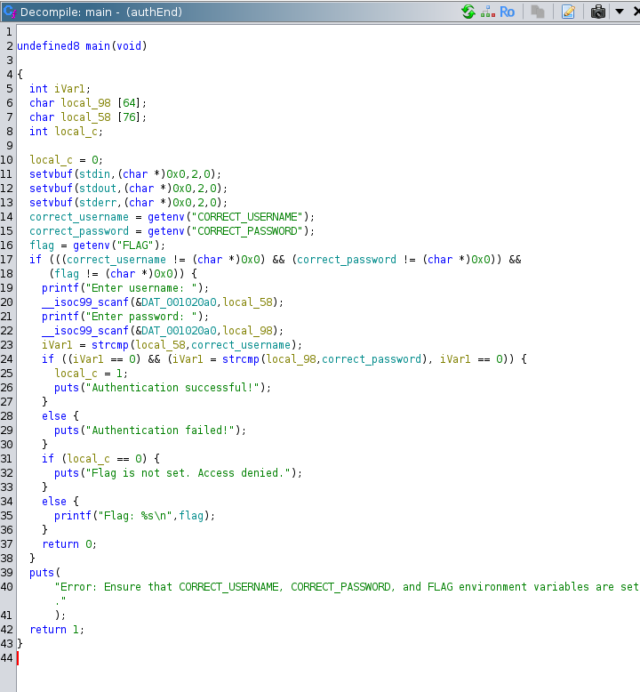

หลังจาก reverse แล้ว เงื่อนไขที่จะได้ flag คือ username และ password ต้องถูกต้อง

เมื่อเราสังเกตุจากตัวแปร buffer สำหรับรับค่า username ขนาด 76 และ password ขนาด 64 โดย stack จะเรียงจาก password(local_98) ต่อด้วย username(local_58) และ ตัวแปรที่เอาไว้เก็บเงื่อนไข (local_c)

จาก code จะสังเกตุได้ว่า `local_c` เป็นเงื่อนไขที่จำทำให้ code print flag ออกมาโดยเงื่อนไขคือ ห้ามเป็น 0 เราจึงมองหาวิธีทำให้ค่าไม่เป็น 0 ซึ่งจาก stack จะพบว่าเราสามารถ overflow ลงมาจาก `local_58` ได้

ปัญหาก่อน print flag คือค่า `local_c` จะเปลี่ยนเป็น 1 เมื่อ user/pass ถูก

เราจึงสรุปได้ว่าทำให้ user / pass ผิดและ user จะต้อง overflow ลงไปหา `local_c` ซึ่งก็คือ 76 + 1

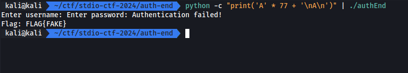

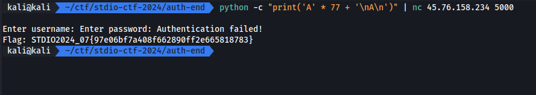

# Network

## Network > Banana Network

| BananaNetwork was hacked by the famous hacker "GonnaCry" who found a vulnerability in the system by guessing the administrator's password. He was able to log in to the system and upload several encrypted files, one of which contained a secret flag. |
|:-|

เราต้องหาไฟล์ที่ถูกเข้ารหัส เพราะมันมี flag อยู่

**Screen**

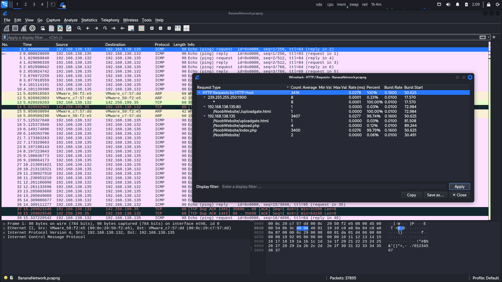

จากข้างต้นคือ เราจะต้องหาไฟล์ที่เข้ารหัสเพื่อที่จะทำการหาว่า flag อยู่ที่ไหน ซึ่งเราจะใช้ Network Miner สำหรับการ export ไฟล์

เนื่องจาก Network Miner ตัวฟรีใช้ pcapng ไม่ได้ เราเลยต้อง convert เป็น pcap ก่อน

```sh
tshark -F pcap -r [pcapng] -w [pcap]
```

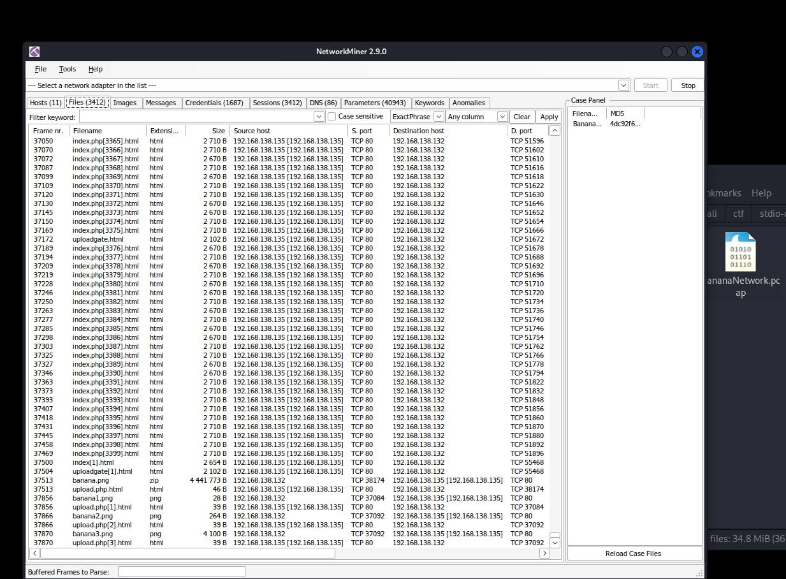

หลังจากดูอยู่สักพักสิ่งที่เราพอสรุปได้คร่าวๆคือ

- มีการ login หลายครั้ง โดนการ brute force password
- มี SECRET อะไรสักอย่างอยู่ใน uploadgate.html
- banana.png ที่เป็น zip ถูก upload
- banana{1,2,3}.png เป็น plant text

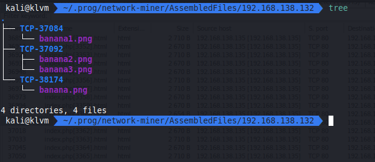

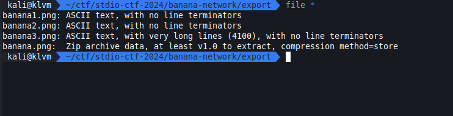

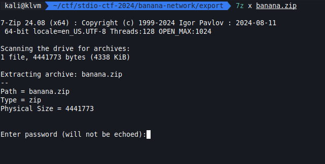

แต่พบว่า banana.zip นั้นติด password

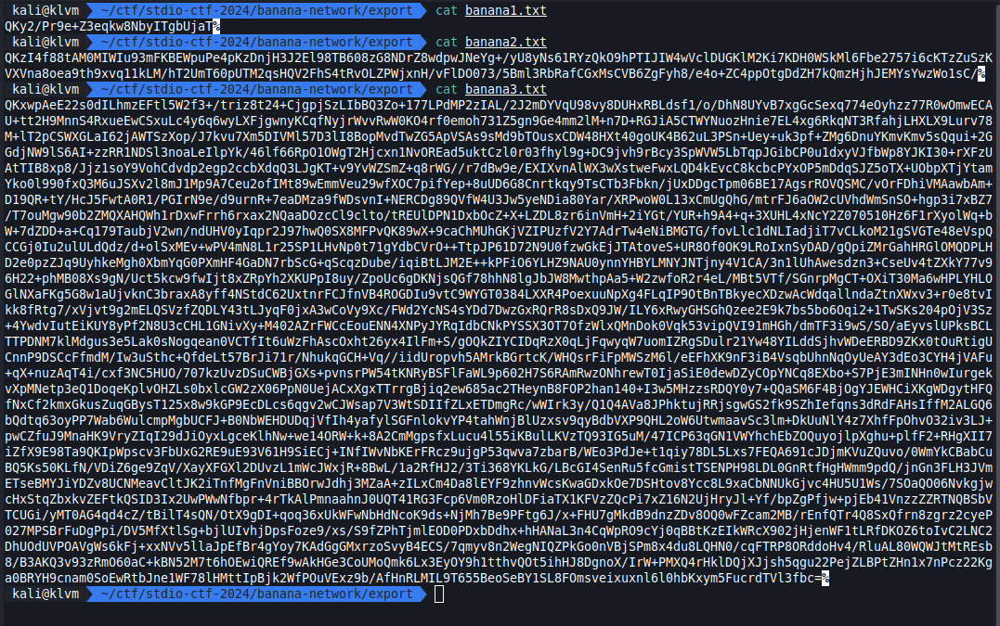

banana{1,2,3}.txt ก็เป็นอะไรแปลกๆ

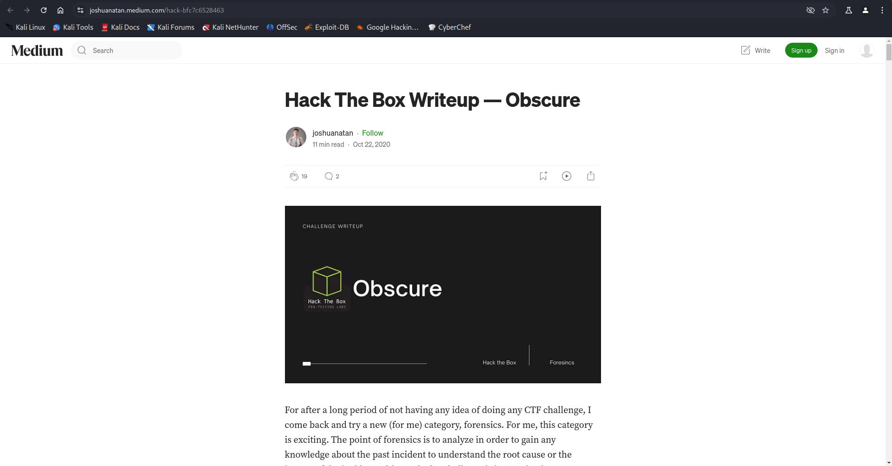

พอลองนำ SECRET KEY ไป search ใน google แล้วพบว่ามี blog ที่ใช้ SECRET KEY นี้ [Hack The Box Writeup - Obscure](https://joshuanatan.medium.com/hack-bfc7c6528463)

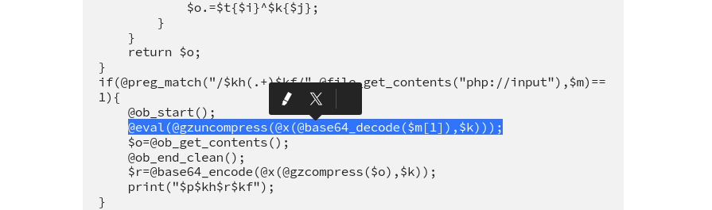

เนื่องจากมี SECRET KEY ที่เหมือนกัน เราจึงตัดสินใจว่า มันน่าจะแก้คล้ายๆกัน เราเลยทำการอ่าน blog ดังกล่าวแล้วสรุปวิธีถอดคราวๆได้ว่า

`decode base64` -> `xor` -> `gzuncompress`

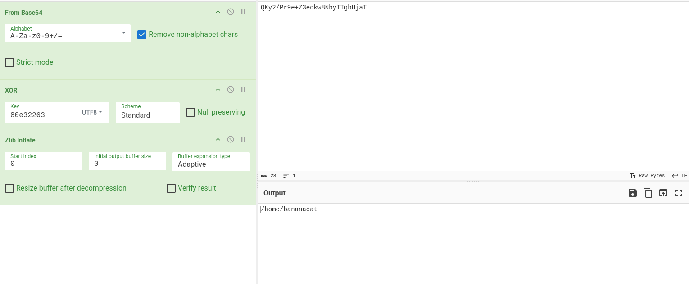

banana1.txt

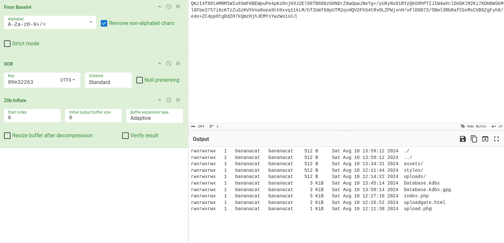

banana2.txt

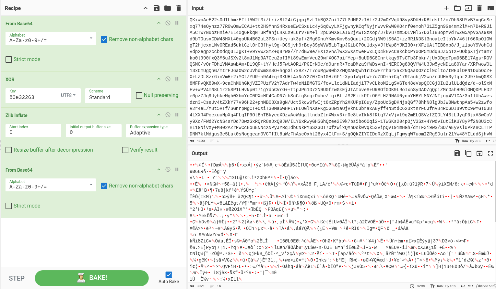

banana3.txt ตัว blog ได้ทำการ decode ด้วย base64 รอบที่สอง เราจึงทำตาม

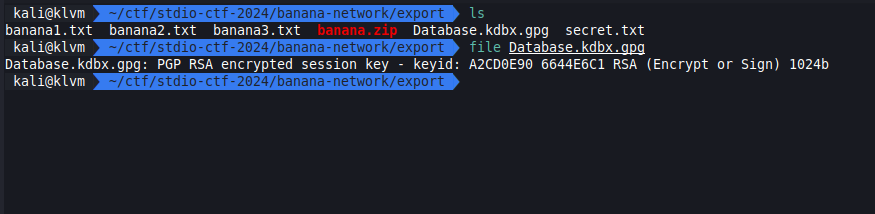

ต่อมาเราจะทำการหา password ของ banana.zip โดยการทดลองกรองเอา password ใน brute force ที่เจอใน traffic ออกมา

```sh
tshark -r BananaNetwork.pcapng -Y 'http.request.method == "POST" && http.content_type == "application/x-www-form-urlencoded"' -T fields -e http.file_data > data-str-hex.txt
```

```py
from urllib.parse import unquote

data = open("data-str-hex.txt").read().split("\n")
data = [unquote(bytes.fromhex(line).decode("utf-8").replace("username=admin&password=", "")) for line in data]

open("passwords.txt", "w", encoding="utf-8").write("\n".join(data))
```

เมื่อเราได้ password list มาแล้วเราก็จะทำการลองมันทุกตัวเลย โดยเราจะใช้ john the ripper ในการหา

```sh
zip2john banana.zip > banana.hash
john banana.hash --wordlist=passwords.txt
```

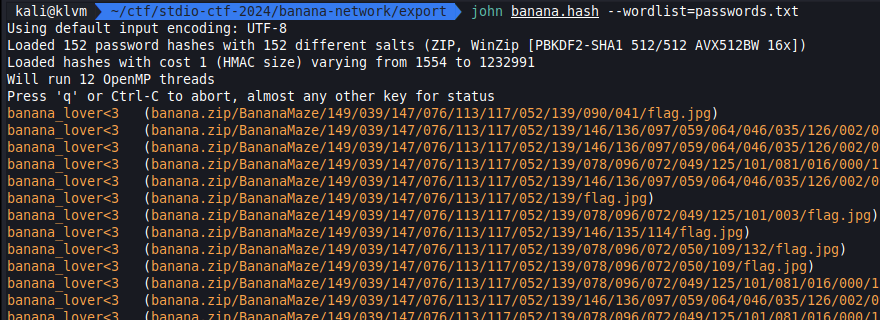

flag.jpg เป็นเพียงรูปหลอก

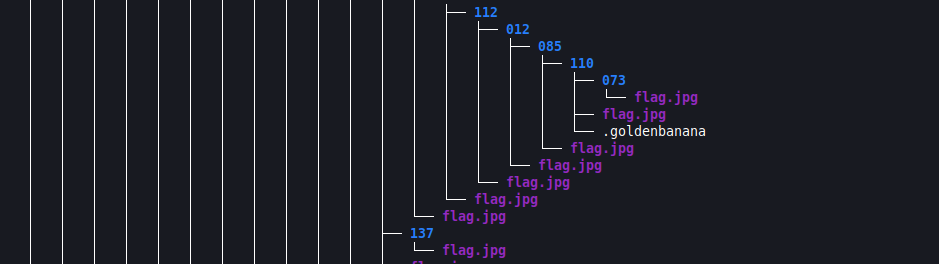

เราทำการหาไฟล์ต่างๆด้วย `tree -a` แล้วพบกับ .goldenbanana เราเลย copy ออกมายัง workspace ของเรา

```sh
cp $(find . -name .goldenbanana) .
```

แล้วพบว่ามันคือ PGP private key block ซึ่งเราไม่รู้ password เราจึงทำการ crack

```sh
gpg2john Database.kdbx.gpg  > Database.kdbx.hash
john Database.kdbx.hash --wordlist=./passwords.txt
```

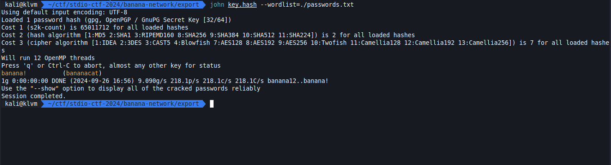

แล้วเราก็ทำการ import แล้วก็ decrypt ด้วย password ที่ได้มา

```sh
gpg --import key.pgp
gpg --output Database.kdbx --decrypt Database.kdbx.gpg
```

เสร็จแล้วเปิดด้วย keepass

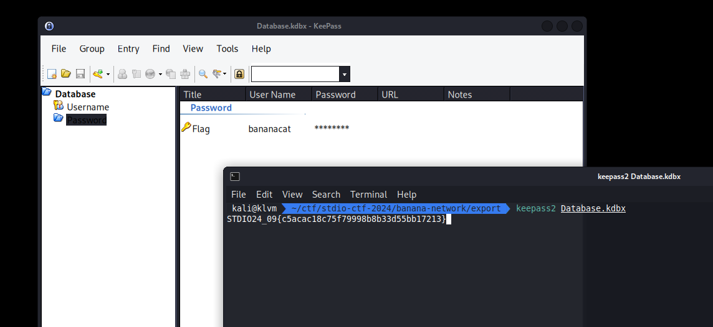

# Misc

## Misc > Modern password

ได้ code สำหรับรับรูปไปทำอะไรสักอย่าง ถ้าผลรวมถูกจะได้ flag

```py
URL_PASSWORD = "https://upload.wikimedia.org/wikipedia/commons/thumb/0/05/Cat.png/307px-Cat.png"

import torch
import torchvision
from PIL import Image
import requests

class Decoder(torch.nn.Module):
    def __init__(self):
        super().__init__()
        self.training = False
        self.flag = torch.Tensor([
            0x2c, 0x2b, 0xff, 0x5e, 0xa0, 0xd4, 0x86, 0x98, 0x93,
            0x7a, 0x72, 0x16, 0xcc, 0x65, 0x76, 0x5e, 0x28, 0x4f,
            0x2e, 0x39, 0x78, 0xf6, 0x15, 0xda, 0x6e, 0x35, 0x6d,
            0xd6, 0x83, 0xdf, 0x2a, 0x67, 0xd5, 0x60, 0xeb, 0x9a
        ]).int()

    def forward(self, x):
        torch.manual_seed(x)
        x = torch.nn.Embedding(0o1750, 0o44, padding_idx=0)(x)
        x = torch.abs(255 * x).int() % 0xFF
        if x.sum() != 0o7617:
            return "Access denied - please provide correct password"
        return (
            "Access granted - here is the flag: "
            + f"STDIO2024_11{{{ ''.join([chr(c) for c in (x ^ self.flag).tolist()]) }}}"
        )

class ModernPassword(torch.nn.Module):
    def __init__(self):
        super().__init__()
        self.training = False
        self.backbone = torchvision.models.mobilenet_v2(weights=torchvision.models.MobileNet_V2_Weights.DEFAULT, progress=False)
        self.backbone.eval()
        self.decoder = Decoder()
        self.prep = torchvision.transforms.Compose([
            torchvision.transforms.Resize(256),
            torchvision.transforms.CenterCrop(224),
            torchvision.transforms.ToTensor(),
            torchvision.transforms.Normalize(mean=[0.485, 0.456, 0.406], std=[0.229, 0.224, 0.225]),
        ])

    def forward(self, url):
        try:
            img = Image.open(requests.get(url, stream=True, headers={'User-Agent': 'STDIO2024'}).raw)
            out = self.prep(img).unsqueeze(0)
            assert out.shape == (1,3,224,224)
        except:
            return "Access denied - error loading image from URL"
        return self.decoder(torch.argmax(self.backbone(out)))

model = ModernPassword()
print(model(URL_PASSWORD))
```

จะสังเกตุได้ว่า class `ModernPassword` นั้นจะทำการ download รูปจาก url แล้วแปลงไปเรื่อยๆ แต่ก่อนเข้า `self.decoder` นั้นคือ `torch.argmax` ซึ่งถ้าเรา debug ด้วยการดักค่าตรงนั้นออกมาดูจะพบว่าเป็น scalar tensor

ไม่ว่าเราจะเอารูปไหนเข้าไป ค่าตรงนี้จะเป็น scalar เราจึงทำการ brute force

```py
i = 0
while (True)
    result = Decoder()(torch.tensor(i))
    if "flag" in result:
        print(result)
        break
    i += 1
```

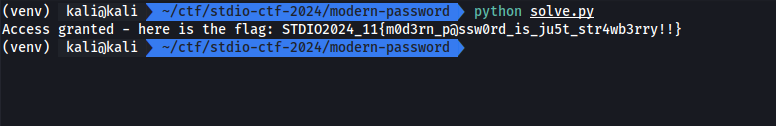
