Writeup การแข่งขัน CTF (online) รอบแรก จัดโดย คณะวิศวกรรมศาสตร์ มหาวิทยาลัยศรีนครินทรวิโรฒ, ACIS Professional Center และ SECPlayground ในวันที่ 1/7/2025

**Don't Know Everything**'s first event of the year อืมมม เอาจริงนี้ก็พึ่งเปิดเทอมแหละ สำหรับงานนี้ก็ 3 คนเหมือนเดิมฮะ

- [@noonomyen](https://github.com/noonomyen)
- [@c0ffeeOverdose](https://github.com/c0ffeeOverdose) - [Blog](https://blog.c0ffeeoverdose.xyz/posts/ctf/swu-capture-the-flag-competition-2025)
- [@willywotz](https://github.com/willywotz)

แน่นอน ผมช้าเช่นเคย... ด้วยอานิสงของคุณพรี่ [@willywotz](https://github.com/willywotz) เราเลยได้อันดับที่ 8

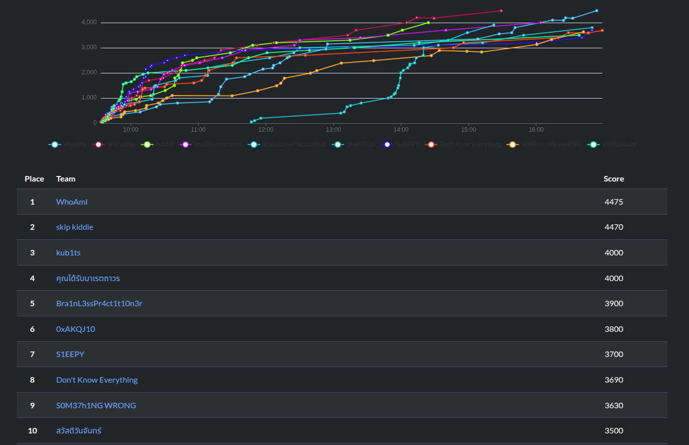

> Screenshot at 01/07/2025 17:26:37

# Challenges

- Binary Exploitation (Pwn)
  - Lucky Numbers? [@willywotz](https://github.com/willywotz)
  - Legendary Football Club Selector [@willywotz](https://github.com/willywotz)
  - The Jumper [@willywotz](https://github.com/willywotz)
  - EternalTears
- Cryptography
  - Planet of the Apes [@noonomyen](https://github.com/noonomyen)
  - Pixelated Hash [@noonomyen](https://github.com/noonomyen)
  - Agent 172 [@c0ffeeOverdose](https://github.com/c0ffeeOverdose)
  - Magnolia
- Forensics
  - Slack Space [@c0ffeeOverdose](https://github.com/c0ffeeOverdose)
  - Dear Brute.... [@c0ffeeOverdose](https://github.com/c0ffeeOverdose)
  - Systemfile [@noonomyen](https://github.com/noonomyen)
  - RANSOMWARE be careful!
- Miscellaneous
  - Game of Colors [@c0ffeeOverdose](https://github.com/c0ffeeOverdose) [@noonomyen](https://github.com/noonomyen)
  - u-i-i-io-i-ii-a-io [@c0ffeeOverdose](https://github.com/c0ffeeOverdose)
  - Trust Your Eyes [@noonomyen](https://github.com/noonomyen)
  - "ห้ามตัวเองไม่ให้รักเธอ จะทำยังไงใจมันไม่ฟัง"
- Mobile Application
  - Manifest0 [@willywotz](https://github.com/willywotz)
  - Unintended Secrets [@willywotz](https://github.com/willywotz)
  - InsecureStorage [@willywotz](https://github.com/willywotz)
  - Log It In! [@willywotz](https://github.com/willywotz)
- Network
  - Wireshark 101 [@willywotz](https://github.com/willywotz)
  - Wireshark 201 [@willywotz](https://github.com/willywotz)
  - อดทนจนกว่าจะได้ flag [@c0ffeeOverdose](https://github.com/c0ffeeOverdose)
  - นายเองก็เป็นได้นะ โคนันอะ [@noonomyen](https://github.com/noonomyen)
- Reverse Engineering
  - Lost But Not Forgotten [@noonomyen](https://github.com/noonomyen)
  - You're not a monkey... right? [@noonomyen](https://github.com/noonomyen)
  - Press Start [@willywotz](https://github.com/willywotz)
  - Missile Protocol [@willywotz](https://github.com/willywotz)
- Web Application
  - Find me! [@c0ffeeOverdose](https://github.com/c0ffeeOverdose)
  - Break In and Find the Secrets [@c0ffeeOverdose](https://github.com/c0ffeeOverdose)
  - Case File #0xC4J
  - Hidden Pathways
- Zpecial-Challenges
  - Make Your Own Luck [@willywotz](https://github.com/willywotz)
  - Who will win the Premier League? [@willywotz](https://github.com/willywotz)

คะแนน 50 100 200 300 ยกเว้น หมวดสุดท้าย 100 ทั้งสอง

---

# Lucky Numbers?

_คุณสามารถเดาหมายเลขนำโชคของฉันได้หรือไม่? ระหว่าง 0 - 10000 มีเพียงหมายเลขเดียวที่ถูกต้อง!_ \
_Hint 0 points\: บางครั้งคุณต้องคิดนอกกรอบ และบางทีเลขนำโชคของฉันอาจจะยาว_

<details>
<summary><b>Guest-My-LuckyNum.c</b></summary>

```c
#define _GNU_SOURCE
#include <stdio.h>
#include <stdlib.h>
#include <string.h>
#include <signal.h>
#include <unistd.h>
#include <sys/types.h>

# define BUFSIZE 56

# define FLAGSIZE 64

char flag[FLAGSIZE];

void sigsegv_handler(int sig) {
    printf("\n%s\n", flag);
    fflush(stdout);
    exit(1);
}

void number_guessing_game();

int main(int argc, char **argv) {
    FILE *f = fopen("flag.txt", "r");
    if (f == NULL) {
        perror("fopen failed");
        exit(0);
    }

    fgets(flag, FLAGSIZE, f);
    fclose(f);
    
    signal(SIGSEGV, sigsegv_handler);
    
    gid_t gid = getegid();
    setresgid(gid, gid, gid);
    
    number_guessing_game();
    
    return 0;
}

void number_guessing_game() {
    int secret_number = 1337;
    char input[BUFSIZE];

    printf("Welcome to the Number Guessing Game!\n");
    printf("Try to guess my lucky number between 0 - 10000:\n");
    fflush(stdout);
    
    while (1) {
        printf("Enter your guess: ");
        fflush(stdout);
        
        scanf("%s", input);

        if (strlen(input) >= BUFSIZE - 1) { 
            printf("\nBuffer Overflow :) Jrypbzr gb ovanel rkcybvgngvba jbeyq.\n");
            fflush(stdout);
            raise(SIGSEGV);
            exit(1);
        }
        
        int guessed_number = atoi(input);

        if (guessed_number == secret_number) {
            printf("Congratulations! You guessed correctly.\n");
            break;
        } else {
            printf("Oops! That is not the correct number. Try again.\n");
        }
    }
    
    fflush(stdout);
}

```

</details>

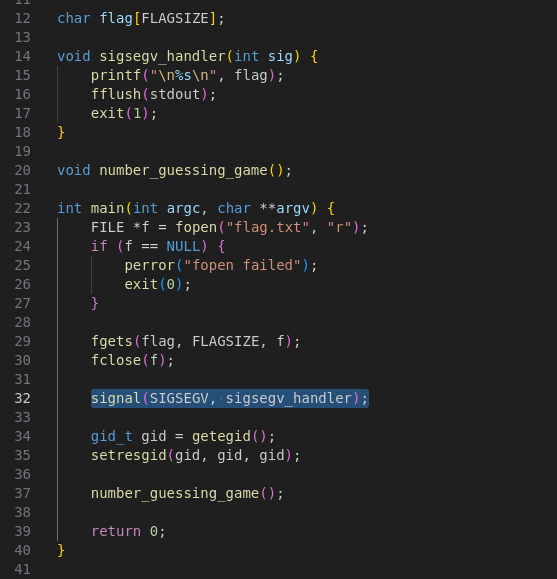

เงื่อนไขของการ print flag คือ ต้อง call function `sigsegv_handler` แล้วมันจะทำการ printf flag ที่เป็นตัวแปรอยู่ global ออกมา แล้ว `sigsegv_handler` ถูกผูกเข้ากับ signal `SIGSEGV` ซึ่ง SIGSEGV คือ Segmentation fault จะเกิดขึ้นเมื่อ **access memory ผิดที่**

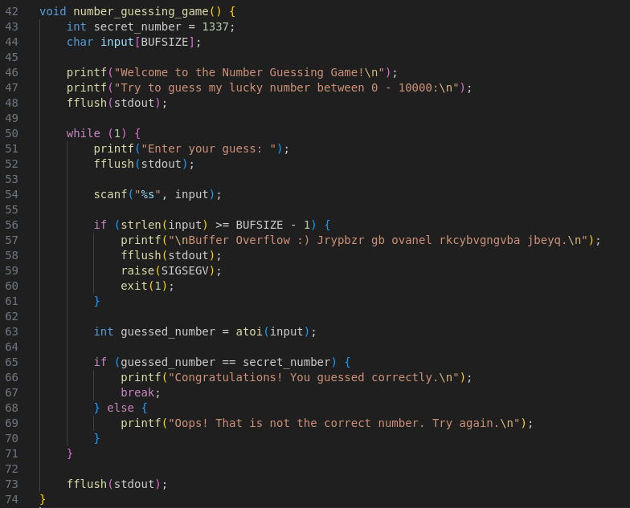

แต่ไม่ได้ยาก เพราะมี `raise(SIGSEGV)` ที่เงื่อนไขคือ input ทะลุ buffer

ยัดอะไรก็ได้สิแบบนี้

แล้วกี่ตัวละ? ตัว buffer ขนาด 56 bytes จะเก็บ character ได้ 55 ตัว + NULL แต่ condition คือ len >= (56 - 1) หรือก็คือขั้นตํ่า 55 ตัวนั้นเอง (นี้ยังไม่ทะลุเลยนะ)

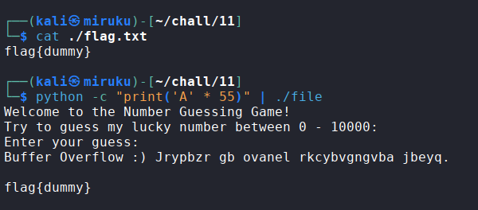

> Compiled with GCC (Debian 14.2.0-19) 14.2.0 on Kali

`swu{W3lc0me_t0_B1n@ry_3xPl0it@t10n}`

# Legendary Football Club Selector

_เพื่อนของฉันไม่เคยดูฟุตบอลมาก่อนเลย แต่เขาอยากเข้าร่วมชมรมแฟนบอล\! ฉันเลยอยากให้นายช่วย แนะนำทีมฟุตบอลที่ยอดเยี่ยมที่สุด ทีมที่มี ประวัติศาสตร์อันยาวนาน และคว้าถ้วยรางวัลมากที่สุดให้เพื่อนฉันหน่อย ได้โปรดช่วยแนะนำเขาที_

<details>
<summary><b>Football_Fan_Club.c</b></summary>

```c
#define _GNU_SOURCE
#include <stdio.h>
#include <stdlib.h>
#include <string.h>
#include <signal.h>
#include <unistd.h>
#include <sys/types.h>

#define BUFSIZE 32
#define FLAGSIZE 111

char flag[FLAGSIZE];

void sigsegv_handler(int sig) {
    printf("\n%s\n", flag);
    fflush(stdout);
    exit(1);
}

int in_team_list(char *team, char *teams[], int count) {
    for (int i = 0; i < count; i++) {
        if (strcmp(team, teams[i]) == 0)
            return 1;
    }
    return 0;
}

void recommend_team_1();
void recommend_team_2();

int main(int argc, char **argv){
    FILE *f = fopen("flag.txt", "r");
    if (f == NULL) {
     perror("fopen failed");
     exit(0);
    } 
    if (f == NULL) {
        printf("%s %s", "Please create 'flag.txt' in this directory with your", "own debugging flag.\n");
        exit(0);
    }
    
    fgets(flag, FLAGSIZE, f);
    signal(SIGSEGV, sigsegv_handler);

    gid_t gid = getegid();
    setresgid(gid, gid, gid);
    recommend_team_1();
  
    return 0;
}

void recommend_team_1() {
    printf("%s %s\n%s\n%s %s\n%s",
            "Welcome to the Football Fan Club Selector!",
            "Can you help the fans find the best football team to support?",
            "The first fan wants to support a top-tier team!",
            "Please choose from the following teams:",
            "R3a1_M@dr1d, FC_Barc%70dna, M@nch3st3r_Un1t3d",
            "Enter your recommendation: ");
    fflush(stdout);

    char choice1[BUFSIZE];
    scanf("%s", choice1);
    char *teams1[3] = {"R3a1_M@dr1d", "M@nch3st3r_Un1t3d","FC_Barc%70dna"};
    if (!in_team_list(choice1, teams1, 3)) {
        printf("%s", "That team is not in our list!\n");
        fflush(stdout);
    } else {
        int count = printf(choice1);
        if (count > 2 * BUFSIZE) {
            recommend_team_2();
        } else {
            printf("%s\n%s\n",
                    "The fan is not convinced!",
                    "Try recommending a team with a stronger history!");
            fflush(stdout);
        }
    }
}

void recommend_team_2() {
    printf("\n%s %s\n%s %s\n%s %s\n%s",
            "Great job! The first fan is happy!",
            "Now, can you recommend a team to the next fan?",
            "This fan wants an underdog team with great potential",
            "(Make a recommendation before they change their mind!)",
            "Please choose from the following teams:",
            "L1v3r%sp00l, M@nch3%st3r_C1ty, B0ru%s%s10_D0rtmund",
            "Enter your recommendation: ");
    fflush(stdout);

    char choice2[BUFSIZE];
    scanf("%s", choice2);
    char *teams2[3] = {"L1v3r%sp00l", "M@nch3%st3r_C1ty", "B0ru%s%s10_D0rtmund"};
    if (!in_team_list(choice2, teams2, 3)) {
        printf("%s", "That team is not in our list!\n");
        fflush(stdout);
    } else {
        printf(choice2);
        fflush(stdout);
    }
}
```

</details>

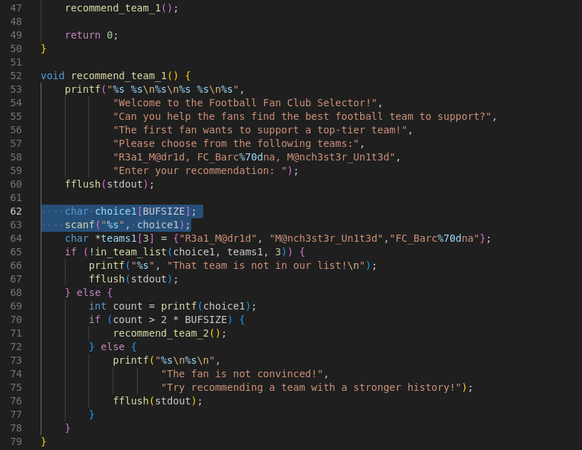

เหมือนกันกับข้อ **Lucky Numbers?** เลย แค่รอบนี้เราทำให้มันพังจริงๆ โดยเราจะยัด input ให้เกินในรอบแรกเลย แค่นี้ก็จะเรียก function `sigsegv_handler` แล้ว

> Compiled with GCC (Debian 14.2.0-19) 14.2.0 on Kali

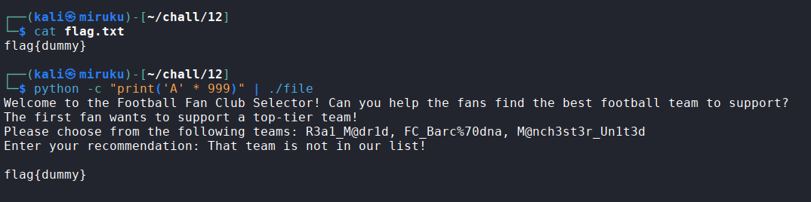

`swu{84ca9df6a817b5d0cfcdfea90b6e03be}`

# The Jumper

_การกระโดด เป็นเรื่องที่สำคัญมาก แต่ว่าต่อให้กระโดดได้ไกลแค่ไหน ก็ไม่สำคัญเท่ากระโดดให้ถูกที่ \(Addr\)_

File: `Jumper` (ELF 32-bit LSB executable)

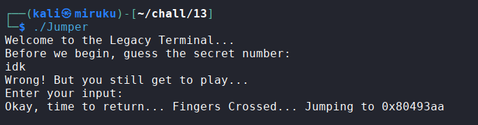

งงหว่า Jumping to address?

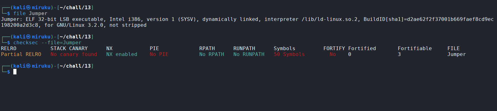

ok เป็น No PIE + No canary found ด้วยสิ

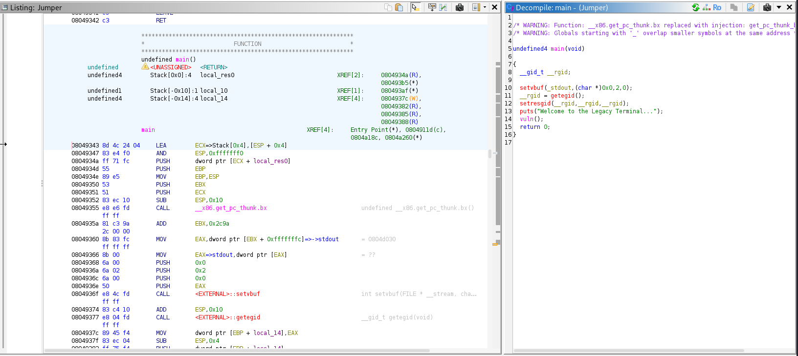

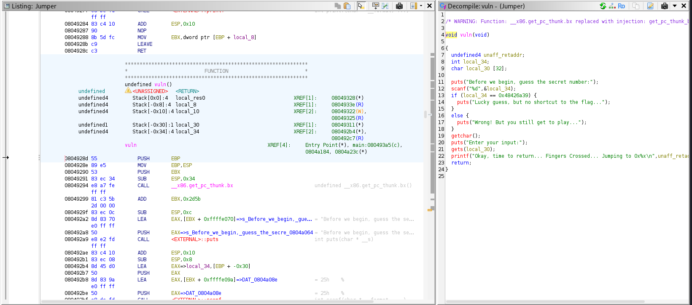

แสดงว่าต้องมี function ซ่อนอยู่ใช่ไหม?

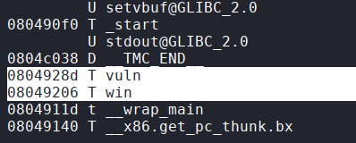

ช่าย, สรุปคือ stack overflow ครับ โดยเราต้องไปเขียนทับ return address นั้นเอง จากเดิมที่จะกลับไป `main` เราจะเปลี่ยนที่ให้ไปหา `win` function แทน

แล้ว `0x080493aa` ที่ print ออกมาก่อนจบ process คืออะไร ? มันคือ address ใน `main` function ครับ

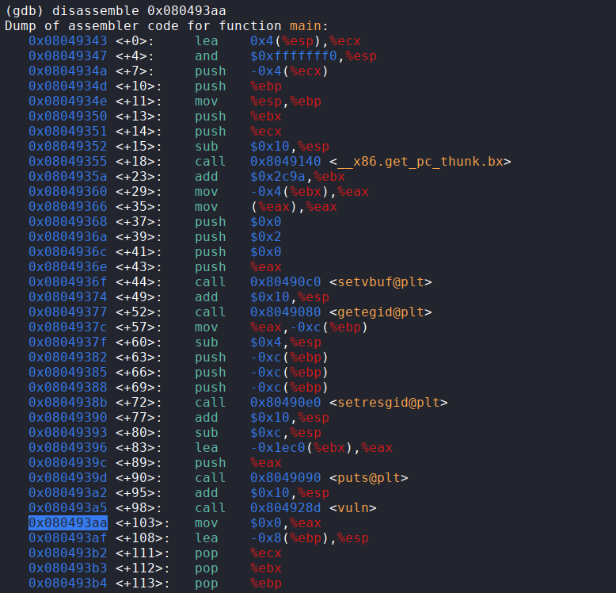

หลังจากเรียก `vuln` function นั้นเอง

เอาละ เราต้องแก้จาก `0x080493aa` -> `0x08049206` เพื่อให้รัน code ใน `win` function

เราจะใช้ gdb ก่อนว่าจะต้องยัดเข้าไปให้โดนตรงไหน ซึ่งเราจะเริ่มจาก break ตรง `0x804931a` เพื่อดูว่าหลังจาก input ไปแล้ว stack memory หน้าตาเป็นยังไง

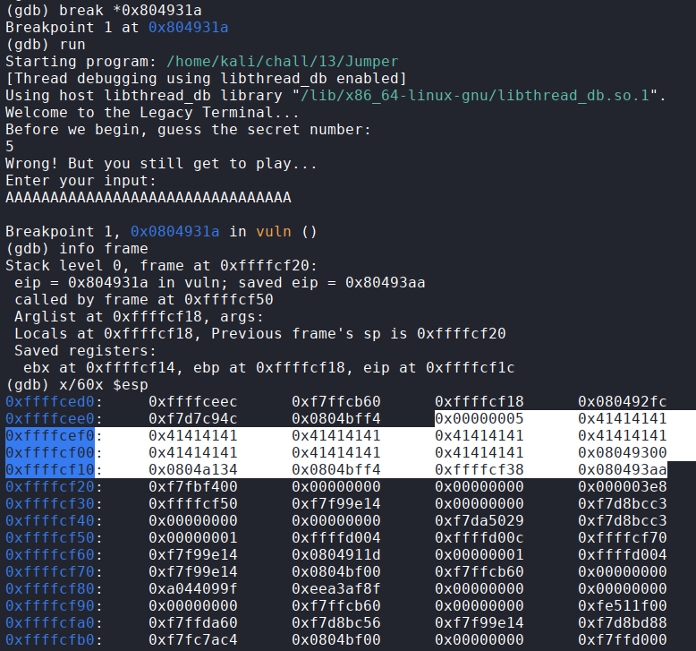

หลังจากที่ break แล้ว ก่อนหน้านี้เราได้ยัด เลข 5 เข้าไป และ A จำนวน 32 ตัว จะพบว่า stack เป็นดังนี้ ซึ่งจะเห็นว่าเราต้องเขียนทับไปอีก 4 word หรือก็คือ 16 bytes นั้นเองถึงจะโดน return address

แล้วเราจะเขียนยัดอะไรเข้าไปละ เราก็แปลง `0x08049206` เป็น little-endian ซึ่งจะได้ `\x06\x92\x04\x08`

สรุป เราต้องยัดเลขหลอก scanf รอบแรกไปก่อน แล้วต่อด้วยขยะขนาด 32 + 16 bytes แล้วตามด้วย address `\x06\x92\x04\x08`

```sh
python -c "import sys; sys.stdout.buffer.write(b'1\n' + (b'A'*(32+16)) + b'\x06\x92\x04\x08')" | ./Jumper
```

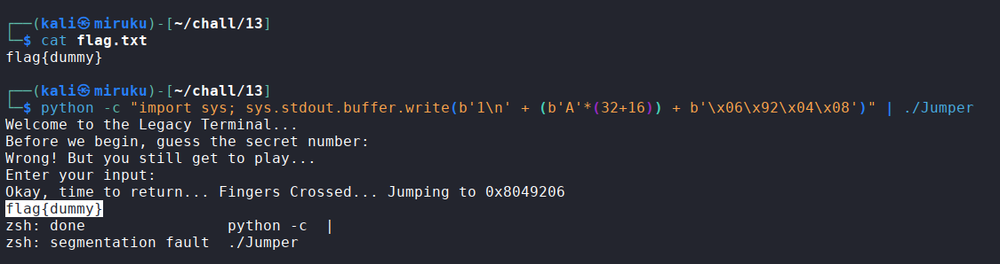

# EternalTears

_ปี 2017 โลกต้องเผชิญกับภัยคุกคามทางไซเบอร์ครั้งใหญ่ที่สุดครั้งหนึ่งในประวัติศาสตร์ ระบบปฏิบัติการเก่าถูกบุกรุก ไม่ใช่เพราะความผิดพลาดของผู้ใช้ แต่เพราะช่องโหว่ที่แฝงตัวอยู่ในโค้ดระดับลึกของระบบ แม้เวลาจะผ่านไป แต่ไม่ใช่ทุกองค์กรที่สามารถอัปเดตระบบได้ทันเวลา เครื่องบางเครื่องยังคง มีร่องรอยของโค้ดที่อันตราย ซึ่งอาจถูกใช้เป็นกุญแจสู่บางสิ่งที่ถูกซ่อนอยู่ เครื่องเป้าหมายที่คุณได้รับมอบหมายให้ตรวจสอบคือ Windows 7 ที่ยังไม่ได้แพตช์ แม้ว่ามันจะดูเหมือนเครื่องที่ใช้งานทั่วไป แต่มันมีบางอย่างที่คุณต้องค้นหา..._

**Unsolved**

# Planet of the Apes

_Z2tpe1VVX1NPR01fUUhUXzIwMjV9_ \
_ชื่อราชาลิงตัวแรกในหนังเรื่อง Planet of the Apes อาจเป็นอัลกอริทึมถอดรหัสได้_

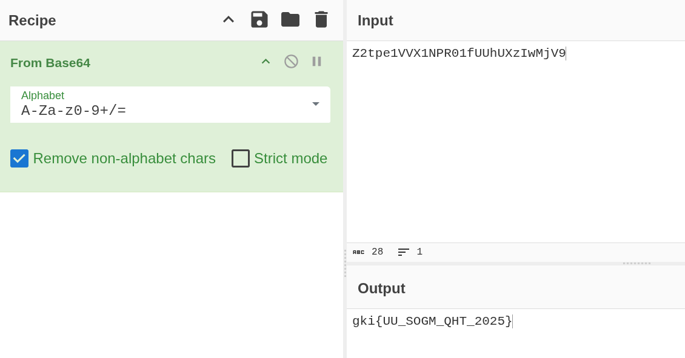

มันคือ base64 ว่าแต่ ไงต่อนิ

ไหนลองถาม llm เจ้าหนึ่งดิ

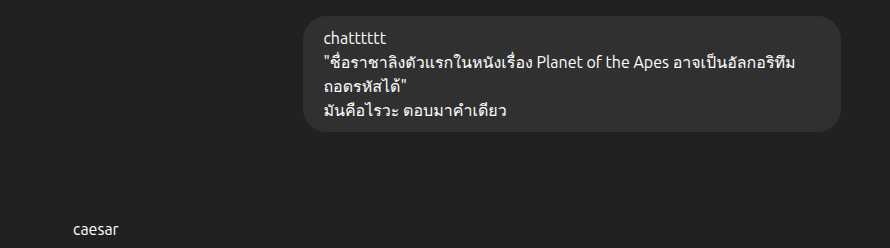

ok... งั้นเริ่มจาก ROT

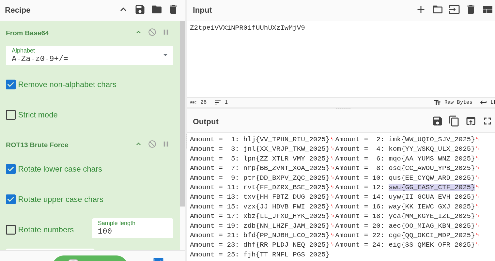

it work

`swu{GG_EASY_CTF_2025}`

# Pixelated Hash

_เจ้าหน้าที่ได้รับไฟล์ภาพปริศนา ซึ่งเชื่อกันว่าภายในภาพนี้มีรหัสสำคัญซ่อนอยู่_

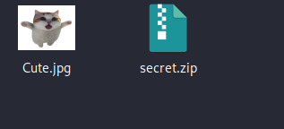

ดูแมวนั้นสิ มันน่าจะมีรหัส file zip แน่ๆเลยว่าปะ

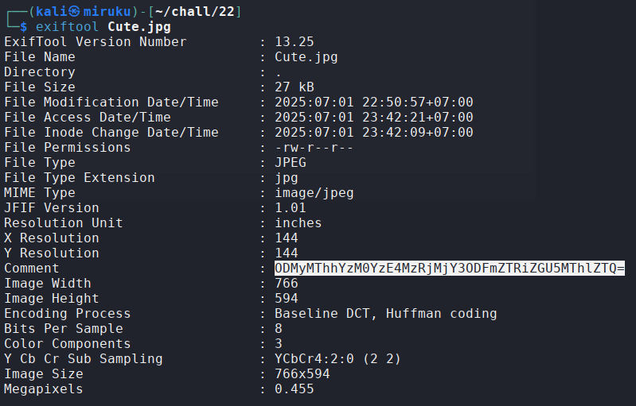

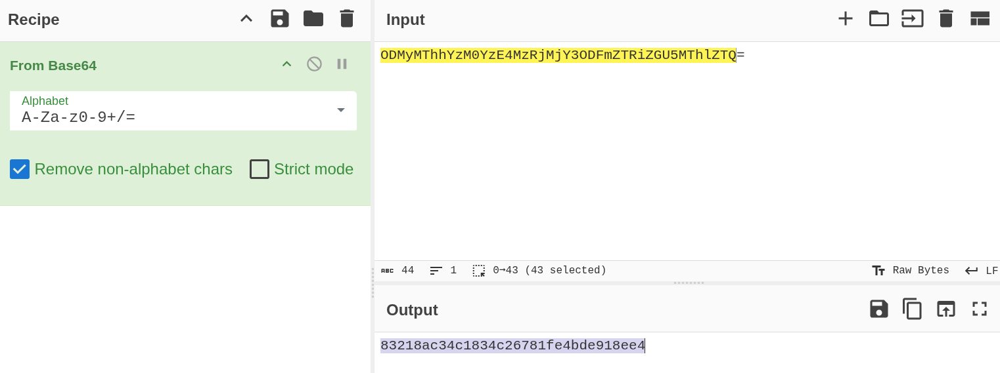

`83218ac34c1834c26781fe4bde918ee4`

อาาา ไม่รู้ทำไมตอนนั้นคิดว่ามันคือ md5 เลยลองโยนลง [crackstation](https://crackstation.net) ดู

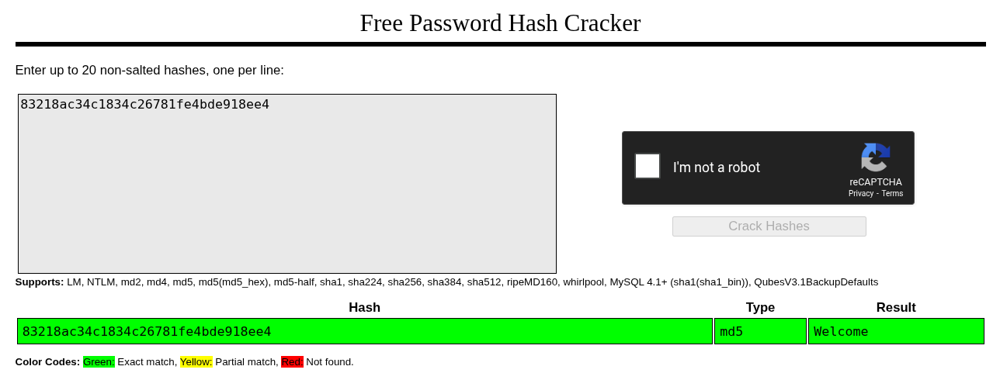

`Welcome`, password แหละ unzip เลยดีกว่า

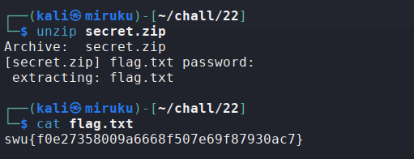

`swu{f0e27358009a6668f507e69f87930ac7}`

# Agent 172

_Thw\[WaJ\`\[LaHt\[EcAjP536_

_เจ้าหน้าที่หน่วยลับ 172 ที่ทางรัฐบาลส่งไปเพื่อสืบราชการลับ ได้แอบส่งข้อความมาแต่ว่า ทางเจ้าหน้าที่ได้ทำการดัดแปลงข้อความเอาไว้เพื่อไม่ได้ศัตรูที่ดักจับข้อมูลนั้นอ่านออกได้ พวกเราเด็กมศวที่บังเอิญได้มอบหมายให้แกะข้อความจดหมายลับจาก Agent 172 ที่ส่งมาให้ Agent rotx0r เราต้องแก้ไขรหัสลับนี้ให้ได้เพื่อที่จะได้ส่งข้อความไปให้รัฐบาลต่อไป\!\!\! ในรูปแบบ MD5 โดยAgent 172 ได้แนบ Note มาดังนี้ การแกะรหัสข้อความมีทั้งหมด 3 ขั้นตอน_

[swu-capture-the-flag-competition-2025/agent-172 @c0ffeeoverdose](https://blog.c0ffeeoverdose.xyz/posts/ctf/swu-capture-the-flag-competition-2025/#agent-172)

เราได้ข้อความที่ถูกเข้ารหัสมา ซึ่งลองหลายวิธีแล้ว แต่เมื่อลองใช้ magic operation แล้วเลื่อนดูก็เจอเข้ากับข้อความที่อ่านได้

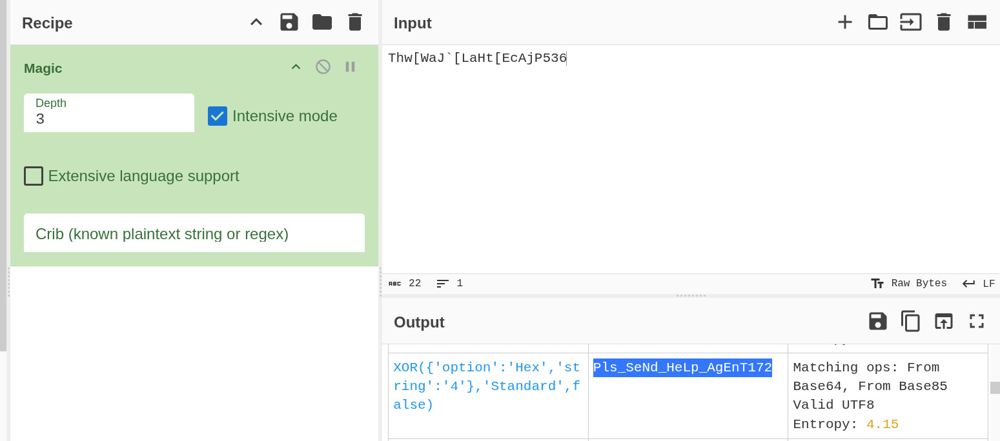

`swu{9f6ac258d55d2d6f54e41a91c6aa3846}`

# Magnolia

_ภายในวิหารแมกโนเลียที่เงียบสงบ ดอกไม้ศักดิ์สิทธิ์ทั้งเจ็ดผลิบานภายใต้แสงจันทร์ ตำนานกล่าวว่า ผู้กล้าที่ถอดรหัสจากดอกไม้หกดอกได้สำเร็จ จะพบเบาะแสซึ่งนำไปสู่กุญแจแห่งความลับ และไขประตู\.\.\.สู่ดอกไม้สุดท้าย โบราณจารย์ได้ทิ้งบทกวีไว้ ถักทอด้วยกลีบดอกไม้และแสงจันทร์ ผู้ที่เข้าใจความหมายในกลอน จะเห็นหนทางที่ซ่อนอยู่ในเงา โปรดอ่านบทกลอนอย่างละเอียด_

**Unsolved**

# Slack Space

_Can you Read Me?_ \
_Hint 0 points: แค่คุณเปิดโลกก็เปลี่ยน -\_\_\_\_\_-_

[swu-capture-the-flag-competition-2025/slack-space @c0ffeeoverdose](https://blog.c0ffeeoverdose.xyz/posts/ctf/swu-capture-the-flag-competition-2025/#slack-space)

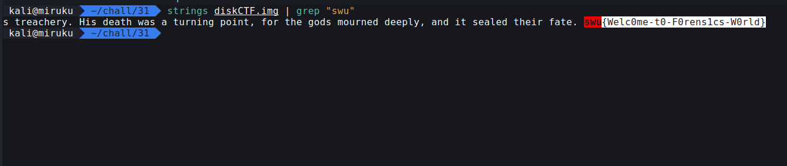

แค่ strings grep โลกก็เปลี่ยน

# Dear Brute

_ถึง บูธร์,_ \
_สองวันที่ผ่านมา ฉันพบว่าเซิร์ฟเวอร์ฝั่ง West Farm Server ถูกโจมตี ทำให้ตอนนี้ฉันต้องรับมือกับงานจำนวนมาก ฉันอยากขอให้คุณช่วยวิเคราะห์ log และตรวจสอบว่าแฮกเกอร์ใช้เทคนิคอะไรในการโจมตี รวมถึงพวกเขาได้ข้อมูลอะไรไปบ้าง ยังไงฝากช่วยดูให้ทีนะ และการเปิดไฟล์ก็ใช้วิธีเดิมตามที่เราทำกัน เอ้อ! อีกอย่าง อย่าลืมอ่านไฟล์ข้อความของฉันด้วย_ \
_จาก, ฟอร์ส_

[swu-capture-the-flag-competition-2025/dear-brute @c0ffeeoverdose](https://blog.c0ffeeoverdose.xyz/posts/ctf/swu-capture-the-flag-competition-2025/#dear-brute)

ได้ไฟล์ชื่อ `Dear-Tom.zip` เราได้ extract `log.zip` ที่ถูก lock ไว้ และ `Message.zip` ที่ด้านในมี `secret.txt` ที่มีรายการ plaintext อยู่

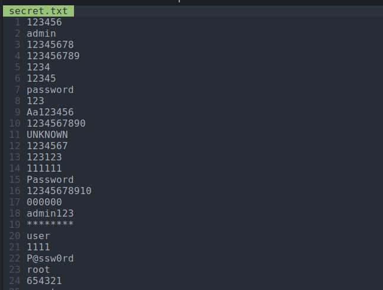

เดาได้ทันทีว่าต้อง brute force

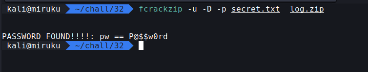

ต่อด้วย unzip

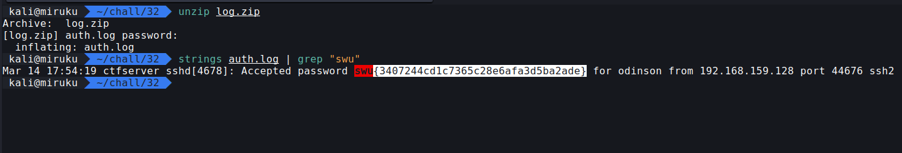

ซึ่งจะได้ `auth.log` ออกมา เสร็จแล้วก็ strings grep again

`swu{3407244cd1c7365c28e6afa3d5ba2ade}`

# Systemfile

_หน่วยสืบสวนอาชญากรรมทางไซเบอร์บุกเข้าจับกุมกลุ่มแฮกเกอร์ในย่านเริงรมย์ แต่เมื่อไปถึงกลับพบเพียงซากของคอมพิวเตอร์และเซิร์ฟเวอร์ที่ถูกทำลายจนยับเยิน ส่งผลให้ข้อมูลสำคัญสูญหายไปอย่างไร้ร่องรอย ท่ามกลางความสับสน เจ้าหน้าที่พบเบาะแสบางอย่างที่อาจนำไปสู่การกู้คืนข้อมูลได้ แต่พวกเขาต้องการผู้เชี่ยวชาญในการกู้ข้อมูลดิจิทัล_ \
_คุณจะสามารถค้นหาและกู้คืนข้อมูลเหล่านั้นได้หรือไม่?_

เราได้ไฟล์ชื่อ `disk2.img` มา ซึ่ง ใช่ผมใช้เน็ต 500MB สำหรับ download ไฟล์มาเพื่อ strings grep

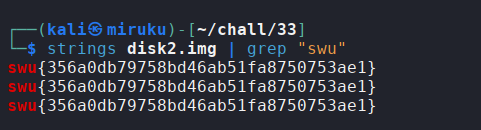

`swu{356a0db79758bd46ab51fa8750753ae1}`

# RANSOMWARE be careful

_ในสัปดาห์ที่ผ่านมา คุณพบว่าองค์กรของคุณถูกโจมตีโดยแฮกเกอร์ด้วย Ransomware ส่งผลให้ข้อมูลสำคัญถูกเข้ารหัสไปจนหมดสิ้น แต่ถึงแม้คุณจะเป็นเพียง IT Guy ธรรมดาที่ใคร ๆ มองว่ากาก แต่คุณกลับมีไฟและปณิธานอันแรงกล้าที่อยากช่วยองค์กร ด้วยความมุ่งมั่น คุณจึงแอบขอร้องให้เพื่อนของคุณ-ผู้รับผิดชอบ Case นี้-ช่วยส่งไฟล์ OVA ของเซิร์ฟเวอร์ที่ถูกโจมตี รวมถึงข้อมูลอื่น ๆ ที่เกี่ยวข้องมาให้... แต่สิ่งที่คุณได้รับกลับเป็นเพียง บัญชีที่มีสิทธิ์ต่ำ สำหรับเข้าถึงเซิร์ฟเวอร์เท่านั้น_ \
_จากนี้ไป ทุกอย่างขึ้นอยู่กับคุณแล้ว... คุณจะสามารถกู้คืนข้อมูลทั้งหมดได้หรือไม่? สู้เขา ทาเคชิ_

**Unsolved**

หา private key ไม่เจอครับ 😭

::github{repo="marmos91/ransomware"}

# Game of Colors

_ถึง ฟอร์ส, ฉันส่งซีรีส์ Game of Thrones ไปให้แล้ว อยากให้นายลองดูสักครั้ง เชื่อเถอะ…มันจะตราตรึงใจนายไปตลอดชีวิต ฉันรับประกัน! หาเวลาดูให้ได้ล่ะ!!! เมื่ออ่านจบแล้ว-ทำลายข้อความนี้ซะ!! จาก, Old Friend Long live the Empire0!_

Solve: [@c0ffeeOverdose](https://github.com/c0ffeeOverdose) [swu-capture-the-flag-competition-2025/game-of-colors](https://blog.c0ffeeoverdose.xyz/posts/ctf/swu-capture-the-flag-competition-2025/#game-of-colors) \
Submit: [@noonomyen](https://github.com/noonomyen)

แถมๆ พอดี [@c0ffeeOverdose](https://github.com/c0ffeeOverdose) เจอแล้วแหละ แต่ยังไม่ submit แล้วผลก็เพลอ submit ไปละ (แย่งแบบงงๆ)

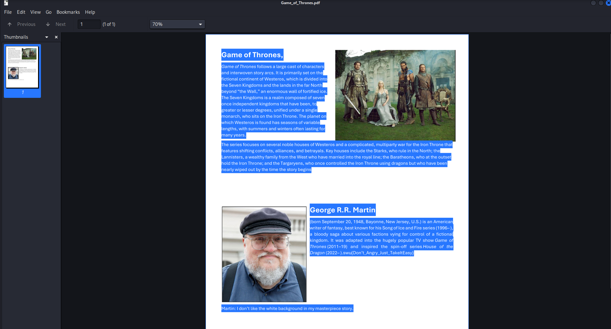

open แล้วก็ `ctrl + a` ขอบคุณครับ

`swu{Don’t_Angry_Just_TakeItEasy}`

# u-i-i-io-i-ii-a-io

_เจ้าแมว u i i io i ii a io กำลังส่งข้อความถึงคุณ_ \
_View Hint: ใช้โปรแกรม sonic visualiser_

[swu-capture-the-flag-competition-2025/u-i-i-io-i-ii-a-io @c0ffeeoverdose](https://blog.c0ffeeoverdose.xyz/posts/ctf/swu-capture-the-flag-competition-2025/#u-i-i-io-i-ii-a-io)

ได้ไฟล์เสียงแมว u_i_i_io_i_ii_a_io.wav มา

สำหรับข้อนี้ เราได้ทำการ hint คือ `ใช้โปรแกรม sonic visualiser`

ทำการ `Add Spectrogram`

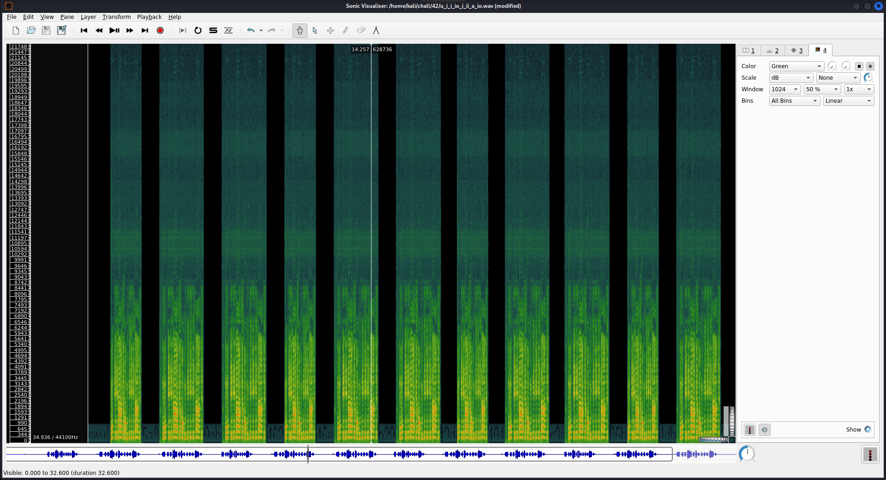

flag อยู่ด้านล่าง

`swu{5a89eb46246eb29f3d494c3f05b4db21}`

# Trust Your Eyes

_Note\: เปิดเสียงเบาๆนะ_

ได้ไฟล์ Audio1.wav ครับ เริ่มจาก Audacity หน่อยดีกว่า

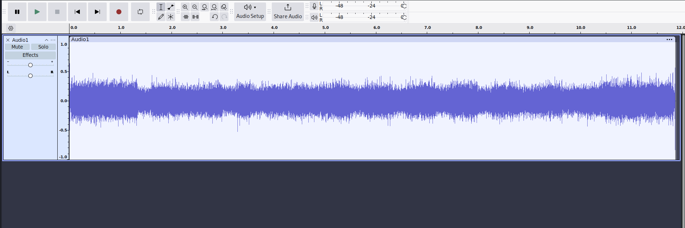

ไหนลอง Spectrogram สิ


ได้หรอ ได้แหละ ว่าแต่ qr code มันแปลกๆนะ \
ซึ่งใช่ ผมลอง grayscale + threshold แล้ว scan ไม่ติด \
หลังจากนั่งดูสักพัก รูปมันแปลกๆนะ มันหมุนไม่พอแถมยัง flip อีก \
ไม่รอช้า ไหนลองหมุนกลับสิ

GIMP: `Grayscale` > `Rotate 180` > `Flip Horizontal` > `Threshold`

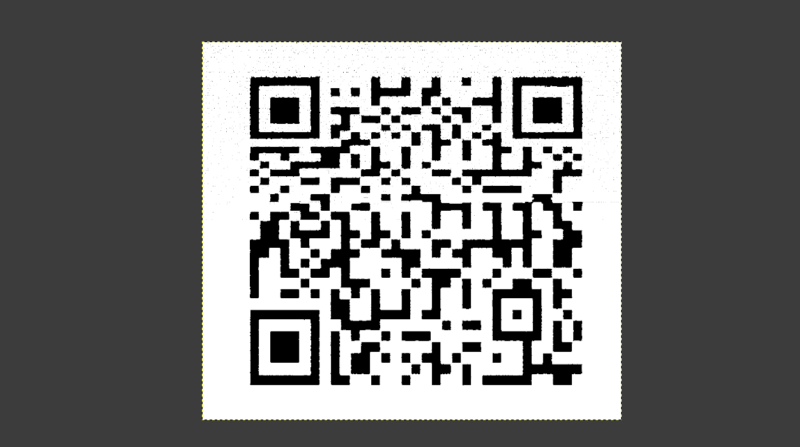

scan ยังไม่ได้ฮะ งั้นได้เวลาสร้าง qr code แบบ **h a n d m a d e**

::github{repo="merricx/qrazybox"}

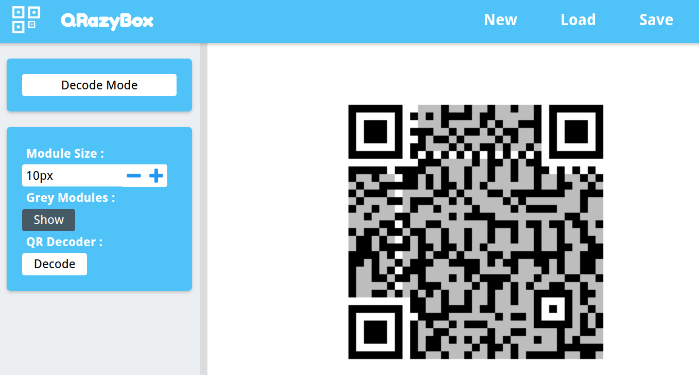

scan สิ scan เลย

`} 6 4 0 4 0 5 3 5 6 d 3 8 8 6 0 3 0 9 a 3 9 e a 6 c e 6 c c 2 6 b { u w s`

flag ชัว

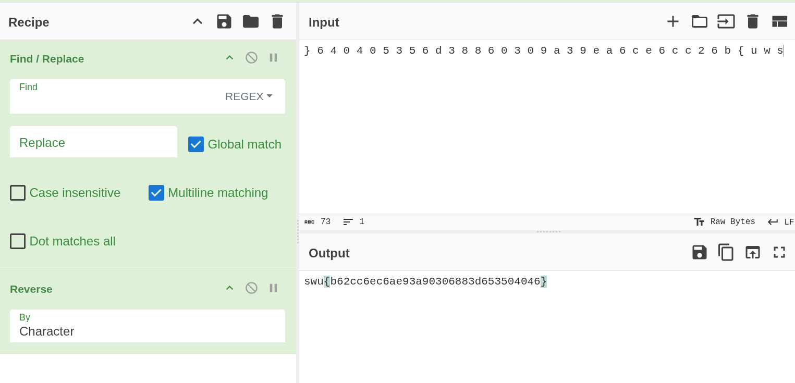

`swu{b62cc6ec6ae93a90306883d653504046}`

# "ห้ามตัวเองไม่ให้รักเธอ จะทำยังไงใจมันไม่ฟัง"

_อยู่ๆเพื่อนก็ส่งเพลงนี้มาให้ฟัง มันจะพยายามบอกอะไรเราเนี่ย..._

**Unsolved**

# Manifest0

_คุณได้รับมอบหมายให้ทำ Penetration Testing บนแอปพลิเคชันตัวหนึ่ง ซึ่งมีรายงานว่า มีช่องโหว่ร้ายที่เป็นอันตรายต่อผู้ใช้_ \
_Hint 0 points: ตรวจสอบไฟล์ AndroidManifest.xml_

เราได้ไฟล์ `Manifest0.apk` มา ซึ่งเริ่มจาก extract ก่อนเลย เราจะใช้ apktool

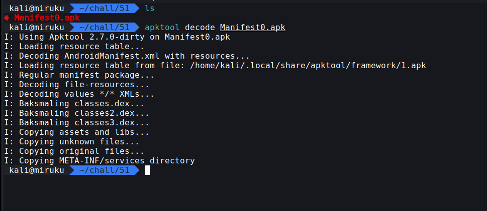

แล้วก็พบ `secret_flag` ที่เป็น base64 อยู่


decode

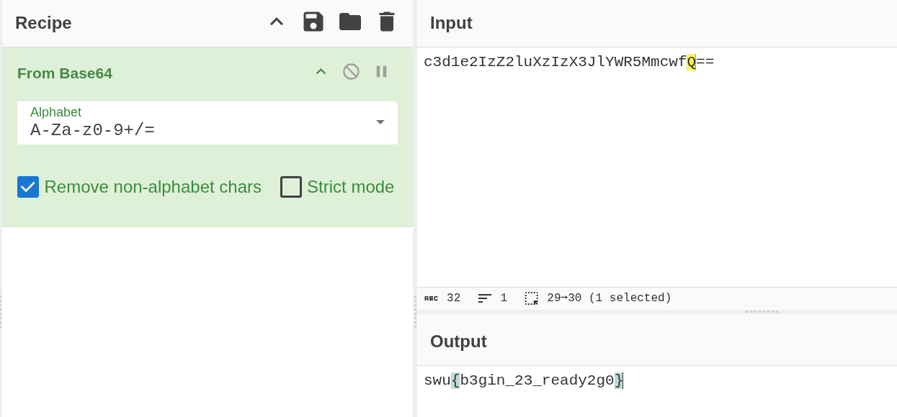

`swu{b3gin_23_ready2g0}`

# Unintended Secrets

_ในระหว่างการพัฒนาแอปพลิเคชัน\, ผู้พัฒนาได้บังเอิญสร้างไฟล์ที่เก็บข้อมูลสำคัญไว้โดยไม่ได้ตั้งใจ คุณจึงได้รับการว่าจ้างให้ทำการ penetration testing เพื่อหาช่องโหว่ที่อาจเกิดจากไฟล์ดังกล่าว_

เราได้ไฟล์ `FindMe.apk` ก็ เริ่มจาก apktool again

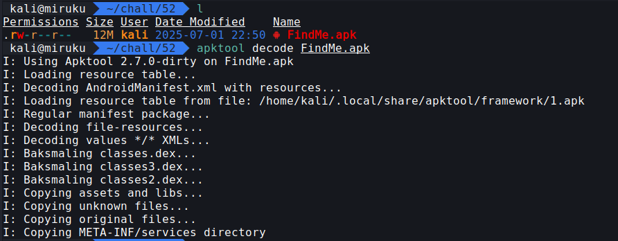

ในรอบนี้ได้เจอเพราะมีไฟล์ชื่อ flag อยู่

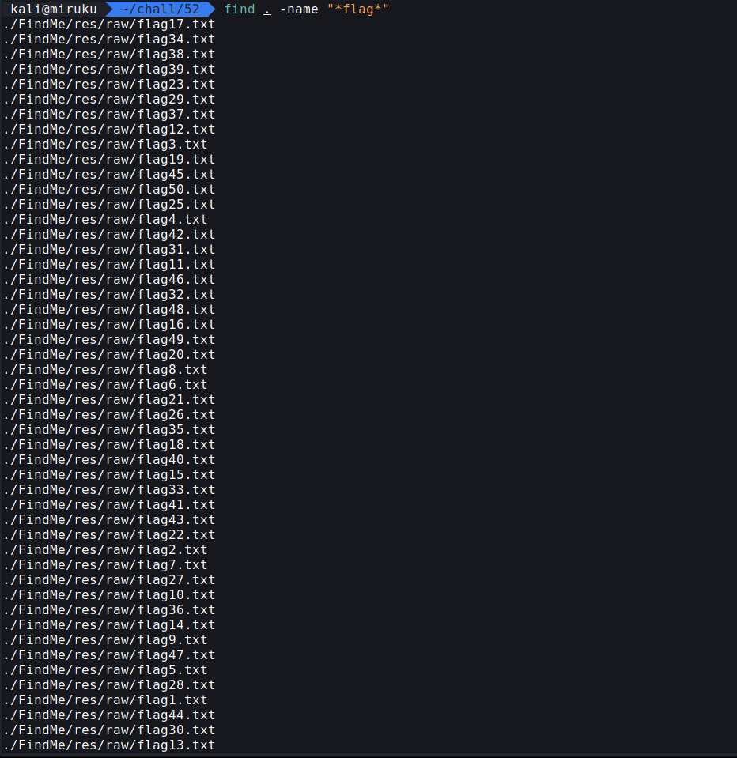

แปะ Cyber Chef

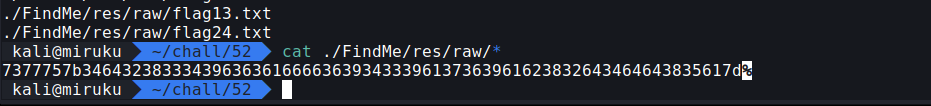

`from hex`

`swu{4d28349ccaff69439a769ab82d4dd85a}`

# InsecureStorage

_คุณได้รับมอบหมายให้ทำการทดสอบความปลอดภัยบน Mobile Application หลังจากที่คุณติดตั้งแอปและเปิดใช้งาน ผู้ใช้จะต้องป้อน Username และ Password บนหน้าล็อกอิน เมื่อลงชื่อเข้าใช้ ข้อมูลเหล่านี้จะถูกบันทึกอยู่ในโทรศัพท์มือถือ_

ไฟล์ InsecureStorage.apk

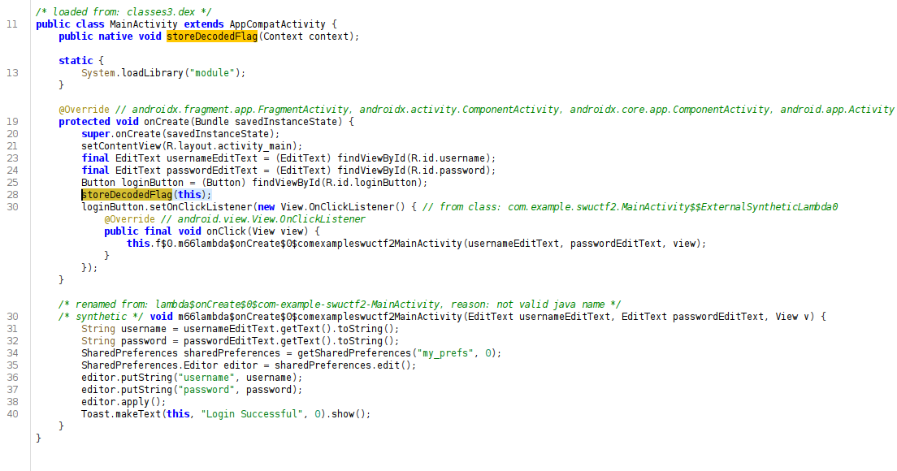

มี function ที่น่าจะเก็บ flag ใว้ `storeDecodedFlag` แต่ function นี้น่าจะอยู่ใน library `module`

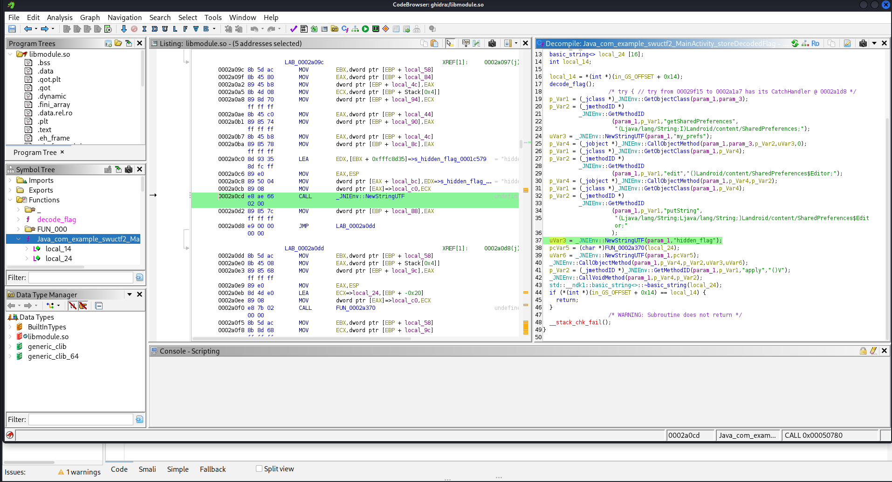

ดูเหมือนจะมีการเก็บ flag ลง `SharedPreferences` key: `hidden_flag`

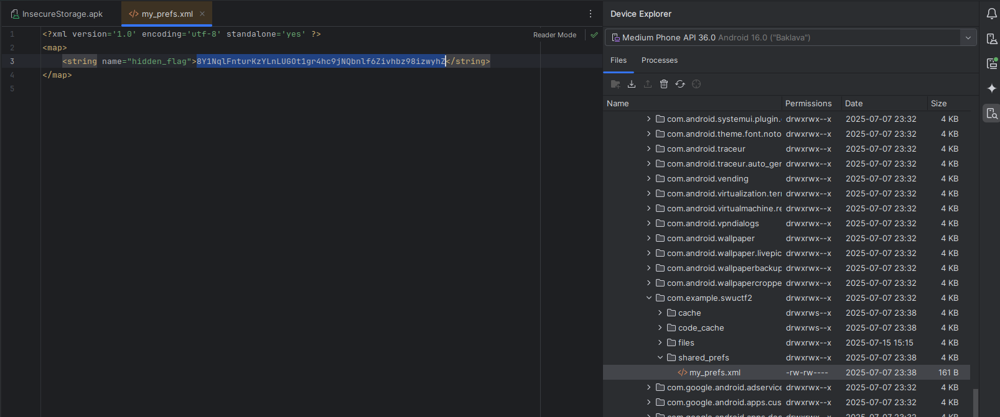

`/data/data/com.example.swuctf2/shared_prefs`

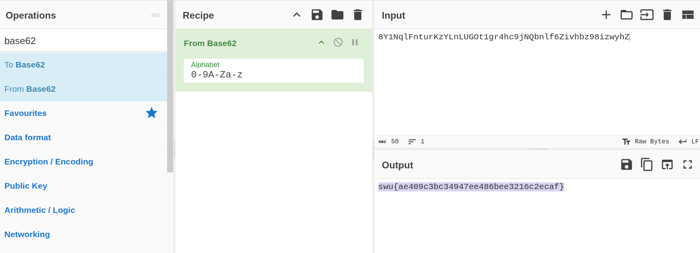

`swu{ae409c3bc34947ee486bee3216c2ecaf}`

# Log It In

_แอปพลิเคชันมือถือที่กำลังอยู่ในขั้นตอนการทดสอบนี้ได้ทำการบันทึกการกระทำของผู้ใช้ลงในอุปกรณ์ ซึ่งรวมถึงข้อมูลที่มีความสำคัญ เช่น รหัสผ่านหรือข้อมูลส่วนบุคคล การบันทึกข้อมูลเหล่านี้ในเครื่องอาจสร้างช่องโหว่ที่สามารถถูกโจมตีได้ คุณได้รับมอบหมายให้ทำการตรวจสอบและค้นหาช่องโหว่ที่อาจเกิดขึ้นจากการจัดเก็บข้อมูลดังกล่าว_

ไฟล์ `Login.apk`

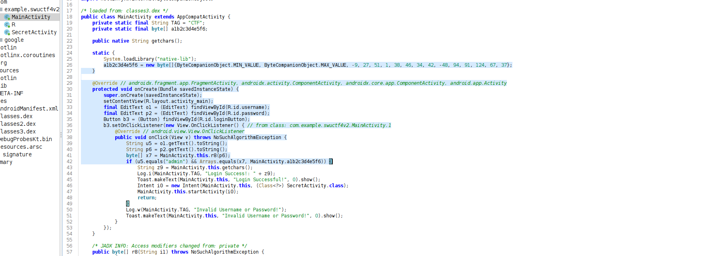

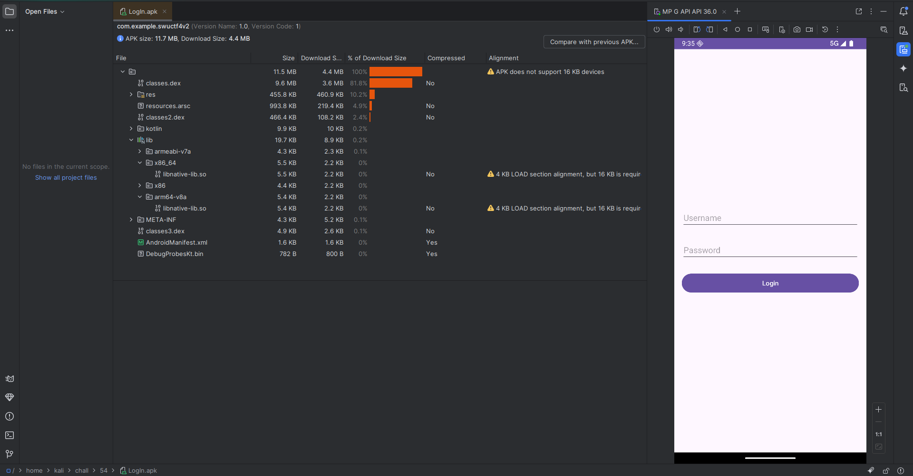

เป็นหน้า login ซึ่งมี user เป็น `admin` และ password ที่ถูก obfuscate ไว้ แต่จะสังเกตเห็นว่ามี `Log.i(MainActivity.TAG, "Login Success!: " + z9);` ที่ output ข้อความจาก `getchars` โดย `getchars` ไม่มีการรับ args และไม่ได้อยู่ใน code นี้ด้วยแต่อยู่ใน library `native-lib` ซึ่งหลังจากขั้นตอนนี้เราสามารถไปได้สองทางคือ แงะ lib หรือลอง call function ดูก่อน โดยถ้าเรา reverse lib มาดูก็จะพบกับ function และ xor encrypt ไว้

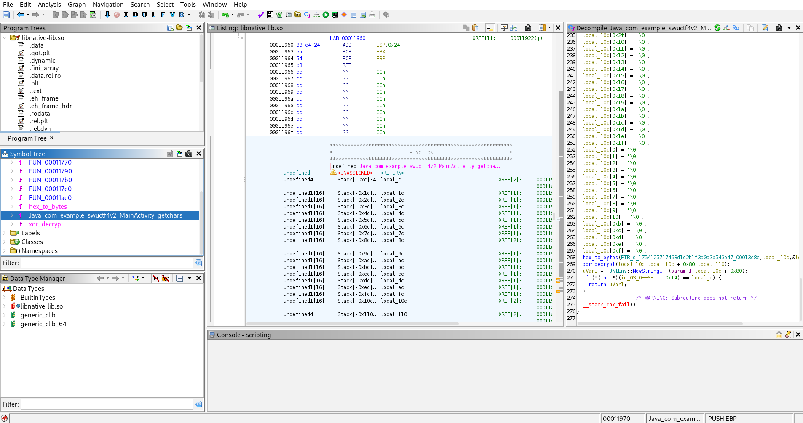

ซึ่งถ้าเรา reverse จาก lib นี้เราก็สามารถได้ flag แต่มีอีกวิธีคือ call มันดูเลย เพราะมันไม่ต้องการรับ parameter อะไรอยู่แล้ว

```js
Java.perform(() => {
    Java.choose("com.example.swuctf4v2.MainActivity", {
        onMatch: (i) => console.log(i.getchars()),
        onComplete: () => {}
    })
})
```

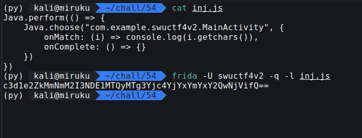

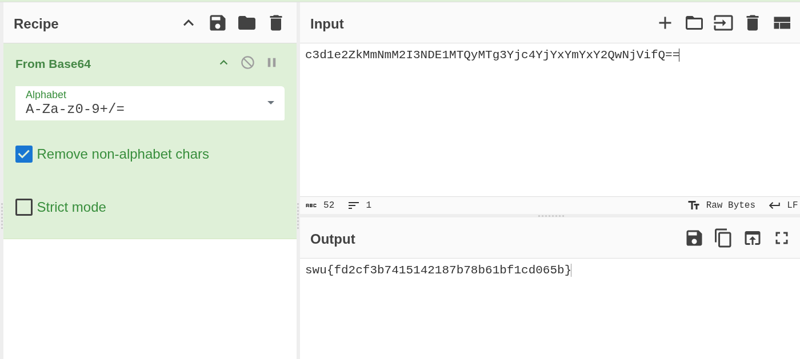

`swu{fd2cf3b7415142187b78b61bf1cd065b}`

::github{repo="frida/frida"}

# Wireshark 101

_Wireshark เป็นโปรแกรมที่เอาไว้ดู Packet ที่ใช้ในการสื่อสาร ในแต่ละ Protocol ก็จะแตกต่างกันไป คนที่เคยใช้ก็จะหา Flag ได้ไม่ยาก_ \
_Hint 0 points: flag อยู่ในอากาศ....เห้ย flag อยู่ใน traffic นั่นแหละ_

`Network_Noob.pcapng`

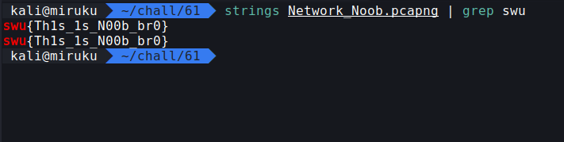

strings grep เข้าให้

# Wireshark 201

`Network_Easy.pcapng`

_มันทำอะไรได้มากกว่าการดู Traffic..._

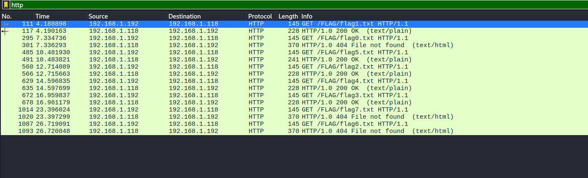

อืมมมม

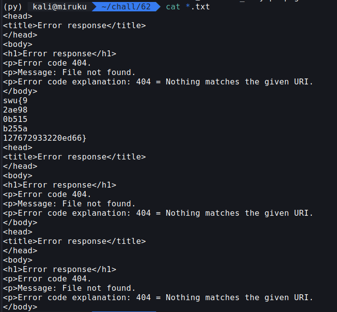

`swu{92ae980b515b255a127672933220ed66}`

# อดทนจนกว่าจะได้ flag

_ถึงจะผ่านข้อนี้ไปได้ แต่ก็ไม่สามารถผ่านคนในใจของเค้าได้หรอก!_

[swu-capture-the-flag-competition-2025/อดทนจนกว่าจะได้ flag @c0ffeeoverdose](https://blog.c0ffeeoverdose.xyz/posts/ctf/swu-capture-the-flag-competition-2025/#%E0%B8%AD%E0%B8%94%E0%B8%97%E0%B8%99%E0%B8%88%E0%B8%99%E0%B8%81%E0%B8%A7%E0%B9%88%E0%B8%B2%E0%B8%88%E0%B8%B0%E0%B9%84%E0%B8%94%E0%B9%89-flag)

ผมว่า description มันแปลกๆนะ

`Network_Medium.pcapng`

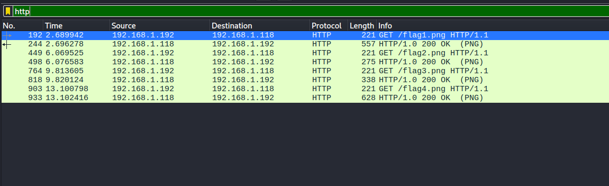

เอ๊ะ

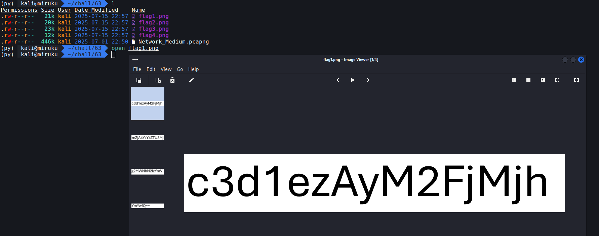

น่าน

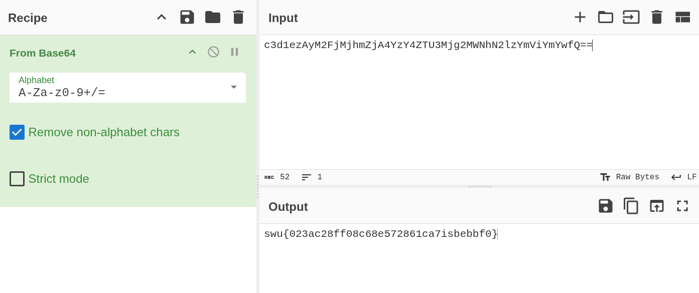

`swu{023ac28ff08c68e572861ca7b3bebbf0}`

# นายเองก็เป็นได้นะ โคนันอะ

_"ถ้าตัดความเป็นไปไม่ได้ออกไปหมดแล้ว สิ่งที่เหลืออยู่ ไม่ว่าจะไม่น่าเชื่อแค่ไหนก็ตาม แต่มันก็คือความจริง" \(เสียงโคนัน\)_

เราได้ไฟล์ `Network_Hard.pcapng` มา เราก็เปิดด้วย program ประจำบ้านอย่าง wireshark

ในขณะเลื่อนๆดูนั้นเองเราก็เจอ steam ที่เป็น http อยู่เราเลยเปิดดู

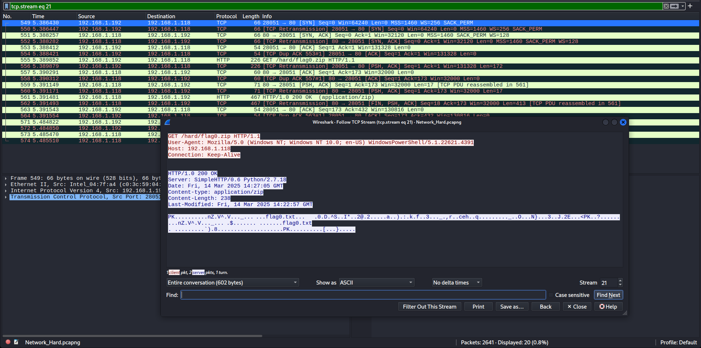

flag ??? ไหน export ดูสิ

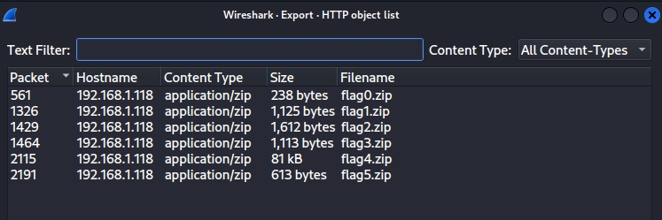

ไฟล์ zip แฮะ

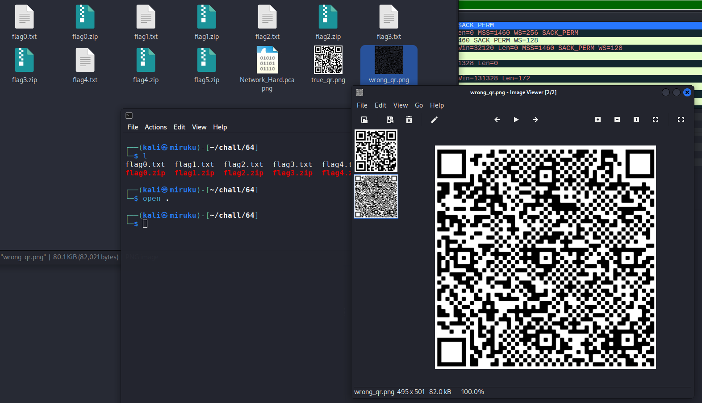

อืมมมม มันคือ qr code สองตัว อันแรกคงไม่ต้องถามหรอก ผมว่าคุณก็น่าจะรู้ 😂

เข้าเรื่องดีกว่า flag อยู่ qr code ที่เป็นตัว `wrong_qr.png` ครับ โดยมันผิดแปลกใช่ไหมละ ถ้าดูดีๆจะพบว่า `position` มันถูกลบตรงกลางออก

แล้วเราจะ scan ไง? ลองจากง่ายๆก่อน อย่างการซ่อม position

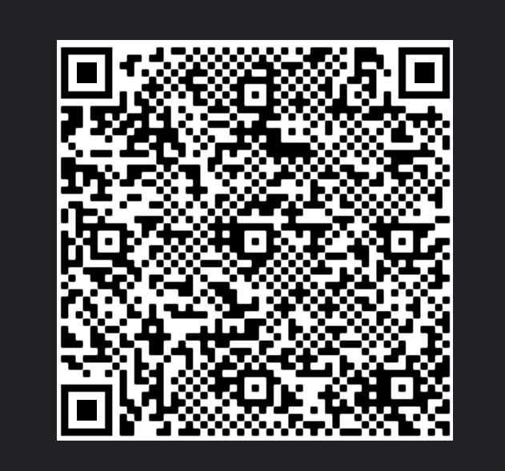

ซึ่งผมใช้มือถือ scan ครับ แล้วได้ data นี้มา

`01110011 01110111 01110101 01111011 00110101 00110110 01100011 00110000 00110010 00110010 01100010 00110100 01100011 01100101 00110010 01100110 00110100 00110000 00110011 01100100 01100011 00110010 00110000 00110000 00111001 01100110 00110001 00110010 01100101 00111001 00110010 00110001 00110110 00110000 00111000 00110101 01111101`

ซึ่งอาจะสงสัยว่า scan ได้ไงใช่ไหม คำตอบคือ qr code มีวิธีจัดการกับข้อมูลที่ขาดหายหรือผิดของ qr code ครับ ถ้ามีอะไรไปทับนิดๆหน่อยก็ยังสามารถ scan ได้ครับ เอาละ โดนใส่ Cyber Chef ต่อเลยฮะ

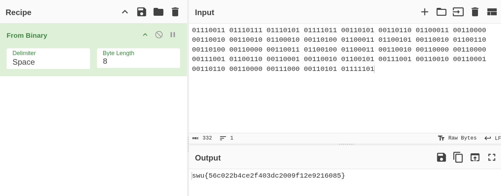

`swu{56c022b4ce2f403dc2009f12e9216085}`

# Lost But Not Forgotten

_คุณเป็นนักวิจัยด้านความปลอดภัยและได้รับไฟล์ challenge.exe ซึ่งเป็นไฟล์ปริศนาจากการแข่งขัน CTF \(Capture The Flag\) ที่กำหนด ให้คุณค้นหา Flag ที่ซ่อนอยู่ภายในไฟล์ โดยไม่มีฟังก์ชันใดเรียกใช้มันโดยตรง_ \
_คำสั่ง cat หรือ strings อาจจะมีคำตอบที่ซ้อนอยู่_

จริงๆผมก็ เปิด ghidra ก่อน strings เลยแหละ แหกธรรมเนียมนิดหน่อย

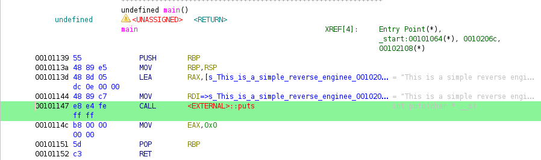

อืม strings เถอะ

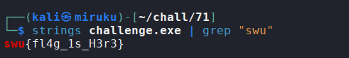

`swu{fl4g_1s_H3r3}`

ไม่ต้องทำอะไรกันละ

# You're not a monkey... right?

_เราพัฒนามาจากลิงแล้ว... ใช่ไหม? หมายถึง... เราลงจากต้นไม้มาแล้วนะ จุดไฟได้แล้ว สร้างคอมพิวเตอร์ได้แล้ว เขียนโค้ดก็เป็น เจาะระบบยังได้เลย เราเล่น AI ได้ ทำมีมได้ กดเลือกได้ (ถึงจะมั่วบ้างก็เถอะ) คือ... ถ้ามาถึงขนาดนี้แล้ว เราน่าจะเกินจุดกดมั่ว ๆ ไปแล้วมั้ง... ใช่ไหม... ใช่ไหม??เราพัฒนามาจากลิงแล้ว... ใช่ไหม? หมายถึง... เราลงจากต้นไม้มาแล้วนะ จุดไฟได้แล้ว สร้างคอมพิวเตอร์ได้แล้ว เขียนโค้ดก็เป็น เจาะระบบยังได้เลย เราเล่น AI ได้ ทำมีมได้ กดเลือกได้ (ถึงจะมั่วบ้างก็เถอะ) คือ... ถ้ามาถึงขนาดนี้แล้ว เราน่าจะเกินจุดกดมั่ว ๆ ไปแล้วมั้ง... ใช่ไหม... ใช่ไหม??_

Monkey.zip

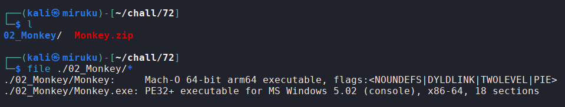

แต่ผมใช้ Linux...

ช่างมัน เริ่มจาก strings ตามธรรมเนียม

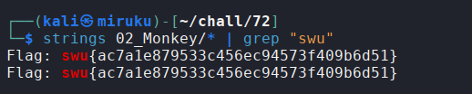

`swu{ac7a1e879533c456ec94573f409b6d51}`

ไม่ต้องทำอะไรกันละ again...

# Press Start

_ยินดีต้อนรับสู่เกม ที่เขียนไว้ให้คุณไม่มีทางชนะ_

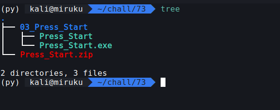

strings grep ไม่เจอฮะ

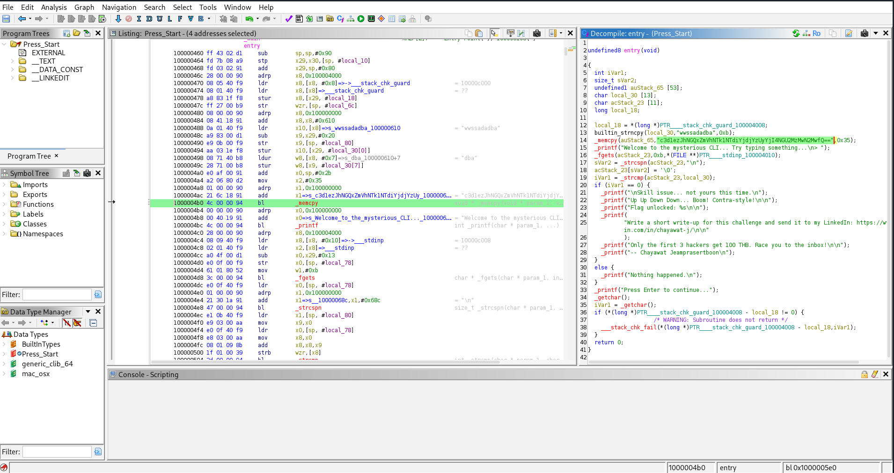

อืมมม

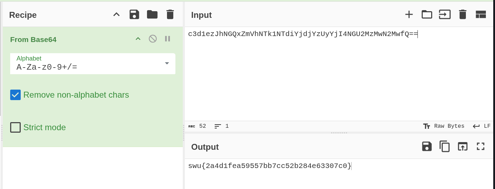

`swu{2a4d1fea59557bb7cc52b284e63307c0}`

# Missile Protocol

_คุณได้รับคำสั่งให้มากดยกเลิกคำสั่งยิงขีปนาวุธ แต่หัวหน้าดันลืมบอกรหัสผ่านเนี่ยสิ ขี้ลืมจริง ๆ เลย แต่จำได้ว่ารหัสผ่านเป็นอักษรพิมพ์เล็กหมด_

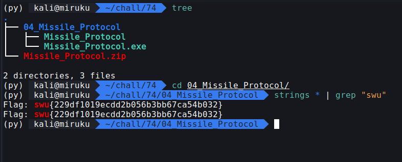

เห้อ

`swu{229df1019ecdd2b056b3bb67ca54b032}`

# Find me

_คุณกำลังสัมภาษณ์งานที่บริษัท Software Development แห่งหนึ่ง และได้รับภารกิจสุดท้าทาย ตรวจสอบการทำงานของเว็บไซต์ เพื่อค้นหาข้อมูลที่ละเอียดอ่อน ซึ่งอาจถูกทิ้งไว้โดยไม่ตั้งใจจากนักพัฒนา_ \
_Hint 0 points: View Page Source_

[swu-capture-the-flag-competition-2025/find-me @c0ffeeoverdose](https://blog.c0ffeeoverdose.xyz/posts/ctf/swu-capture-the-flag-competition-2025/#find-me)

`swu{We1c0m3_t0_W3b_Applicati0n_Cha113ng3s}`

# Break In and Find the Secrets

_คุณเป็นนักทดสอบเจาะระบบที่มีจริยธรรม และบังเอิญพบเว็บไซต์เก่าที่ถูกลืมเลือน แต่กลับเต็มไปด้วยช่องโหว่ร้ายแรง ด้วยจรรยาบรรณในสายงาน คุณจึงตัดสินใจตรวจสอบและทดสอบช่องโหว่ เพื่อแจ้งเตือนเจ้าของเว็บไซต์ก่อนที่มันจะถูกใช้ในทางที่ผิด_ \
_อย่างไรก็ตาม การแจ้งเตือนแบบธรรมดาอาจไม่ได้รับความสนใจ คุณจึงต้อง ค้นหาข้อความลับ ที่มีเพียงเจ้าของเว็บไซต์เท่านั้นที่รู้ และใช้มันเป็นหลักฐานในการพิสูจน์ตัวตนของคุณ จงค้นหามัน!_

[swu-capture-the-flag-competition-2025/break-in-and-find-the-secrets @c0ffeeoverdose](https://blog.c0ffeeoverdose.xyz/posts/ctf/swu-capture-the-flag-competition-2025/#break-in-and-find-the-secrets)

`swu{3407244cd1c7365c28e6afa3d5ba2ade}`

# Case File #0xC4J

_“เงาในเครือข่ายมืด… มีบางสิ่งถูกทิ้งไว้โดยไม่ตั้งใจ หรืออาจตั้งใจให้เราเจอ”_ \
_คุณคือ ผู้ช่วยนักสืบแห่งหน่วยสืบสวนไซเบอร์ลับพิเศษ หัวหน้าหน่วย (ที่ไม่เคยเปิดเผยตัวตน) ส่งข้อความเพียงสั้น ๆ:_ \
_"หลักฐาน… มักถูกซ่อนไว้ในจุดที่ไม่มีใครคิดจะมอง"_

**Unsolved**

# Hidden Pathways

_คุณคือที่ปรึกษาด้านความปลอดภัย (Pentester) ที่ได้รับมอบหมายให้ประเมินความมั่นคงของ ACIS Internal Admin Portal_ \
_ระบบนี้ดูเรียบง่ายและปลอดภัยในสายตาคนทั่วไป ลองดูสิว่าคุณทำอะไรกับมันได้ไหม!_ \
_Hint 0 points: ../ not help try simple_

**Unsolved**

> LFI (access.log) + RCE

# Make Your Own Luck

_ในโลกแห่งการต่อสู้นี้ โชคชะตาและการสุ่มคือภาพลวงตา! คนที่ยิ่งใหญ่เท่านั้นที่จะก้าวข้ามความบังเอิญไปได้_ \
_Hint 0 points: เรื่องบังเอิญไม่มีจริง_

เป็นไฟล์ python


จากที่ดูจะเห็นว่า key == 42 ก็คือ random ให้ได้ 42 ? เอาเป็นว่าลบ random ทิ้งเลยดีกว่าไม่ได้ใช้หรอก

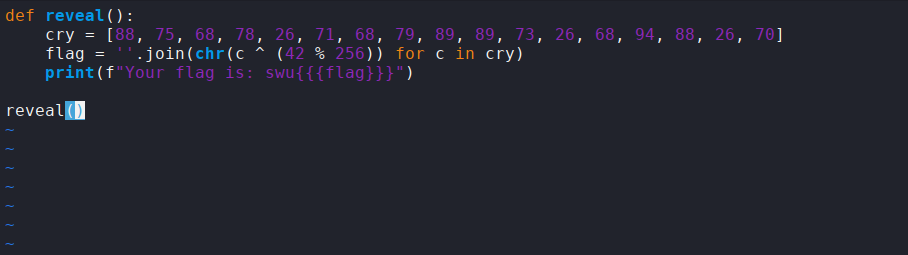

เราก็จะได้ code ที่ใช้ถอด flag


`swu{rand0mnessc0ntr0l}`

# Who will win the Premier League?

_ถึงโค้งสุดท้ายของศึก Premier League! แม้ Liverpool เพิ่งตกรอบ UEFA Champions League และพ่ายให้กับ Newcastle ในรอบชิงชนะเลิศ Carabao Cup อย่างน่าเสียดาย_ \
_แต่ใน Premier League พวกเขายังคงรั้งตำแหน่งจ่าฝูง ทิ้งห่าง Arsenal ถึง 15 คะแนน ใครจะได้แชมป์ Premier League กันนะ!_ \
_Hint 0 points: "ลองเอาคำตอบไปบอก Bot ดูสิ!"_

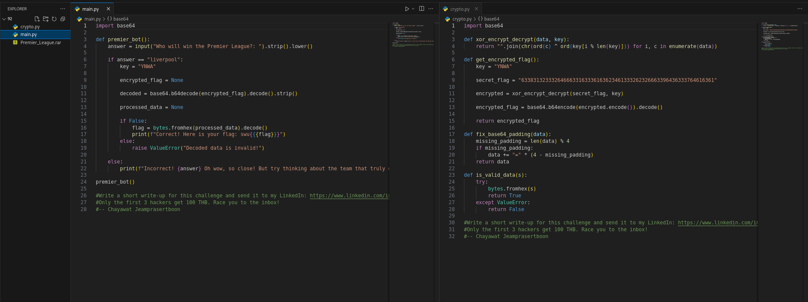

เป็น python ไฟล์ เริ่มจากไหนดีนะ

หลังจากอ่าน code สักพักเราก็เดาได้แล้วว่า code หลักอยู่ที่ main.py \
โดยมันมีข้อมูลที่ขาดหายและ if condition ที่รับ input อยู่ เราเลยลบทิ้งเลยละกัน

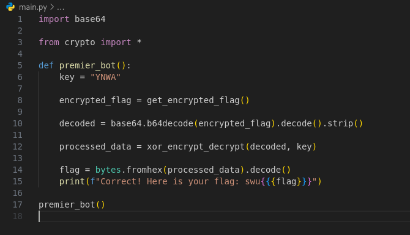

หลังจากไล่ code เสร็จแล้ว ไฟล์ crypto.py ไม่ได้แก้ไขนะครับ ส่วน main.py จะเรียก function ของ crypto.py มาใช้ โดยเดาจากชื่อตัวแปรเลยครับ

แล้วทำไมใช้ `xor_encrypt_decrypt` function ในการถอด ? ก็เพราะ XOR มีคุณสมบัติเป็น symmetric encryption ครับ เลยใช้ key เดียวกัน function เดียวกันได้เลย ถ้า function นั้นๆไม่มีท่าแปลกๆเพิ่มเติม

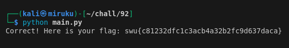

`swu{c81232dfc1c3acb4a32b2fc9d637daca}`

---

# ช่วงท้าย

รอบการแข่งขัน

- First round 1/7/2025
- Secound round 8/7/2025

สำหรับ blog นี้ก็จะรวม challenges ที่ทีมผม solve ไป แล้วผมมาเขียนใหม่ และมีของอีกคนครับ [swu-capture-the-flag-competition-2025 @c0ffeeoverdose](https://blog.c0ffeeoverdose.xyz/posts/ctf/swu-capture-the-flag-competition-2025/)

กว่าที่ writeup นี้จะเขียนเสร็จก็แข่งรอบสองจบไปแล้วครับ ซึ่งจบไปที่อันดับที่ 4 (ชมเชย)

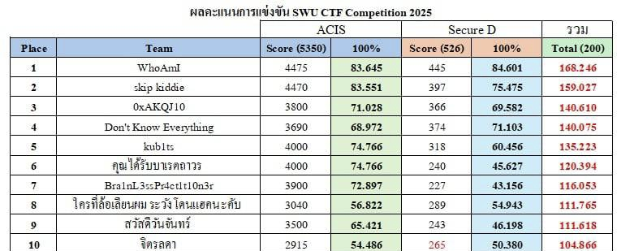

`9/7/2025 20:12`

แอบเสียดายนะ มันนิดเดียวจริงๆ ถ้าได้ first solve หรือ solve ได้อีกสักข้อในรอบที่สองทีมผมอาจได้ที่ 3 ก็ได้ 😭

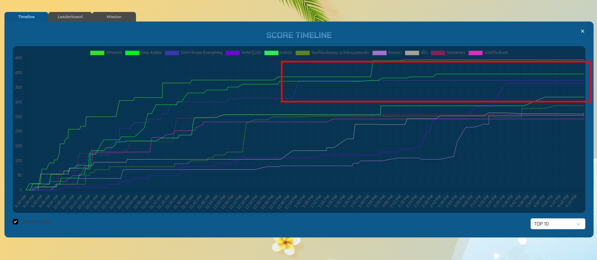

ซึ่งถ้าลองดู score ก็จะพบว่าทีมผมนิ่งไปช่วงบ่าย ซึ่งใช่ฮะ วันนั้นทีมผมแข่งสองงาน ซึ่งชนกับงาน **IT RERU Cyber Hackathon 2025** ช่วงวันที่ 7-8 กรกฎาคม ที่มีการแข่งขันในช่วงบ่ายวันที่ 8

ส่วนการแข่งรอบสองนั้น ดูเหมือนโจทย์เก่าจะเยอะครับ คือถ้าใครตามงาน event ของ secplayground จัดก็จะเอ๊ะเลยแหละครับว่ามันคุ้นๆ ที่หนักว่านั้นคือ search ชื่อ challenge เจอง่ายๆเลยครับ แต่มีบาง challenge ที่เปลี่ยน flag อยู่ เลยกลายเป็นว่ารอบสองเหมือนวัดความสามารถในการหา writeup ของแต่ละทีมซะงั้น แต่สุดท้ายแล้วพอ writeup หมดก็วัดที่ทีมอีกทีว่าจะ solve challenge ที่หา writeup ไม่เจอได้หรือเปล่า ซึ่งผมคิดว่าก็ไม่ได้แย่นะ เพราะงานจริงๆที่ challenge เก่าๆพวกนี้คือแข่งระดับวันสองวันเลย แล้วเอามาใช้ในงานที่แข่งไม่ถึง 24hr ซึ่งมีเวลาให้ทำน้อยลง

สำหรับงานนี้ก็ถือว่าทำได้ดีครับ

แอบเสียดายที่ให้เวลาเขียน writeup แค่ถึงเที่ยงคืนวันแข่ง ซึ่งผมเขียนไม่ทัน เพราะต้องไปทำอย่างอื่น กว่าจะได้กลับมาเขียนก็ใกล้จะเที่ยงคืนซะแล้ว 😢

แล้วพบกัน blog หน้าครับ ehe..
