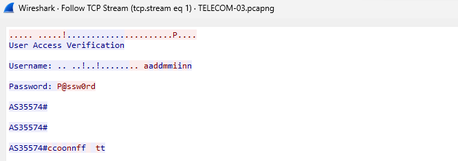

# Red Team

ทำไม่ได้สักข้อครับ T_T.

# Blue Team

```txt
.
└── Blue Team 1
    ├── log
    │   ├── T1
    │   │   ├── AS15855.txt
    │   │   ├── AS24417.txt
    │   │   ├── AS31749.txt
    │   │   ├── AS35574.txt
    │   │   ├── AS64496.txt
    │   │   ├── AS67841.txt
    │   │   ├── CE1.txt
    │   │   └── PE1.txt
    │   ├── T4
    │   │   ├── bgp-route-after-attack.txt
    │   │   └── bgp-route-before-attack.txt
    │   └── T6-8
    │       ├── ce.txt
    │       ├── syslog.txt
    │       └── users.txt
    └── pcap
        ├── TELECOM-02.pcapng
        ├── TELECOM-03.pcapng
        └── TELECOM-05.pcapng
```

```txt
.
└── Blue Team 2
    ├── asset inventory.txt
    ├── eventlog
    │   └── C4ISR
    │       ├── C4ISR-Application.evtx
    │       ├── C4ISR-Security.evtx
    │       ├── C4ISR-Sysmon.evtx
    │       └── C4ISR-System.evtx
    └── pcap
        ├── C4ISR-01.pcap
        ├── C4ISR-02.pcap
        ├── C4ISR-03.pcap
        └── C4ISR-04.pcap
```

- 1-01
- 1-02
- 1-03
- 1-unknown-1
- 1-unknown-2
- 1-unknown-3

- 2-unknown-1

> unknown ในที่นี้คือ จำไม่ได้ว่าข้อที่เท่าไหร่

---

# 1

## 1 > 1

โดยสิ่งเราต้องหาก็คือ AS Number อะไรอยู่ใกล้ 8.8.8.8

ไฟล์อยู่ใน `/Blue Team 1/log/T1`

```txt
.
├── AS15855.txt
├── AS24417.txt
├── AS31749.txt
├── AS35574.txt
├── AS64496.txt
├── AS67841.txt
├── CE1.txt
└── PE1.txt
```

เปิดมันทุกไฟล์ด้วย [VSCode](https://code.visualstudio.com/)


ต้นทาง เราจะเริ่มจาก PE1

ค้นหา `8.8.8.8` แต่ไม่เจอ แต่ใช้ `8.8.8.0` ได้ แล้วก็พบกับ


เราจะพบว่ามี `8.8.8.0` อยู่ใน AS{number}.txt ทุกไฟล์


แต่มีไฟล์หนึ่งที่ via ip ถูกชี้ไปยัง ip ที่มีใน PE1 บรรทัด 28

และ ip ดังกล่าวยังมีปรากฎในเพียงแค่ 2 ไฟล์คือ `PE1.txt` และ `AS15855.txt`


คำตอบคือ `15855`

## 1 > 02

ถ้าต้องการดักข้อมูลต้องใช้ protocol:port อะไร

`/Blue Team 1/pcap/TELECOM-02.pcapng`

เปิดด้วย [Wireshark](https://www.wireshark.org) แล้วทำการ `Statistics > Protocol Hierarchy`


จะพบว่า packet ส่วนใหญ่เป็น Telnet บน TCP

และเมื่อเรา filter ด้วย telnet ก็จะพบการเชื่อต่อระหว่าง `39.39.39.39` และ `6.39.7.1`


และเมื่อสังเกตุเราจะพบว่า `6.39.7.1` นั้นเป็นฝั่ง server ที่เปิดผ่าน port `23`

ดังนั้น ถ้าเราต้องการทุกอย่างในการส่งข้อมูล จึงตองดักจาก protocol `tcp` port `23`

ตอบ `tcp:23`

## 1 > 03

โจทย์ถามว่า username และ password คืออะไร


เปิดมา เราเจอ Telnet เราจึงไม่รอช้าที่จะ `Follow > TCP Stream`



เราก็เจอ username และ password ตอน login แล้วเราก็เขียนในรูป `username:password`

ตอบ `admin:@P@ssw0rd`

## 1 > unknown 1

ให้เป็นตำสั่งสร้าง user ใน router cisco

โจทย์ถามว่า password คืออะไร

`username redaxe privilege 15 secret 5 $1$iI7Y$4/vBLXbeP8LCUd2Y0dONj/`

จากที่เห็นคือเป็นคำสั่งสร้าง user โดน secret เป็น type 5

ในข้อนี้เราจะทำการ brute force ตัว secret

แต่ก่อนที่เราจะไปทำ brute force เราจะใช้ wordlist ก่อน เพื่อเราหาเจอได้จาก wordlist มันจะช่วยให้ประหยัดเวลา

ในที่นี้เราจะใช้ kali linux เราจะได้ wordlist มาจาก

```sh
sudo apt install wordlists
```

เสร็จแล้วทำการไป extract gz

```sh
cd usr/share/wordlists
sudo gunzip /usr/share/wordlists/rockyou.txt.gz
```

```sh
echo '$1$iI7Y$4/vBLXbeP8LCUd2Y0dONj/' > secret.txt
john --format=md5crypt --wordlist=/usr/share/wordlists/rockyou.txt secret.txt
```


ตอบ `Cisco123`

## 1 > unknown 2

:ในข้อนี้ โจทย์ถามว่า ผู้โจมตีทำการสร้าง user ใหม่ครั้งแรกเวลาไหน รูปแบบคำตอบ utc (hh:mm:ss)

ในข้อนี้เราจะมองหาไฟล์ log

`/Blue Team 1/log/T6-8/syslog.txt`


ไฟล์ดังกล่าวเป็นไฟล์จาก syslog

เราจะมองหาคำสั่งที่เป็นคำสั่งสร้าง user คือคำสั่ง `username`


มีการเก็บ log จาก `6.39.7.1` เขียนใน syslog เวลา `2022-07-22 16:36:13` โดยเวลาที่เกิดขึ้นคือ `Jul 22 09:36:05.915`

ตอบ `09:36:05`

## 1 > unknown 3

ข้อนี้โจทย์บอกว่า DNS มี domain ที่ถูกจดทะเบียนในไทย ถูกปลอมที่อยู่ IP

โจทย์ถามว่า domain ไหนถูกปลอม IP

ในข้อนี้ เรารวมไฟล์ pcap เพื่อความง่ายในการหาว่ามันอยู่ในไฟล์ไหน เปิดด้วย [Wireshark](https://www.wireshark.org)

```
TELECOM-02.pcapng
TELECOM-03.pcapng
TELECOM-05.pcapng
```

เราจะ filter เอาแค่ dns


เพื่อความง่ายในการดู เราจึง รวมไฟล์แล้วกรองเอา packet ตอบกลับ dns

```sh
tshark -r ./TELECOM-02.pcapng -r TELECOM-03.pcapng -r TELECOM-05.pcapng \
       -Y "dns && ip.src == 8.8.8.8" \
       -T fields -e ip.src -e ip.dst -e dns.qry.name -e dns.a -e dns.aaaa \
       | sort -n | uniq -c | grep '\.th'
```

เราจะได้รายการ ตอบกลับ dns มา


เมื่อนำข้อมูลมาจัดด้วยมือใหม่จะได้ 6 domain ที่เราต้องหาว่าเป็นตัวไหน

```txt
fiber.3bb.co.th A    110.164.192.250
www.ais.th      A    104.18.24.25,104.18.25.25
www.ais.th      AAAA 2606:4700::6812:1919,2606:4700::6812:1819
www.dtac.co.th  A    202.91.16.169
www.nbtc.go.th  A    79.6.8.3
www.ntplc.co.th A    118.174.10.141
www.true.th     A    18.140.215.123,54.169.2.5,52.220.103.140
```

ณ วันที่ 2023/09/30

นํา IP v4 ที่ได้ไปหาต่อด้วย [ipinfo](https://ipinfo.io/) (logged) โดยเราจะดูว่ามี domain ใน IP นั้นไหม

```txt
fiber.3bb.co.th
    ASN Name : JasTel Network International Gateway
    Domain   : 3bb.co.th
www.ais.th
    ASN Name : Cloudflare, Inc.
    Domain   : ais.th
www.dtac.co.th
    ASN Name : Total Access Communication PLC.
    Domain   : dtac.co.th
www.nbtc.go.th
    ASN Name : Telecom Italia S.p.A.
    Domain   :
www.ntplc.co.th
    ANS Name : Internet Data Center Service
    Domain   :
www.true.th
    ANS Name : Amazon Technologies Inc.
    Domain   :
```

เราสงสัย `www.nbtc.go.th` `www.ntplc.co.th` `www.true.th`

เราจึงทำการ query dns จาก domain ที่ต้องสงสัย แล้วนำไปหา ASN Name อีกครั้ง

```txt
www.nbtc.go.th -> Cloudflare, Inc.
www.ntplc.co.th -> Internet Data Center Service
www.true.th -> Amazon Technologies Inc.
````

เราจะเห็นได้ชัดเลยว่า `www.nbtc.go.th` นั้นไม่ตรงกัน จึงสรุปได้เลย

ตอบ `www.nbtc.go.th`

# 2

## 2 > unknown 1

ข้อนี้โจทย์ต้องการทราบ username:password ลำดับที่ 3 ในไฟล์ที่ถูกส่ง

ในโจทย์นี้เรานำไฟล์ pcap มารวมกันทั้งหมด และเราดึงไหล์ด้วย [Network Miner](https://www.netresec.com/?page=NetworkMiner)

```txt
C4ISR-01.pcap
C4ISR-02.pcap
C4ISR-03.pcap
C4ISR-04.pcap
```


เราลองเปิดไฟล์ไปแล้วพบว่า ไฟล์ `account.txt` นั้นมี username และ password เรียงกันเป็นรายการ 3 ลำดับในหัวข้อ client


ตอบ `user3:P@ssw0rd3`
