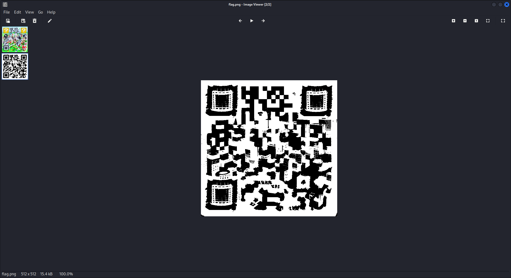

รอบคัดเลือก ระดับ Senior, ใน repo นี้เป็นโจทย์ที่ทีมเราหา flag ได้ภายในเวลาแข่งขัน

## Members

- [@c0ffeeOverdose](https://github.com/c0ffeeOverdose)

## Challenges

- Web Application
  - Pickle
  - Hidden Attack
  - Nginx Secmis
- Digital Forensic
  - Covered Track
  - **Nebula**
  - Pickle
  - 3rd Tier Assignment
- Reverse Engineering & Pwnable
  - Read
  - Reverse CTF
  - CryptoLockerMe
  - PRINT
- Programming
  - **Decrypt message**
  - C#
  - Northwind4SQLServer
  - enc_dir
- Network Security
  - **The puzzle**
  - **Secret Message**
  - MitM
  - **xfil**
  - **SOMEWHERE**
- Mobile Security
  - hello flutter
  - Show Me The Flag
  - mflag
  - hflag
  - WidgProx
- Cryptography
  - **ZeroRight**
  - **Lineman**

---

# Digital Forensic

## Digital Forensic > Nebula

```txt
.
└── Nebula.mp4
```

**Flag found by: [@c0ffeeOverdose](https://github.com/c0ffeeOverdose)**

เป็นไฟล์ video ที่ไม่มีเบาะแสอะไรเลย


ไม่รู้ทำไม ลองคิดว่ามันจะมี text ที่เป็น flag อยู่ด้ายในหรือเปล่า ?

และใช่ เมื่อค้นหาด้วย flag pattern ก็พบเข้ากับ flag ที่อยู่ท้ายไฟล์ `Nebula.mp4`


# Programming

## Programming > Decrypt message

```txt
.
└── Decrypt message
    ├── encrypt.py
    ├── key.txt
    └── secret.txt
```

เราได้ file มา 3 ไฟล์ จากการอ่านไฟล์เราก็ทราบว่า

- `encrypt.py` ใช้เข้ารหัส
- `key.txt` ใช้เก็บ key
- `secret.txt` ใช้เก็บข้อความที่ถูกเข้ารหัส


แต่ความแปลกคือ key.txt ดูเหมือนจะไม่ได้มี key เดียวนะสิ

ดังนั้นเราจึงสรุปสิ่งที่เราจะทำออกมาได้ 2 อย่างคือ

- เขียน decrypt.py
- หา key ที่ถูกต้อง

```py
from cryptography.fernet import Fernet

fm = open("flag.txt", "w")
fs = open("secret.txt", "rb")
fk = open("key.txt", "r")

secret = fs.read()

for key in fk.read().split("\n"):
    try:
        cipher_suite = Fernet(key.encode())
        decrypted_message = cipher_suite.decrypt(secret)
        break
    except:
        pass

fm.write(decrypted_message.decode())

fm.close()
fs.close()
fk.close()
```

```sh
python3 decrypt.py
```

แล้ว flag จะอยู้ในไฟล์ `flag.txt`


# Network Security

## Network Security > The puzzle

```txt
.
└── The puzzle.pcapng
```

**Flag found by: [@c0ffeeOverdose](https://github.com/c0ffeeOverdose)**

ไฟล์ที่เราได้มาคือไฟล์ pcapng เป็นไฟล์ packet capture สามารถเปิดได้โดยใช้ [Wireshark](https://www.wireshark.org)


เมื่อเราเปิดขึ้นมาก็พบกับ HTTP Protocol เป็น packet แรก ที่บอกถึงว่ามีการ upload ไฟล์บางอย่าง งานนี้เดาไม่ยากเลยว่าต้องทำอะไร

เราจึงทำการ export HTTP ออกมาดู

- `File > Export Objects > HTTP`


และสิ่งที่เราได้มาก็คือไฟล์ภาพ ที่เป็น QR Code


เราก็ได้ทำการ scan ดูแล้วพบว่าไม่สามารถสแกนได้ ด้วยสาเหตุง่ายๆคือ QR Code มีรูปแบบไม่ถูกต้อง ในที่นี้คือขาด Position ไป 2 ที่

เราจึงจะทำการแก้ไขภาพโดยการตัดต่อภาพ เราจะใช้โปรแกรมอะไรก็ได้ (แต่ตอนแข่ง [@c0ffeeOverdose](https://github.com/c0ffeeOverdose) เขาใช้ [Paint](https://en.wikipedia.org/wiki/Microsoft_Paint) กับรูปตัดแปะง่ายๆ ไม่ปรับสี)

ในที่นี้เราจะยกตัวอย่างโดยใช้ [GIMP](https://www.gimp.org)

- Colors > Saturation = 0
- Colors > Threshold = Auto (160, 255)



เมื่อเราทำการ export ออกมาแล้ว เราก็ทำการนำมือถือมา scan QR Code ก็จะได้เป็น link `https://bit.ly/ctt23` เมื่อเข้าไปแล้วจะถูก redirect ไปที่ `https://shelldo.000webhostapp.com/flag.txt` อีกที


## Network Security > Secret Message

```txt
.
└── TheSecretMessage.pcap
```

ไฟล์ที่เราได้มาคือไฟล์ pcap เป็นไฟล์ packet capture สามารถเปิดได้โดยใช้ [Wireshark](https://www.wireshark.org)

เมื่อเราเปิด เราจะเห็นว่ามี packet ไม่กี่อัน และพบกับ HTTP จึงไม่รอช้าที่จะ export HTTP ออกมาดู

- `File > Export Objects > HTTP`


เราได้ไฟล์ `upload.php` มาสองไฟล์ และมีไฟล์หนึ่งที่มีความน่าสนใจ เพราะ HTTP ได้บอกว่ามันคือ zip ไฟล์ และเราจึงดึงเอา data มาเขียนเป็น zip file


จากนั้นเราก็ทำการ extract ไฟล์ออกมา และมันซ้อนกัน เราจึง extract ไปเรื่อยๆจนได้ `flag.txt`


เราได้ text ชุดหนึ่งมา และ pattern นี้ทำให้นึกถึง Base64 แต่มันไม่ใช่เพราะตัว padding มันดันมาอยู่ด้านหน้า จึงเดาๆได้ว่ามันน่าจะเรียงย้อนกลับ เราจึงจับโยนใส่ [CyberChef](https://gchq.github.io/CyberChef/)

- Reverse
- From Base64

และเราก็ได้ flag


## Network Security > xfil

```txt
.
└── xfil
    └── xfil.pcapng
```

ไฟล์ที่เราได้มาคือไฟล์ pcapng เป็นไฟล์ packet capture สามารถเปิดได้โดยใช้ [Wireshark](https://www.wireshark.org)


จากภาพเราจะสังเกตุได้ว่า มี dns query จำนวนมากแต่ server ตอบกลับว่า ไม่มีชื่อดังกล่าว

เมื่อเราสังเกตุจะพบว่า subdomain มีความยาวเท่ากันทุกการ query ยกเว้นครั้งสุดท้าย และชื่อ subdomain นั้นเป็นรูปแบบเลขฐาน 16

เราก็คิดว่าพอเอา data (subdomain) ดังกล่าวมาต่อกัน น่าจะเป็นไฟล์

เราจึงนำ 2 bytes แรกไปค้นหาใน [List of file signatures](https://en.wikipedia.org/wiki/List_of_file_signatures) และก็พบว่า มันคือประเภทไฟล์ jpeg

ถึงจุดนี้แล้วไม่ต้องสงสัยแล้วว่ามันคืออะไรนอกจากว่ามันจะคือ ไฟล์รูปภาพ

เราจึงดึง query name เฉพาะที่ client ส่ง ออกมาจากไฟล์ pcap และในไฟล์ pcap นี้ไม่มี packet อื่นที่ไม่เกี่ยวข้องอยู่ เลยไม่จำเป็นต้อง filter อะไรมาก

```sh
tshark -r xfil.pcapng -T fields -e dns.qry.name -Y 'ip.src == 172.16.67.130'
```


ลบ domain name ออก แล้วนำมาต่อกันแล้วเขียนเป็นไฟล์

```py
with open('data.jpeg', 'ab') as f:
    try:
        while True:
            f.write(bytes.fromhex(input().replace('.totallynotmalicious.xyz', '')))
    except EOFError:
        f.close()
```

```sh
tshark -r xfil.pcapng -T fields -e dns.qry.name -Y 'ip.src == 172.16.67.130' | python3 script.py
```

และ flag ที่เราตามหาก็จะอยู่ในภาพ `data.jpeg`


## Network Security > SOMEWHERE

```txt
.
└── SOMEWHERE.pcapng
```

ไฟล์ที่เราได้มาคือไฟล์ pcapng เป็นไฟล์ packet capture สามารถเปิดได้โดยใช้ [Wireshark](https://www.wireshark.org)


จากที่เราเห็น จะเป็น packet ปะปนกันไปหมด พอถึงจุดนี้ไม่รู้ทำไม เลยลองไป export HTTP ออกมาดู

- `File > Export Objects > HTTP`


แน่นอน เราไม่รอช้าที่จะ save มันออกมาดู และเราก็ได้พบกับ flag ที่อยู่ใน `favicon.png`


# Cryptography

## Cryptography > ZeroRight

```txt
.
└── ZeroRight.txt
```

เราได้มาเป็น file txt ตัวหนึ่งด้านในเป็น string ที่มีแค่ 0 และ 1


เราเดาว่ามันต้องเป็น text ที่ถูกเข้ารหัสมาเป็น binary แน่ๆ

แต่ปัญหาคือโดนเข้ารหัสอะไรมาบ้างละ ?

ด้วยความขี้เกียจเราจึงจับโยนเข้า CyberChef แล้วใช้เวทมนต์ในการถอดรหัส (แนะนำให้ใช้ Google Chrome)

- Magic with Intensive mode and Depth default (3)

จากนั้นทำการค้นหาทั้งหน้าเว็บด้วยด้วย flag pattern ของงานนี้ `CTT23`


## Cryptography > Lineman

```txt
.
└── Lineman.png
```

**Flag found by: [@c0ffeeOverdose](https://github.com/c0ffeeOverdose)**

เราได้รูปๆหนึ่งมา ไม่รู้ว่ามันคืออะไร แต่รู้สึกคุ้นๆ เหมือนเคยเห็นที่ไหนมาก่อน


ลอง `Google len`


เลื่อนๆ ไป เหมือนจะเจอรูปที่คล้ายๆ กัน


ลองกด `Search image with Google`


พอเลื่อนๆ ไป เราก็จะเจอคำประมาณ `pigpen`, `Pigpen Cipher`


Hm มันคืออะไร! พอเราลองไป Search ดู


เหมือนจะมาถูกทาง งั้นลอง Search `pigpen cipher online decoder` เราก็จะเจอเว็บ สำหรับ decode แล้วเราลอง กดตามภาพที่ได้


นี้มันใช่ ใช่แน่ๆ แต่ Flags จะอยู่ในรูป `CTT23{Flags}` เพราะงั้น Flags ก็จะเป็น `CTT23{ILOVENCSA}` ง่ายใช่ไหมละ 😏😏😏 (text & emoji by c0ffeeOverdose)
