- **Cryptography**
  - **Easy 1**
  - **Easy 2**
  - **Medium**
  - **Hard**
- **Programming**
  - **Easy 1**
  - **Easy 2**
  - **Medium**
  - type_the_word
- **Web Application**
  - **Not So Secret**
  - Exclude Me Not
  - Waiting List
  - Sth Sticker Shop (SSS) `Removed during the match`
- **Digital Forensic**
  - **Easy 1**
  - **Easy 2**
  - Bad Company
  - Cloudo
- **Reverse Engineering & Pwnable**
  - **Running Number**
  - **Embedded Malware**
- **Network Security**
  - **HTTP Mayhem**
  - **Silent Whisper**
  - **Encrypted C2 v2**
  - Ultimate C2 v2
- **Mobile Security**
  - **Easy**
  - **Medium**
  - **The Face THCTT24**
  - **Click Click**

---

# Cryptography

## Cryptography > Easy 1

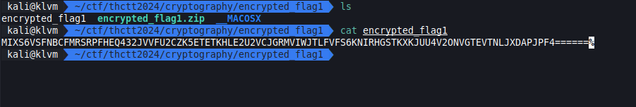

ใช้ Cyber Chef ในการถอดรหัส

| Recipe | Setting | Description |
| :-- | :-: | :-- |
| From Base32 | | |
| Regular expression | `b//(.*)//` Output capture group | ลบส่วนที่ไม่ต้องการ |
| From Base64 | | |

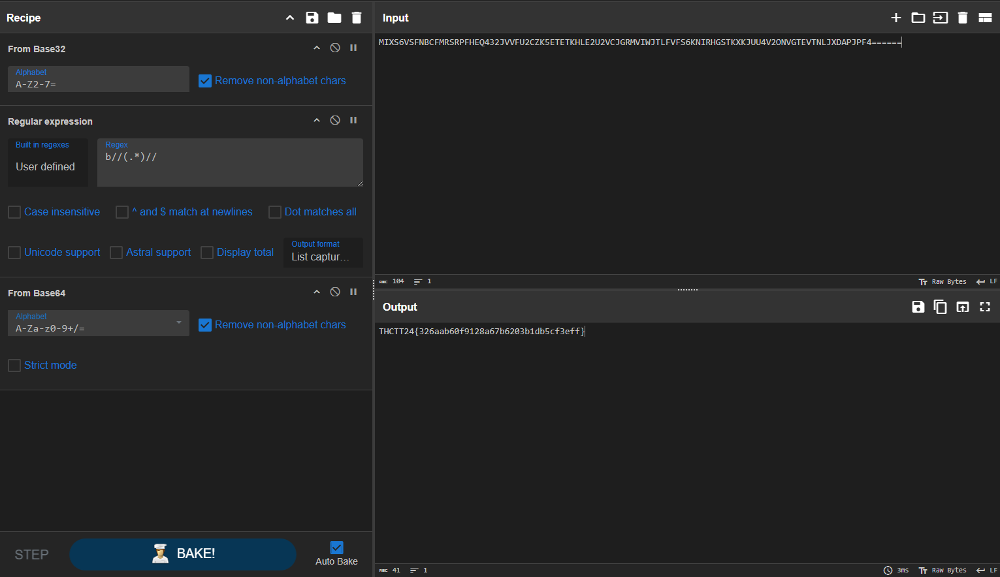

## Cryptography > Easy 2

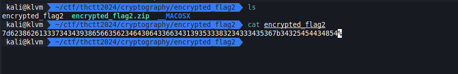

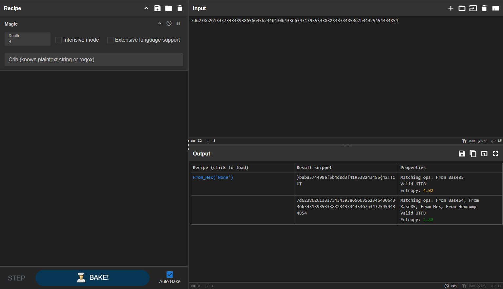

เริ่มจาก Cyber Chef เหมือนเดิม ด้วย `Magic` แล้วเราก็เจอเลย ที่เหลือก็ Reverse

| Recipe |
| :-- |
| From_Hex |
| Reverse |

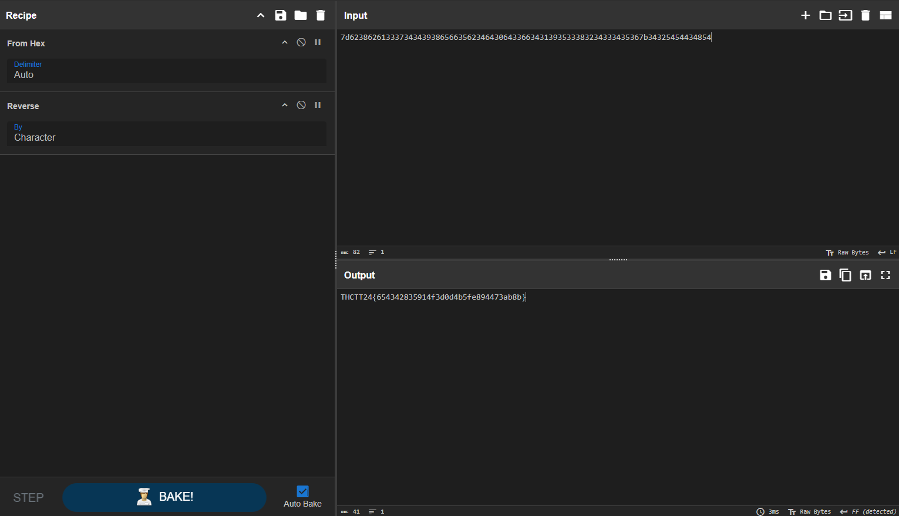

## Cryptography > Medium

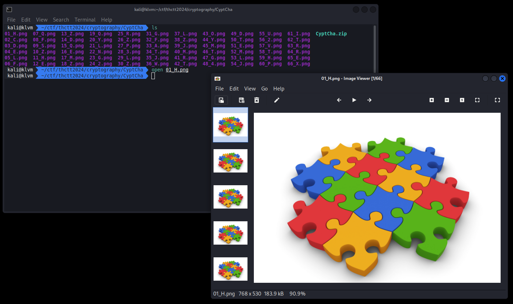

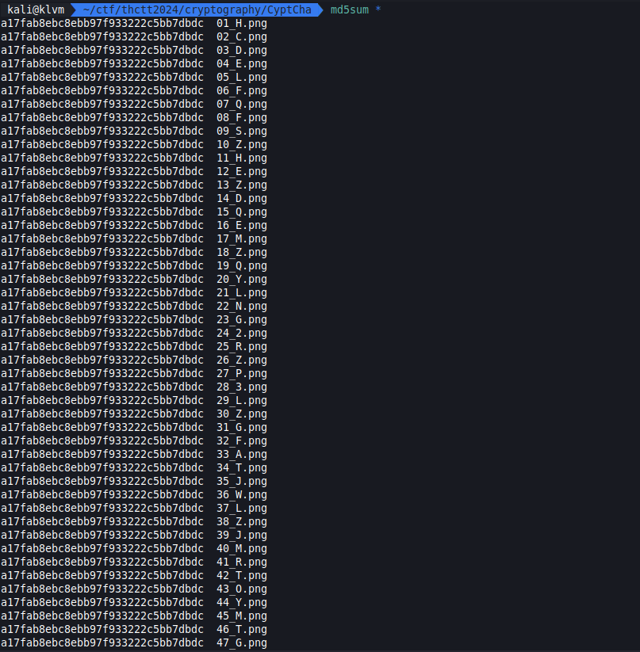

เริ่มจากหาว่ามันมีหลายไฟล์มันมีอะไรแปลกๆไหม แล้วเราพบว่าเป็นไฟล์เดียวกันหมดเลย ต่างกันแค่ชื่อ

แล้วต่างกันแค่ตรงชื่อ ? แต่ดันมีลำกับเป็นชื่อไฟล์ และตามด้วย char หนึ่งตัว เราจึงลองกรองเอา char พวกนั้นมาต่อกันดู

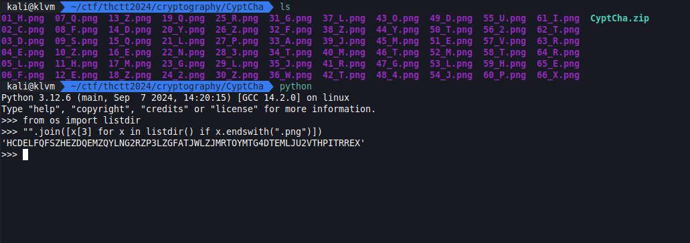

ต่อด้วย Cyber Chef

| Recipe |
| :-- |
| Reverse |
| ROT13 |
| From Base32 |

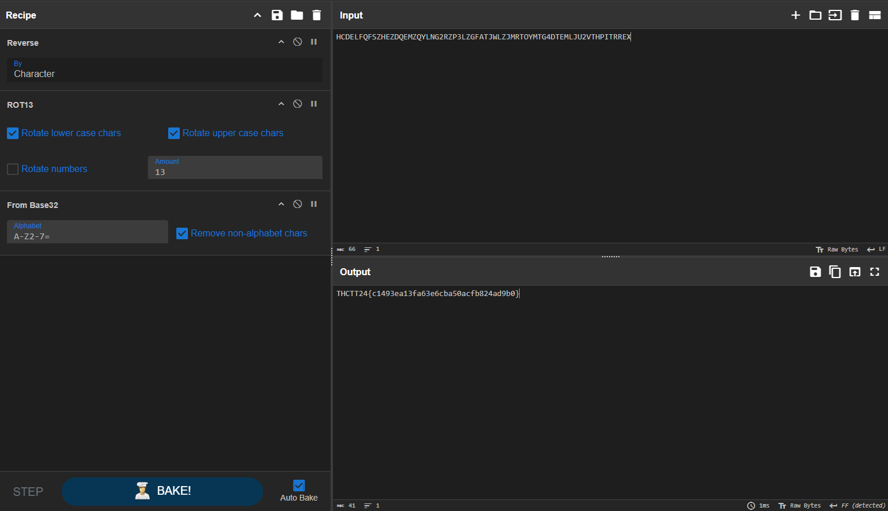

## Cryptography > Hard

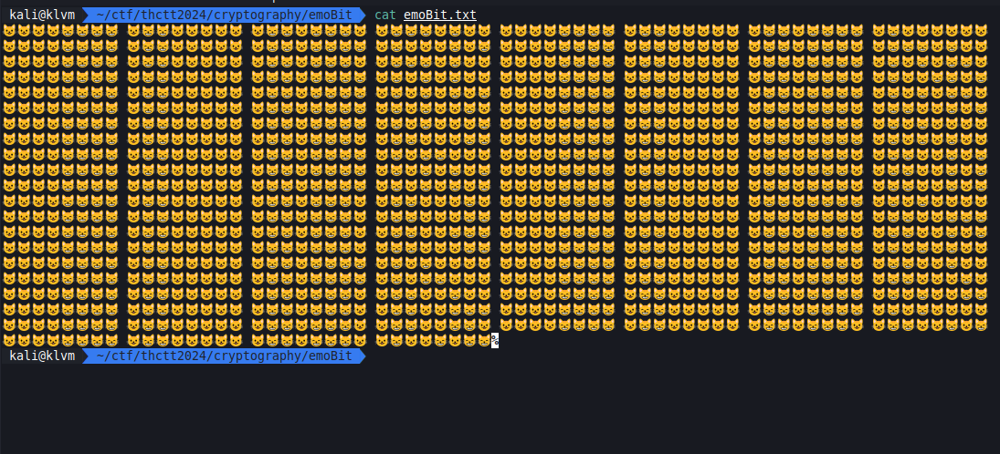

เริ่มจากการนั่งจ้องก่อนเลย ถ้าเราลองไล่ดูว่ามี emoji อะไรบ้างละ นับจำนวนต่อการเว้นวรรจะพบว่ามันคล้ายๆ byte ซึ่งจำนวน byte จะเท่ากับ 164 bytes

เราจึงทำการแปลงมัน แล้วไปต่อที่ Cyber Chef

```sh
cat emoBit.txt | python -c "print(''.join([x.replace('😺', '1').replace('😸', '0') for x in input()]), end='')" > bytes.txt
```

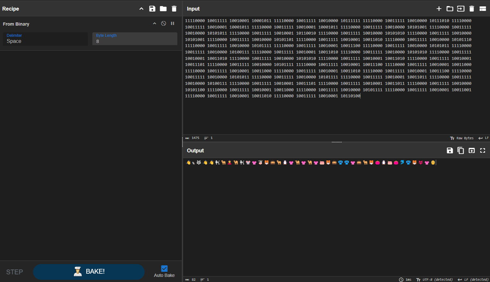

ด้วย `From Binary` output แสดงให้เราเห็นว่า เรามาถูกทางสินะ ออกมาเป็น emoji สวยงามแบบนี้ ว่าแต่มันไปต่อยังไง ? นั่งจ้องอีกสิ

> กรณีที่เรา replace emoji ด้วย 0, 1 สลับกันมันจะทำให้เราได้อะไรที่อ่านไม่ได้ ซึ่งเราแก้ปัญหาด้วยการใช้ recipe `NOT` หลัง `From Binary` ได้

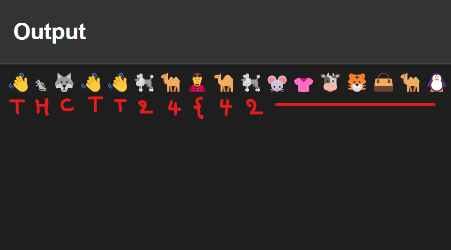

เราพบว่า emoji พวกนี้มี pattern เหมือนกันกับ flag pattern ของงานนี้ เราจึงคิดว่ามันน่าจะเป็น offset ตัว char แหละที่เลื่อนไปจาก range alphabet จนไปหา range ที่เป็น emoji เราจึงหาว่ามัน offset เท่าไหร่ด้วยการเอาตัวแรกมาลบกัน

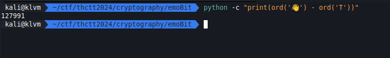

พบว่า offset ของมันคือ 127991 เสร็จแล้วเราก็นำ emoji พวกนี้ไปลบกับค่า offset

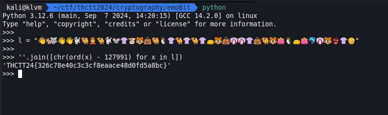

# Programming

## Programming > Easy 1

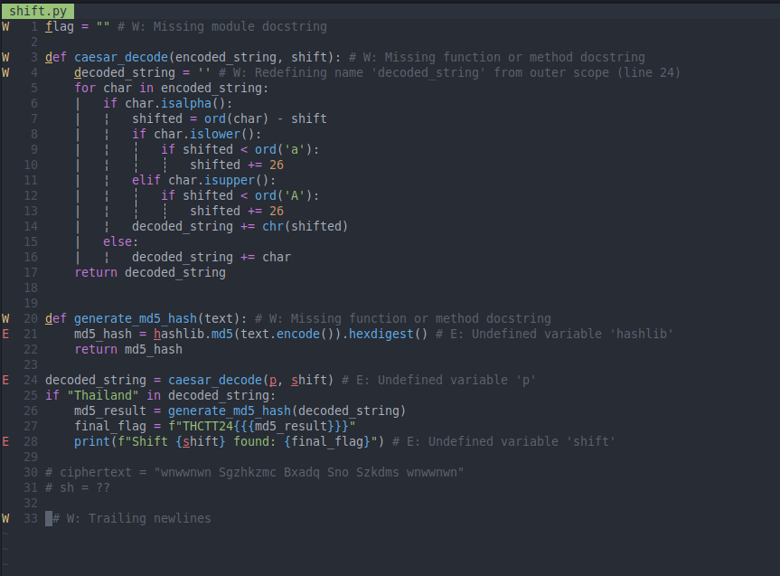

เราเห็นชื่อ function `caesar_decode` เราก็รู้ได้ทันทีเลยว่านี้คือ Caesar cipher

สิ่งที่เราต้องทำคือหาว่าต้องเลื่อน cipher ที่ได้มาจนเจอคำว่า `Thailand` และต้องแก้ code ที่ผิดด้วย

ซึ่งการเลื่อนแบบ basic นั้นไม่ยากจนเกินไป เราสามารถ loop เลื่อน check ไปทีละรอบจนเจอได้

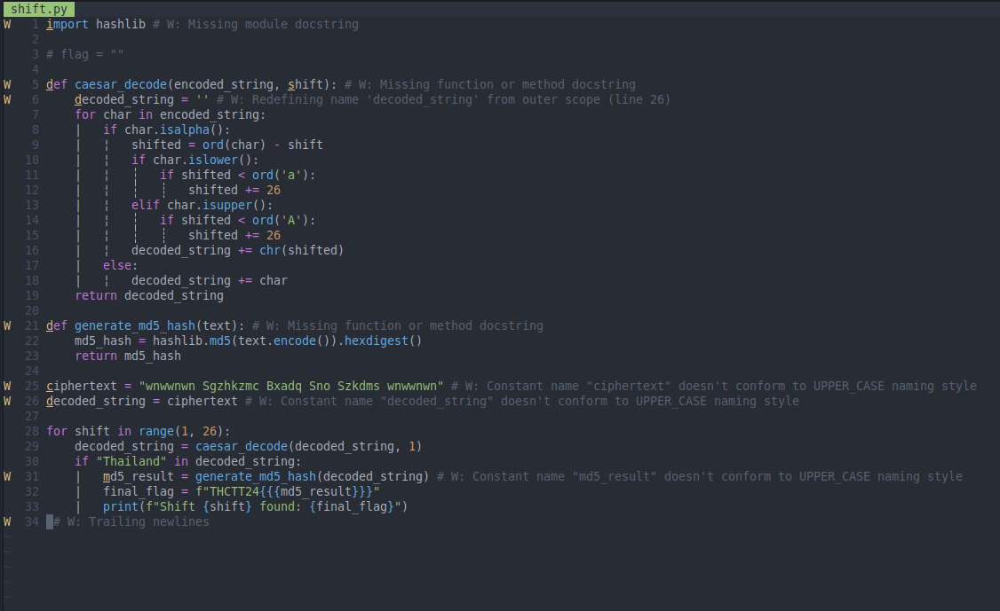

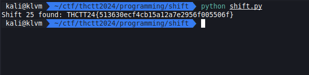

## Programming > Easy 2

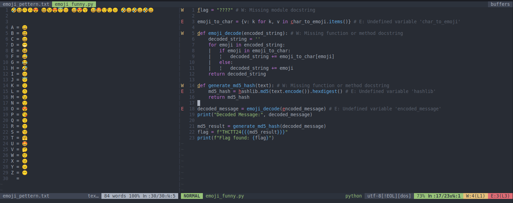

เปิดมาก็รู้ได้เลยว่านี้คือ Substitution cipher

ซึ่งจากข้างต้นเราแค่ต้องสร้าง map ที่ใช้ decode และแก้ code ที่ผิด

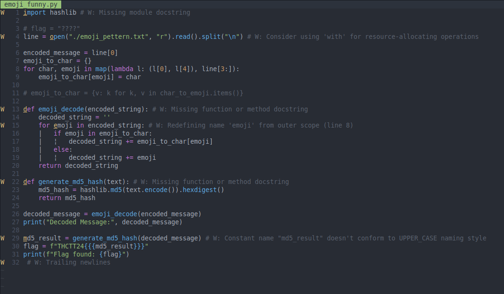

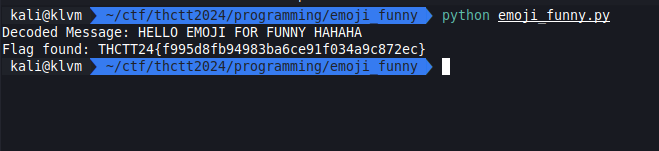

## Programming > Medium

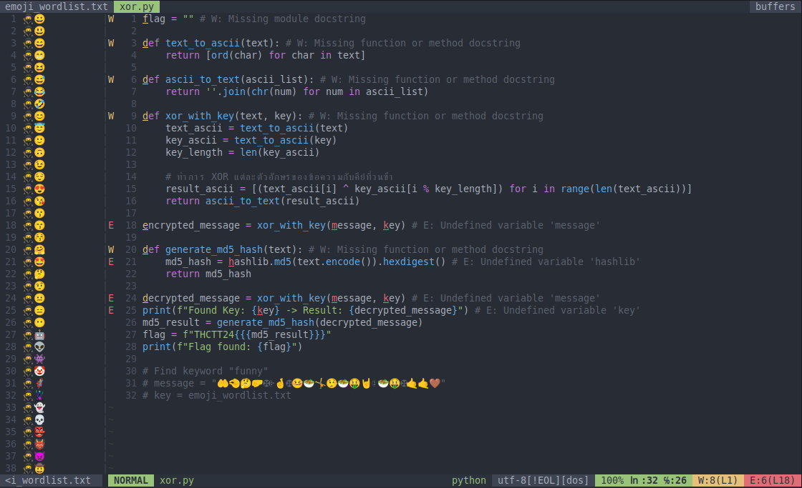

คำใบ้ที่ได้มาคือ key ต้องมีคำว่า `funny` หลัง decode

สิ่งที่เราต้องทำคือ loop ลอง key ไปเรื่อยๆจนเจอ และแก้ code ที่ผิด

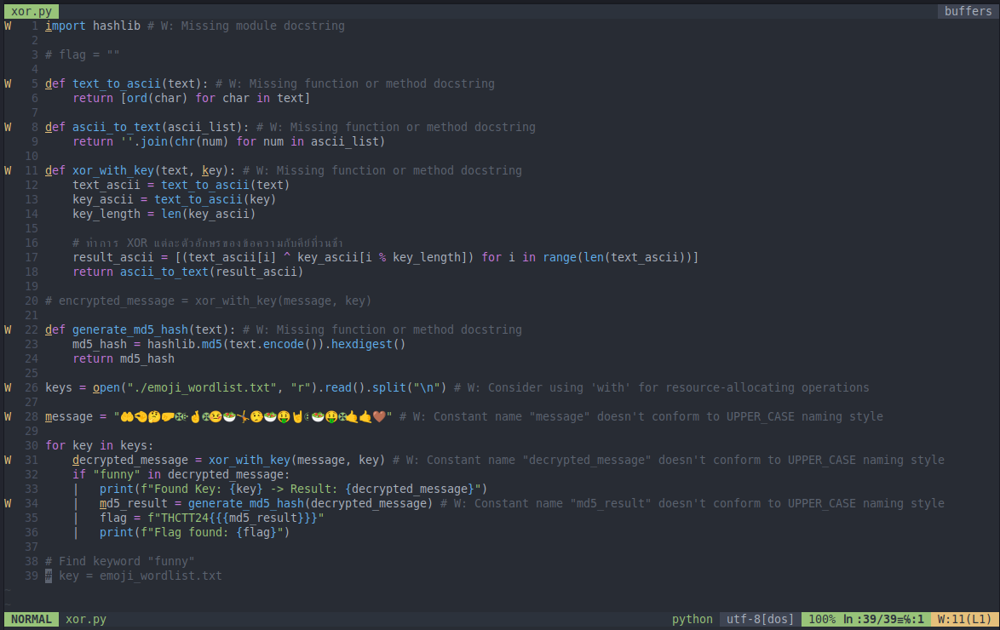

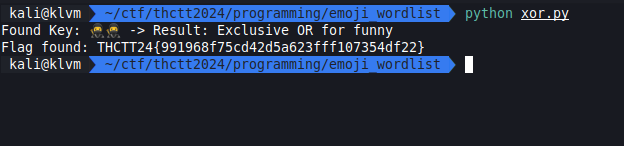

# Web Application

## Web Application > Not So Secret

username จะอยู่ใน html ซึ่งสามารถเปิดได้จาก dev tool ได้เลย แล้วมันจะเป็น comment ตรงรายชื่อ 3 คนนั้น

password นั้นไม่มี เราจะต้องสร้าง session token ขึ้นมาเอง โดยจะต้องใช้ username + timestamp ซึ่ง time จะใช้เวลาไหนก็ได้ สมมุติว่า n คือ timestamp ที่จะใช้ ให้สร้างด้วย function `create_session_token` ที่ได้มา เสร็จแล้วอาจจะลอง validate ก่อนก็ได้ แต่ถ้าไม่ก็เอาไป set ลง cookie ใน browser ได้เลย โดยเราจะ set `session_token` = token ที่เรา generate และ `session_timestamp` คือ n ที่เราใช้ ซึ่งเราจะวนๆอยู่อาจจะสัก 3 รอบ เพราะมี 3 user ที่เราไม่รู้ว่าเป็นใครกันแน่ เมื่อสำเร็จ flag จะโผล่มา

# Digital Forensic

## Digital Forensic > Easy 1

```text
.
├── 2024
│   ├── 08
│   │   ├── 01
│   │   │   └── flag.txt
│   │   .
│   │   .
│   │   └── 31
│   │       └── flag.txt
│   ├── 09
│   │   ├── 01
│   │   │   └── flag.txt
│   │   .
│   │   .
│   │   └── 30
│   │       └── flag.txt
│   └── 10
│       ├── 01
│       │   └── flag.txt
│       .
│       .
│       └── 31
│           └── flag.txt
├── 90DAY.zip
└── Thailand_Cyber_Top_Talent_2024.jpg
```

เปิดมาพบ flag.txt เยอะมาก เหมือนกันหลายไฟล์ด้วย แถมรูปที่ได้มาก็ไม่มีอะไรอีก

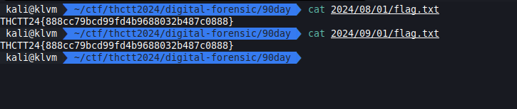

ไหนลองเปิดออกมาดูทุกอันหน่อยสิ

```sh
find . -type f -exec cat {} +
```

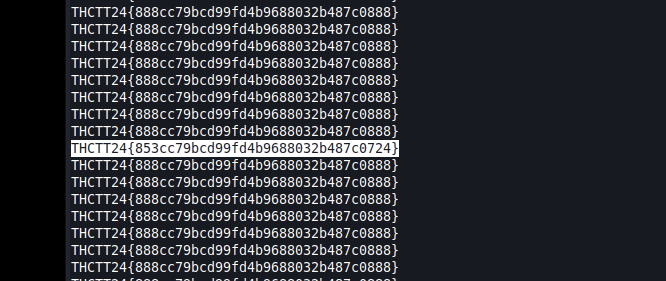

## Digital Forensic > Easy 2

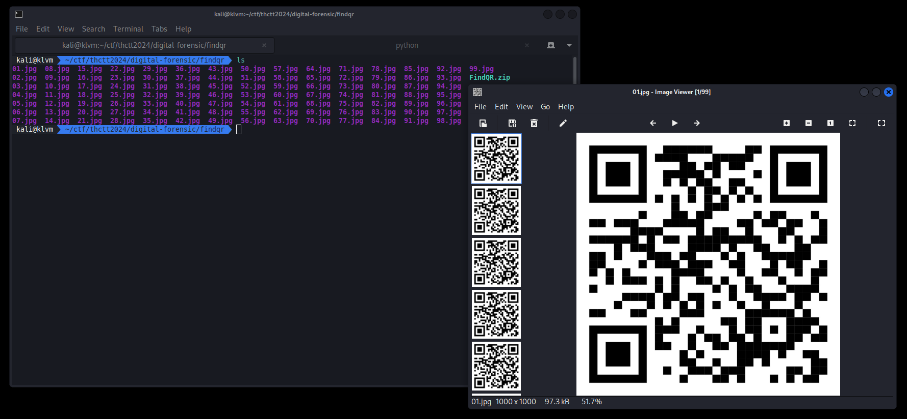

เราได้ไฟล์ QR Code มาเยอะมาก ซึ่งเราจะเริ่มจากการ checksum

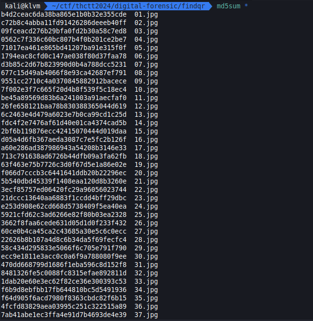

พบว่ามันไม่เหมือนกัน แต่ด้านในจะมี text ที่ว่า `THCTT24` เราก็พยายามใช้ tool ต่างๆในการหาจนไปจบที่ steghide ที่ pass คือ text ที่ได้จาก QR Code ซึ่งเมื่อเราถอดออกมาได้คือไฟล์ flag แต่มันปลอม !

งั้นเพื่อความรวดเร็วเราจะรูดมันเลยละกัน

```sh
for file in *.jpg; do yes | steghide --extract -sf "$file" -p "THCTT24"; done
```

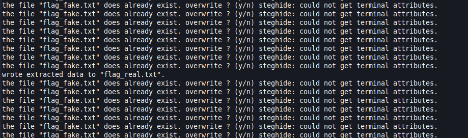

เจอไฟล์ flag

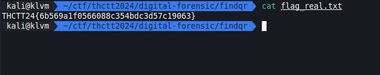

# Reverse Engineering and Pwnable

## Reverse Engineering and Pwnable > Running Number

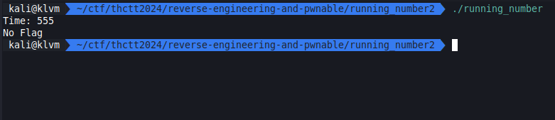

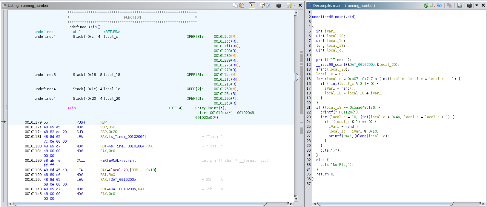

เราต้องหาว่า seed ไหนที่ทำให้ได้คำตอบ

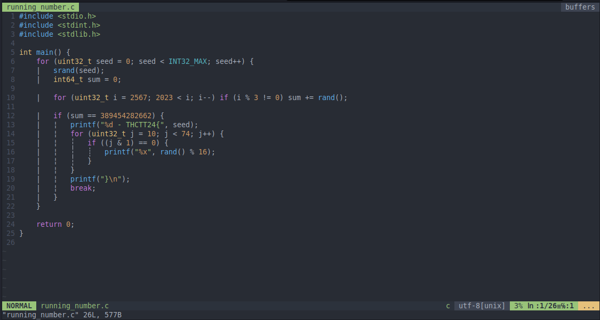

สิ้นคิดก็ brute force ไปเลย โดยการไล่ seed ไปเลื่อยๆ

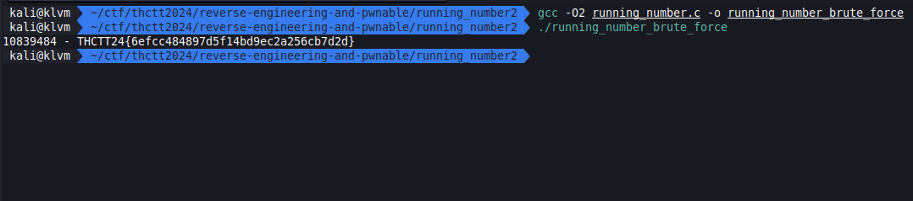

## Reverse Engineering and Pwnable > Embedded Malware

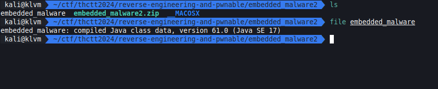

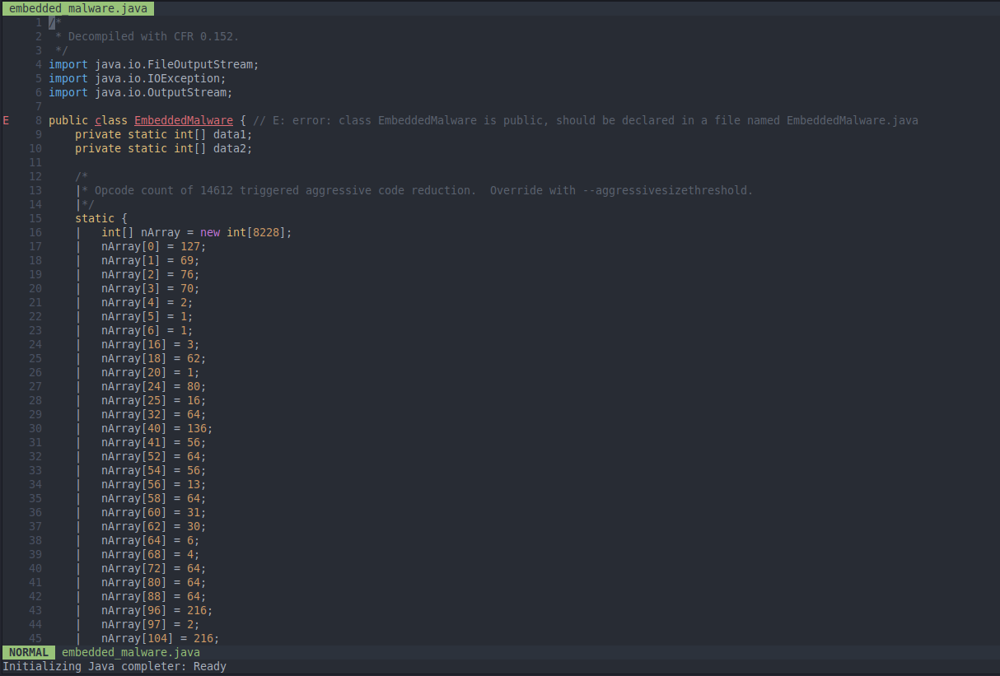

เริ่มจากใช้ cfr decompile แล้วพบว่า public class ไม่ตรงกับชื่อไฟล์

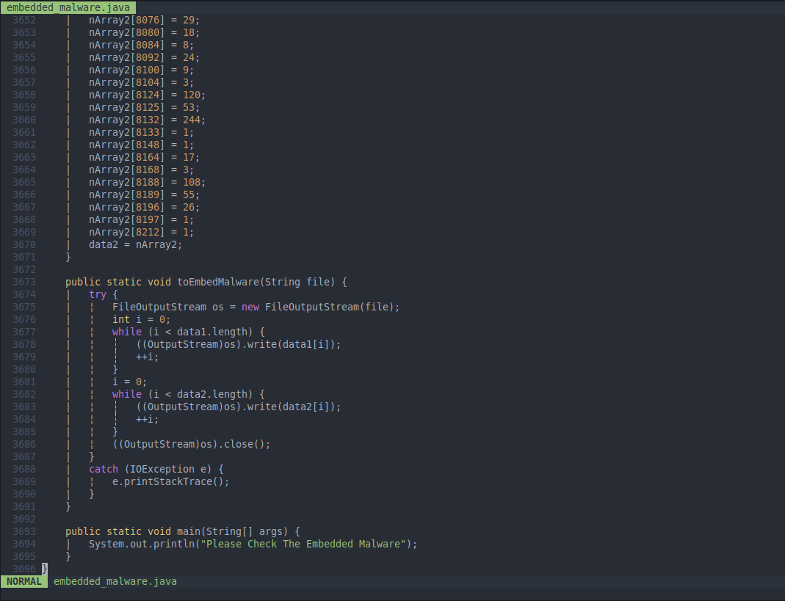

เจอ array สองตัว ยาวมาก พร้อมกับ function ที่ไม่ได้ใช้ถูกเรียก ซึ่ง function นั้นเอาไว้เขียนไฟล์จากข้อมูล array 2 ตัว

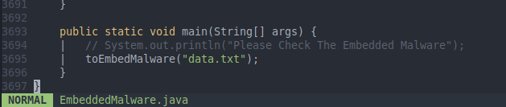

เราเปลี่ยนชื่อไฟล์และลองเรียก function นั้นดู

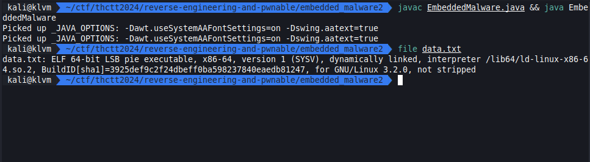

พบว่าคือ ELF file

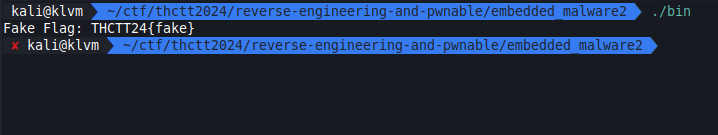

เราจึงลองรันดู อืมมม โดนหลอก ?

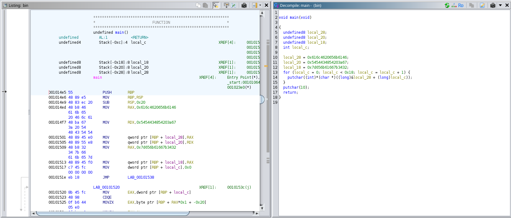

reverse ไปก็ไม่เจออะไรอีก

แต่จากที่เคยเจอถ้ามาทรงนี้มีอะไรแปลกๆซ้อนไว้แน่ๆ

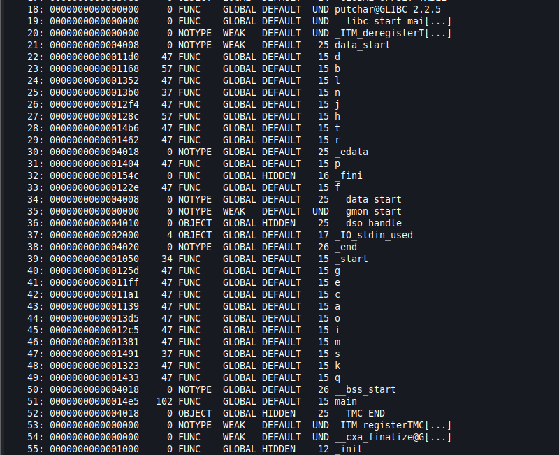

อย่างที่คิด มี function หลายตัวแปลกๆอยู่จริงๆด้วย เพราะชื่อ function พวกนี้ไม่ปกติแถมไม่ถูกเรียกใน main function อีก

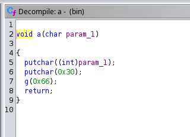

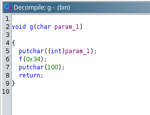

เราจึงลองเปิดดูสักสองตัวพบว่ามัน call ต่อกันเป็น chain และมีการเรียก putchar ซึ่งเราคิดว่าน่าจะเป็น flag ที่ print ออกมาทีละตัว

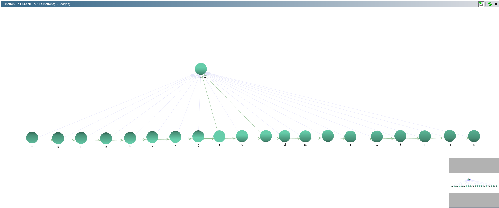

เมื่อเราลองเปิดดู function call graph จากตัวหนึ่งแล้วไล่ดูให้หมด พบว่าต้นทางคือ function n

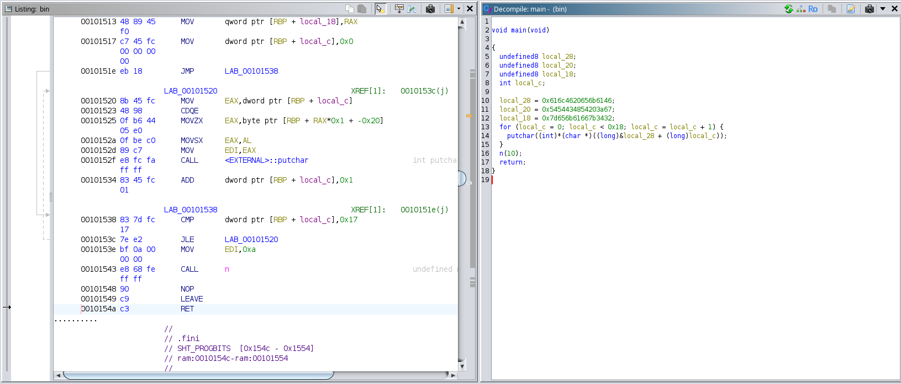

เราจึง patch function ใน main function ตัวหนึ่งให้ไปเรียก function n

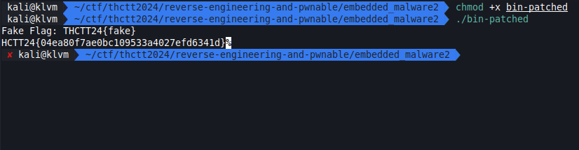

คงไม่ต้องถามหรอกนะว่าตัวแรกที่หายไปใน flag คืออะไร

# Network Security

## Network Security > HTTP Mayhem

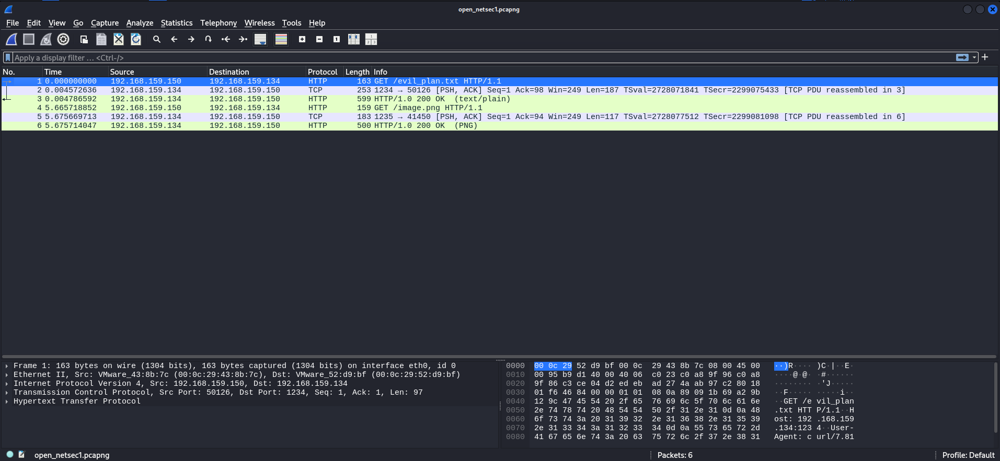

เราเปิดมาพบ 2 stream ที่เป็น http

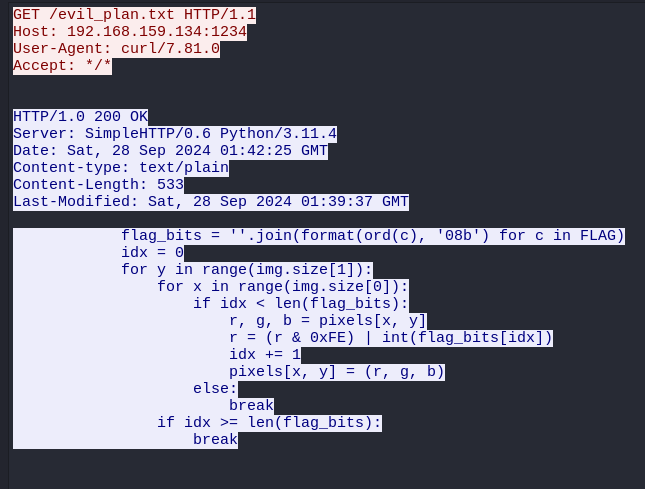

มันคือ code python ที่เอาไว้ใช้ทำอะไรสักอย่าง

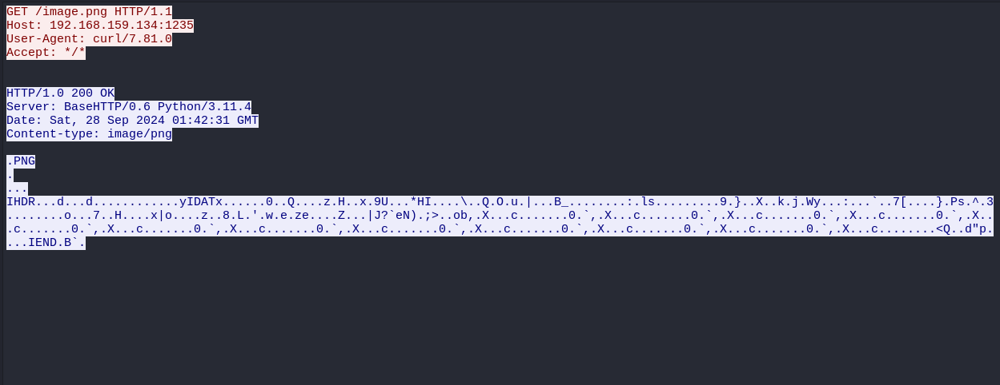

รูป

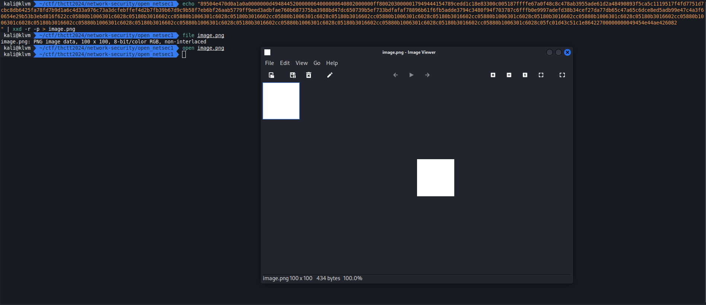

เราจึงลองเอารูปนั้นมาเปิดดู แต่ทำไมไม่มีอะไรเลย ?


เราจึงกลับไปดูที่ code เราจึงเดาๆได้ว่า code นี้ใช้ในการซ่อนข้อมูลใน pixle bit สุดท้าย


เราจึงเขียนแก้ code ให้ใช้เป็นการถอดรหัส


## Network Security > Silent Whisper


หน้าที่ของเราคือต้องมาหาว่า password ไหนที่ใช้เข้าสู่ระบบได้สำเร็จ


เราจึงทดลองด้วย key word สักตัวเพื่อดูว่ามันจะมีคำไหนบ้าง ซึ่งดูเหมือนถ้า login สำเร็จจะมีคำนี้


เราจึงเอาคำนั้นไป filter ใน wireshark


## Network Security > Encrypted C2 v2


export ไว้รอเลย


จากที่ดูคือเราต้องเอา maps ไปใช้ในการถอดรหัส จะได้จาก handshake และ ข้อความจะเกิดขึ้นตอน callback


เราเลยเขียน code loop ถอดมันทุกแบบไปเลย


it work

# Mobile Security

## Mobile Security > Easy


ยังไม่ได้ทำอะไรก็เจออะไรแปลกๆเข้าให้ซะแล้ว

เราเห็นว่ามันน่าจะเป็น base เราเลยลบ prefix ออกแล้วลองถอดด้วย base64 ดู


## Mobile Security > Medium


สำหรับข้อนี้จะพบ flag ได้ที่ assets ของ apk

เอาไปแปลงใน Cyber Chef ด้วย `From Hex`


**Cheat**

```sh
binwalk -e Mobile2.apk && cat $(find . -name flag.txt) | xxd -r -p
```

## Mobile Security > The Face THCTT24

คำใบ้คือ ใครหายไป

`com.example.thefacethctt24.MainActivity`


เราเริ่มจากจุดที่ใช้ random ค่าเพื่อเลือกรูปไปแสดง แล้วเราพบว่า 32 หายไปจาก array

แล้วรูปที่ 32 อยู่ที่ไหน ?

เพื่อความมักง่ายเราจะใช้ binwalk แล้ว search ชื่อไฟล์

```sh
binwalk -e TheFaceTHCTT24.apk
find . -name "*32*"
```


โดนเกรียนจริง

GIMP


## Mobile Security > Click Click

เราเริ่มจากการ decompile แล้วไปที่ MainActivity


เราจะพบกับ code ที่ใช้ check flag ซึ่งจากข้างต้นจะสรุปได้ว่า

- รับค่าจากผู้ใช้
- loop XOR char กับ key ที่ละตัว
- ถ้า string ที่ได้เท่ากับ secret จะถือว่าถูก

เราเลยต้องหาว่า secret และ key คืออะไร

เริ่มจาก `key` ได้จาก `com.example.clickclick.R` (หลอก)


ต่อด้วย `secret` ได้จาก `com.example.clickclick.Message`


เรารู้ว่า flag จริงต้องมีขนาดเป็น 9 `THCTT24{}` + 32 `md5` = 41 และ secret ที่มี length เป็น 287 ซึ่งเมื่อหารกับ 41 แล้วจะได้ 7 นั้นหมายความว่าทุกๆ 7 char ของ secret นี้คือ char

แต่เดี๋ยวก่อนนะ เราได้ key มาตอนแรกแล้วนิ, ใช่ แต่ขนาดของมันนั้นใน string decimal มันใหญ่กว่า 7 หลัก ซึ่งคือ 10 หลัก

แล้วทำไงต่อ ? ก็หา key ใหม่ไง...

ว่าด้วยเรื่องการหา key เราสามารถหาได้สองวิธีคือ 1.หาใน app นั้นแหละ / 2.สร้างเอง

**สร้างเอง**

เรารู้คุณสมบัติของ XOR ดีว่า `a^b = c` และ `b^c = a` และ `c^a = b` และเรารู้ว่า flag pattern เริ่มต้นลงท้ายคืออะไรเราจึงสามารถเรา key ได้

ยกตัวอย่าง เราเอา secret มาแยกออกทีละ 7 ตัว

```text
DEC 2964887  2964875  2964864  2964887  2964887  2964977
HEX 0x2d3d97 0x2d3d8b 0x2d3d80 0x2d3d97 0x2d3d97 0x2d3df1
    T        H        C        T        T        2
```

จะเห็นได้ว่าตรงตัว `T` นั้นจะมีค่าที่เหมือนกันเลย ดังนั้น key จะได้จาก `2964887` (0:8 secret) ^ `84` (T) ซึ่งก็คือ `2964931` นั้นเอง

**หาจากใน app**


search เลยสิ แล้วดันเจอจริง

ที่เหลือก็ทำเอา key ที่ได้ไป XOR กับ secret 41 ตัว


